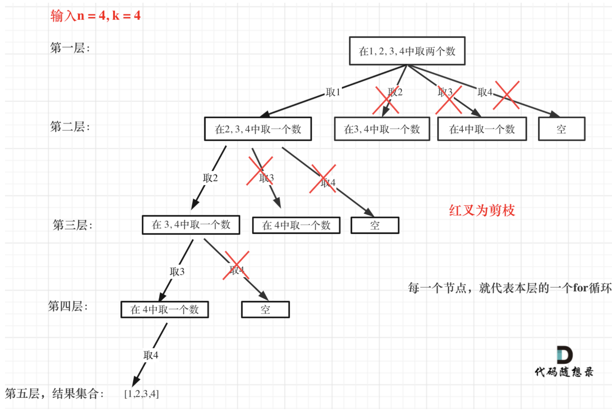
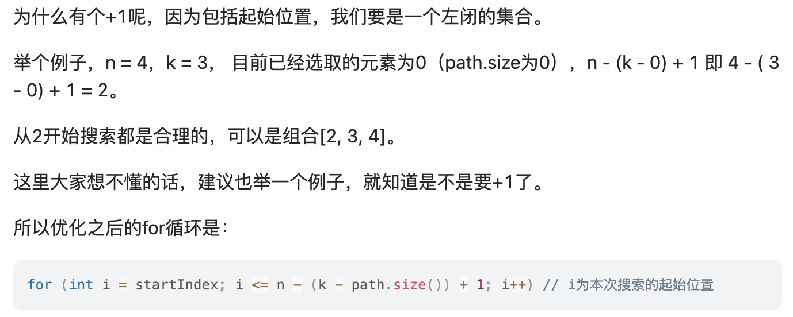
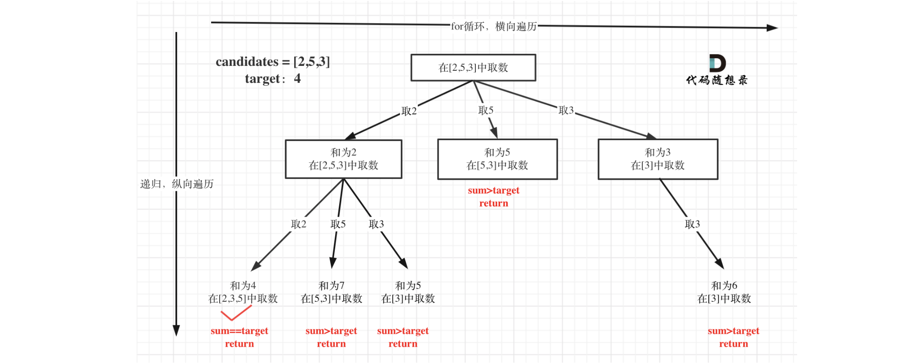

## 回溯模版

回溯算法是`算法设计`中的一种方法，是一种`渐进式`寻找并构建问题解决方式的策略。回溯算法会先从一个可能的动作开始解决问题，如果不行，就回溯并选择另一个动作，直到将问题解决。

> 举例：鬼吹灯，走一条路未走通就回来再走另一条路。

什么问题适合回溯算法？

- 有很多路
- 这些路里，有`死路`，`出路`
- 通常需要递归来模拟所有的路

回溯法解决的问题都可以抽象为树形结构（N 叉树），用树形结构来理解回溯就容易多了。可以参考[代码随想录的解说](https://programmercarl.com/)

```js
function test (){
  let res = [] // 二维数组，返回的值
  let path = [] // 一维数组，单个值
  function backtracking(参数) {
    if (path.size() == k) { // 终止条件
        // 存放结果;
        return;
    }

    for (int i = startIndex; i <= n; i++) {  // 根据题目要求适当剪枝优化
        // 处理节点;
        path.push()
        ...
        backtracking(路径，选择列表); // 递归
        // 回溯，撤销处理结果
        path.pop()
        ...
    }
  }
  backtracking()
  return res
}


```

:::success{title=基本规律}

- 用树形结构分析，可以发现 数组 arr（或 nums） 相当于树的宽度，k（代表需要取几个元素） 相当于树的深度
- 每次搜索到了叶子节点，就找到了一个结果，也就是“模版”中的 `终止条件`，比如 `path.length === k`
- 难判断的一般是 for 循环里的 `startIndex`，`startIndex` 就是防止出现重复的元素。

  :::

## 组合

### 力扣 77. 组合

[力扣链接](https://leetcode.cn/problems/combinations/description/)

:::warning{title=解题思路}
最直接的做法就是使用 for 循环，题目中 k=2，就可以用两个 for 嵌套进行排列组合：

```js
int n = 4;
for (int i = 1; i <= n; i++) {
    for (int j = i + 1; j <= n; j++) {
        cout << i << " " << j << endl;
    }
}
```

但是如果 n=100，k=50，那我们就需要写 50 个 for 循环嵌套，肯定是不合理的，这时候我们就需要用**回溯法的递归**来解决嵌套层数的问题

- 用树形结构来分析，可以发现 n 相当于树的宽度，k 相当于树的深度
  :::

```js
/**
 * @param {number} n
 * @param {number} k
 * @return {number[][]}
 */
var combine = function (n, k) {
  let result = [];
  let path = [];
  const combineHelper = (n, k, startIndex) => {
    if (path.length === k) {
      result.push(Array.from(path));
      return;
    }
    for (let i = startIndex; i <= n - (k - path.length) + 1; i++) {
      // for循环时，选择的起始位置之后的元素个数如果已经小于k，就可以适当修剪了
      // 也就是i <= n - (k - path.length) + 1
      path.push(i); // 下标也是值
      combineHelper(n, k, i + 1);
      path.pop();
    }
  };
  combineHelper(n, k, 1); // 因为题目区间直接是[1,n]，就可以直接下标从1开始
  return result;
};
```

:::info{title=难点解析}

**👉 关于 `n - (k - path.length) + 1`是如何得出的？**

简单思路：

- 先列出跟 i 值有关的因素：k、n、i、path.length，并且看明显绑定的因素：k 与 path.length 是绑定的，可以直接给出关系 k-path.length
- 所以其实因素值就两个：k-path.length、n
- 列出基本公式：i <= ？
- 直接分析因素值与 i 的正负关系，n 越大，i 也就范围越大；k-path.length 越大，也就意味着所需要的值的个数也越多，i 的范围值就越小，这么简单分析就可以直接给出：i <= - (k-path.length) + n
- 然后再图，验证公式，发现不对，总是少了个 1，继续分析（回溯算法看代码随想录的分析，leetcode 评论区有）
  

:::

### 力扣 17.电话号码的字母组合

[力扣链接](https://leetcode.cn/problems/letter-combinations-of-a-phone-number/description/)

```js
/**
 * @param {string} digits
 * @return {string[]}
 */
var letterCombinations = function (digits) {
  if (!digits.length) return [];
  const res = [],
    path = [];
  const map = [
    '',
    '',
    'abc',
    'def',
    'ghi',
    'jkl',
    'mno',
    'pqrs',
    'tuv',
    'wxyz',
  ];

  function backtracking(arr, k, i) {
    if (path.length === k) {
      res.push(path.join(''));
      return;
    }
    for (const str of map[arr[i]]) {
      path.push(str);
      backtracking(arr, k, i + 1);
      path.pop();
    }
  }
  backtracking(digits, digits.length, 0);
  return res;
};
```

### 力扣 39.组合总和

[力扣链接](https://leetcode.cn/problems/combination-sum/description/)

:::success{title=解题思路}
注意到题目中的`无限制重复被选取`，但是没有 0 ，因为下面有提示：1 <= candidates[i] <= 200。

本题和 77.组合、216.组合总和 III 的区别是：本题没有数量要求，可以无限重复，但是有总和的限制，所以间接的也是有个数的限制。


注意图中叶子节点的返回条件，因为本题没有组合数量要求，仅仅是总和的限制，所以递归没有层数的限制，只要选取的元素总和超过 target，就返回！
:::
:::success{title=套路}
在求和问题中，排序之后加剪枝是常见的套路！
:::

### 力扣 40.组合总和 II

[力扣链接]()

### 力扣 216.组合总和 III

[力扣链接]()

## 分割

### 力扣 131.分割回文串

[力扣链接]()

### 力扣 93.复原 IP 地址

[力扣链接]()

## 子集

### 力扣 78. 子集

[力扣链接](https://leetcode-cn.com/problems/subsets/)

:::success{title=解题思路}

- 要求：1.所有排列情况 2.没有重复元素
- 有出路，有死路
- 考虑使用回溯算法
  :::

  :::success{title=解题步骤}

- 用递归模拟出所有情况
- 保证接的数字都是后面的数字
- 收集所有到达递归终点的情况，并返回
  :::

其实子集也是一种组合问题，因为它的集合是无序的，子集{1,2} 和 子集{2,1}是一样的。
那么既然是无序，取过的元素不会重复取，写回溯算法的时候，for 就要从 startIndex 开始，而不是从 0 开始！

#### 代码随想录的思路

```js
/**
 * @param {number[]} nums
 * @return {number[][]}
 */
var subsets = function (nums) {
  const res = [];
  const path = [];
  const backtracking = (startIndex) => {
    res.push(Array.from(path));
    for (let i = startIndex; i < nums.length; i++) {
      path.push(nums[i]);
      backtracking(i + 1);
      path.pop();
    }
  };

  backtracking(0);
  return res;
};
```

#### 其他思路

```js
var subsets = function (nums) {
  const res = [];
  const backtrack = (path, index, start) => {
    if (path.length === index) {
      res.push(path);
      return;
    }
    for (let i = start; i < nums.length; i += 1) {
      backtrack(path.concat(nums[i]), index, i + 1);
    }
  };
  for (let i = 0; i <= nums.length; i += 1) {
    backtrack([], i, 0);
  }
  return res;
};
```

时间复杂度——O(2^N)，因为每个元素都有两种可能（存在或不存在）
空间复杂度——O(N)，递归的深度

### 力扣 90.子集 II

[力扣链接]()

## 排列

### 力扣 46. 全排列

[力扣链接](https://leetcode-cn.com/problems/permutations/)

[代码随想录解说视频](https://www.bilibili.com/video/BV19v4y1S79W/?spm_id_from=333.788&vd_source=7ee2eb32d377b22069c6dc587637a207)

:::success{title=解题思路}

- 要求：1.所有排列情况 2.没有重复元素
- 有出路，有死路
- 考虑使用回溯算法
  :::

这题需要知道`排列`和`组合`的区别：

- 排列：在每次迭代的过程中，都需要从数组 numsnumsnums 的第一个元素，即 nums[0]nums[0]nums[0]，开始选择
- 组合：在每次迭代的过程中，都需要从数组 numsnumsnums 的当前元素开始选择；

:::success{title=解题步骤}

- 用递归模拟出所有情况
- 遇到包含重复元素的情况，就回溯
- 收集所有到达递归终点的情况，并返回
  :::

#### 代码随想录的思路

```js
/**
 * @param {number[]} nums
 * @return {number[][]}
 */
var permute = function (nums) {
  const res = []; // 二维数组，返回的值
  const path = []; // 一维数组，单个排列值

  function backtracking(arr, used) {
    // 终止条件，通俗来说就是不要再继续“分裂”下去了
    if (path.length === arr.length) {
      res.push(Array.from(path));
      // 为什么不是res.push(path)，因为path存的是引用地址，为了不改变原数组
      return;
    }
    for (let startIndex = 0; startIndex < arr.length; startIndex++) {
      // 比如[1,2,3]取了第一个数1之后，第二个数是应该是从[2,3]里取
      // 这行代码就是为了防止重复取1
      if (used[startIndex]) continue;
      path.push(arr[startIndex]);
      used[startIndex] = true;
      backtracking(arr, used);
      // 当遇到终止条件（path.length === arr.length）就会return，下面的就会执行
      // 开始做回溯
      path.pop();
      used[startIndex] = false;
    }
  }
  backtracking(nums, []);
  return res;
};
```

#### 其他简洁思路

```js
/**
 * @param {number[]} nums
 * @return {number[][]}
 */
var permute = function (nums) {
  const res = [];
  const backtrack = (path) => {
    if (path.length === nums.length) {
      res.push(path);
      return;
    }
    nums.forEach((n) => {
      if (path.includes(n)) return;
      backtrack(path.concat(n));
    });
  };
  backtrack([]);
  return res;
};
```

时间复杂度——O(n!), n! = 1\*2\*3\*4\*...\*n;
空间复杂度——O(n)，递归的层数

## 棋盘问题

### 力扣 51.N 皇后

[力扣链接]()

### 力扣 37.解数独

[力扣链接]()

## 其他
