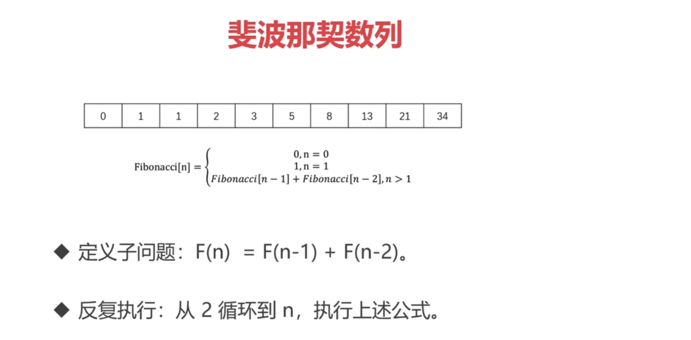
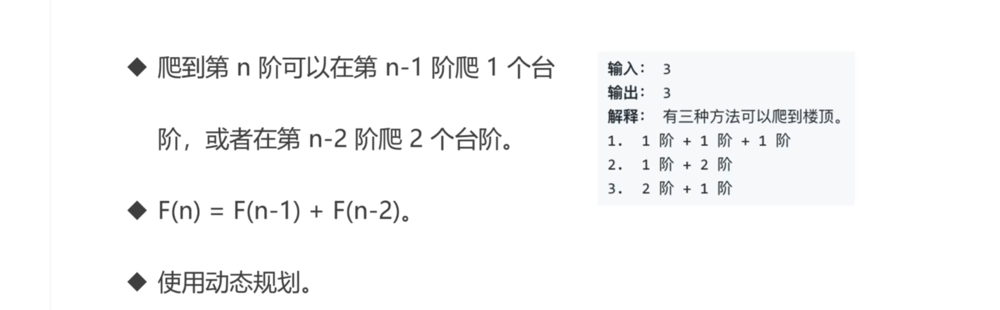
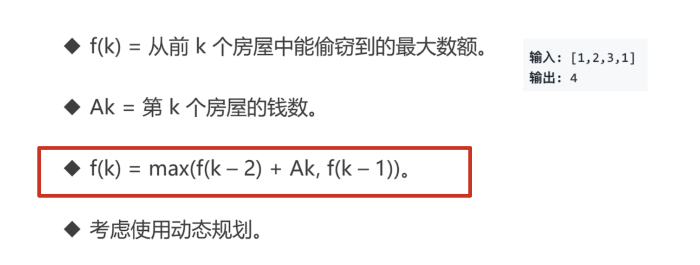
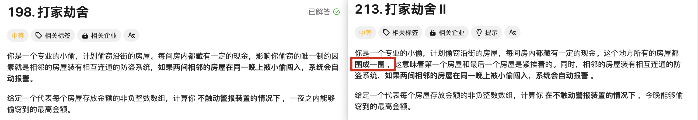

动态规划是`算法设计`中的一种方法，它将一个问题分解为`相互重叠`的子问题，通过反复求解子问题，来解决原来的问题。

## 力扣 509. 斐波那契数

[力扣链接](https://leetcode.cn/problems/fibonacci-number/description/)



#### JS 版本

```js
/**
 * @param {number} n
 * @return {number}
 */
var fib = function (n) {
  // f(n)=f(n-1)+f(n-2)
  // 0 1 2 3 4
  // 0 1 1 2 3
  if (n < 2) return n;
  let p = 0,
    q = 1;
  for (let i = 2; i <= n; i++) {
    const temp = p;
    p = q;
    q = q + temp;
  }
  return q;
};
```

#### GO 版本

```go
func fib(n int) int {
    if n<2{
        return n
    }
    var p = 0;
    var q = 1;
    for i:=2; i<=n; i++ {
        temp := p
        p = q;
        q=q+temp
    }
    return q
}
```

## 力扣 70. 爬楼梯

[力扣链接](https://leetcode-cn.com/problems/climbing-stairs/)

#### 解题思路



#### JS 版本

```js
/**
 * @param {number} n
 * @return {number}
 */
var climbStairs = function (n) {
  // f(n)=f(n-1)+f(n-2)
  // 1 2 3 4
  // 1 2 3 5
  if (n < 2) return 1;
  let p = 1;
  let q = 1;

  for (let i = 2; i <= n; i++) {
    const temp = p;
    p = q;
    q = p + temp;
  }
  return q;
};
```

## 爬楼梯 VS 斐波那契数

:::warning{title=区别}

公式一样，但是基地（n=0、1、2 时）不一样

:::

## 力扣 198. 打家劫舍

[力扣链接](https://leetcode-cn.com/problems/house-robber/)

#### 解题思路



:::success{title=解题思路}

分为两种情况，第 k 号房屋是否要偷：

- 偷的话，`f(k)=f(k-2)+Ak`
- 不偷的话，要想金额最大的话，k-1 号房屋要偷

所以基本公式出来了：`f(k)=Max( f(k-2)+Ak , f(k-1))`
:::

#### JS 版本

```js
/**
 * @param {number[]} nums
 * @return {number}
 */
var rob = function (nums) {
  let p = 0;
  let q = 0;

  for (let i = 0; i < nums.length; i++) {
    const temp = p;
    p = q;
    q = Math.max(temp + nums[i], q);
  }
  return q;
};
```

#### GO 版本

```go
func rob(nums []int) int {
    var p = 0
    var q = 0

    for i:=0; i<len(nums); i++ {
        temp := p
        p = q
        q = max(temp+nums[i], q)
    }
    return q
}
```

:::info{title=复杂度}

时间复杂度——O（n）
空间复杂度——O（1）
:::

## 力扣 213. 打家劫舍 II

[力扣链接](https://leetcode.cn/problems/house-robber-ii/description/)

#### 解题思路



:::warning{title=区别}

这道题是「198. 打家劫舍」的进阶，和第 198 题的不同之处是，这道题中的房屋是首尾相连的，第一间房屋和最后一间房屋相邻，因此第一间房屋和最后一间房屋不能在同一晚上偷窃。

:::

:::success{title=解题思路}

分为两种情况（第一间，n=0；最后一间，n=n）：

- 不偷最后一间，那么最后一间不能偷，就在[0,n-2]区间上进行打家劫舍
- 不偷第一间，就在[1,n-1]区间上进行打家劫舍

:::

#### JS 版本

```js
/**
 * @param {number[]} nums
 * @return {number}
 */

const robRange = (left, right, arr) => {
  let p = 0;
  let q = 0;
  for (let i = left; i <= right; i++) {
    const temp = p;
    p = q;
    q = Math.max(temp + arr[i], q);
  }
  return q;
};
var rob = function (nums) {
  const n = nums.length;
  if (n === 1) return nums[0];
  // 0，n-2，不偷最后一间
  // 1，n-1，不偷第一间
  const a = robRange(0, n - 2, nums);
  const b = robRange(1, n - 1, nums);
  return Math.max(a, b);
};
```

#### GO 版本

```go
func robRange(left int, right int, arr []int) int {
    var p = 0;
    var q = 0;
    for i:=left; i<=right; i++ {
        temp := p
        p = q
        q = max(arr[i]+temp, q)
    }
    return q
}
func rob(nums []int) int {
    var n = len(nums)
    if n == 1{
        return nums[0]
    }
    return max(robRange(0,n-2,nums), robRange(1,n-1,nums))
}
```

## 动态规划 VS 分而治之

:::warning{title=区别}
子问题如果是独立的，就是分而治之。不是独立的就是动态规划
:::
