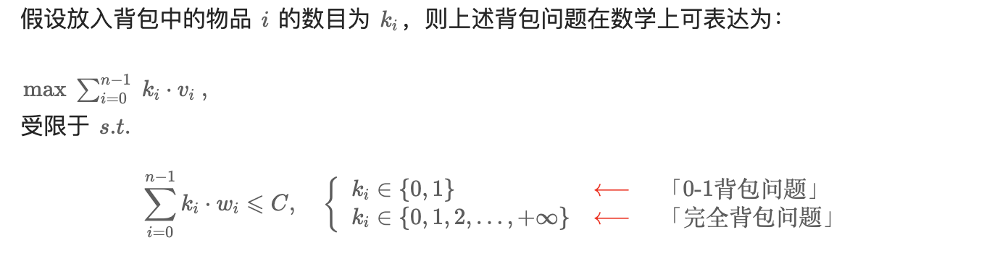

## 背包问题

背包问题 (Knapsack problem) 是一种组合优化的 NP (NP-Complete) 完全问题。问题可以描述为：给定一组物品，每种物品都有自己的重量和价格，在限定的总重量内，我们如何选择，才能使得物品的总价格最高。问题的名称来源于如何选择最合适的物品放置于给定背包中。

:::info{title="举例"}
一般问题： 我们有 n 件物品和一个容量 (capacity)为 C 的背包，记第 i 件物品的重量 (weight) 为 wi，价值 (value) 为 vi，求将哪些物品装入背包可使价值总和最大。

- 0-1 背包： 如果限定每件物品最多只能选取 111 次（即 0  或  10\ 或\ 10  或  1 次），则问题称为 0-1 背包问题。
- 完全背包： 如果每件物品最多可以选取无限次，则问题称为 完全背包问题。
  :::

- 「0-1 背包」是「完全背包」的基础
- `动态规划` 是解决「0−1 背包问题」和「完全背包问题」的标准做法。

## 0-1 背包问题

## 完全背包
