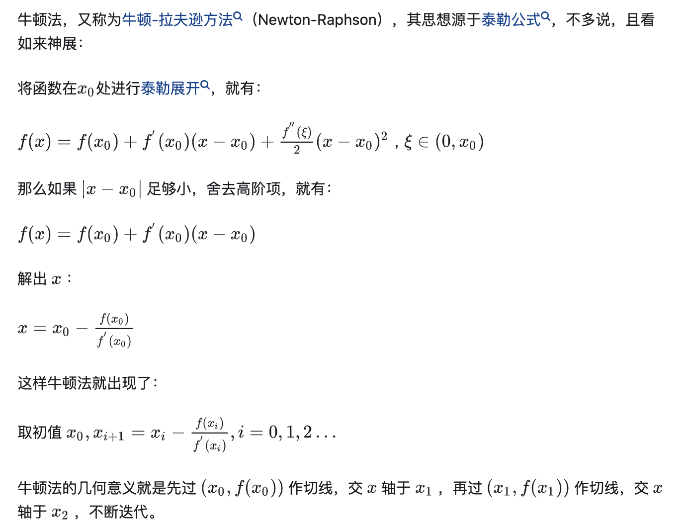
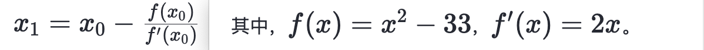

## 一、最大公因数/最小公倍数

### 约数/倍数

如果数 a 能被数 b 整除，a 就叫做 b 的倍数，b 就叫做 a 的约数。

### 最大公因数/最小公倍数

最大公因数，也称最大公约数、最大公因子，指两个或多个整数共有约数中最大的一个。a，b 的最大公约数记为`（a，b）`，同样的，a，b，c 的最大公约数记为（a，b，c），多个整数的最大公约数也有同样的记号。求最大公约数有多种方法，常见的有`质因数分解法`、`短除法`、`辗转相除法`、`更相减损法`。

与最大公约数相对应的概念是最小公倍数，a，b 的最小公倍数记为`[a，b]`。

### 辗转相除法求最大公因数/最小公倍数

欧几里得算法又称辗转相除法，是指用于计算两个非负整数 a，b 的最大公约数。应用领域有数学和计算机两个方面。计算公式 gcd(a,b) = gcd(b,a mod b)。
扩展欧几里得算法可用于 RSA 加密等领域。
假如需要求 1997 和 615 两个正整数的最大公约数,用欧几里得算法，是这样进行的：
1997 ÷ 615 = 3 (余 152)
615 ÷ 152 = 4(余 7)
152 ÷ 7 = 21(余 5)
7 ÷ 5 = 1 (余 2)
5 ÷ 2 = 2 (余 1)
2 ÷ 1 = 2 (余 0)
至此，最大公约数为 1
以除数和余数反复做除法运算，当余数为 0 时，取当前算式除数为最大公约数，所以就得出了 1997 和 615 的最大公约数 1。

实现：

```js
function gcd(a, b) {
  while (a % b !== 0) {
    let temp = a % b;
    a = b;
    b = temp;
  }
  return b;
}
```

先用辗转相除法求最大公因数，再用两数相乘除以最大公因数得到最小公倍数

### 🌰[HJ108 求最小公倍数](https://www.nowcoder.com/practice/22948c2cad484e0291350abad86136c3?tpId=37&tqId=21331&rp=1&ru=/exam/oj/ta&qru=/exam/oj/ta&sourceUrl=%2Fexam%2Foj%2Fta%3FtpId%3D37&difficulty=undefined&judgeStatus=undefined&tags=&title=)

思路：先用辗转相除法求最大公因数，再用两数相乘除以最大公因数得到最小公倍数

```js
const readline = require('readline');

const rl = readline.createInterface({
  input: process.stdin,
  output: process.stdout,
});
rl.on('line', function (line) {
  let [a, b] = line.split(' ');
  function gcd(a, b) {
    while (a % b !== 0) {
      let temp = a % b;
      a = b;
      b = temp;
    }
    return b;
  }
  console.log((a * b) / gcd(a, b));
});
```

## 二、平方根/立方根

### 1.牛顿迭代法

- [如何通俗易懂地讲解牛顿迭代法求开方（数值分析）？](https://www.zhihu.com/question/20690553)
- [69. x 的平方根-牛顿迭代法](https://leetcode.cn/problems/sqrtx/solutions/7568/niu-dun-die-dai-fa-by-loafer/)
- [牛顿法计算 33 的平方根(编码实现)](https://juejin.cn/post/7288540474058702885?searchId=20240220232006F5E1AB5DB61820CBC708)

:::success{title=核心点}


- 假设要求 33 的平方根，取初识猜测值为 x=5
- 迭代公式：，记忆点：精度 precison=1e-7
  :::

### [🌰69. x 的平方根 ](https://leetcode.cn/problems/jJ0w9p/description/)

```js
/**
 * @param {number} x
 * @return {number}
 */
var mySqrt = function (x) {
  if (x == 0) return 0; // 题目测试用例有0
  let n = x;
  // 迭代公式 f(x) = x0 - f(x0)/f'(x0)
  // f(x)=x^2-n,f'(x)=2x，其中n就是题目中提到的x
  // 以x=33为例，迭代公式为 f(x) = x -  （x^2-33）/2x = 2x-33-2/x = (x + 33/x)/2

  let x0 = n / 2;
  let precison = 1e-7;
  //x0 * x0 会溢出
  // while(Math.abs(x0 * x0 - n) > precison){
  //    x0 = (x0 + n/x0) / 2
  // }
  // return Math.floor(x0)

  while (true) {
    let temp = (x0 + n / x0) / 2;
    if (Math.abs(temp - x0) < precison) {
      break;
    }
    x0 = temp;
  }
  return Math.floor(x0); // 题目要求舍去整数
};
```

### [🌰367. 有效的完全平方数](https://leetcode.cn/problems/valid-perfect-square/description/)

根据上一题的解法，可以如下解答，但发现超出时间限制了：

```js
/**
 * @param {number} num
 * @return {boolean}
 */
var isPerfectSquare = function (num) {
  // 令f(x)=f(x0)+f'(x0)(x-x0)=0
  // 得出迭代公式x=x0-f(x0)/f'(x0)
  // 将f(x)=x^2 - num,f'(x)=2x代入，得到迭代公式 x - (x^2 - num)/2x = (x+num/x) / 2
  let x0 = num / 2;
  const precison = 1e-7;
  while (true) {
    let temp = (x0 + num / x0) >> 1;
    if (Math.abs(x0 - temp) < precison) {
      break;
    }
    x0 = temp;
  }
  return x0 * x0 === num; // 注意不要用 Number.isInteger(x0)判断，因为x0真的可以是整数，比如num=14，x0=3。
};
```

修改两行代码：

```js
var isPerfectSquare = function(num) {
-    let x0 = num / 2
+    let x0 = num
-    if(Math.abs(x0-temp)<precison){...}
+    if(x0-temp<precison){...}
};
```

完整代码：

```js
let x0 = num;
const precison = 1e-6;
while (true) {
  let temp = (x0 + num / x0) >> 1;
  if (x0 - temp < precison) {
    break;
  }
  x0 = temp;
}
return x0 * x0 === num; // 注意不要用 Number.isInteger(x0)判断，因为x0真的可以是整数，比如num=14，x0=3。
```

### [🌰HJ107 求解立方根](https://www.nowcoder.com/practice/caf35ae421194a1090c22fe223357dca?tpId=37&tqId=21330&rp=1&ru=/exam/oj/ta&qru=/exam/oj/ta&sourceUrl=%2Fexam%2Foj%2Fta%3Fpage%3D3%26tpId%3D37%26type%3D37&difficulty=undefined&judgeStatus=undefined&tags=&title=)

## 三、杨辉三角

### [118. 杨辉三角](https://leetcode.cn/problems/pascals-triangle/description/)

这题会做，[119. 杨辉三角 II](https://leetcode.cn/problems/pascals-triangle-ii/description/)也可以攻克。

```js
/**
 * @param {number} numRows
 * @return {number[][]}
 */
var generate = function (numRows) {
  const res = [];
  for (let i = 0; i < numRows; i++) {
    const row = new Array(i + 1).fill(1);
    for (let j = 1; j < row.length; j++) {
      row[j] = res[i - 1][j - 1] + (res[i - 1][j] || 0);
    }
    res.push(row);
  }
  return res;
};
```

### [HJ53 杨辉三角的变形](https://www.nowcoder.com/practice/8ef655edf42d4e08b44be4d777edbf43?tpId=37&tqId=21276&rp=1&ru=/exam/oj/ta&qru=/exam/oj/ta&sourceUrl=%2Fexam%2Foj%2Fta%3Fpage%3D2%26tpId%3D37%26type%3D37&difficulty=undefined&judgeStatus=undefined&tags=&title=)

这题用构建出杨辉三角的二位数列，发现执行结果会提示内存超限制，本质这题不是考察杨辉三角的公式，这是一道纯找规律的题目。

```js
const readline = require('readline');

const rl = readline.createInterface({
  input: process.stdin,
  output: process.stdout,
});
rl.on('line', function (line) {
  const count = Number(line);
  if (count <= 2) {
    console.log(-1);
  } else if (count % 4 === 0) {
    console.log(3);
  } else if (count % 2 === 1) {
    // 注意是count % 2 ===1 ，而不是count % 3 ===0
    console.log(2);
  } else {
    console.log(4);
  }
});
```
