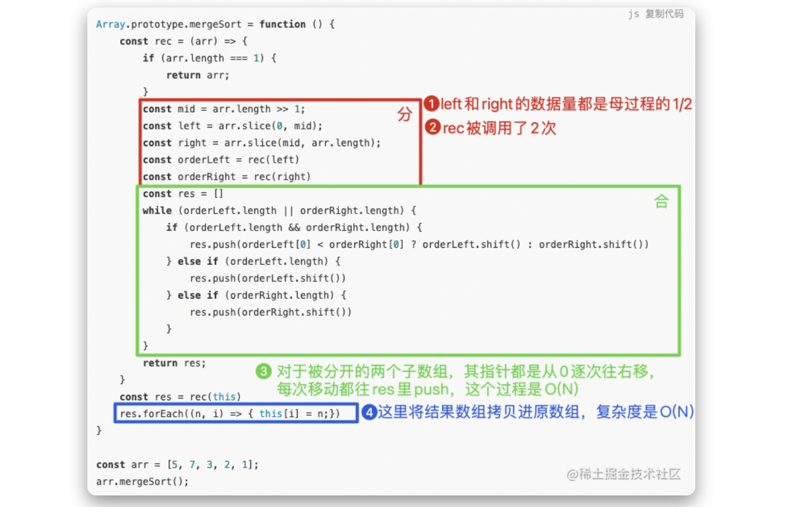
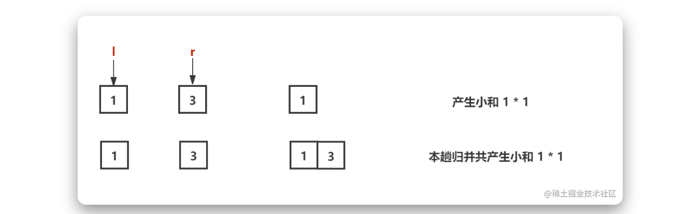
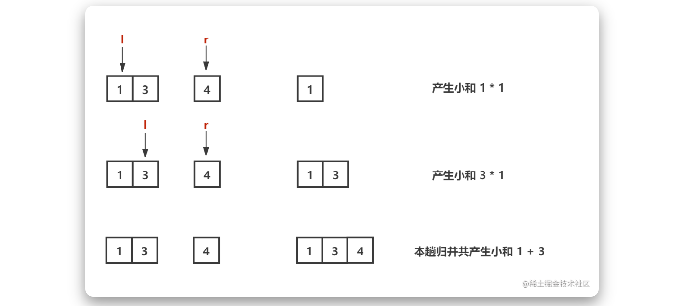
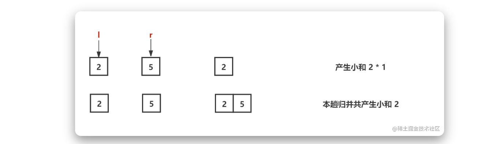
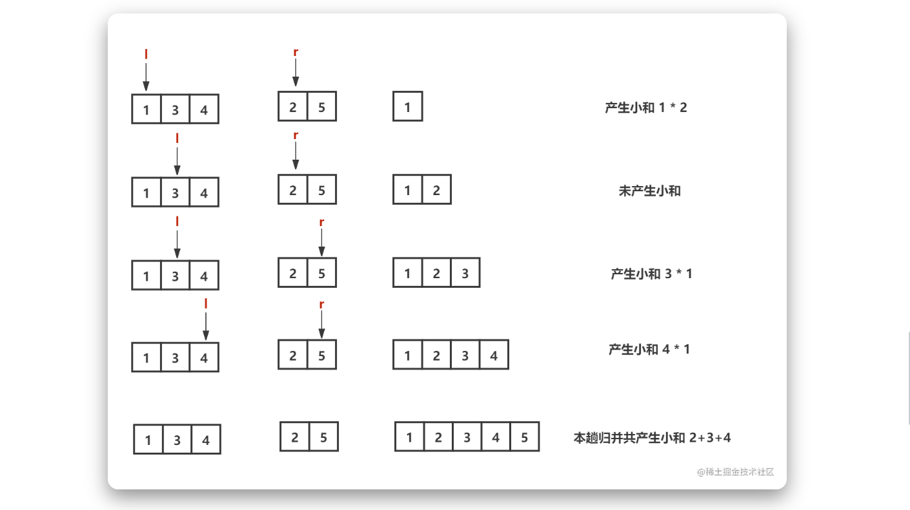

## 选择排序

:::success{title=思路}

- 1.找到数组中的最小值，选中它并将其放置在第一位
- 2.接着找到第二小的值，选中它并将其放置在第二位
- 3.以此类推，执行 n-1 轮
  :::

:::info{title=复杂度}

- 时间复杂度为`O(N^2)`
- 空间复杂度为`O(1)`
  :::

```js
Array.prototype.selectionSort = function () {
  for (let i = 0; i < this.length - 1; i++) {
    let minIndex = i;
    for (let j = i; j < this.length; j++) {
      if (this[j] < this[minIndex]) {
        minIndex = j;
      }
    }
    if (minIndex !== i) {
      const temp = this[i];
      this[i] = this[minIndex];
      this[minIndex] = temp;
    }
  }
};

const arr = [5, 7, 3, 2, 1];
arr.selectionSort();
```

[代码片段](https://code.juejin.cn/pen/7087242499416129572)

## 冒泡排序

:::success{title=思路}

- 1.比较所有相邻元素，如果第一个比第二个大，则交换它们
- 2.一轮下来，可以保证最后一个数是最大的（第一轮确定了第 n 位置的数，第二轮确定了第 n-1 位置的数）
- 3.执行 n-1 轮，就可以完成排序

:::

:::info{title=复杂度}

- 时间复杂度为`O(N^2)`
- 空间复杂度为`O(1)`
  :::

```js
Array.prototype.bubbleSort = function () {
  for (let i = this.length; i > 0; i--) {
    for (let j = 0; j < i; j++) {
      if (this[j] > this[j + 1]) {
        let temp = this[j];
        this[j] = this[j + 1];
        this[j + 1] = temp;
      }
    }
  }
};
const arr = [5, 4, 3, 2, 1];
arr.bubbleSort();
```

## 插入排序

:::success{title=思路}

- 1.从第二个数开始**往前比**
- 2.比它大就**往后排**
- 3.以此类推进行到最后一个数，从而依次确定 0，1，2...位置的数

特殊：根据数据的不同，实际的常数操作次数不同。不过时间复杂度是按最差情况估计，所以说插入排序的时间复杂度为$O(N^2)$。

:::

:::info{title=复杂度}

- 时间复杂度为`O(N^2)`
- 空间复杂度为`O(1)`
  :::

```js
Array.prototype.insertSort = function () {
  for (let i = 1; i < this.length; i++) {
    for (let j = i - 1; j >= 0 && this[j] > this[j + 1]; j--) {
      console.log(this[j]);
      const temp = this[j];
      this[j] = this[j + 1];
      this[j + 1] = temp;
    }
  }
};

const arr = [5, 4, 3, 2, 1];
arr.insertSort();
```

## 归并排序

:::success{title=总体思路}

- 分：把数组分为两个部分，再递归的对子数组进行“分”操作，直到分成一个个单独的数
- 合：把两个数合并为有序数组，再对有序数组进行合并，直到全部子数组合并为一个完整数组
  :::

:::success{title=合并的思路}

- 新建一个空数组 res，用于存放最终排序后的数组
- 比较两个有序数组的头部，较小者出队并推入 res 中
- 如果有两个数组还有值，重复上一步骤
  :::

:::info{title=复杂度}

- 分的时间复杂度是 O(logN)
- 合的时间复杂度是 O(n)
- 时间复杂度是 O(n\*logN)
  :::

### js 版本的实现

```js
Array.prototype.mergeSort = function () {
  const rec = (arr) => {
    if (arr.length === 1) {
      return arr;
    }
    const mid = arr.length >> 1;
    const left = arr.slice(0, mid);
    const right = arr.slice(mid, arr.length);
    const orderLeft = rec(left);
    const orderRight = rec(right);
    const res = [];
    while (orderLeft.length || orderRight.length) {
      if (orderLeft.length && orderRight.length) {
        res.push(
          orderLeft[0] < orderRight[0] ? orderLeft.shift() : orderRight.shift(),
        );
      } else if (orderLeft.length) {
        res.push(orderLeft.shift());
      } else if (orderRight.length) {
        res.push(orderRight.shift());
      }
    }
    return res;
  };
  const res = rec(this);
  res.forEach((n, i) => {
    this[i] = n;
  });
};

const arr = [5, 7, 3, 2, 1];
arr.mergeSort();
```

### 左神版本的实现

```java
public static void process(int[] arr, int L, int R){
    if(L==R){
        return;
    }
    int mid = L+((R-L)>>1);
    process(arr, L,mid);
    process(arr, mid+1,R);
    merge(arr,L,mid,R);
}

public static void merge(int[] arr, int L, int M, int R){
    int[] help=new int[R-L+1];
    int i = 0;
    int p1=L;
    int p2=M+1;
    while(p1<=M &&p2<=R){
        help[i++]=arr[p1]<=arr[p2]?arr[p1++]:arr[p2++];
    }
    while(p1<=M){
        help[i++]=arr[p1++];
    }
    while(p2<=R){
        help[i++]=arr[p2++];
    }
    for(i=0;i<help.length;i++){
        arr[L+i]=help[i];
    }
}
```

总的时间复杂度为$O(n*log{N})$（分的时间复杂度为$O(log{N})$，合的时间复杂度是$O(n)$）；空间复杂度为$O(N)$
[代码片段](https://code.juejin.cn/pen/7087890047269077004)

### 求证 Master 公式

#### 用递归方法找一个数组中的最大值

假如需要在数组[6,1,3,5,4]数组中找出其最大值，算法方法为 getMax，那么结果 res=getMax(6,1,3,5,4)=getMax(getMax(6,1,3),getMax(5,4))=getMax(getMax(6,1,3),getMax(5,4))=getMax(getMax(getMax(6,1),getMax(3,3)),getMax(getMax(5,5),getMax(4,4)))=...，这样就可以用递归去求解。

突破点：用什么标志递归状态？——所求数组范围的 leftIndex、rightIndex。

实现：

```js
public class GetMax{
    public static int getMax(int[] arr){
        return process(arr, 0, arr.length - 1);
    }
}
// arr[L...R]范围上求最大值
public static int process(int[] arr, int L, int R){
    if(L==R){
        return arr[L];  // arr[L...R]范围上只有一个数，直接返回
    }
    int mid = L+(R-1) >>1;  // 中位
    int leftMax = process(arr, L, mid);
    int rightMax = process(arr, mid+1, R);
    return Math.max(leftMax, rightMax);
}
```

#### Master 公式

递归是非常常见的一种算法，由于递归相比顺序执行或循环程序，时间复杂度难以计算，而 master 公式就是用于计算递归程序的时间复杂度。

:::info{title=公式}
`T(N)=a\*T(N/b)+O(N^d)`

- `T(N)`表示母问题的数据量
- `T(N/b)`表示子过程每次递归的数据量
- a 表示子过程被调用的次数
- `O(N^d)`表示除去调用之外的剩余过程
  :::

#### “用递归方法找一个数组中的最大值”的算法是否符合 Master 公式？

在上述的问题中，将数组分为左右两部分，每部分的计算量为 N/2，这个子过程调用了 2 次，除去调用之外的剩余过程（即比较两部分的最大值）时间复杂度 O(1)，也就是说上述的递归算法的 master 公式为`T(N)=2*T(N/2)+ O(1)`

#### 归并排序是否符合 Master 公式？

对归并排序进行具体分析：

因此是满足 master 公式的，为`T(N)=2*T(N/2)+ O(N)`，即时间复杂度为`O(N * {logN})`。
因为只需要一个长度为 N 的临时数组，空间复杂度为`O(N)`。

### 小和问题

小和问题和逆序对问题是归并排序的算法的延伸应用。

小和问题：在一个数组中，每一个数左边比当前数小的数累加起来，叫做这个数组的小和。求一个数组的小和。

> 例子：[1,3,4,2,5]中，1 左边没有比 1 小的数；3 左边有比 3 小的数：1；4 左边比它小的数：1、3；2 左边比它小的数：1；5 左边比它小的数：1、3、4、2，因此小和为$1+1+3+1+1+3+4+2=16$

换下思路等效，也就是求每一个数右边比当前数大的个数，(个数 \* 当前数) 的累加和就是结果：

> 在[1,3,4,2,5]中，1 右边比它大的数有 4 个，产生 4 个 1 的小和；3 右边比它大的数有 2 个，产生 2 个 3 的小和；4 右边比它大的数有 1 个，产生 1 个 4 的小和；2 右边比它大的数有 1 个，产生 1 个 2 的小和；5 右边没有比它大的数。因此小和为$4*1+2*3+1*4+1*2=16$

第二种思路，可以轻松的用归并排序得出。下面给出具体分析步骤：

- step1:分——将数组分为左右两个部分，再递归的对子数组进行“分”操作，直到分成一个个单独的数。


- step2:合并(1,3)，左指针指向 1，右指针指向 3，当左侧指向值<右侧指向值时产生小和（1 个 1）；合并（1,3,4）时，左指针指向 1，右指针指向 4，产生 1 个 1，左指针右滑到 3，右指针还是指向 4，产生小和（1 个 3）
  

- step3:合并（1,3,4）时，左指针指向 1，右指针指向 4，产生 1 个 1，左指针右滑到 3，右指针还是指向 4，产生小和（1 个 3）
  

- step4:合并(2,5)，产生小和（1 个 2）
  

- step5:合并(134，25)，产生小和（2 个 1，1 个 3，1 个 4）
  

#### 小和问题与归并排序

在上述小和的分析过程中，我们是手动计算右边比当前数大的数量，对于算法来说，我们就需要对数组进行排序。那小和问题与归并排序有什么关系呢？先来复习下归并排序的思路。

小和问题中的 merge 过程，如果左右相等，必须要先 push 右边数组的数。其它跟归并排序无差别。

```java
public static int process(int[] arr, int l, int r){
    if(l==r){
        retun 0;
    }
    int mid = l+((r-l)>>1);
    return process(arr,l,mid)+process(arr,mid+1,r)+merge(arr,l,mid,r)
}
public static int merge(int[] arr, int l, int m, int r){
    int[] help = new int[r-l+1];
    int i=0;
    int p1=l;
    int p2=m+1;
    int res=0;
    while(p1<=m &&p2<=r){
        res+=arr[p1] <arr[p2]?(r-p2+1)*arr[p1]:0;
        help[i++]=arr[p1]<arr[p2]?arr[p1++]:arr[p2++];
    }
    while(p1<=m){
        help[i++]=arr[p1++];
    }
    while(p2<=r){
        help[i++]=arr[p2++];
    }
    for(i=0;i<help.length;i++){
        arr[l+i]=help[i]
    }
    return res;
}
```

## 快速排序

:::info{title=思路}

- 分区：从数组中任意选择一个“基准”，所有比基准小的元素放在基准前面，比基准大的元素放在基准的后面。
- 递归：递归地对基准前后的子数组进行分区。
  :::

:::info{title=复杂度}

- 时间复杂度为`O(logN)`
- 空间复杂度为`O(n)`
  :::

```js
Array.prototype.quickSort = function () {
  const rec = (arr) => {
    if (arr.length === 1) {
      return arr;
    }
    const left = [];
    const right = [];
    const mid = arr[0];
    for (let i = 1; i < arr.length; i += 1) {
      if (arr[i] < mid) {
        left.push(arr[i]);
      } else {
        right.push(arr[i]);
      }
    }
    return [...rec(left), mid, ...rec(right)];
  };
  const res = rec(this);
  res.forEach((n, i) => (this[i] = n));
};
const arr = [2, 4, 5, 3, 1];
arr.quickSort();
console.log(arr);
```

### 从荷兰国旗问题详解快排原理

#### 问题一

给定一个数组 arr，和一个数 num，请把小于等于 num 的数放在数组的左边，大于 num 的数放在数组的右边。要求额外空间复杂度 O(1)，时间复杂度 O(N)

#### 思路

逐次遍历数组，涉及五个概念：当前 index、当前值 curValue、虚拟的“小于区”、虚拟的“大于区”，逐次遍历过程中会有三种情况：

- curValue < num，则“小于区”右扩一个，且最后一个值与 curValue 交换，index++
- curValue > num，则“大于区”左扩一个，且区的第一个值与 curValue 交换，index 不变

#### 问题二（荷兰国旗问题）

给定一个数组 arr，和一个数 num，请把小于 num 的数放在数组的左边，等于 num 的数放在数组的中间，大于 num 的数放在数组的右边。要求额外空间复杂度 O(1)，时间复杂度 O(N)

#### 思路

逐次遍历数组，涉及五个概念：当前 index、当前值 curValue、虚拟的“小于区”、虚拟的“中间区”、虚拟的“大于区”，逐次遍历过程中会有三种情况：

- curValue < num，则当前值与小于区下一个值交换，小于区右扩一个，i++
- curValue == num，则直接 index++
- curValue > num，则当前值与大于区前一个交换，大于区左扩一个，i 不动

### 快排 1.0 版本

快速排序的思路跟上述荷兰国旗问题的思路类似，都是通过分区来解决。

假设现在需要对数组[4,3,5,6,5,0,1,7,8,5]进行快速排序，那么步骤如下：

- step1（第一次分区）：以数组最后一个数 5 作为基准，再将数组所有的数（包括最后一个数 5）进行分区，得到[4,3,0,1,5,5,5,8,7,6]。这里的“中间区”[5,5,5]就产生了，并且它们的位置是确定的，之后的比较就不需要再比较“中间区”了，一次遍历就确定了一大块数据，所以叫**快速**排序。
- step2（第二次分区）:对”小于区“[4,3,0,1]进行分区，以最后一个值 1 作为基准，就得到[1,0,3,4]；对“大于区”[8,7,6]进行分区，以 6 作为基准就得到[6,7,8]。
- 以此进行递归，就会得到最后排好序的数组

:::warning{title=复杂度}
从分析过程可以看出，每次分区都只是确定了一个数的位置。那么其时间复杂度是多少呢？

举个 🌰：假如对数组[1,2,3,5,6,7,8,9]进行快速排序（期间没有“小于区”和“中间区”）。当以 9 为基准的时候，遍历整个数组，最终确定了 9 的位置；当以 8 为基准的时候，遍历[1,2,3,5,6,7,8]，才确定了 8 的位；...，总的时间复杂度就是 9+8+7+...。当数组特别大时，时间复杂度就是$O(N^2)$
:::

:::warning{title=时间复杂度高的原因}
先来说一种情况，如果我们找的基准，刚好使得“小于区”和“大于区”数据量一样大，这就使得递归过程符合**Master 公式**（什么是 Master 公式？看[这里](https://juejin.cn/post/7088691002424164365)）:$T(N)=2*T(N/2)+O(N)$，那么时间复杂度就是$O(N * {logN})$。

> 总结：所以，快排 1.0 版本的时间复杂度之所以高，是因为基准找的不对（最好情况时间复杂度是$O(N * {logN})$，最坏情况时间复杂度是$O(N^2)$）。因此我们需要对上述的快排算法进行优化。

:::

### 快排 2.0 版本

在快排 1.0 的版本基础上，对于基准的选取做了优化：**在数组中随机选择一个数，并与最后一个数进行交换，用这个随机选取的数作为基准。**

```java
public static void quickSort(int[] arr, int l,int r){
    if(l<r){
        swap(arr, l+(int)(Math.random() * (R-L+1)), r);
        int[] p = partition(arr,l,r);
        quickSort(arr,l,p[0]-1);  // 小于区
        quickSort(arr,p[1]+1,r);  // 大于区
    }
}
// 这是一个处理arr[l...r]的函数
// 返回等于区域（左边界，右边界），所以返回一个长度为2的数组res，res[0] res[1]
// 假设[3,6,2,5,7,5],随机数选到了5并和最后一个数交换，然后得到[3,2,5,5,6,7]，那么函数返回等于区域的左右边界，也就是第一个5的index值和最后一个5的index值：{2，3}
public static int[] partition(int[] arr,int l, int r){
    int less = l-1;
    int more = r;
    while(l<more){
        if(arr[l]<arr[r]){
            swap(arr,++less, l++);
        }else if(arr[l]>arr[r]){
            swap(arr, --more, l);
        }else{
            l++;
        }
    }
    swap(arr, more, r);
    return new int[] {less+1, more}
}
```

### 为什么快速排序要随机化

由于基准值是随机的，因此最后的时间复杂度都是概率性问题，而如果去把这些结果值求取期望值，其时间复杂度就是$O(N * {logN})$。

在上述我们已经知道最好的情况的 Master 公式是$T(N)=2*T(N/2)+O(N)$，也就是说（假设数组长度为 5），以下情况等概率：

> $T(N)=T(N)+O(N)$ // 全部都是小于区  
> $T(N)=T(N/5)+T(4/5*N)+O(N)$ // 小于区:大于区=1:4  
> $T(N)=T(2/5*N)+T(3/5*N)+O(N)$ // 小于区:大于区=2:3  
> $T(N)=T(3/5*N)+T(2/5*N)+O(N)$ // 小于区:大于区=3:2  
> $T(N)=T(4/5*N)+T(1/5*N)+O(N)$ // 小于区:大于区=4:1  
> $T(N)=T(N)+O(N)$ // 全部都是大于区  
> 通过一大堆数学公式，求得的时间复杂度期望值是$O(N * {logN})$。

### 快速排序的空间复杂度与时间复杂度

想要知道空间复杂度就需要了解以下两点：

- 快速排序只是使用数组原本的空间进行排序，所以所占用的空间应该是常量级的，但是由于每次划分之后是递归调用，所以递归调用在运行的过程中会消耗一定的空间。
- 每次递归需要的空间是固定的，总体空间复杂度即为递归层数。
- 时间复杂度与空间复杂度都是求概率累加。

### 最好/平均情况

最好的情况是每次递归都平分数组，一共需要递归 logN 次，每次需要 N 时间。 分析如下：  
我们假设一共有 N 个数需要排序，也就是二叉树一共有 N 个结点。如果把二叉树的图画出来，每次 partition（分区）相当于处理所有当前区间的结点。

- 第一层 partition 处理了 N 个点。
- 第二层调用 partition 两次，每次处理 N/2 个点，总体还是 N 个点。
- 第三层调用了 partition 四次，每次处理 N/4 个点，总体还是 N 个点。

所以时间复杂度 = 二叉树的层数($logN$) \* 每层处理的结点个数 (N)

> 总结：最好/平均情况下，空间复杂度是$O({logN})$，时间复杂度是$O(N * {logN})$

### 最差情况

在最差的情况下，每次都把数组分成 1 和 N-1，一共需要递归 N 次，每次需要 N 时间，每次只完成了一个元素，那么空间复杂度为$O(N)$

> 总结：最差情况下，空间复杂度是$O(N)$，时间复杂度是$O(N^2)$

### 阮式快排有助于理解

18 年阮一峰在微博被人吐槽了就是因为这个，不过我觉得这种方式挺好理解，比原地的简单多了。

```js
const quickSort = function (arr) {
  if (arr.length < 2) return arr;
  // 随机选择0～arr.length之间选一个基准值
  const pivot = Math.floor(Math.random() * arr.length);
  // 声明两个数组，分别用于存放比基准值小的数据和比基准值大的数据
  let minArr = [];
  let maxArr = [];
  // 根据基准值填充数组
  for (let i = 0; i < arr.length; i++) {
    // 大于基准值就放maxArr里
    if (arr[i] >= arr[pivot] && i !== pivot) {
      maxArr.push(arr[i]);
    }
    // 小于基准值就放minArr里
    if (arr[i] < arr[pivot] && i !== pivot) {
      minArr.push(arr[i]);
    }
  }
  // 分别对基准值划分出来的数组递归调用快速排序，然后合并数组
  return [...quickSort(minArr), arr[pivot], ...quickSort(maxArr)];
};
```

### 力扣 912. 排序数组

[力扣 链接](https://leetcode.cn/problems/sort-an-array/)

```js
var quickSort = function (arr, start, end) {
  if (start < end) {
    // 1.找出一个随机数作为基准值，并与最后一个值交换
    swap(arr, start + Math.floor(Math.random() * (end - start + 1)), end);
    // 2.找出中间区域的左右边界index值
    const p = partition(arr, start, end);
    // 3.递归排序小于区和大于区
    quickSort(arr, start, p[0] - 1);
    quickSort(arr, p[1] + 1, end);
  }
};
var swap = function (arr, i1, i2) {
  let temp = arr[i1];
  arr[i1] = arr[i2];
  arr[i2] = temp;
};
var partition = function (arr, l, r) {
  // 分为三种情况：
  // 1.curValue<pivot,则当前值与小于区下一个值交换，小于区右扩一个，i++
  // 2.curValue==pivot，则i++
  // 3.curValue>pivot，则当前值与大于区前一个交换，大于区左扩一个，i不动

  let less = l - 1; // 定义小于区的范围为 （负无穷大，less]
  let more = r; // 定义大于区的范围为 [r+1, 正无穷大）
  while (l < more) {
    if (arr[l] < arr[r]) {
      swap(arr, l++, ++less);
    } else if (arr[l] > arr[r]) {
      swap(arr, l, --more);
    } else {
      l++;
    }
  }
  // 此时已经划分为四个区域了：小于区、等于区[无数个pivot]、大于区、一个pivot
  // 然后需要将大于区的一个数与最后一个pivot交换，那么就会被分为三个区域：小于区、等于区、大于区
  swap(arr, more, r);
  return [less + 1, more];
};
var sortArray = function (nums) {
  quickSort(nums, 0, nums.length - 1);
  return nums;
};
```

## 排序总结 💛

### 归纳

| 算法     | 时间复杂度 | 空间复杂度 | 稳定性                                       |
| -------- | ---------- | ---------- | -------------------------------------------- |
| 选择排序 | $O(N^2)$   | $O(1)$     | 无                                           |
| 冒泡排序 | $O(N^2)$   | $O(1)$     | 可以实现稳定性（关键看数值相等时是否要交换） |
| 插入排序 | $O(N^2)$   | $O(1)$     | 可以实现稳定性（关键看数值相等时是否要交换） |
| 归并排序 | $O(NlogN)$ | $O(N)$     | 可以（关键是 merge 时如何处理相等的情况）    |
| 快速排序 | $O(NlogN)$ | $O(logN)$  | 无                                           |
| 堆排序   | $O(NlogN)$ | $O(1)$     | 无                                           |

- 不具备稳定性的排序：选择排序、快速排序、堆排序
- 具备稳定性的排序：冒泡排序、插入排序、归并排序、一切桶排序思想下的排序

### 如何选择排序算法

从上述表格中可以选出三种最优的，下面进行分析优缺点：

- 归并排序：有稳定性；空间复杂度较高
- 快速排序：常数项指标最低，意味最快；但没有稳定性，空间复杂度无法做到 O(1)
- 堆排序：空间使用最少

> 结论：如果要选择一种排序的话，一般来说，选择**快速排序**（常数项指标比归并排序最低），如果有空间限制，就选择**堆排序**，需要稳定性用**归并排序**。 目前没有找到时间复杂度 O(N\*logN)，额外空间复杂度为 O(1)，又稳定的排序。

### Q1：基于比较的排序，能否做到时间复杂度少于 O(N\*logN)？

目前不行

### Q2：在时间复杂度为 O(N\*logN)的前提下，是否能做到空间复杂度少于 O(N)，并具备稳定性？

目前不行

## 工程上对排序的改进

- 充分利用 O(N\*logN)和 O(N^2)排序各自的优势：实际使用中，我们一般不会只使用一种算法，而是使用综合算法，比如快排+插入，也可以归并+插入。
- 稳定性的考虑

### 快排+插入

比如说，经典的快排算法是这样的：

```java
public static void quickSort(int[] arr, int l,int r){
    if(l==r) return;
    swap(arr, l+(int)(Math.random() * (R-L+1)), r);
    int[] p = partition(arr,l,r);
    quickSort(arr,l,p[0]-1); // 小于区
    quickSort(arr,p[1]+1,r); // 大于区
}
```

**如何改进？**  
 当样本量大的时候，利用快排的调度思想，左右两部分进行递归，所以总体的调度方式是快排；但在小样本量下，对这小样本部分进行插入排序。也就是说快排+插入结合的方式。因为快排时间复杂度 O(N\*logN)，插入时间复杂度是 O(N^2)，在小样本情况下，插入排序的瓶颈不明显，并且其常数时间很低，两个算法结合，就是结合了小样本上插入排序的常数时间低的优势与大样本上快速排序的调度优势。

当样本量比较小的时候，在小样本量上直接做插入排序。我们可以改成这样：

```java
public static void quickSort(int[] arr, int l,int r){
   if(l==r) return;
   if(l>r-60){
       // 在arr[l...r]插入排序
       // O(N^2)小样本量的时候，跑得快
       return;
   }
   swap(arr, l+(int)(Math.random() * (R-L+1)), r);
   int[] p = partition(arr,l,r);
   quickSort(arr,l,p[0]-1); // 小于区
   quickSort(arr,p[1]+1,r); // 大于区
}
```

## 系统中的排序算法

**很多系统自带了排序算法，内部是怎么做的？**

一般来说，如果是基础类型，使用的是快排，如果是非基础类型（自定义类型），就用的归并排序。  
 这种做法是基于稳定性的考量。如果是基础类型，会认为稳定性是没有用的，就默认使用常数时间比较低的快速排序，如果是非基础类型的数据，系统无法判定你是否需要稳定性，就使用归并排序来保证稳定性。

在 C/C++/Java 的底层，底层库的排序，代码非常多，在极致优化排序算法，但归根结底就是利用各个排序的优势，进行拼装结合。

> 对于算法的优化，都是从**稳定性**、**复杂度**这两个维度进行考量的。

## 常见的关于排序算法的坑

- 归并排序的额外空间复杂度可以变成 O(1)，但是非常难，不需要掌握，有兴趣可以搜“归并排序 内部缓存法”（这种做法会失去稳定性，并且代码较难实现，不如直接使用堆排序）。
- “原地归并排序”的帖子都是垃圾，虽然会让归并排序的空间复杂度降为 O(1)，但同时会让时间复杂度变成 O(N^2)，不如直接用插入排序
- 快速排序可以做到稳定性问题，但是非常难，不需要掌握，可以搜“01 stable sort”。（会将空间复杂度提高为 O(N)，不如直接用归并）
- 所有的改进都不重要，因为目前没有找到时间复杂度 O(N\*logN)，额外空间复杂度为 O(1)，又稳定的排序。
- 有一道题目，是奇数放在数组左边，偶数放在数组右边，还要求原始的相对次序不变，碰到这个问题，可以怼面试官。（经典的快排做不到稳定性，快排的 0 和 1 标准相当于奇偶标准）

## 顺序搜索

:::success{title=思路}

- 1.遍历数组
- 2.找到跟目标值相等的元素，就返回它的下标
- 3.遍历结束后，如果没有搜索到目标值，就返回-1
  :::

:::info{title=复杂度}

- 时间复杂度为`O(N)`
- 空间复杂度为`O(1)`
  :::

```js
Array.prototype.sequentialSearch = function (item) {
  for (let i = 0; i < this.length; i++) {
    if (this[i] === item) {
      return i;
    }
  }
  return -1;
};

const res = [5, 7, 3, 2, 1].sequentialSearch(4);
console.log(res);
```

## 二分搜索

- [我作了首诗，保你闭着眼睛也能写对二分查找](https://mp.weixin.qq.com/s?__biz=MzAxODQxMDM0Mw==&mid=2247485044&idx=1&sn=e6b95782141c17abe206bfe2323a4226&chksm=9bd7f87caca0716aa5add0ddddce0bfe06f1f878aafb35113644ebf0cf0bfe51659da1c1b733&scene=21#wechat_redirect)

:::success{title=思路}

- 1.从数组中间元素开始，如果中间元素正好是目标值，则搜索结束
- 2.如果目标值大于或小于中间元素，则在大于或小于中间元素的那一半数组中搜索
  :::

:::info{title=复杂度}

- 时间复杂度为`O(logN)`（每次比较都使搜索范围缩小一半）
- 空间复杂度为`O(1)`
  :::

```js
Array.prototype.binarySearch = function (item) {
  // 需要一个有序的数组，需要先对数组进行排序
  // this.sort()
  let low = 0;
  let high = this.length - 1;
  while (low <= high) {
    const mid = Math.floor((low + high) / 2);
    const element = this[mid];
    if (element < item) {
      low = mid + 1;
    } else if (element > item) {
      high = mid - 1;
    } else {
      return mid;
    }
  }
  return -1;
};

const res = [1, 2, 3, 4, 5].binarySearch(1);
console.log(res);
```

### 二分法变形

- 在一个有序数组中，找某个数是否存在
- 在一个有序数组中，找>=某个数最左侧的位置
- 局部最小值问题
  例如：在一个无序数组 arr 中，任意两个相邻的数不相等，求一个局部最小的位置，要求时间复杂度为$O(N)$

### 力扣 704. 二分查找

[力扣 链接](https://leetcode.cn/problems/binary-search/description/)

#### JS 版本

```js
/**
 * @param {number[]} nums
 * @param {number} target
 * @return {number}
 */
var search = function (nums, target) {
  let left = 0;
  let right = nums.length - 1;

  while (left <= right) {
    let mid = left + ((right - left) >> 1);
    if (nums[mid] === target) return mid;
    if (nums[mid] > target) {
      right = mid - 1;
    } else if (nums[mid] < target) {
      left = mid + 1;
    }
  }
  return -1;
};
```

#### GO 版本

```go
func search(nums []int, target int) int {
    var left = 0;
    var right = len(nums) - 1;

    for left <= right {
        mid := left + ((right-left)>>1)
        cur := nums[mid]
        if cur == target {
            return mid
        }
        if cur > target {
            right = mid - 1
        }else {
            left = mid + 1
        }
    }
    return -1
}
```

### 力扣 278. 第一个错误的版本

[力扣 链接](https://leetcode.cn/problems/first-bad-version/description/)

```js
/**
 * @param {function} isBadVersion()
 * @return {function}
 */
var solution = function (isBadVersion) {
  /**
   * @param {integer} n Total versions
   * @return {integer} The first bad version
   */
  return function (n) {
    let left = 1;
    let right = n;
    while (left < right) {
      const mid = left + ((right - left) >> 1);
      if (isBadVersion(mid)) {
        right = mid;
      } else {
        left = mid + 1;
      }
    }
    return left;
  };
};
```

### 力扣 35. 搜索插入位置

[力扣 链接](https://leetcode.cn/problems/search-insert-position/description/)

```js
/**
 * @param {number[]} nums
 * @param {number} target
 * @return {number}
 */
var searchInsert = function (nums, target) {
  let left = 0;
  let right = nums.length - 1;
  while (left <= right) {
    const mid = left + ((right - left) >> 1);
    if (nums[mid] === target) return mid;
    if (nums[mid] > target) {
      right = mid - 1;
    } else {
      left = mid + 1;
    }
  }
  return left;
};
```

### 力扣 21.合并两个有序链表

[力扣 链接](https://leetcode-cn.com/problems/merge-two-sorted-lists/)

:::success{title=解题思路}

- 与归并排序中的合并两个有序数组很相似
- 将数组替换成链表就能解此题
  :::

:::info{title=解题思路}

- 时间复杂度 o(n)，n 是两个链表的长度之和
- 空间复杂度 o(1)
  :::

### 力扣 69.X 的平方根

[力扣 链接](https://leetcode.cn/problems/sqrtx/description/)
