## 栈

栈：后进先出
（JS 中用数组实现）

### 栈的应用场景

需要后进先出的场景，比如十进制转二进制、判断字符串的括号是否有效、函数调用堆栈

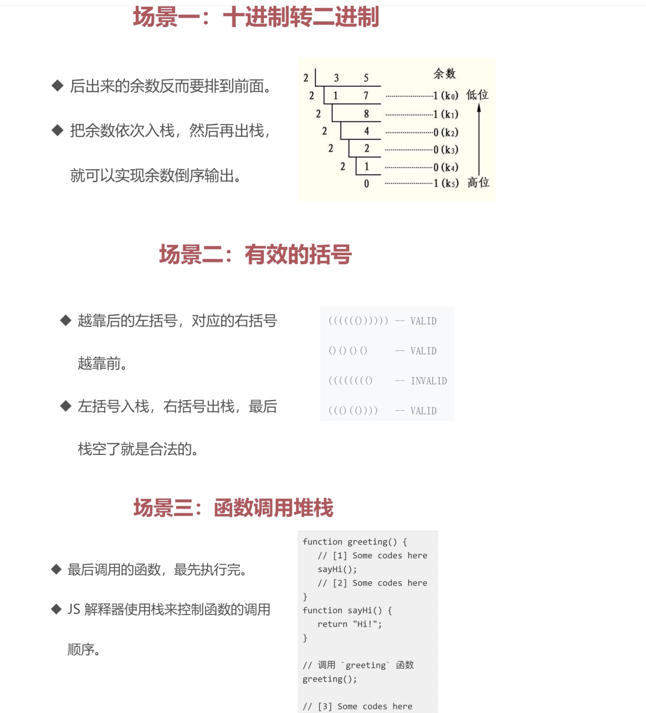

### 力扣 20.有效的括号

[力扣 链接](https://leetcode.cn/problems/valid-parentheses/description/)

#### JS 版本

```js
/**
 * @param {string} s
 * @return {boolean}
 */
var isValid = function (s) {
  if (s.length % 2 === 1) {
    return false;
  }
  const stack = [];
  for (let i = 0; i < s.length; i++) {
    const c = s[i];
    if (c === '[' || c === '{' || c === '(') {
      stack.push(c);
    } else {
      const t = stack[stack.length - 1];
      if (
        (t === '(' && c === ')') ||
        (t === '{' && c === '}') ||
        (t === '[' && c === ']')
      ) {
        stack.pop();
      } else {
        return false;
      }
    }
  }
  return stack.length === 0;
};
```

### 力扣 144. 二叉树的前序遍历

[力扣 链接](https://leetcode.cn/problems/binary-tree-preorder-traversal/description/)

#### JS 版本

```js
/**
 * Definition for a binary tree node.
 * function TreeNode(val, left, right) {
 *     this.val = (val===undefined ? 0 : val)
 *     this.left = (left===undefined ? null : left)
 *     this.right = (right===undefined ? null : right)
 * }
 */
/**
 * @param {TreeNode} root
 * @return {number[]}
 */
var preorderTraversal = function (root) {
  let arr = [];
  let fn = (node) => {
    if (!node) return;
    if (node.val !== undefined) {
      arr.push(node.val);
    }
    fn(node.left);
    fn(node.right);
  };
  fn(root);
  return arr;
};
```

#### GO 版本

```go
/**
 * Definition for a binary tree node.
 * type TreeNode struct {
 *     Val int
 *     Left *TreeNode
 *     Right *TreeNode
 * }
 */
func preorderTraversal(root *TreeNode) []int {
    arr := []int{}

    var preorder func(*TreeNode)

    preorder = func(node * TreeNode){
        if node == nil {
            return
        }
        arr = append(arr, node.Val)
        preorder(node.Left)
        preorder(node.Right)
    }
    preorder(root)
    return arr
}
```

## 队列

队列：先进先出
（JS 中用数组实现）

### 队列的应用场景

需要先进先出的场景，比如食堂排队、JS 异步（Event Loop）中的任务队列、计算最近请求次数

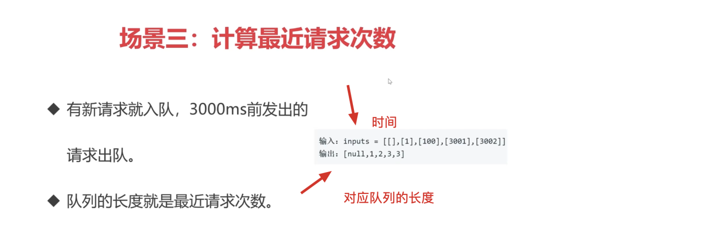

### 力扣 933. 最近的请求次数

[力扣 链接](https://leetcode.cn/problems/number-of-recent-calls/)

## 链表

在 Go 语言中，\*代表取指针地址中存的值，&代表取一个值的地址

### 数组 VS 链表

- 数组：增删非首尾元素时往往需要移动元素
- 链表：增删非首尾元素，不需要移动元素，只需要更改 next 的指向即可

### JS 中用 Object 模拟链表

```js
const a = { val: 'a' };
const b = { val: 'b' };
const c = { val: 'c' };
const d = { val: 'd' };

a.next = b;
b.next = c;
c.next = d;

// 遍历链表
let p = a;
while (p) {
  console.log(p.val);
  p = p.next;
}

// 插入
const e = { val: 'e' };
c.next = e;
e.next = d;

// 删除 （删除了e）
c.next = d;
```

### 力扣 237.删除链表中的节点

[力扣 链接](https://leetcode.cn/problems/delete-node-in-a-linked-list/)

JS 版本

```js
/**
 * Definition for singly-linked list.
 * function ListNode(val) {
 *     this.val = val;
 *     this.next = null;
 * }
 */
/**
 * @param {ListNode} node
 * @return {void} Do not return anything, modify node in-place instead.
 */
var deleteNode = function (node) {
  node.val = node.next.val;
  node.next = node.next.next;
};
```

GO 版本

```go
/**
 * Definition for singly-linked list.
 * type ListNode struct {
 *     Val int
 *     Next *ListNode
 * }
 */
func deleteNode(node *ListNode) {
    node.Val = node.Next.Val
    node.Next = node.Next.Next
}
```

### 力扣 206.反转链表

[力扣 链接](https://leetcode.cn/problems/reverse-linked-list/)

#### 思路：

用双指针一前一后遍历链表

JS 版本

```js
/**
 * Definition for singly-linked list.
 * function ListNode(val, next) {
 *     this.val = (val===undefined ? 0 : val)
 *     this.next = (next===undefined ? null : next)
 * }
 */
/**
 * @param {ListNode} head
 * @return {ListNode}
 */
var reverseList = function (head) {
  let p = head;
  let res = null;
  while (p) {
    let temp = p.next;
    p.next = res;
    res = p;
    p = temp;
  }
  return res;
};
```

GO 版本

```go
/**
 * Definition for singly-linked list.
 * type ListNode struct {
 *     Val int
 *     Next *ListNode
 * }
 */
func reverseList(head *ListNode) *ListNode {
    var res *ListNode
    var p = head
    for p != nil  {
         temp :=p.Next
         p.Next = res
         res = p
         p = temp
    }
    return res
}
```

时间复杂度——o(n)，一个循环体
空间复杂度——o(1)，无数组和矩阵

### 力扣 2. 两数相加

[力扣 链接](https://leetcode.cn/problems/add-two-numbers/description/)

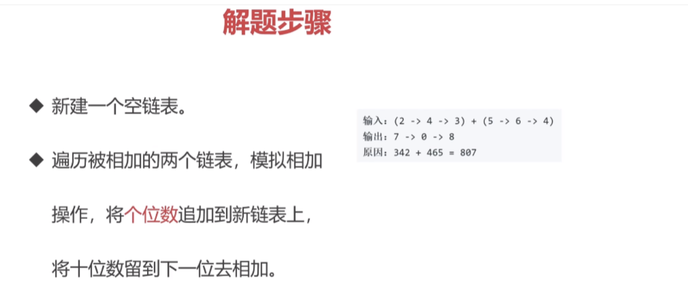

JS 版本

```js
/**
 * Definition for singly-linked list.
 * function ListNode(val, next) {
 *     this.val = (val===undefined ? 0 : val)
 *     this.next = (next===undefined ? null : next)
 * }
 */
/**
 * @param {ListNode} l1
 * @param {ListNode} l2
 * @return {ListNode}
 */
var addTwoNumbers = function (l1, l2) {
  let pre = new ListNode(0); //开辟了一个内存空间，pre指向这个空间
  let carry = 0; // 进位数
  let cur = pre; // cur也指向开辟的内存空间，跟pre指向同样的地址
  // 给cur.next赋值相当于给pre.next赋值，执行cur=cur.next相当于cur指向了新地址
  while (l1 || l2 || carry) {
    const sum = (l1?.val || 0) + (l2?.val || 0) + carry;
    cur.next = new ListNode(sum % 10);
    carry = Math.floor(sum / 10);
    if (l1) {
      l1 = l1.next;
    }
    if (l2) {
      l2 = l2.next;
    }
    cur = cur.next;
  }
  return pre.next;
};
```

GO 版本

```go
/**
 * Definition for singly-linked list.
 * type ListNode struct {
 *     Val int
 *     Next *ListNode
 * }
 */
func addTwoNumbers(l1 *ListNode, l2 *ListNode) *ListNode {
    var pre = &ListNode{}
    var carry = 0
    var cur = pre
    for l1!=nil || l2!=nil || carry != 0  {
        n1, n2 := 0,0; // Go没有三元运算符
        if l1 != nil {
            n1 = l1.Val
            l1 = l1.Next
        }
        if l2 != nil {
            n2 = l2.Val
            l2 = l2.Next
        }
        sum := n1 + n2 +carry
        carry = sum / 10   // 不需要向下取整，why？
        cur.Next = &ListNode{ sum % 10, nil}
        cur = cur.Next;
    }
    return pre.Next
}
```

时间复杂度——较长链表的长度 O(n)
空间复杂度——较长链表的长度 O(n)

### 力扣 83.删除排序链表中的重复元素

[力扣 链接](https://leetcode.cn/problems/remove-duplicates-from-sorted-list/)

#### 思路

题目中表示链表是按升序排列的，所以重复元素毕竟是相邻的。

解题思路：遍历链表，如果发现当前元素和下个元素值相同，就删除下个元素值。

JS 版本

```js
var deleteDuplicates = function (head) {
  let p = head;
  while (p && p.next) {
    if (p.val === p.next.val) {
      p.next = p.next.next;
    } else {
      p = p.next;
    }
  }
  return head;
};
```

GO 版本

```go
func deleteDuplicates(head *ListNode) *ListNode {
    var p = head
    for p!=nil && p.Next!=nil {
        if(p.Val == p.Next.Val){
            p.Next = p.Next.Next
        }else{
            p = p.Next
        }
    }
    return head
}
```

时间复杂度——O(n)
空间复杂度——O(1)

### 力扣 141. 环形链表

[力扣 链接](https://leetcode.cn/problems/linked-list-cycle/description/)

#### 思路

双指针，一快一慢，若是能相遇就是有环。

JS 版本

```js
/**
 * @param {ListNode} head
 * @return {boolean}
 */
var hasCycle = function (head) {
  let p1 = head;
  let p2 = head;

  while (p1 && p2 && p2.next) {
    p1 = p1.next;
    p2 = p2.next.next;

    if (p1 === p2) {
      return true;
    }
  }
  return false;
};
```

GO 版本

```go
/**
 * Definition for singly-linked list.
 * type ListNode struct {
 *     Val int
 *     Next *ListNode
 * }
 */
func hasCycle(head *ListNode) bool {
    var p1 = head
    var p2 = head;

    for p1!=nil && p2!=nil && p2.Next!=nil{
        p1 = p1.Next
        p2=  p2.Next.Next
        if p1 == p2 {
            return true
        }
    }
    return false
}
```

时间复杂度——O(n)
空间复杂度——O(1)

### JS 中的原型链和链表

- 原型链的本质是链表
- 原型链上的节点是各种原型对象，比如 Function.prototype、Object.prototype...
- 原型链通过**proto**属性连接各种原型对象
- obj -> Object.prototype -> null
- func -> Function.prototype -> Object.prototype -> null
- arr -> Array.prototype -> Object.prototype -> null
- 若 A 沿着原型链能找到 B.prototype，那么 `A instanceof B `为 `true`

### 使用链表指针获取 JSON 的节点值

```js
const json = {
  a: { b: { c: 1 } },
  d: { e: 2 },
};
const path = ['a', 'b', 'c'];

let p = json;
path.forEach((k) => {
  p = p[k];
});
```

### 力扣 234. 回文链表

[力扣 链接](https://leetcode.cn/problems/palindrome-linked-list/description/)

最新思路： 将元素放到数组里，然后对数组进行双指针，即可验证。

#### 思路 1

遍历链表，将链表里的值挨个放进数组里，然后，再次遍历链表，每次遍历都拿数组里最后一个值进行对比

```js
var isPalindrome = function (head) {
  let heap = [];
  let node = head;
  while (node) {
    heap.push(node.val);
    node = node.next;
  }
  console.log(heap);
  while (head) {
    const last = heap.pop();
    if (last !== head.val) {
      return false;
    }
    head = head.next;
  }
  return true;
};
```

#### 思路 2

- 1.找到前半部分链表的尾节点（使用快慢指针）
- 2.反转后半部分链表
- 3.判断是否回文(使用双指针，起点不同，一个在 head，一个中间，同时向后遍历)
- 4.还原链表并返回结果

JS 版本

```js
/**
 * Definition for singly-linked list.
 * function ListNode(val, next) {
 *     this.val = (val===undefined ? 0 : val)
 *     this.next = (next===undefined ? null : next)
 * }
 */
/**
 * @param {ListNode} head
 * @return {boolean}
 */

const endOfFirstHalf = (head) => {
  let fast = head;
  let slow = head;
  while (fast.next !== null && fast.next.next !== null) {
    fast = fast.next.next;
    slow = slow.next;
  }
  return slow;
};
const reverseList = (head) => {
  let p1 = null;
  let cur = head;
  while (cur) {
    let temp = cur.next;
    cur.next = p1;
    p1 = cur;
    cur = temp;
  }
  return p1;
};
var isPalindrome = function (head) {
  const firstHalfEnd = endOfFirstHalf(head);
  const secondHalfStart = reverseList(firstHalfEnd.next);
  let p1 = head;
  let p2 = secondHalfStart;
  let tag = true;
  while (p2 && tag) {
    if (p1.val !== p2.val) tag = false;
    p1 = p1.next;
    p2 = p2.next;
  }
  firstHalfEnd.next = reverseList(secondHalfStart);
  return tag;
};
```

### 实现 instanceOf 方法

GO 版本

```go
/**
 * Definition for singly-linked list.
 * type ListNode struct {
 *     Val int
 *     Next *ListNode
 * }
 */

func endOfFirstHalf(head *ListNode) *ListNode{
    var fast = head;
    var slow = head;
    for fast.Next!=nil && fast.Next.Next!=nil {
        fast = fast.Next.Next
        slow = slow.Next
    }
    return slow
}
func reverseList(head *ListNode) *ListNode{
    var p1 *ListNode = nil
    var cur = head

    for cur != nil {
        temp := cur.Next
        cur.Next = p1
        p1 = cur
        cur = temp
    }
    return p1

}
func isPalindrome(head *ListNode) bool {
    firstHalfEnd := endOfFirstHalf(head)
    secondHalfStart := reverseList(firstHalfEnd.Next);

    p1 := head
    p2 := secondHalfStart
    tag := true
    for p2 !=nil &&tag {
        if p1.Val != p2.Val{
            tag = false
        }
        p1=p1.Next
        p2=p2.Next
    }
    return tag
}
```

## 集合

- 集合：是一种`无序且唯一`的数据结构
- 在 ES 中，集合就是 Set
- 集合的常用操作：去重、判断某元素是否在集合中、求交集

```js
// 去重
const arr = [1, 1, 2, 2];
const arr2 = [...new Set(arr)];

// 判断元素是否在集合中
const set = new Set(arr);
const has = set.has(3);

// 求交集
const set2 = new Set([2, 3]);
const set3 = new Set([...set].filter((item) => set2.has(item)));
```

### 力扣 349.两个数组的交集

[力扣 链接](https://leetcode.cn/problems/intersection-of-two-arrays/description/)

#### 思路 1（时间复杂度太大）

- 先去重（用集合）:[...new Set(arr)]
- 遍历

JS 版本

```js
var intersection = function (nums1, nums2) {
  return [...new Set(nums1)].filter((n) => nums2.includes(n));
};
```

时间复杂度——o(n\*2)，filter 与 includes 都是 o(n)
空间复杂度——o(m)，即去重后的数组

### ES6 中的 Set

- 使用 Set 对象：new、add、delete、has、size
- 迭代 Set：多种迭代方法、Set 与 Array 互转、求交集/差集

```js
let mySet = new Set();

mySet.add(1);
mySet.add(5);
mySet.add(5);
mySet.add('some text');
let o = { a: 1, b: 2 };
mySet.add(o);
mySet.add({ a: 1, b: 2 });

const has = mySet.has(5);

mySet.delete(5);

for (let item of mySet) console.log(item);
for (let item of mySet.values()) console.log(item);
for (let [key, value] of mySet.values()) console.log(key, value);

const myArr = Array.from(mySet);

const mySet2 = new Set([1, 2, 3, 4]);

// 交集
const intersection = new Set([...mySet].filter((x) => mySet2.has(x)));
// 差集
const difference = new Set([...mySet].filter((x) => !mySet2.has(x)));
```

## 字典

### ES6 中的 Map

```js
const m = new Map();

// 增
m.set('a', 'aa');
m.set('b', 'bb');

// 删
m.delete('b');
m.clear();

// 改
m.set('a', 'aaa');
```

### 力扣 349. 两个数组的交集

[力扣 链接](https://leetcode.cn/problems/intersection-of-two-arrays/description/)

#### JS 版本

```js
var intersection = function (nums1, nums2) {
  const map = new Map();
  nums1.forEach((n) => {
    map.set(n, true);
  });
  const res = [];
  nums2.forEach((n) => {
    if (map.get(n)) {
      res.push(n);
      map.delete(n);
    }
  });
  return res;
};
```

时间复杂度——nums1 与 nums2 的长度总和，o(n+m)
空间复杂度—— 临时变量的消耗，o(m)

#### GO 版本

```go
func intersection(nums1 []int, nums2 []int) []int {
    var arr = []int{}
    map1 := make(map[int]struct{})
    for _,v := range nums1 {
       map1[v] = struct{}{}
    }
    map2 := make(map[int]struct{})
    for _,v := range nums2 {
       map2[v] = struct{}{}
    }
    if len(map1) > len(map2) {
        map1, map2 = map2, map1
    }
    for v := range map1 {
        if _, has := map2[v]; has {
            arr = append(arr, v)
        }
    }
    return arr
}
```

### 力扣 20.有效的括号

[力扣 链接](https://leetcode.cn/problems/valid-parentheses/)

#### 思路：

- 1.定义一个 map 对象，存储括号键值对
- 2.遍历字符串
- 3.遇到左符号进栈，右符号出栈

<u>**卡壳点：如何去判断右符号 => 曲线救国 => 不去判断是否是右符号，而是知道右符号最终都是要出栈的，不如在判断不是左符号时就先出栈再判断是否是右符号**<u>

#### JS 版本

```js
/**
 * @param {string} s
 * @return {boolean}
 */
var isValid = function (s) {
  let map = new Map();
  map.set('(', ')');
  map.set('{', '}');
  map.set('[', ']');

  let stack = [];
  for (let i = 0; i < s.length; i++) {
    if (map.has(s[i])) {
      stack.push(s[i]);
    } else {
      const last = stack.pop();
      if (map.get(last) !== s[i]) {
        return false;
      }
    }
  }

  return stack.length === 0;
};
```

#### GO 版本

```go
func isValid(s string) bool {
    m := map[byte]byte{
        '(': ')',
        '[': ']',
        '{': '}',
    }
    stack := []byte{}
    n := len(s)
    for i:=0;i<n;i++ {
        _,ok := m[s[i]]
        if ok {
            stack = append(stack, s[i])
        }else{
            if len(stack) == 0 || m[stack[len(stack)-1]] != s[i] {
                return false
            }else{
                 stack = stack[:len(stack)-1]
            }
        }
    }
    return len(stack)==0
}
```

时间复杂度——o(n)
空间复杂度——o(n)

### 力扣 1.两数之和

[力扣 链接](https://leetcode.cn/problems/two-sum/)

#### JS 版本

```js
/**
 * @param {number[]} nums
 * @param {number} target
 * @return {number[]}
 */
var twoSum = function (nums, target) {
  const map = new Map();
  for (let i = 0; i < nums.length; i += 1) {
    const n = nums[i];
    const n2 = target - n;
    if (map.has(n2)) {
      return [map.get(n2), i];
    } else {
      map.set(n, i);
    }
  }
};
```

#### GO 版本

```go
func twoSum(nums []int, target int) []int {
    var m = make(map[int]int)
    for i,v := range nums {
        temp := target - v
        if _,has := m[temp]; has {
            return []int{i, m[temp]}
        }else {
            m[v] = i
        }
    }
    return nil
}
```

### 💥 力扣 3.无重复字符的最长子串

[力扣 链接](https://leetcode.cn/problems/longest-substring-without-repeating-characters/description/)

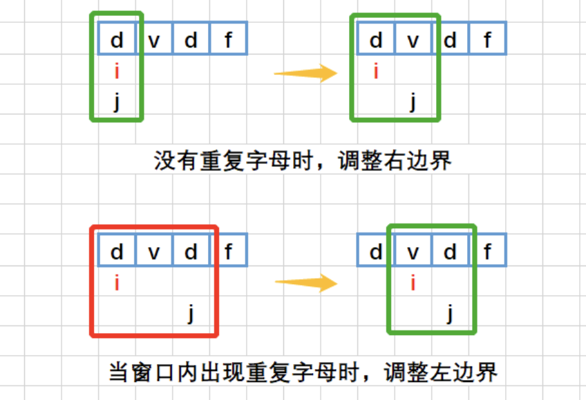

⚠️ 注意 left 值的变化:`left = max(left,m[cur] + 1);`，如何不加 max，会出错，比如 abba，当 right 移动到第 2 个 a 时，由于之前 m[a]=0,此时 left 就等于 1 了，明显是不对的，应该还要跟当时的 left 进行比较，当时的 left 已经等于 2 了

#### JS 版本

```js
/**
 * @param {string} s
 * @return {number}
 */
var lengthOfLongestSubstring = function (s) {
  let count = 0;
  const map = new Map();
  let left = 0;

  for (let right = 0; right < s.length; right++) {
    const cur = s[right];
    if (map.has(cur)) {
      left = Math.max(left, map.get(cur) + 1);
    }
    map.set(cur, right);
    count = Math.max(count, right - left + 1);
  }
  return count;
};
```

#### GO 版本

```go
func lengthOfLongestSubstring(s string) int {
    var left = 0;
    var count = 0;
    var m = make(map[byte]int)
    for right, _ := range s {
        cur:= s[right]
        if _,has := m[cur]; has {
            // left = m[cur] + 1
            // 如何不加max，会出错，比如abba，当right移动到第2个a时，由于之前m[a]=0,此时left就等于1了，明显是不对的，应该还要跟当时的left进行比较，当时的left已经等于2了
            left = max(left,m[cur] + 1);
        }
        count = max(right-left+1, count)
        m[cur]=right;
        fmt.Println(left,right, count)
        right++

    }
    return count
}
```

时间复杂度——o(n)
空间复杂度——o(m)，m 是字符串中不重复字符的个数

### 💥 力扣 76.最小覆盖子串

[力扣 链接](https://leetcode.cn/problems/minimum-window-substring/description/)

#### 图示

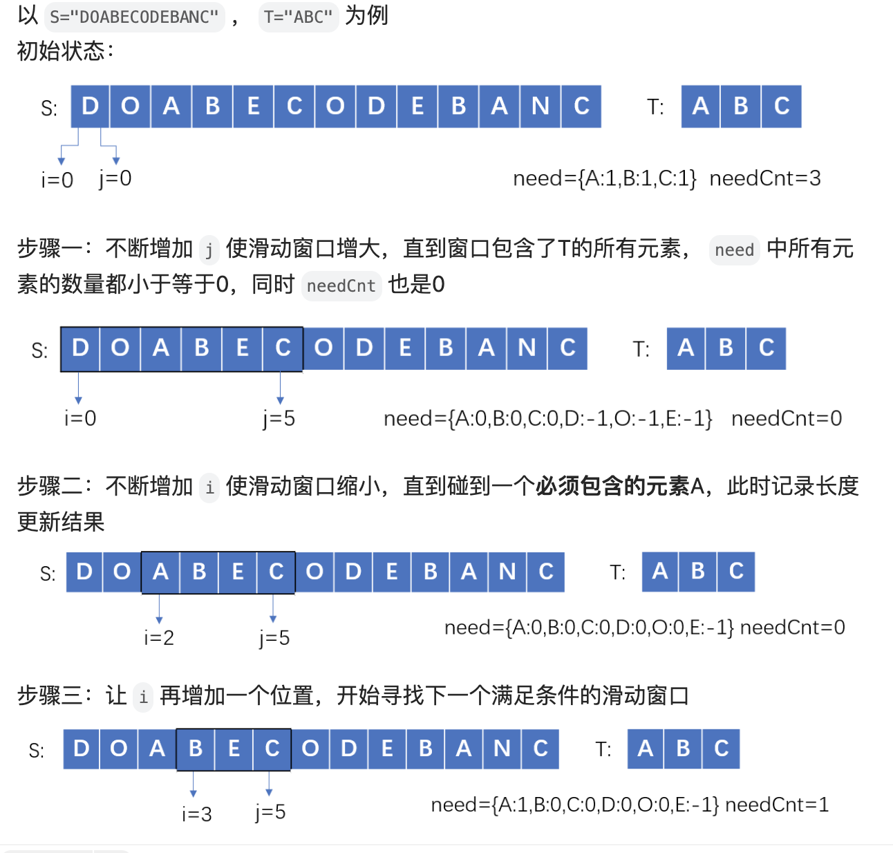

#### JS 版本

```js
/**
 * @param {string} s
 * @param {string} t
 * @return {string}
 */
var minWindow = function (s, t) {
  let l = 0;
  let r = 0;
  const needMap = new Map();
  for (let i of t) {
    needMap.set(i, needMap.has(i) ? needMap.get(i) + 1 : 1);
  }
  let needCut = needMap.size;
  // 当needCut等于0时就移动左指针，移动右指针时根据情况更改needMap和needCut以及Res数据

  let res = '';
  while (r < s.length) {
    const cur = s[r];
    if (needMap.has(cur)) {
      const newCount = needMap.get(cur) - 1;
      needMap.set(cur, newCount);
      if (newCount === 0) needCut -= 1;
    }
    while (needCut === 0) {
      // 所有必须的元素都凑齐了
      // 1.更新res值
      const newRes = s.substring(l, r + 1);
      if (!res || res.length > newRes.length) res = newRes;
      // 2.开始移动左指针，缩小长度
      const c = s[l];
      if (needMap.has(c)) {
        needMap.set(c, needMap.get(c) + 1);
        if (needMap.get(c) > 0) needCut += 1;
      }
      l += 1;
    }
    r += 1;
  }
  return res;
};
```

#### GO 版本

```go
func minWindow(s string, t string) string {
    var l =0;
    var r =0;
    var needMap = make(map[byte]int)
    for index,_ := range t {
       c := t[index]
       if _,has := needMap[c]; has {
           needMap[c] = needMap[c]+1
       }else{
           needMap[c] = 1
       }
    }

    var needCut = len(needMap)
    var res string

    for r < len(s) {
        c := s[r]
        if _,has := needMap[c]; has{
            newCount := needMap[c] - 1
            needMap[c] = newCount;
            if newCount == 0 {
                needCut--
            }
        }
        for needCut == 0 {
            newRes := s[l:r+1]
            if res == "" || len(res) > len(newRes) {
                res = newRes
            }
            c := s[l]
            if _,has := needMap[c]; has {
                needMap[c] = needMap[c]+1
                if needMap[c] > 0 {
                    needCut +=1
                }
            }
            l++
        }
        r++
    }
    return res
}

```

时间复杂度——o(m+n)，m 是 t 的长度，n 是 s 的长度
空间复杂度——o(m)，字典的长度是 t 中不同字符串的个数

## 树

JS 中没有树，但是可以用 Object 和 Array 构建树，前端工作中常见的树包括：DOM 树、级联选择、树形控件...

- 树的常用操作：深度/广度优先遍历、先中后序遍历

### 💯 深度/广度优先遍历

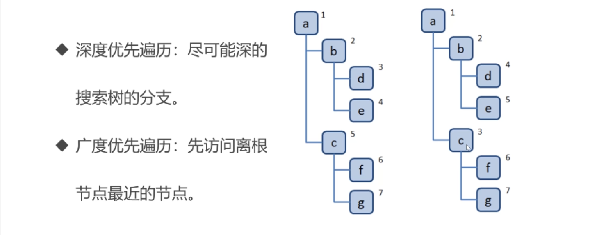

### 💯DFS 深度优先遍历

#### 思路

- 1.访问根节点
- 2.对根节点的 children 挨个进行深度优先遍历

```js
const tree = {
  val: 'a',
  children: [
    {
      val: 'b',
      children: [
        {
          val: 'd',
          children: [],
        },
        {
          val: 'e',
          children: [],
        },
      ],
    },
    {
      val: 'c',
      children: [
        {
          val: 'f',
          children: [],
        },
        {
          val: 'g',
          children: [],
        },
      ],
    },
  ],
};

const dfs = (root) => {
  console.log(root.val);
  root.children.forEach(dfs);
};

dfs(tree);

//输出
a;
b;
d;
e;
c;
f;
g;
```

### 💯BFS 广度优先遍历

#### 思路

- 1.新建一个队列，把根节点入列
- 2.把队头出队并访问
- 3.把队头的 children 挨个入队
- 4.重复 2、3 步，直到队列为空

```js
const tree = {
  val: 'a',
  children: [
    {
      val: 'b',
      children: [
        {
          val: 'd',
          children: [],
        },
        {
          val: 'e',
          children: [],
        },
      ],
    },
    {
      val: 'c',
      children: [
        {
          val: 'f',
          children: [],
        },
        {
          val: 'g',
          children: [],
        },
      ],
    },
  ],
};

const bfs = (root) => {
  const q = [root];
  while (q.length > 0) {
    const n = q.shift();
    console.log(n.val);
    n.children.forEach((child) => {
      q.push(child);
    });
  }
};

bfs(tree);

// 输出
a;
b;
c;
d;
e;
f;
g;
```

## 图

- 图可以表示任何二元关系，比如道路、航班...
- JS 中没有图，但是可以用 Object 和 Array 构建图
- 图的表示法：邻接矩阵、邻接表、关联矩阵

### 图的表示

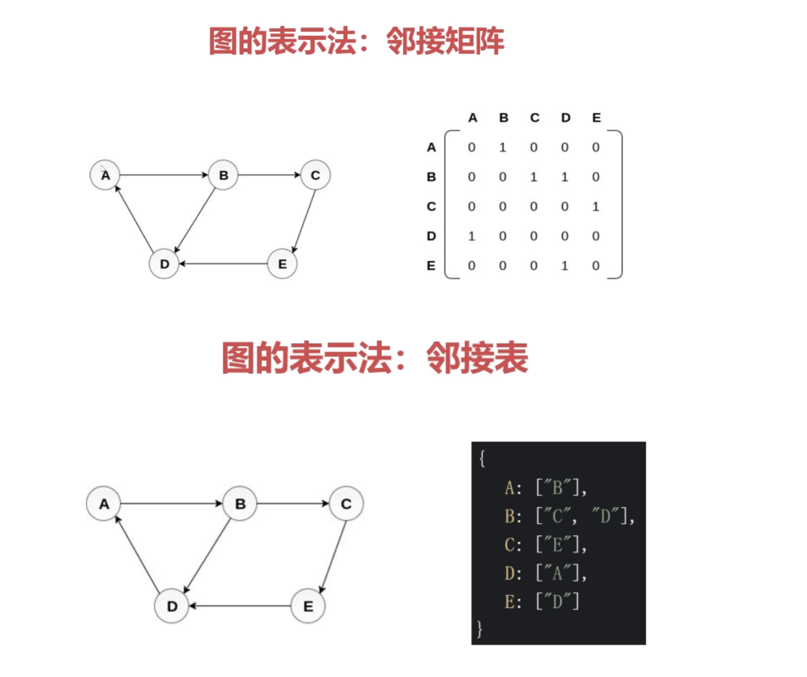

### 图的常用操作

- 深度优先遍历：尽可能深的搜索图的分支
- 广度优先遍历：先访问离根节点最近的节点

### 图的深度优先遍历

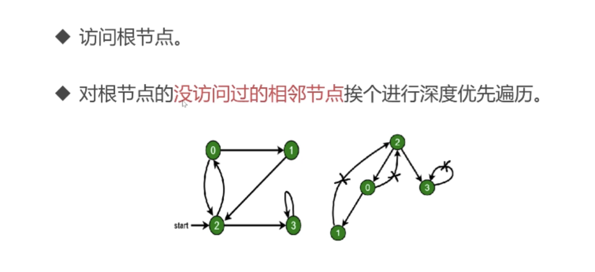

```js
// 数据源 graph.js
const graph = {
  0: [1, 2],
  1: [2],
  2: [0, 3],
  3: [3],
};

module.exports = graph;

// 示例：
const graph = require('./graph');

const visited = new Set();
const dfs = (n) => {
  console.log(n);
  visited.add(n);
  graph[n].forEach((c) => {
    if (!visited.has(c)) {
      dfs(c);
    }
  });
};

dfs(2);
// 输出
2;
0;
1;
3;
```

### 图的广度优先遍历

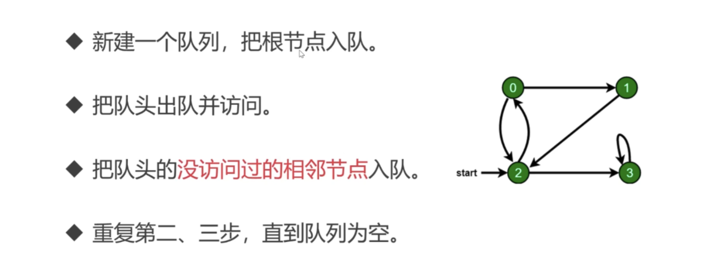

```js
const graph = require('./graph');

const visited = new Set();
const q = [2];
while (q.length) {
  const n = q.shift();
  console.log(n);
  visited.add(n);
  graph[n].forEach((c) => {
    if (!visited.has(c)) {
      q.push(c);
    }
  });
}

// 输出
2;
0;
3;
1;
```

### 💥 力扣 65.有效数字

[力扣 链接](https://leetcode.cn/problems/valid-number/description/)

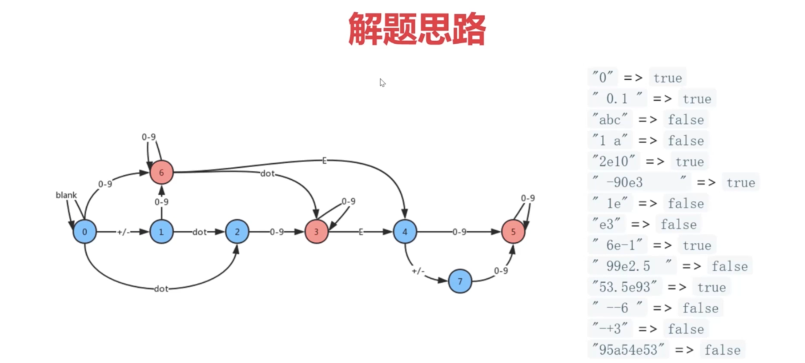
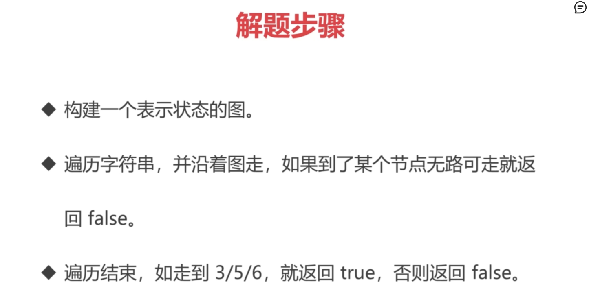

JS 版本

```js
var isNumber = function (s) {
  const graph = {
    0: { blank: 0, sign: 1, '.': 2, digit: 6 },
    1: { digit: 6, '.': 2 },
    2: { digit: 3 },
    3: { digit: 3, e: 4 },
    4: { digit: 5, sign: 7 },
    5: { digit: 5 },
    6: { digit: 6, '.': 3, e: 4 },
    7: { digit: 5 },
  };

  let state = 0;
  for (c of s.trim()) {
    if (c >= '0' && c <= '9') {
      c = 'digit';
    } else if (c === ' ') {
      c = 'blank';
    } else if (c === '+' || c === '-') {
      c = 'sign';
    }

    state = graph[state][c];
    if (state === undefined) {
      return false;
    }
  }

  if (state === 3 || state === 5 || state === 6) {
    return true;
  }
  return false;
};
```

时间复杂度——o(n)
空间复杂度——o(1)，graph 对象是静态的，不会变化。

### 💥 力扣 417. 太平洋大西洋水流问题

[力扣 链接](https://leetcode-cn.com/problems/pacific-atlantic-water-flow/)

#### 要解决的问题

哪些位置的雨水能同时流进太平洋和大西洋。

#### 重要思路

- 把矩阵想象成图

将水的流向反转，假设太平洋和大西洋的水 从低向高 “攀登”，分别能到达哪些位置，分别用 p_visited 和 a_visited 表示。两者的交集就代表能同时流向太平洋和大西洋的位置。

### 💥 力扣 133.克隆图

[力扣 链接](https://leetcode-cn.com/problems/clone-graph/)

#### 解题步骤

- 深度或广度优先遍历所有节点
- 拷贝所有的节点，存储起来
- 将拷贝的节点，按照原图的连接方法进行连接

### 力扣 133.克隆图（DFS）

#### JS 版本

```js
/**
 * // Definition for a Node.
 * function Node(val, neighbors) {
 *    this.val = val === undefined ? 0 : val;
 *    this.neighbors = neighbors === undefined ? [] : neighbors;
 * };
 */

/**
 * @param {Node} node
 * @return {Node}
 */
var cloneGraph = function (node) {
  if (!node) return;
  const visited = new Map();
  const dfs = (n) => {
    const nCopy = new Node(n.val);
    visited.set(n, nCopy);
    (n.neighbors || []).forEach((e) => {
      if (!visited.has(e)) {
        dfs(e);
      }
      nCopy.neighbors.push(visited.get(e));
    });
  };
  dfs(node);
  return visited.get(node);
};
```

#### GO 版本

```go
/**
 * Definition for a Node.
 * type Node struct {
 *     Val int
 *     Neighbors []*Node
 * }
 */

func cloneGraph(node *Node) *Node {
    var visited = make(map[*Node]*Node)
    var dfs func(node *Node)

    dfs = func(node *Node) {
        if node == nil{
            return
        }
        nCopy := &Node{node.Val, []*Node{}}
        visited[node] = nCopy

        if len(node.Neighbors) > 0 {
            for _, v := range node.Neighbors {
                if _,has := visited[v]; !has{
                    dfs(v)
                }
                nCopy.Neighbors = append(nCopy.Neighbors, visited[v])
            }
        }
    }
    dfs(node)
    return visited[node]
}
```

时间复杂度：O(n)，访问了所有节点，n 为节点数
空间复杂度：O(n)，有 map 这个数据结构。

### 力扣 133.克隆图（BFS）

#### JS 版本

## 堆

### 堆是什么？

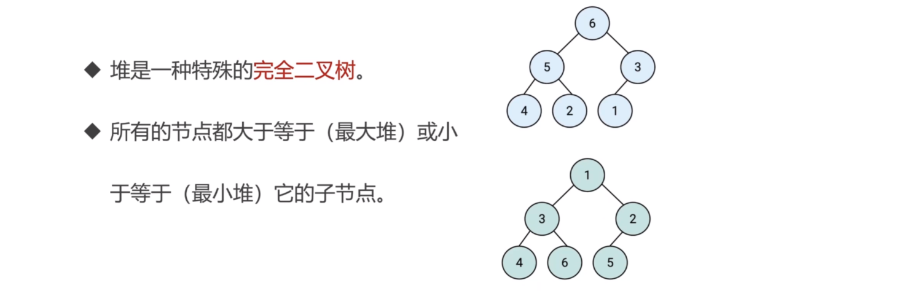

#### JS 中的堆

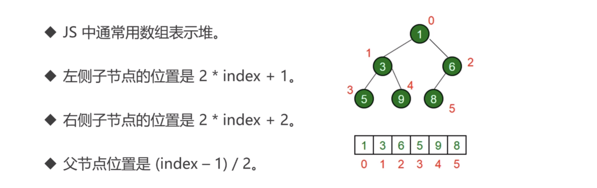

#### 堆的应用

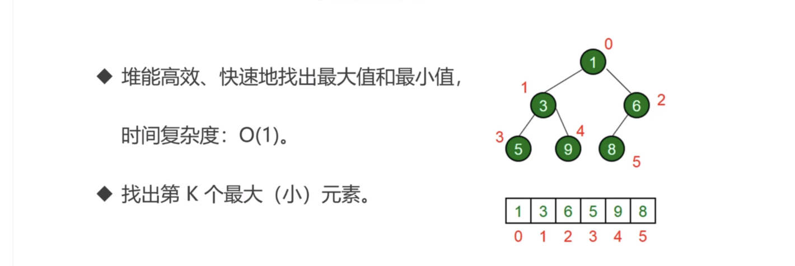
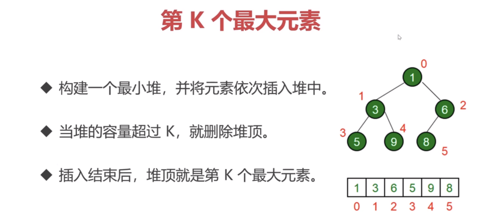

### JS 实现最小堆类

:::success{title=重点}

- 求左侧子节点：2\*index+1
- 求右侧子节点：2\*index+2
- 求父节点：(index-1)>>1 或者(index-1)/2
  :::

#### 思路

- 在类里，声明一个数组，用来装元素
- 主要方法：插入、删除堆顶、获取堆顶、获取堆大小

:::success{title=思路}

- 插入
  - 将值插入堆的底部，即数组的尾部
  - 然后上移：将这个值和它的父节点进行交换，直到父节点小于等于这个插入的值
  - 大小为 k 的堆中插入元素的时间复杂度为`O(logk)`
- ❣️ 删除堆顶
  - 用数组尾部元素替换堆顶<u>（直接删除堆顶会破坏堆结构）</u>
  - 然后下移：将新堆顶和它的子节点进行交换，直到子节点大于等于这个新堆顶
  - 大小为 k 的堆中删除堆顶的时间复杂度为`O(logk)`
- 获取堆顶和堆的大小
  - 获取堆顶：返回数组的头部
  - 获取堆的大小：返回数组的长度

:::

```js
class MinHeap {
  constructor() {
    this.heap = [];
  }
  swap(i1, i2) {
    const temp = this.heap[i1];
    this.heap[i1] = this.heap[i2];
    this.heap[i2] = temp;
  }
  getParentIndex(i) {
    // return Math.floor((i-1)/2)]
    // 取商
    return (i - 1) >> 1;
  }
  getLeftIndex(i) {
    return i * 2 + 1;
  }
  getRightIndex(i) {
    return i * 2 + 2;
  }
  // 上移
  shiftUp(index) {
    if (index == 0) return;
    const parentIndex = this.getParentIndex(index);
    if (this.heap[parentIndex] > this.heap[index]) {
      this.swap(parentIndex, index);
      this.shiftUp(parentIndex);
    }
  }
  shiftDown(index) {
    const leftIndex = getLeftIndex(index);
    const rightIndex = getRightIndex(index);
    if (this.heap[leftIndex] < this.heap[index]) {
      this.swap(leftIndex, index);
      this.shiftDown(leftIndex);
    }
    if (this.heap[rightIndex] < this.heap[index]) {
      this.swap(rightIndex, index);
      this.shiftDown(rightIndex);
    }
  }
  // 插入
  insert(value) {
    this.heap.push(value);
    this.shiftUp(this.heap.length - 1);
  }
  // 删除堆顶
  shift() {
    this.heap[0] = this.heap.pop();
    this.shiftDown(0);
  }
  // 获取堆顶
  peek() {
    return this.heap[0];
  }
  // 获取堆的大小
  size() {
    return this.heap.length;
  }
}

const h = new MinHeap();
h.insert(3);
h.insert(2);
h.insert(1);
```

### 力扣 215. 数组中的第 K 个最大元素

[力扣链接](https://leetcode-cn.com/problems/kth-largest-element-in-an-array/)

:::success{title=分析}

- 解题思路
  - 看到“第 K 个最大元素”，考虑选择使用最小堆
- 解题步骤
  - 构建一个最小堆，并依次把数组的值插入堆中
  - 当堆的容量超过 K，就删除堆顶
  - 插入结束后，堆顶就是第 K 个最大元素
- 思考：为什么不是用最大堆？
  最小堆和最大堆都只是保证父子节点之间的大小，但子节点有两个，而且两个子节点哪边大并不确定，如果是求最大堆，无法保证第 k 个元素就是目标值，但是求最小堆，目标值就是堆顶，能够保证是目标值
  :::

#### 用最小堆实现（题目中要求时间复杂度位 O(n)，所以此法不满足要求，但可以学习下）

时间复杂度：O(n \* logk)
空间复杂度：O(k)

```js
/**
 * @param {number[]} nums
 * @param {number} k
 * @return {number}
 */
var findKthLargest = function (nums, k) {
  const minHeap = new MinHeap();
  for (let i = 0; i < nums.length; i++) {
    h.insert(nums[i]);
    if (h.size() > k) {
      h.shift();
    }
  }
};

class MinHeap {
  constructor() {
    this.heap = [];
  }
  getParentIndex(i) {
    return (i - 1) >> 1;
  }
  getLeftChildIdx(i) {
    return i * 2 + 1;
  }
  getRightChildIdx(i) {
    return i * 2 + 2;
  }
  swap(i, j) {
    const temp = this.heap[i];
    this.heap[i] = this.heap[j];
    this.heap[j] = temp;
  }
  shiftUp(i) {
    if (i === 0) return;
    const parentIdx = this.getParentIndex(i);
    if (this.heap[parentIdx] > this.heap[i]) {
      this.swap(parentIdx, i);
      this.shiftUp(parentIdx);
    }
  }
  shiftDown(i) {
    const left = this.getLeftChildIdx(i);
    const right = this.getRightChildIdx(i);
    if (this.heap[left] < this.heap[i]) {
      this.swap(left, i);
      this.shiftDown(left);
    }
    if (this.heap[right] < this.heap[i]) {
      this.swap(right, i);
      this.shiftDown(right);
    }
  }
  insert(value) {
    this.heap.push(value);
    this.shiftUp(this.heap.length - 1);
  }
  size() {
    return this.heap.length;
  }
  deletePeek() {
    this.heap[0] = this.heap.pop();
    this.shiftDown(0);
  }
  peek() {
    return this.heap[0];
  }
}
```

### 力扣 347. 前 K 个高频元素

[力扣链接](https://leetcode-cn.com/problems/top-k-frequent-elements/)

## Chrome 的 Profile 工具测试 Map 和 Object 频繁增删操作的性能
