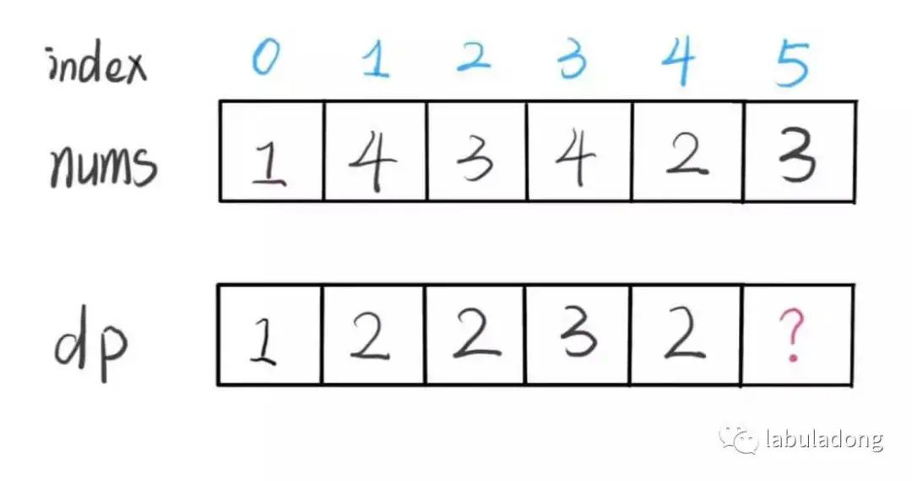

## [🦩 从最长递增子序列推状态转移方程](https://mp.weixin.qq.com/s?__biz=MzAxODQxMDM0Mw==&mid=2247485269&idx=1&sn=571a6366b0b592f103971ae3e119998b&scene=21#wechat_redirect)

[力扣链接](https://leetcode.cn/problems/fibonacci-number/description/)

注意「子序列」和「子串」这两个名词的区别，子串一定是连续的，而子序列不一定是连续的。

### 解法一：动态规划，时间复杂度 O(N^2)

- dp[i] 表示以 nums[i] 这个数结尾的最长递增子序列的长度。
  
- dp[i]初始值为 1，因为以 nums[i] 结尾的最长递增子序列起码要包含它自己。
- 假设 dp[0...i-1] 都已知，如何求 dp[i]？ 假设求 dp[5], 已知 nums[5] = 3，既然是递增子序列，我们只要找到前面那些结尾比 3 小的子序列，然后把 3 接到最后，就可以形成一个新的递增子序列，而且这个新的子序列长度加一。
  
  ```js
  for (int i = 0; i < nums.length; i++) {
    for (int j = 0; j < i; j++) {
        if (nums[i] > nums[j])
            dp[i] = Math.max(dp[i], dp[j] + 1);
    }
  }
  ```
- 最终结果（子序列的最大长度）是 dp 数组中的最大值
  ```js
  int res = 0;
  for (int i = 0; i < dp.size(); i++) {
      res = Math.max(res, dp[i]);
  }
  return res;
  ```

题解：

```js
var lengthOfLIS = function (nums) {
  let dp = new Array(nums.length);
  dp.fill(1);

  for (let i = 0; i < nums.length; i++) {
    for (let j = 0; j < i; j++) {
      if (nums[j] < nums[i]) {
        dp[i] = Math.max(dp[i], dp[j] + 1);
      }
    }
  }
  let res = 1;
  for (let i = 0; i < dp.length; i++) {
    res = Math.max(res, dp[i]);
  }
  return res;
};
```

### 解法二：贪心+二分查找，时间复杂度为 O(NlogN)

思路跟玩蜘蛛纸牌一样，难点就是要用算法找出当前的牌放在那一组上：由于每一组的牌都是有序的，就可以用二分查找来搜索当前牌应放置的位置。 [保你闭着眼睛也能写对二分查找](https://mp.weixin.qq.com/s?__biz=MzAxODQxMDM0Mw==&mid=2247485044&idx=1&sn=e6b95782141c17abe206bfe2323a4226&chksm=9bd7f87caca0716aa5add0ddddce0bfe06f1f878aafb35113644ebf0cf0bfe51659da1c1b733&scene=21#wechat_redirect)详细介绍了二分查找的细节及变体。

规则：

- 只能把点数小的牌压到点数比它大的牌上；
- 如果当前牌点数较大没有可以放置的堆，则新建一个堆，把这张牌放进去；
- 如果当前牌有多个堆可供选择，则选择最左边的那一堆放置。 -> 这样可以保证牌堆顶的牌有序

重点：

- 每一堆的牌是有序排列的
- 遇到当前牌有多个堆可选择时选择最左边的，保证牌堆顶的牌有序，二分查找就是在这些堆顶数中进行，搜索当前牌应放置的位置
- 因为牌堆顶的牌有序，所以如果从每堆拿出一张牌，就可以形成一个递增子序列。又因为每堆牌的值是递减的，所以这个递增子序列是最长的。

分析：
nums = [0,3,1,6,2,2,7,8]，考虑两个长度一样的递增子序列[0,1,2]和[3,6,7]，哪个子序列更好？[0,1,2]更好，因为它的最后一个值更小，有更多的数可以作为它的下一个数，延长这个递增子序列的可能性更大。
因此，如果想找最长递增子序列，末尾的数越小越好。因此最后的结果就是牌堆顶组成的序列就是最长递增子序列。

```js
/**
 * @param {number[]} nums
 * @return {number}
 */
var lengthOfLIS = function (nums) {
  const top = [];
  let count = 0; // 牌堆的数量

  for (let i = 0; i < nums.length; i++) {
    const curPoker = nums[i];
    let left = 0,
      right = count; // 二分查找的区间就是所有牌堆最后一张牌所组成的区间
    while (left < right) {
      // 区间是左闭右开,right是长度值，所以不能取

      let mid = left + ((right - left) >> 1); // 注意要打括号，否则结果不对
      if (top[mid] > curPoker) {
        right = mid; // 如果是左闭右闭，就是mid-1,但while是左闭右开的，这里也要保持，所以就是mid
      } else if (top[mid] < curPoker) {
        left = mid + 1; // 左闭右闭，就是mid+1
      } else {
        right = mid;
      }
    }
    // 第一张牌需要放第一个堆，以及没有找到合适的牌堆时，新建一个堆
    if (left == count) count++;
    top[left] = curPoker;
  }
  return count;
};
```
