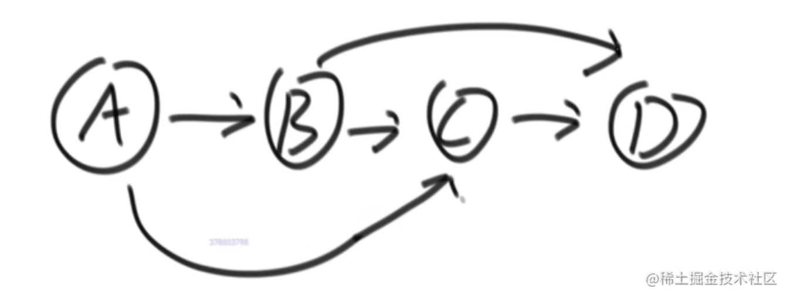
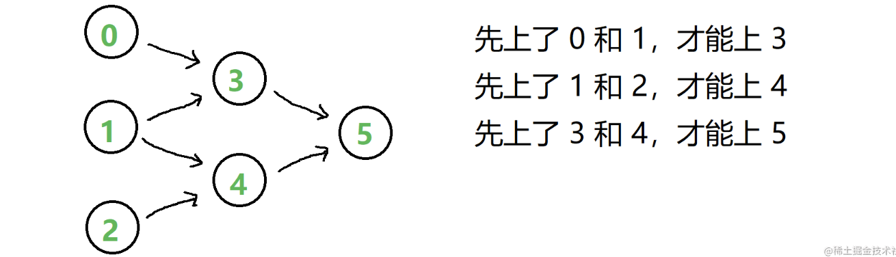

## 拓扑排序

适用范围：要求有向图，且有入度为 0 的节点，且没有环。

给出一个有向图，如何确定访问节点的顺序，并能保证所有的都被访问到，拓扑排序就是来解决这个问题的。

把一个有向无环图转成线性的排序，这就是拓扑排序。

### 举个例子

假定有向图如下：



1. 先确定入度为 0 的点，为 A，这个点在拓扑排序中是排在最前面的
2. 确定好 A 点之后，将 A 点从图中抹去，剩下 B、C、D 三个点，可以确定拓扑排序的第二个点是 B（入度为 0）
3. 同样将 B 点从图中抹去，可以依次确定拓扑排序的第三、四个点是 C、D

:::success{title=思路}
给出一个有向图，依次找出入度为 0 的点，就可以确定出访问节点的顺序
:::

```java
public class TopologySort{
    public static List<Node> sortedTopology(Grapgh grapgh){
        // key: 某一个node
        // value：剩余的入度
        HashMap<Node, Integer> inMap = new HashMap<>();
        // 入度为0的点，才能进这个队列
        Queue<Node> zeroInQueue = new LinkedList<>();
        for(Node node: graph.nodes.values()){
            inMap.put(node, node.in);
            if(node.in == 0){
                zeroInQueue.add(node):
            }
        }
        // 拓扑排序的结果，依次加入result
        List<Node> result = new ArrayList<>();
        while(!zeroInQueue.isEmpty()){
            Node cur = zeroInQueue.poll();
            result.add(cur);
            for(Node next: cur.nexts){
                inMap.put(next, inMap.get(next)-1);
                if(inMao.get(next)==0){
                    zeroInQueue.add(next);
                }
            }
        }
        return result;
    }
}

```

## 力扣 207. 课程表

[力扣链接](https://leetcode.cn/problems/course-schedule/)

:::success{title=解题思路}
本题的选课，有种依赖关系，可以用**有向无环图**来描述依赖关系：

这里我们需要把一个**有向无环图**转成**线性的排序**，这就是**拓扑排序**。

**拓扑排序**中有两个概念：**入度**和**出度**。

在这里，入度为 0 就表示这门课不依赖别的课，可以直接去上课。因为在选课时，我们就先去学那个入度为 0 的课程。学完这个课程之后，就可以再去学别的课程。
:::

步骤：

1. 让入度为 0 的课入列，它们是能直接选的课。
2. 然后逐个出列，出列代表着课被选，同时清除该课的相关联系，也就是减小相关课的入度。
3. 如果相关课的入度新变为 0，安排它入列、再出列……直到没有入度为 0 的课可入列。
4. 当遍历完成时，如果仍有课的入度不为 0，无法被选，完成不了所有课。否则，能找到一种顺序把所有课上完。

:::success{title=说明}

- 入度数组：课号 0 到 n - 1 作为索引，通过遍历先决条件表求出对应的初始入度。
- 邻接表：用哈希表记录依赖关系（也可以用二维矩阵，但有点大）
  - key：课号
  - value：依赖这门课的后续课（数组）

:::

```js
const canFinish = (numCourses, prerequisites) => {
  const inDegree = new Array(numCourses).fill(0); // 入度数组
  const map = {}; // 邻接表
  for (let i = 0; i < prerequisites.length; i++) {
    inDegree[prerequisites[i][0]]++; // 求课的初始入度值
    if (map[prerequisites[i][1]]) {
      // 当前课已经存在于邻接表
      map[prerequisites[i][1]].push(prerequisites[i][0]); // 添加依赖它的后续课
    } else {
      // 当前课不存在于邻接表
      map[prerequisites[i][1]] = [prerequisites[i][0]];
    }
  }
  const queue = [];
  for (let i = 0; i < inDegree.length; i++) {
    // 所有入度为0的课入列
    if (inDegree[i] == 0) queue.push(i);
  }
  let count = 0;
  while (queue.length) {
    const selected = queue.shift(); // 当前选的课，出列
    count++; // 选课数+1
    const toEnQueue = map[selected]; // 获取这门课对应的后续课
    if (toEnQueue && toEnQueue.length) {
      // 确实有后续课
      for (let i = 0; i < toEnQueue.length; i++) {
        inDegree[toEnQueue[i]]--; // 依赖它的后续课的入度-1
        if (inDegree[toEnQueue[i]] == 0) {
          // 如果因此减为0，入列
          queue.push(toEnQueue[i]);
        }
      }
    }
  }
  return count == numCourses; // 选了的课等于总课数，true，否则false
};
```

## 力扣 210. 课程表 II

[力扣链接](https://leetcode.cn/problems/course-schedule-ii/)

## 力扣 269. 火星词典

[力扣链接](https://leetcode.cn/problems/alien-dictionary/)

## 力扣 329. 矩阵中的最长递增路径

[力扣链接](https://leetcode.cn/problems/longest-increasing-path-in-a-matrix/)

## 力扣 444. 序列重建

[力扣链接](https://leetcode.cn/problems/sequence-reconstruction/)
