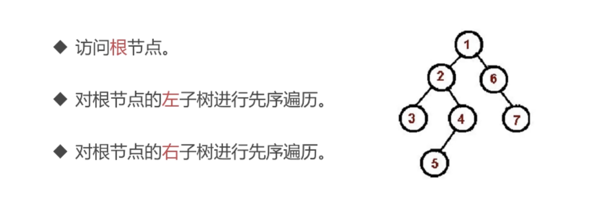
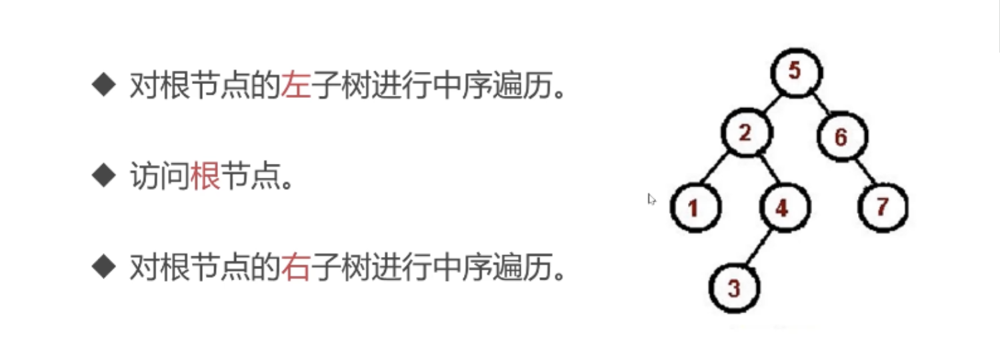
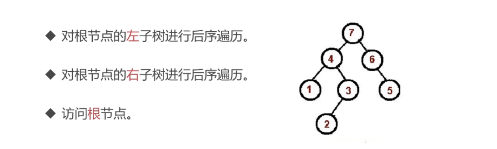
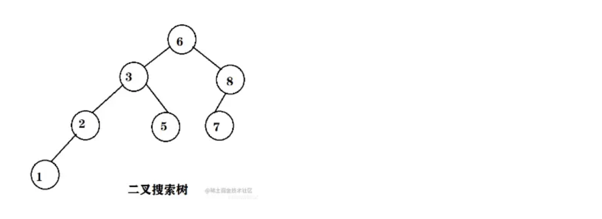
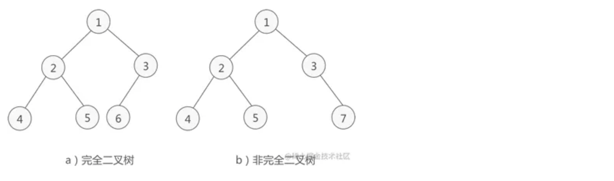
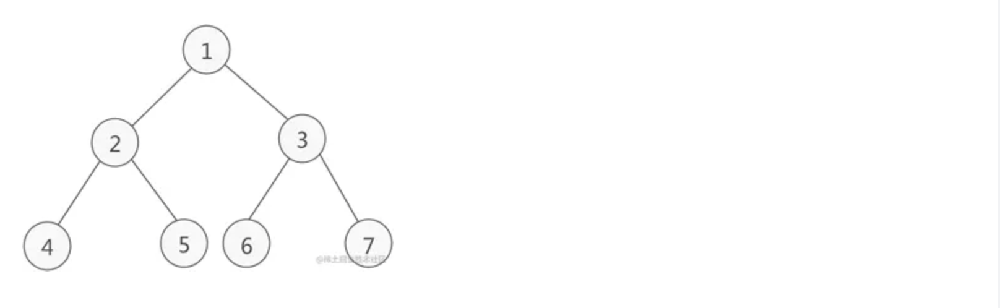

## 二叉树

二叉树是什么？

- 树中每个节点最多只能有两个子节点
- 在 JS 中通常用 Object 来模拟二叉树

数据源：

```js
//  bt.js
const bt = {
  val: 1,
  left: {
    val: 2,
    left: {
      val: 4,
      left: null,
      right: null,
    },
    right: {
      val: 5,
      left: null,
      right: null,
    },
  },
  right: {
    val: 3,
    left: {
      val: 6,
      left: null,
      right: null,
    },
    right: {
      val: 7,
      left: null,
      right: null,
    },
  },
};

module.exports = bt;
```

### 二叉树先序遍历（递归）

#### 思路



```js
const data = require('./bt');

const preorder = (root) => {
  if (!root) {
    return;
  }
  console.log(root.val);
  preorder(root.left);
  preorder(root.right);
};

preorder(data);

// 输出
1;
2;
4;
5;
3;
6;
7;
```

### 二叉树先序遍历（非递归）

```js
const data = require('./bt');

const preorder = (root) => {
  if (!root) {
    return;
  }
  const stack = [root];
  while (stack.length) {
    const n = stack.shift();
    console.log(n.val);
    if (n.left) stack.push(n.left);
    if (n.right) stack.push(n.right);
  }
};
preorder(data);
```

### 二叉树中序遍历（递归）



```js
const data = require('./bt');

const inorder = (root) => {
  if (!root) {
    return;
  }
  inorder(root.left);
  console.log(root.val);
  inorder(root.right);
};

inorder(data);

// 输出
4;
2;
5;
1;
6;
3;
7;
```

### 二叉树中序遍历（非递归）

```js
const data = require('./bt');

const inorder = (root) => {
  if (!root) {
    return;
  }
  const stack = [];
  let p = root;
  while (stack.length || p) {
    while (p) {
      stack.push(p);
      p = p.left;
    }
    const n = stack.pop();
    console.log(n.val);
    p = n.right;
  }
};

inorder(data);
```

### 二叉树后序遍历（递归）



```js
const data = require('./bt');

const postorder = (root) => {
  if (!root) {
    return;
  }
  postorder(root.left);
  postorder(root.right);
  console.log(root.val);
};

postorder(data);

// 输出
4;
5;
2;
6;
7;
3;
1;
```

### 二叉树后序遍历（非递归）

```js
const data = require('./bt');

const postorder = (root) => {
  if (!root) {
    return;
  }
  const outputStack = [];
  const stack = [root];
  while (stack.length) {
    const n = stack.pop();
    outputStack.push(n);
    if (n.left) stack.push(n.left);
    if (n.right) stack.push(n.right);
  }
  while (outputStack.length) {
    const n = outputStack.pop();
    console.log(n.val);
  }
};

postorder(data);
```

## 搜索二叉树

### 搜索二叉树的性质

- 若它的左子树不空，则左子树上所有结点的值均小于它的根结点的值；
- 若它的右子树不空，则右子树上所有结点的值均大于它的根结点的值；
- 它的左、右子树也分别为二叉搜索树



### 判定某个二叉树是否是二叉搜索树

:::success{title=思路}
采用中序遍历方式，如果遍历时的节点一直升序，说明是搜索二叉树。
:::

### 力扣 98. 验证二叉搜索树

[力扣链接](https://leetcode.cn/problems/validate-binary-search-tree/description/)

## 完全二叉树

### 搜索二叉树的性质

如果二叉树中除去最后一层节点为满二叉树，且最后一层的结点依次从左到右分布，则此二叉树被称为完全二叉树。


完全二叉树满足以下要求：

- 所有叶子节点都出现在 k 或者 k-1 层，而且从 1 到 k-1 层必须达到最大节点数；
- 第 k 层可以不是满的，但是第 k 层的所有节点必须集中在最左边。

需要注意的是不要把完全二叉树和“满二叉树”搞混了，完全二叉树不要求所有树都有左右子树，但它要求：

- 任何一个节点不能只有右子树没有左子树
- 叶子节点出现在最后一层或者倒数第二层，不能再往上

### 判定某个二叉树是否是完全二叉树

:::success{title=思路}
采用宽度遍历方式，遍历节点过程中，如果遇到以下情况，说明不是完全二叉树：

- 1.该节点有右孩子，但没有左孩子，直接返回 false
- 2.在不符合规则 1 的前提下，如果该节点没有左右孩子，那么后续遍历到的所有节点（包括下一层的节点）都需要是叶子节点
  :::

### 力扣 958. 二叉树的完全性检验

[力扣链接](https://leetcode.cn/problems/check-completeness-of-a-binary-tree/description/)

## 满二叉树

### 满二叉树的性质

如果二叉树中除了叶子结点，每个结点的度都为 2，则此二叉树称为满二叉树。
满二叉树除了满足普通二叉树的性质，还具有以下性质：

- 满二叉树中第 i 层的节点数为 2n-1  个。
- 深度为 k 的满二叉树必有 2k-1 个节点 ，叶子数为 2k-1。
- 满二叉树中不存在度为 1 的节点，每一个分支点中都两棵深度相同的子树，且叶子节点都在最底层。
- 具有 n 个节点的满二叉树的深度为 log2(n+1)。

  

### 判定某个二叉树是否是满二叉树

利用“深度为 k 的满二叉树必有 2k-1 个节点”这个性质，先求二叉树的最大深度，再求二叉树的节点个数，如果满足关系式那就是满二叉树，否则就不是。

## 平衡二叉树

### 平衡二叉树的性质

概念： 对于任意一个子树，左树和右树的高度差都不超过 1。
平衡二叉树的提出就是为了保证树不至于太倾斜，尽量保证两边平衡。因此它的定义如下：

- 平衡二叉树要么是一棵空树
- 要么保证左右子树的高度之差不大于 1
- 子树也必须是一颗平衡二叉树

也就是说，树的两个左子树的高度差别不会太大。

### 判定某个二叉树是否是平衡二叉树

### 力扣 110. 平衡二叉树

[力扣链接]()

## 二叉树的序列化和反序列化

### 力扣 剑指 Offer 37. 序列化二叉树

[力扣链接]()

### 力扣 剑指 Offer II 048. 序列化与反序列化二叉树

[力扣链接]()

### 力扣 449. 序列化和反序列化二叉搜索树

[力扣链接]()

### 力扣 297. 二叉树的序列化与反序列化

[力扣链接]()

## 二叉树的最近公共祖先

### 力扣 235. 二叉搜索树的最近公共祖先

[力扣链接]()

### 力扣 236. 二叉树的最近公共祖先

[力扣链接]()

## 二叉树的宽度

### 力扣 662. 二叉树最大宽度

[力扣链接]()
