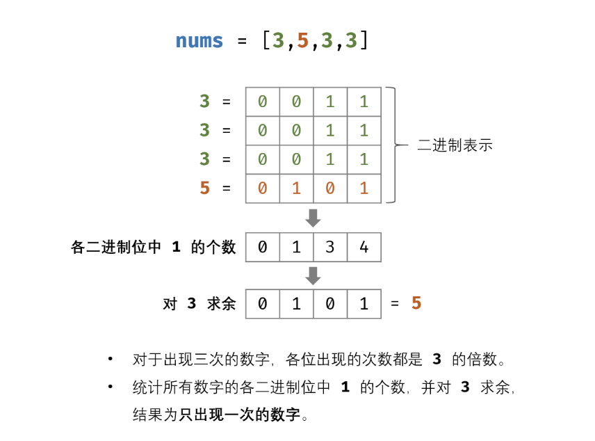

## 二进制

在二进制数里，最高位 0 表示正数，1 表示负数。
为了便于加减计算，正负数用补码来表示，正数的补码就是原码；负数的补码是原码的反码再加 1。
如八位二进制数，它的表示数的范围是：-128 到+127。

+18 -------- 00010010
-18 -------- 反码为：11101101 补码为：11101110

### 原码、反码、补码

:::success{title=原码}
原码就是符号位加上真值的绝对值，即用第一位表示符号，其余位表示值。比如：如果是 8 位二进制：

- [+1]原= 0000 0001
- [-1]原= 1000 0001

第一位是符号位，因为第一位是符号位，所以 8 位二进制数的取值范围就是：<u>（即第一位不表示值，只表示正负。）</u>
[1111 1111 , 0111 1111]，即[-127 , 127]
:::

:::success{title=反码}
反码的表示方法是：

- 正数的反码是其本身；
- 负数的反码是在其原码的基础上，符号位不变，其余各个位取反。

例如：

- [+1] = [0000 0001]原= [0000 0001]反
- [-1] = [1000 0001]原= [1111 1110]反
  可见如果一个反码表示的是负数，人脑无法直观的看出来它的数值。通常要将其转换成原码再计算。

:::

:::success{title=补码}
补码的表示方法是：

- 正数的补码就是其本身；
- 负数的补码是在其原码的基础上，符号位不变，其余各位取反，最后+1。(也即在反码的基础上+1)

例如：

- [+1] = [0000 0001]原= [0000 0001]反= [0000 0001]补
- [-1] = [1000 0001]原= [1111 1110]反= [1111 1111]补
  对于负数，补码表示方式也是人脑无法直观看出其数值的。通常也需要转换成原码再计算其数值。

:::

### 负数的二进制

以十进制（以 10 为基数）数字 9 和 -9 的 32 位二进制表示为例：
:::success{title=负数的二进制表示}

- 9 (base 10): 00000000000000000000000000001001 (base 2)
- -9 (base 10): 11111111111111111111111111110111 (base 2) <u>（取反再加 1）</u>
  :::
  负十进制（以 10 为基数）数字 -9 的二进制表示形式是正十进制（以 10 为基数）数字 9 的二进制补码。也就是说，它是通过反转 00000000000000000000000000001001 的所有位并添加 1 来计算的。

在这两种情况下，二进制数的符号都由其最左边的位给出：对于正十进制数 9，二进制表示的最左边位是 0，对于负十进制数 -9，二进制表示的最左边位是 1。

### 正数的有符号/无符号右移

对于正数 9，零填充右移和符号传播右移产生相同的结果：9 >>> 2 产生 2，与 9 >> 2 相同：
:::success{title=正数的有符号/无符号右移}
9 (base 10): 00000000000000000000000000001001 (base 2)
9 >> 2 (base 10): 00000000000000000000000000000010 (base 2) = 2 (base 10)
9 >>> 2 (base 10): 00000000000000000000000000000010 (base 2) = 2 (base 10)
:::

请注意，最右边的两个位 01 被移出，两个零从左边移入。

### 负数的有符号/无符号右移

> 无符号右移运算符（>>>）（零填充右移）将左操作数计算为无符号数，并将该数字的二进制表示形式移位为右操作数指定的位数，取模 32。 详情见[无符号右移-MDN](https://developer.mozilla.org/zh-CN/docs/Web/JavaScript/Reference/Operators/Unsigned_right_shift)

-9 >> 2（符号传播右移）产生 -3，但 -9 >>> 2（零填充右移）产生 1073741821：
:::success{title=负数的有符号/无符号右移}

-9 (base 10): 11111111111111111111111111110111 (base 2)
-9 >> 2 (base 10): 11111111111111111111111111111101 (base 2) = -3 (base 10) <u>（左侧是加 1）</u>
-9 >>> 2 (base 10): 00111111111111111111111111111101 (base 2) = 1073741821 (base 10) <u>（左操作数计算为无符号数，左侧是加 0）</u>
:::
请注意最右边的两个位 11 是如何移出的。对于 -9 >> 2（符号传播右移），最左边的 1 位的两个副本已从左侧移入，这保留了负号。另一方面，对于 -9 >>> 2（零填充右移），零从左移入，因此不会保留数字的负号，结果是一个（大）正数。

左操作数将被转换为无符号 32 位整数，这意味着浮点数将被截断，而超出 32 位边界的数字将溢出/下溢。

右操作数将转换为无符号的 32 位整数，然后取模 32，因此实际移位偏移量将始终是介于 0 和 31 之间的正整数（包括 0 和 31）。例如，100 >>> 32 与 100 >>> 0 相同（并产生 100），因为 32 模 32 是 0。

## 位运算概览

| 符号 | 描述       | 说明                                                                                                                           | 运算规则                                                                                                                              |
| ---- | ---------- | ------------------------------------------------------------------------------------------------------------------------------ | ------------------------------------------------------------------------------------------------------------------------------------- |
| &    | 与         | 两个位都为 1 时，结果才为 1                                                                                                    | 0&0=0 0&1=0 1&0=0 1&1=1                                                                                                               |
| \|   | 或         | 两个位都为 0 时，结果才为 0                                                                                                    | 0\|0=0 0\|1=1 1\|0=1 1\|1=1                                                                                                           |
| ^    | 异或       | 两个位相同为 0，相异为 1                                                                                                       | 0^0=0 0^1=1 1^0=1 1^1=0                                                                                                               |
| ~    | 取反       | 0 变 1，1 变 0                                                                                                                 | ~1=0、~0=1                                                                                                                            |
| <<   | 左移       | 各二进位全部左移若干位，高位丢弃，低位补 0                                                                                     | 例如 1010 1110<<2,将 a 的二进制位左移 2 位、右补 0，即得 a=1011 1000                                                                  |
| > >  | 右移       | 各二进位全部右移若干位，对无符号数，高位补 0，有符号数，各编译器处理方法不一样，有的补符号位（算术右移），有的补 0（逻辑右移） | 例如 1010 1110>>2,将 a 的二进制位右移 2 位，正数左补 0，负数左补 1<br><u>（操作数每右移一位，相当于该数除以 2）</u>                   |
| >>>  | 无符号右移 | 对于正数，>>>与>>操作结果一样，但负数会天差地别。                                                                              | console.log(3>>1) // 输出 1<br>console.log(3>>>1) // 输出 1<br>console.log(-3>>1) // 输出-2<br>console.log(-3>>>1) // 输出 2147483646 |

## 复合赋值运算符

位运算符与赋值运算符结合，组成新的复合赋值运算符，它们是：
|符号|举例|说明|
|--|--|--|
|+= | 例：a+=b | 相当于 a=a+b|
|&= | 例：a&=b | 相当于 a=a&b|
|\|= | 例：a\|=b| 相当于 a=a\|b|
|>>=| 例：a>>=b |相当于 a=a>>b|
|<<= |例：a<<=b |相当于 a=a<<b |
|^= |例：a^=b |相当于 a=a^b|

## 与运算&

### 认识&

& 按位与操作，按二进制位进行"与"运算。运算规则：（有 0 则为 0）

- 0 & 0 = 0;
- 0 & 1 = 0;
- 1 & 0 = 0;
- 1 & 1 = 1;

### -x 、 x & (-x) 、x & (～ x+1)

-x 的值， 其实就是在 x 的值的基础上进行按位取反(~x)之后在增加 1 所得，即`x & -x == x & (~x + 1)`

#### x 为偶数

```js
x = 0000 0100 1110   // 假设x为偶数，比如0000 0100 1110
～x = 1111 1011 0001 // 取反后就是1111 1011 0001
～x+1 = 1111 1011 0001 + 1 = 1111 1011 0010   // 再加1就等于1111 1011 0010

x & (~x + 1) = 0000 0000 0010        //x & (-x)的结果就是0000 0000 0010
```

#### x 为奇数

```js
x = 0000 0100 1111    // 假设x为奇数，比如 0000 0100 1111
～x = 1111 1011 0000  // 取反后为1111 1011 0000
～x+1 = 1111 1011 0001 //由于～x的值一定是偶数，因此加1时必不会产生进位
x & (~x + 1) = 0000 0000 0001  // x & (~x + 1)结果就是 0000 0000 0001，最后一位必定为1，其他位必定为0
```

:::info{title=结论}

- x 为偶数，`x & (-x)`的二进制表达式只会有一位保留为 1
- x 为奇数，`x & (-x)`的二进制表达式最后一位必定为 1，其它为 0
- x 为 0 时，`x & (-x)`的二进制表达式为 0
  `x & (-x)` 一般是用来获取某个二进制数的最低位的 1 所对应的值

:::

## 异或运算^(Exclusive or, XOR)

运算符号为：⊕（代码中就是^）。

> 如果 a、b 两个值不相同，则异或结果为 1；如果值相同，则为 0
> 用 1 表示真，0 表示假，则异或运算法则为：0⊕0=0，0⊕1=1，1⊕0=1，1⊕1=0。

异或运算也被常称为不进位加法：
10110⊕00111=10001

### 性质

- 满足交换律、结合律，即 a⊕b⊕a=b⊕a⊕a=b⊕(a⊕a)=b⊕0=b
- 0⊕a=a、a⊕a=0 (注意 1⊕a!=a)
- 4^1=5(100^001=101)

### 异或运算在计算机中的应用

举个 🌰——交换值：

```js
int a = 甲
int b = 乙
a=a⊕b;   //a=甲⊕乙，b=乙
b=a⊕b;   //a=甲⊕乙，b=甲⊕乙⊕乙=甲⊕0=甲
a=a⊕b;   //a=甲⊕乙⊕甲=0⊕乙=乙，b=甲
```

> 注意：能用这个方式的前提是，a 与 b 所指向的是不同的内存。

## 常用操作

| 操作                                    | 记忆点                       | 说明                                                                          |
| --------------------------------------- | ---------------------------- | ----------------------------------------------------------------------------- |
| 求中点                                  | mid = L+(R-L)/2=L+((R-L)>>1) | mid = (L+R)/2，为了防止溢出，mid = L+(R-L)/2=L+((R-L)>>1) (右移比除以 2 更快) |
| 获取某个二进制数的最低位的 1 所对应的值 | x & (-x)                     | -                                                                             |

## 力扣 136. 只出现一次的数字

[力扣链接](https://leetcode-cn.com/problems/single-number/)

```js
var singleNumber = function (nums) {
  let xor = 0;
  for (let i = 0; i < nums.length; i++) {
    console.log(i);
    xor ^= nums[i];
  }
  console.log(1 ^ 87, 0 ^ 87);
  return xor;
};
```

#### 题目变形

给定一个**非空**整数数组，除了某个元素只出现奇数次以外，其余每个元素均出现偶数次。找出那个只出现了奇数次的元素。要求时间复杂度为$O(N)$，空间复杂度为$O(1)$

> 思路：0 逐个对数组中的元素进行异或，最后剩下的数就是只出现奇数次的元素（由于出现偶数次的数异或后就是 0）

## 力扣 260. 只出现一次的数字 III

[力扣链接](https://leetcode-cn.com/problems/single-number-iii/)

:::success{title=思路}

- 根据异或性质，当数组中的所有数字逐一跟 0 进行异或，得到的结果即为两个只出现一次的数字的异或结果
- 而由于这两个数字不相等，因此异或结果中至少存在一位为 1。我们可以通过 lowbit 运算找到异或结果中最低位的 1，并将数组中的所有数字按照该位是否为 1 分为两组，这样两个只出现一次的数字就被分到了不同的组中。

对两个组分别进行异或运算，即可得到两个只出现一次的数字 a 和 b。
:::

```js
var singleNumber = function (nums) {
  let eor = 0;
  for (let i = 0; i < nums.length; i++) {
    eor ^= nums[i];
  }
  let rightOne = eor & -eor;
  let type1 = 0;
  let type2 = 0;
  for (const num of nums) {
    if (num & rightOne) {
      type1 ^= num;
    } else {
      type2 ^= num;
    }
  }
  return [type1, type2];
};
```

#### 题目变形

给定一个**非空**整数数组，有两个元素出现奇数次，其余每个元素均出现偶数次。找出只出现了奇数次的元素。要求时间复杂度为$O(N)$，空间复杂度为$O(1)$

> - 思路：假设出现奇数次的两个元素是 x 和 y，那么 0 逐个对数组中的元素进行异或的结果为 eor（eor=x^y，且 eor 不为 0，eor 必然有一个位置上为 1，假设这个位置为 k，那么在 k 位，x 和 y 不相同）；找到 eor 中为 1 的某一位，假设为第 k 位，按 k 是否为 1 将所有元素分为两组，这样的话，x 和 y 分别位于不同组中；不同组中对子元素进行异或，最后结果分别就是 x 和 y
> - 难点：如何找到 eor 中最右为 1 的位置

## 力扣 137. 只出现一次的数字 II

[力扣链接](https://leetcode.cn/problems/single-number-ii/description/)



```js
/**
 * @param {number[]} nums
 * @return {number}
 */
var singleNumber = function (nums) {
  let res = 0;
  for (let i = 0; i < 32; i++) {
    let total = 0;
    // 第i位上的所有数相加
    for (let cur of nums) {
      // num>>i相当于(num/2^i)%2，按位与1的结果就是只保留右移后的最后一位
      total += (cur >> i) & 1;
    }
    res |= total % 3 << i; // 十进制的话，这里是+=，不过我们这里的res是累加二进制位
  }
  return res;
};
```

## 力扣 190. 颠倒二进制位

[力扣链接](https://leetcode.cn/problems/reverse-bits/description/)

```js
/**
 * @param {number} n - a positive integer
 * @return {number} - a positive integer
 */
var reverseBits = function (n) {
  let res = 0;
  for (let i = 0; i < 32; i++) {
    res = (res << 1) + (n & 1);
    n >>>= 1;
  }
  return res >>> 0;
};
```

或者：

```js
var reverseBits = function (n) {
  let res = 0;
  for (let i = 0; i < 32; i++) {
    let cur = (n >>> i) & 1;
    res = (res << 1) + cur;
  }
  return res >>> 0;
};
```
