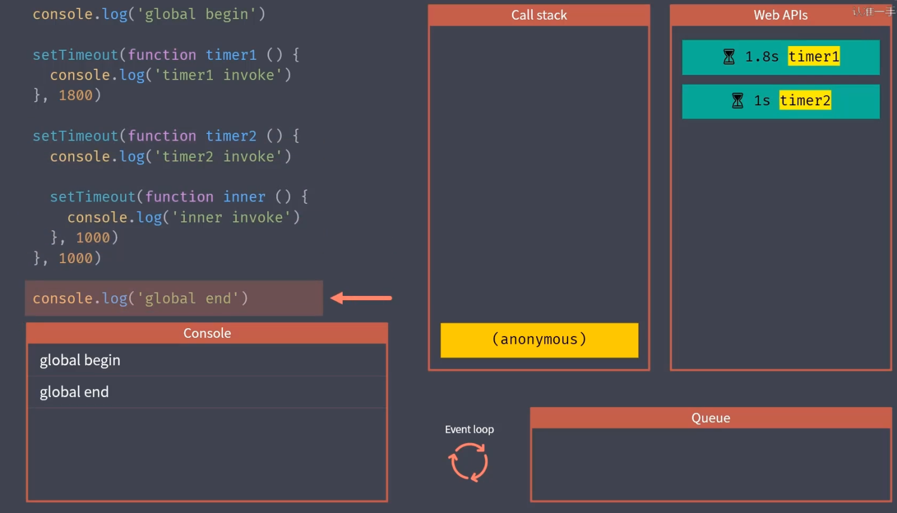

主要内容：同步模式和异步模式的调用差异（reject、catch、unhandleRejection）

## 同步模式与异步模式

- 同步模式：同步模式不是指同时执行，而是排队执行任务
- 异步模式如下图：
  
  结果如下：

  ```js
  global begin
  global end

  timer2 invoke
  timer1 invoke
  inner invoke
  ```

## 回调函数

回调函数是所有异步编程方案的根基

## promise

直接使用传统回调方式去完成复杂的异步流程，会产生回调地狱的问题，为解决这一问题，commonjs 社区提出了 promise 的规范，promise 在 es2015 中别标准化，成为语言规范

### promise 的基本使用

```js
const promise = new Promise(function (resolve, reject) {
  resolve(100);
});

promise.then(
  function (value) {
    console.log('resolved', value);
  },
  function (error) {
    console.log('rejected', error);
  },
);

console.log('end');
```

### promise 方法的 ajax

```js
function ajax(url) {
  return new Promise(function (resolve, reject) {
    var xhr = new XMLHttpRequest();
    xhr.open('GET', url);
    xhr.responseType = 'json';
    xhr.onload = function () {
      if (this.status === 200) {
        resolve(this.response);
      } else {
        reject(new Error(this.statusText));
      }
    };
    xhr.send();
  });
}
ajax('/api/user.json').then(
  function (res) {
    console.log(res);
  },
  function (error) {
    console.log(error);
  },
);
```

### promise 常见误区

promise 本质上也是使用回调函数定义的异步任务结束后所需要执行的任务

```js
function ajax(url){
	return new Promise(function(resolve, reject){
  	var xhr = new XMLHttpRequest()
    xhr.open('GET', url)
    xhr.responseType = 'json'
    xhr.onload = function(){
    	if(this.status === 200){
      	resolve(this.response)
      }else{
      	reject(new Error(this.statusText))
      }
    }
    xhr.send()
  })
}
// 错误的方法————仍然陷入了回调地狱的问题
ajax('/api/user.json').then(function(urls){
	ajax(urls.users).then(function(users){
  	ajax(urls.users).then(function(users){
    	...
    })
  })
})
// 正确的用法————借助于promise then方法链式调用的特点尽可能保证异步任务扁平化
ajax('/api/user.json')
	.then(function(value){
  	return ajax('/api/user.json')
  })   // =>promise
  .then(function(value){
  	return ajax('/api/user.json')
  })   // =>promise
  .then(function(value){
  	return 'hh'
  })   // =>promise
  .then(function(value){
  	console.log(value)
  })
```

### promise 链式调用

- promise 对象的 then 方法会返回一个全新的 promise 对象
- 后面的 then 方法就是在为上一个 then 返回的 promise 注册回调
- 前面 then 方法中回调函数的返回值会作为后面 then 方法回调的参数
- 如果回调中返回的是 promise，那后面 then 方法的回调会等待它的结果

### promise 的异常处理以及差异——catch、reject、unhandledrejection

```js
// 1、reject

ajax('/api/user.json').then(
  function onFulfilled(value) {
    console.log('onFulfilled', value);
  },
  function onRejected(error) {
    console.log('onRejected', error);
  },
);

// 2、catch
ajax('/api/user.json')
  .then(function onFulfilled(value) {
    console.log('onFulfilled', value);
  }) // 返回了一个新的promise，
  .catch(function onFulfilled(value) {
    //.catch方法里也捕获了新promise对象的异常，之所以能够捕获到第一个promise的异常，是因为异常往后传递了
    console.log('onFulfilled', value);
  });

// 实际上，catch方法等同于下面的方法：
ajax('/api/user.json')
  .then(function onFulfilled(value) {
    console.log('onFulfilled', value);
  })
  .then(undefined, function onFulfilled(value) {
    console.log('onFulfilled', value);
  });
```

之前已经知道 promise 对象的 then 方法会返回一个全新的 promise 对象，也就是说，.catch 方法里实际上也捕获了第二个 promise 对象的异常。而通过 reject 方法，不会捕获到这个新 promise 对象的异常

```js
// 1、reject
ajax('/api/user.json').then(
  function onFulfilled(value) {
    console.log('onFulfilled', value);

    // 这里调用了一个不存在的地址
    return ajax('/error-url');
  },
  function onRejected(error) {
    console.log('onRejected', error);
    // 异常没有捕获到
  },
);

// 2、catch
ajax('/api/user.json')
  .then(function onFulfilled(value) {
    console.log('onFulfilled', value);
    // 这里调用了一个不存在的地址
    return ajax('/error-url');
  })
  .catch(function onFulfilled(value) {
    console.log('onFulfilled', value);
    // 异常捕获到了
  });
```

另外，还可以使用 unhandledrejection 方法去处理代码中没有被手动捕获的 promise 异常。但是这种方法不建议使用，应该在代码中明确捕获每一个可能的异常。在浏览器中一般是将这个事件绑定在 windows 对象上。而在 node 中一般是绑定在 process 上。

```js
// 1、浏览器
window.addEventListener(
  'unhandledRejection',
  (event) => {
    const { reason, promise } = event;

    console.log(reason, promise);
    // reason => promise失败原因，一般是一个错误对象
    // promise => 出现异常的promise对象
    event.preventDefault();
  },
  false,
);

// 2、node
process.on('unhandledRejection', (reason, promise) => {
  console.log(reason, promise);
  // reason => promise失败原因，一般是一个错误对象
  // promise => 出现异常的promise对象
});
```

### promise 静态方法

promise.resolve() ——将一个值转化为一个 promise 对象

### promise 并行执行——promise.all 与 promise.race

对于 promise.all，需要任务都成功，这个并行的任务才算成功，而对于 promise.race 只需要成功一个。

### promise 执行时序/宏任务 vs 微任务

目前绝大多数异步调用都是作为宏任务执行。
微任务：

- 1.Promise 的 then 的回调函数
- 2.async 函数 await 下面的代码；
- 3.process.nextTick
- 4.mutationObserver
  宏任务：
- 1.定时器（setInterval 和 setTimeout）
  https://www.cnblogs.com/fangdongdemao/p/10262209.html

## Generator 异步方案 1——回顾 Generator 函数

相比于传统的回调方式，promise 处理异步调用最大的优点就是可以用链式调用解决回调嵌套的问题，但是这样还是会有大量的回调函数，虽然它们是相互独立的，下面说一下 Generator。
认识，ES2015 提供的 Generator——使异步调用再次回到扁平化

```js
// 定义生成器函数
function * foo(){
	console.log('start')

  // 使用yield关键字可以暂停函数
  yeild 'foo'

  try{
  	...
  }catch(e){
  	console.log()
  }
}
//此时不会执行，只是会生成一个generator对象
const generator = foo()

// 执行到yield位置
const res = generator.next()
console.log(res)   // 输出一个对象，{value: 'foo', done: false}


// 再次执行时就会从yeild地方执行，如果传入了参数，这个参数会赋值给yeild 'foo'这行语句
generator.next('bar')


// throw方法会对生成器内部抛出一个异常
generator.throw(new Error)
```

初步使用 generator

```js
function* main() {
  const users = yield ajax('/api/users.json');
  console.log(users);

  const posts = yield ajax('/api/users.json');
  console.log(posts);
}

const g = main();

const res = g.next();

// 此处执行到yield位置，那么res的value值就是ajax('/api/users.json')，也就是一个promise对象
res.value.then((data) => {
  const res2 = g.next(data);
  if (res2.done) return;

  res2.value.then((data) => {
    g.next(data);
  });
});
```

递归执行 generator 函数：

```js
function* main() {
  try {
    const users = yield ajax('/api/users.json');
    console.log(users);

    const posts = yield ajax('/api/users.json');
    console.log(posts);
  } catch (e) {
    console.log(e);
  }
}

function co(generator) {
  const g = generator();
  function handleResult(result) {
    if (result.done) return; // 生成器函数结束
    result.value.then(
      (data) => {
        handleResult(g.next(data));
      },
      (error) => {
        g.throw(error);
      },
    );
  }
  handleResult(g.next());
}
co(main);
```

上述代码中的 co 函数功能有第三方库：https://github.com/tj/co

## Generator 异步方案 2（常用）——async/await 语法糖

```js
async function main() {
  try {
    const users = await ajax('/api/users.json');
    console.log(users);

    const posts = await ajax('/api/users.json');
    console.log(posts);
  } catch (e) {
    console.log(e);
  }
}

const promise = main();
promise.then(() => {
  console.log('all compl');
});
```

## async

## 协程

## 面试题：promise 控制并发请求

参考文档：

- [Promise 对象池](https://blog.csdn.net/bu_leng/article/details/131204325)
- [饥人谷](https://wiki.jirengu.com/doku.php?id=javascript_%E5%B9%B6%E5%8F%91)
- [LeetCode-2636.Promise 对象池](https://leetcode.cn/problems/promise-pool/description/)

原题大意是给你一个异步函数数组 functions，和一个限制数 n，要求设计一个函数，用来执行数组 functions 中的所有异步函数，且最大并行执行数量不能超过 n。
