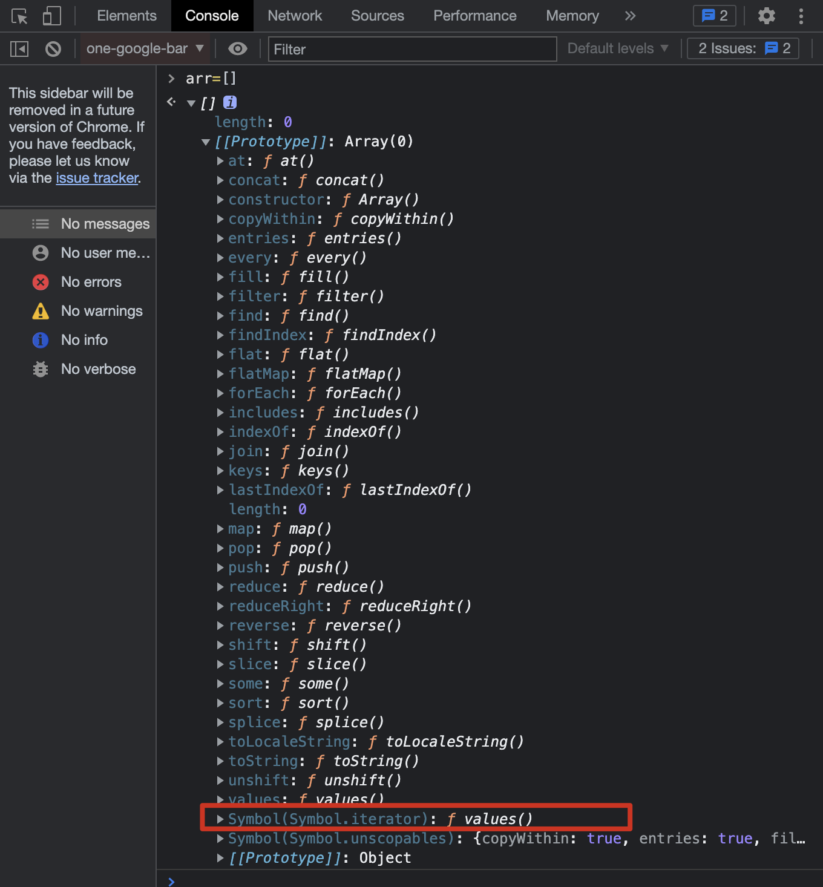

# ECMAScript

If we want to learn JavaScript, we need to understand the basic of JavaScript and ECMAScript(ES).

ECMAScript is a _subset_ of JavaScript.In other words, ECMAScript is an simple standard for JavaScript and adding new features to JavaScript. Then, we can _manipulate_ the JavScript _Document Object Model(DOM)_ and _Browser Object Model(BOM)_ in browsers, read and write files on our local filesystem using NodeJS.

:::success{title=公式}
JavaScript (in browsers) = ECMAScript + Web APIs(DOM、BOM)
JavaScript (in Node) = ECMAScript + Node APIs(fs、net,etc.)
:::

Brendan Eich created Mocha which became LiveScript, and later JavaScript. Netscape presented JavaScript to [Ecma International](https://www.ecma-international.org/),which develops standards and it was renamed to ECMAScript.

> By December 1960 the form that the Association would take was fairly well defined and it had been decided that the headquarters should be in Geneva.

Since ES2015,ECMAScript has been named by year rather than by version number.and most of people <u>have been accustomed to calling</u> ES2015 ES6.

## arrow function

now, let we look a example:

```js
const person = {
  name: 'tom',
  sayHi: function () {
    console.log(`hi,my name is ${this.name}`);
  },
  sayHello: () => {
    console.log(`hello,my name is ${this.name}`);
  },
  sayHiAsync: function () {
    setTimeout(function () {
      console.log(`hi,my name is ${this.name}`);
    }, 1000);
  },
  sayHiAsync2: function () {
    const _this = this;
    setTimeout(function () {
      console.log(`hi,my name is ${_this.name}`);
    }, 1000);
  },
  sayHiAsyncWithArrow: function () {
    setTimeout(() => {
      console.log(`hi,my name is ${this.name}`);
    }, 1000);
  },
};

person.sayHi(); // print out name
person.sayHello(); // print out: undefined, can't print out name
person.sayHiAsync(); // can't print out name, bcz setTimeout will be called in global scope (setTimeout会被放到全局作用域被调用，因此是拿不到当前作用域里的this)
person.sayHiAsync2(); // print put name , 基于闭包保存当前作用域的this
person.sayHiAsyncWithArrow(); // print put name , 箭头函数不改变this
```

## generator / async await

sdsd

## Proxy

The Proxy object enables you to create a proxy for another object, which can _intercept_ and redefine fundamental operations for that object.

```javascript
const person = {
  name: 'zce',
  age: 20,
};

const personProxy = new Proxy(person, {
  get(target, property) {
    console.log(target, property);
    return property in target ? target[property] : undefined;
  },
  set(target, property, value) {
    if (property === 'age') {
      throw new TypeError(`${value} is not an int`);
    }
    console.log(target, property, value);
    return true;
  },
});

console.log(personProxy.name);
console.log(personProxy.xxx);
personProxy.age = '100';
```

### Proxy vs Object.defineProperty

As we all know, `Proxy` and `Object.defineProperty` can be used to listen for property changes, but why vue3 uses `Proxy` instead of `Object.defineProperty` for its _reactivity system_?

Through reading this article: [Understanding the New Reactivity System in Vue 3](https://www.sitepoint.com/vue-3-reactivity-system/), we can draw a conclusion that:

because of the limitations of `Object.defineProperty`，there are some data changes that Vue can't `detect`,these include:

- adding/removing a property to/form an object(such as `obj.newKey=value` or `delete obj.curValue`)
- any changes of array(such as setting array items by index:`arr[index] = newValue` or modifying the length of an array:`arr.length = newLength`)

so,Vue2 provides us with `Vue.set` API method to deal with these limitations, and using some other methods(such as using `splice` array method to change the length of an array), but <u>it's a bit hacky</u> and leads to inconsistency in the codebase.but this has been resolved in Vue3 which uses `Proxy` .

> In conclusion, `Proxy` is better than `Object.defineProperty`:
>
> - `Object.defineProperty`is used to listen for object, rather than array. but `Proxy`can do those well.
> - `Object.defineProperty`methods can't detect some operations(such as `obj.newKey=value` or `delete obj.curValue`), but `Proxy`can do.
> - `Proxy`makes code more elegant.it can detect all properties of object by coding a proxy method, but`Object.defineProperty` has to be **walked through** if you want to listen all properties's operations.Besides, the former is a non-intrusive method of listening and does not require operations on the source object.

**CodePen example**:
[](https://codepen.io/aojiaodemeng/pen/JjmmrKm)

## Reflect

`Reflect` is not a constructor but static class, you cannot use it with the `new` operator or invoke it as a function.It contains static methods for invoking interceptable JavaScript object internal methods.

`Reflect` provides us a unified set of APIs for manipulating object.

```javascript
const obj = { foo: '123', bar: '456' };

const proxy = new Proxy(obj, {
  // if there is no get methods, default get method will be called
  get(target, property) {
    return Reflect.get(target, property);
  },
});
```

```javascript
const obj = { foo: "123", bar: "456" };

// there are different methods of manipulating object
console.log('name' in obj);
console.log(delete obj['age']));
console.log(Object.keys(obj)));

// but if using Reflect, it's very clean and unified
console.log(Reflect.has(obj, 'name'))
console.log(Reflect.deleteProperty(obj, 'name'))
console.log(Reflect.ownKeys(obj))
```

## for...of and Iterator

There are lots of method of walking through array in ECMAScript:

- `for`: is suited for common array.
- `for...in`: is suited for key-value pairs. such as array、object.
- `forEach` and other traversal methods.

for example:

```js
let arr = ['aa', 'bbb'];
for (let i in arr) {
  console.log(i, arr[i]); // print out: 0 aa，1 bbb
  if (i > 0) break; // break does not take effect, and the operation continues
}

var person = { fname: 'John', lname: 'Doe', age: 25 };
for (let item in person) {
  console.log(item, person[item]); // print out:fname John，lname Doe，age 25
}
```

### for...of

All of the above traversal methods have certain limitations, so there is a new method added in ES2015: `for...of`, that will be used as a uniform method to traverse data structures.

```javascript
let arr = ['aa', 'bbb'];
for (const item of arr) {
  console.log(item); // print out aa bbb
  if (item > 100) {
    break; // can be break off by using break、throw、return, but forEach method cannot be interrupt(some、every can be interrupt by return true)
  }
}

let iterable = [10, 20, 30];
for (let value of iterable) {
  value += 1;
  console.log(value); // Sequentially output: 11 21 31
}
for (const value of iterable) {
  console.log(value); // Sequentially output: 10 20 30
}

const s = new Set(['foo', 'bar']);
for (const item of s) {
  console.log(item); // output: foo bar
}

const m = new Map();
m.set('foo', '123');
m.set('bar', '345');
for (let entry of m) {
  console.log(entry); // Sequentially output:["foo", "123"],["bar", "345"]
}
for (const [key, value] of m) {
  console.log(key, value); // Sequentially output:foo 123，bar 345
}
```

> In conclusion, `for...of` will be used as a uniform method to traverse data structures.
> `for...of`can be break off by using `break`、`throw`、`return`, but `forEach` method cannot be interrupted(`some`、`every`can be interrupt by `return` true), `for...in` is also cannot be interrupted.
> but `for...of` cannot be walk through `object`

### Iterator

From the following example can be known `for...of` can be traverse `Map`、`Set`、`Array`, but you can't **loop over** `Object` with `for...of`:

```javascript
const obj = { foo: 123, bar: 456 };
for (const i of obj) {
  console.log(i); // TypeError:obj is not iterable
}
```

That is due to ES2015 provides us a uniform method for traversing data structures —— Iterable API, `Map`、`Set`and`Array` can be traversed by `for...of` because those are iterable, but `Object` is not.

**👉 How to know if the structure is iterable?**


**👉 How to use?**
`Symbol.iterator` method will be return an array iterator object which contains a `next`method, the `next`method will be return a object when called, the value is the element of this array.


**👉 Example for implementing an iterable interface:**

```javascript
const obj = {
  [Symbol.iterator]: function () {
    return {
      next: function () {
        return { value: 'zce', done: true };
      },
    };
  },
};

for (const item of obj) {
  console.log('循环体'); // 发现没有报错，但是没有打印内容
}

const obj2 = {
  store: ['1', '2', '3'],
  [Symbol.iterator]: function () {
    let index = 0;
    const self = this;
    return {
      next: function () {
        const res = {
          value: self.store[index],
          done: index >= self.store.length,
        };
        index++;
        return res;
      },
    };
  },
};
for (const item of obj2) {
  console.log('循环体2');
}
```

> In conclusion, iterator pattern is aim to provide a uniform traversing method

## Asynchronous Programming

There are lots of asynchronous programming methods in JS:

| Method      | Introduction                                             | Advantage                   | Disadvantage    |
| ----------- | -------------------------------------------------------- | --------------------------- | --------------- |
| callback    | the foundation of all asynchronous programming scenarios | simply and high readability | “callback hell” |
| promise     | fixed the problem of 'callback hell'                     |                             |                 |
| generator   |                                                          |                             |                 |
| async await |                                                          |                             |                 |

### Promise

### Generator

sasa

### Async Await

sasa

### ✨ Implement a Promise

## 手写一个 Object.entries

# Map

- subset：n.分组；小组；子集
- manipulate: v.操作，控制，使用
- have been accustomed to doing
- intercept: v.拦截
- detect: v.查明，检测出，察觉，识别
- it's a bit hacky
- walk through: 走过，走查；遍历（数组）
- traverse: v.横穿，穿过
- loop over
