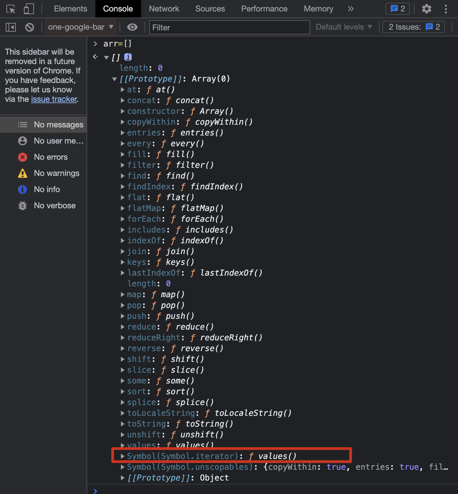
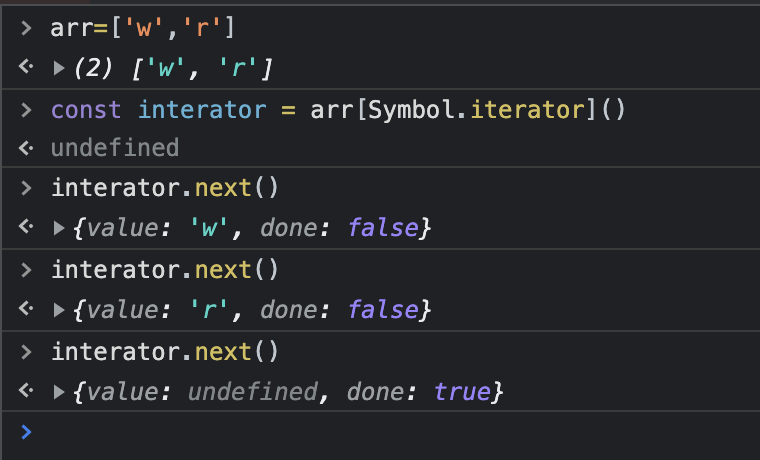

# ECMAScript

:::success{title=重要性}
JavaScript (in browsers) = ECMAScript + Web APIs(DOM、BOM)
JavaScript (in Node) = ECMAScript + Node APIs(fs、net,etc.)
:::

## 箭头函数

### 箭头函数与普通函数的区别

- 箭头函数没有自己的 this，同时也因为没有自己的 this，所以也不能用作构造函数
- 箭头函数没有自己的 arguments 对象。在箭头函数中访问 arguments 实际上获得的是它外层函数的 arguments 值。
-

### new 操作符的执行过程

- 1.首先创建了一个新的空对象
- 2.将对象的原型（**proto**属性）设置为函数的 prototype 对象（将构造函数的作用域赋给新对象）
- 3.让构造函数的 this 指向这个对象，执行构造函数的代码（为这个新对象添加属性）
- 4.判断函数的返回值类型，如果是值类型，返回创建的对象。如果是引用类型，就返回这个引用类型的对象。

### 一道面试题

```js
const person = {
  name: 'tom',
  sayHi: function () {
    console.log(`hi,my name is ${this.name}`);
  },
  sayHello: () => {
    console.log(`hello,my name is ${this.name}`);
  },
  sayHiAsync: function () {
    setTimeout(function () {
      console.log(`hi,my name is ${this.name}`);
    }, 1000);
  },
  sayHiAsync2: function () {
    const _this = this;
    setTimeout(function () {
      console.log(`hi,my name is ${_this.name}`);
    }, 1000);
  },
  sayHiAsyncWithArrow: function () {
    setTimeout(() => {
      console.log(`hi,my name is ${this.name}`);
    }, 1000);
  },
};

person.sayHi(); // print out name
person.sayHello(); // print out: undefined, can't print out name
person.sayHiAsync(); // can't print out name, bcz setTimeout will be called in global scope (setTimeout会被放到全局作用域被调用，因此是拿不到当前作用域里的this)
person.sayHiAsync2(); // print put name , 基于闭包保存当前作用域的this
person.sayHiAsyncWithArrow(); // print put name , 箭头函数不改变this
```

## 代理 Proxy

Proxy 对象对另一个对象创建代理，对该对象的基本操作行为可以进行拦截并对其重新定义。

```javascript
const person = {
  name: 'zce',
  age: 20,
};

const personProxy = new Proxy(person, {
  get(target, property) {
    console.log(target, property);
    return property in target ? target[property] : undefined;
  },
  set(target, property, value) {
    if (property === 'age') {
      throw new TypeError(`${value} is not an int`);
    }
    console.log(target, property, value);
    return true;
  },
});

console.log(personProxy.name);
console.log(personProxy.xxx);
personProxy.age = '100';
```

### Proxy vs Object.defineProperty

众所周知，`Proxy`和`Object.defineProperty`都可以监听对象的读写，但为什么 Vue3 放弃使用了 Vue2 种的选择使用了`Object.defineProperty`而选择了`Proxy` 呢？

阅读了这篇文章[Understanding the New Reactivity System in Vue 3](https://www.sitepoint.com/vue-3-reactivity-system/)，可以很确定：因为`Object.defineProperty`的诸多局限性，有些操作是无法监听到的，比如：

- 对对象增加新属性，或删除某属性，比如`obj.newKey=value` 或`delete obj.curValue`
- 无法监听数组的任何行为，比如通过 index 更改数组中的某个值：arr[index] = newValue，或者更改数组的长度：`arr.length = newLength`

为了解决`Object.defineProperty`的以上局限性，Vue2 提供了`Vue.set` API，来实现对象的更多操作监听，并使用了一些 hacky 的方法，比如原生`splice`数组方法去更改数组的长度，但这破坏了代码的规范性，写法上跟其他地方不一致，而这些问题，`Proxy` 完美避开。

:::success{title=总结}
`Proxy` 相对于`Object.defineProperty`更强大:

> - `Object.defineProperty`是属于对象的方法，无法监听数组。`Proxy`可以
> - `Object.defineProperty`并非所有行为都能监听到（比如 `obj.newKey=value` or `delete obj.curValue`）
> - `Proxy`更优雅。对对象的所有属性实现监听一个代理方法即可搞定，但是`Object.defineProperty`却需要遍历对象的属性，因为这个方法是对单个属性单独监听。此外，前者是以非侵入式的方法进行监听，不需要对源对象进行操作。

:::

**CodePen 示例**:
[](https://codepen.io/aojiaodemeng/pen/JjmmrKm)

## Reflect

Reflect 属于一个静态类，即不能通过 new 构建实例对象（new Reflect()），只能通过调用 Reflect 的静态方法(Reflect.get())。在 Reflect 内部封装了一系列对对象的底层操作，Reflect 成员方法就是 Proxy 处理对象的默认实现。

Reflect 的存在意义——统一提供一套用于操作对象的 API

```javascript
const obj = { foo: '123', bar: '456' };

const proxy = new Proxy(obj, {
  // 如果没有定义get方法，就相当于使用默认的：
  get(target, property) {
    return Reflect.get(target, property);
  },
});
```

```javascript
const obj = { foo: "123", bar: "456" };

// 以下都是操作对象，但是方法却截然不同
console.log('name' in obj);
console.log(delete obj['age']));
console.log(Object.keys(obj)));

// 使用Reflect
console.log(Reflect.has(obj, 'name'))
console.log(Reflect.deleteProperty(obj, 'name'))
console.log(Reflect.ownKeys(obj))
```

## 迭代器 for...of and Iterator

### for...of

在 ECMAScript 中，遍历数组有很多方法：

- for——适合遍历普通数组
- for...in——适合遍历键值对
- forEach 等一些对象的遍历方法

for...in

```js
let arr = ['aa', 'bbb'];
for (let i in arr) {
  console.log(i, arr[i]); // 输出0 aa，1 bbb
  if (i > 0) break; // break不生效，继续执行
}

var person = { fname: 'John', lname: 'Doe', age: 25 };
for (let item in person) {
  console.log(item, person[item]); // 输出fname John，lname Doe，age 25
}
```

以上遍历方式都有一定的局限性，所以 ES2015 借鉴了其他语言，引入了 for...of 循环。这种方式以后会作为遍历所有数据结构的统一方式。

```javascript
let arr = ['aa', 'bbb'];
for (const item of arr) {
  console.log(item); // 输出 aa bbb
  if (item > 100) {
    break; // for...of可以用break、throw、return终止循环/关闭迭代器，但是forEach是不可以的，some、every中可以返回true终止。
  }
}

let iterable = [10, 20, 30];
for (let value of iterable) {
  value += 1;
  console.log(value); // 先后输出11 21 31
}
// 如果不想修改语句块中的变量，let就改成const
for (const value of iterable) {
  console.log(value); // 先后输出10 20 30
}

const s = new Set(['foo', 'bar']);
for (const item of s) {
  console.log(item); // 输出foo bar
}

const m = new Map();
m.set('foo', '123');
m.set('bar', '345');
for (let entry of m) {
  console.log(entry); // 先后输出["foo", "123"],["bar", "345"]
}
for (const [key, value] of m) {
  console.log(key, value); // 先后输出foo 123，bar 345
}
```

### Iterator

从上面的例子可以看出，for...of 可以遍历数组类的数据结构，但是对于遍历普通对象就会报错：

```javascript
const obj = { foo: 123, bar: 456 };
for (const i of obj) {
  console.log(i); // TypeError:obj is not iterable。 obj是不可被迭代的
}
```

原因：ES 中能够表示有结构的数据类型越来越多，从最早的数组、对象，到现在的 set、map 等，为了提供一种统一的遍历方式，ES2015 提供了 Iterable 接口，实现 Iterable 接口就是 for...of 的前提。即能够被 for...of 遍历的数据类型在内部都实现了 Iterable 接口。

Iterable 接口约定了哪些内容？
首先，在浏览器控制台里可以查看到能被 for...of 遍历的数据类型的原型对象上都有一个 Symbol.iterator 对象。如截图所示：


调用这个 Symbol.iterator 方法会返回一个数组迭代器对象，这个对象中有一个 next 方法，此方法返回的也是一个对象，其中 value 的值是数组中的第一个元素，再次调用 next 方法，继续返回对象：


因此，可以被 for...of 遍历的数据类型都必须实现这个 Iterable 接口，即在内部要挂载 Iterable 方法，这个方法需要返回一个带有 next 方法的对象，不断调用这个 next 方法可以实现对内部所有元素的遍历。

**👉 实现可迭代接口**

```javascript
const obj = {
  [Symbol.iterator]: function () {
    return {
      next: function () {
        return { value: 'zce', done: true };
      },
    };
  },
};

for (const item of obj) {
  console.log('循环体'); // 发现没有报错，但是没有打印内容
}

const obj2 = {
  store: ['1', '2', '3'],
  [Symbol.iterator]: function () {
    let index = 0;
    const self = this;
    return {
      next: function () {
        const res = {
          value: self.store[index],
          done: index >= self.store.length,
        };
        index++;
        return res;
      },
    };
  },
};
for (const item of obj2) {
  console.log('循环体2');
}
```

> 总结：迭代器模式的意义核心就是对外提供统一遍历接口。

## 异步编程 Asynchronous Programming

There are lots of asynchronous programming methods in JS:

| Method      | Introduction                                             | Advantage                   | Disadvantage    |
| ----------- | -------------------------------------------------------- | --------------------------- | --------------- |
| callback    | the foundation of all asynchronous programming scenarios | simply and high readability | “callback hell” |
| promise     | fixed the problem of 'callback hell'                     |                             |                 |
| generator   |                                                          |                             |                 |
| async await |                                                          |                             |                 |

### Promise

### Generator

### Async Await

## class 中 的 constructor 与 super 的理解

### constructor

constructor 是类 class 的构造函数，通过 new 命令创建对象实例时，会自动调用此方法，一个类必须有 constructor 方法，如果未显式定义，一个默认的 constructor 会被默认添加。一般 constructor 方法返回实例对象 this，但也可以指定 constructor 方法返回一个新的对象。

### super

class 继承中，子类如果想要用 this 关键字，就必须在其构造函数里执行 super 方法，否则会报错。这是因为子类自己的 this 对象，需要先通过父类的构造函数完成塑造，得到父类的实例属性和方法之后，再对其进行加工，加入子类自己的属性和方法。如果不调用 super 方法，子类就得不到 this 对象。

super 这个关键字，既可以当做函数使用，也可以当做对象使用。

#### super 当做函数使用

```javascript
class A {
  constructor() {
    console.log(new.target.name); // new.target 指向当前正在执行的函数
  }
}

class B extends A {
  constructor {
    super();  // super代表了父类构造函数，但返回的是子类的实例，即super内部的this指向的是子类。
              // super()相当于执行了A.prototype.constructor.call(this, props)
  }
}
new A(); // A
new B(); // B
```

#### super 当做对象使用

略

### 参考文章

[阮一峰-Class 的继承](https://es6.ruanyifeng.com/#docs/class-extends)
[解读 es6 class 中 constructor 方法 和 super 的作用](https://blog.csdn.net/a419419/article/details/82772412)
