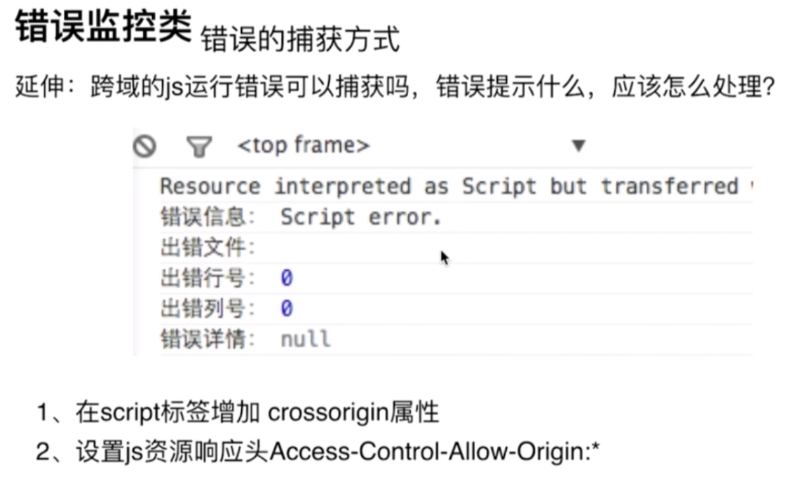
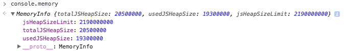
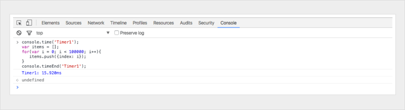
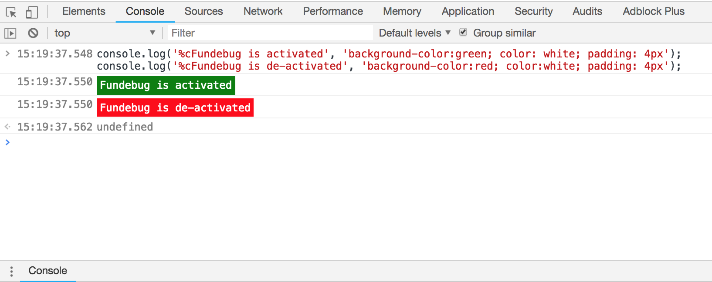

在面试中经常会被问到：

- 如何监测 js 错误？
- 如何保证产品质量
  两者归根结底都是问错误监控。

## 前端错误的分类

- 1.即时运行错误：代码错误
- 2.资源加载错误
- 3.promise 里的错误

## 即时运行错误的捕获方式：

- try catch
- window.onerror（注意：window.onerror 只能捕获即时运行错误，不能捕获到资源加载错误）

## 资源加载错误

- object.onerror（注意 object.onerror 这种资源加载错误不会冒泡到 window，因此 window.onerror 是无法捕捉到资源加载错误的。）
- performance.getEntries()：performance.getEntries()可以获得该页面所有资源的加载过程各阶段的时刻及其他信息。
- window.onerror 事件捕获（注意不是在冒泡阶段）

其中 performance.getEntries()方法是：

- step1:控制台输入 performance.getEntries().forEach(item=>{console.log(item.name)})，获取到该页面已经加载出来的资源
- step2:控制台输入 document.getElementsByTagName('img')，获取到当前页面所有的 img 标签，与上一步的数据相减

## promise 里的错误

promise 里的错误有三种方式：promise.catch、reject、unhandledrejection。

nhandledrejection 用来处理代码中没有被手动捕获的 promise 异常（这个错误不会被 windows.onerror 监控到）。在浏览器中一般是将这个事件绑定在 windows 对象上。而在 node 中一般是绑定在 process 上。

```js
<!DOCTYPE html>
<html lang="en">
<head>
    <meta charset="UTF-8">
    <title>错误监控</title>
    <script type="text/javascript">
        window.addEventListener("error", function(e){
            console.log('捕获',e)
        }, true)  // 这里改成false就捕获不到错误了，false为默认值，表示在冒泡阶段执行
    </script>
</head>
<body>
    <script src="//baidu.com/test.js" charset="utf-8"></script>
</body>
</html>
```

## 延伸：跨域的 js 运行错误可以捕获吗，错误提示是什么，应该怎么处理？

可以捕获到错误，但是拿不到具体信息。

解决方法：

- step1:在 script 标签增加 crossorigin 属性
- step2:设置 js 资源响应头 Access-Control-Allow-Origin:\*



## 上报错误的基本原理

- 1.采用 Ajax 通信的方式上报（这种一般都不会用）
- 2.利用 Image 对象上报（常用）

```js
<script>(new Image()).src='http://baidu.com/test/';</script>
```

## 调试技巧

[10 个用 Console 来 Debug 的高级技巧](https://blog.fundebug.com/2018/03/19/10-tips-for-debugging-with-console/)  
[14 招搞定 JavaScript 调试](https://blog.fundebug.com/2017/11/08/14-javascript-debugging-tips/)  
[20 个 Chrome DevTools 调试技巧](https://blog.fundebug.com/2018/08/22/art-of-debugging-with-chrome-devtools/)

- 1.console.log 与 debug
- 2.console.memory
  如果你发现性能问题很难分析，可能还要考虑是否有内存泄露，你可以使用 console.memory（注意 memory 是 console 的属性，不是函数），来查看当前的堆的使用情况。
  

- 3.console.time() && console.timeEnd()
  如果你想分析函数的性能，可以使用 console.time()来计时，console.timeEnd()来结束计时，控制台会打印出两次之间的时间差。
  了解代码的执行时间是非常有用的，特别是调试耗时的 for 循环。你可以通过定义不同的名字来设置多个 timer。我们来演示一下如何操作：
  `js
console.time("Timer1");
var items = [];
for (var i = 0; i < 100000; i++) {
    items.push({ index: i });
}
console.timeEnd("Timer1");
`
  
  **比如分析哪种循环遍历方法最快?**

                                                                                                          for、forEach、for...of、for...in中，for 速度最快, 但可读性差；foreach 速度快, 可控制属性；for...of 比较慢, 但好用；for...in 比较慢, 最不好用

- 4.给 log 加点颜色
  log 有时候变得非常多，包含你自己的、一些第三方扩展或者浏览器的 logs。除了使用过滤器(filter)以外，你还可以使用颜色来更好地区分。
  
- 5.why did you update：查看哪个 props 导致了组件的变化
- 6.source map
- 7.chrome DevTools 的 API：返回在 DOM 元素上注册的所有的事件
  ```
  getEventListeners($('#wrap'))
  getEventListeners(document)
  ```
  比如某个事件未能注销，在页面上另一个元素上点击出现了 bug，一时不知道是哪里出现了问题。
- 8.暂停 UI 在 Hover 状态下的展现结果：使用快捷键暂停脚本执行（F8 or command\）
- 9.移动端：第三方插件模拟 console-eruda；针对第三方应用：内网穿透

## 面试题：try-catch 捕捉不到异步里的错误

:::info{title=捕捉错误}

- 请找出下列操作中存在的异常
- 并设法让外层的 try catch 能捕获到异常，打印出 log

```js
const doing = false;
try {
  setTimeout(() => {
    doing = true;
  }, 1000);
} catch (e) {
  console.log('Something went wrong');
}
```

知识点：异步代码的回调里产生的异常是无法被 try catch 捕获的
:::
参考文档:

- [前端中 try-catch 捕获不到哪些异常和常见错误](https://blog.csdn.net/qq_44732146/article/details/129962657)
- [两个 try catch 引起的对 JS 事件循环的思考](https://zhuanlan.zhihu.com/p/531017667)
- [来聊一聊 JavaScript 中的异常捕获](https://blog.cuiyongjian.com/fe/catch-error/)
- [Callback Promise Generator Async-Await 和异常处理的演进](https://www.jianshu.com/p/78dfb38ac3d7)

### 原因分析

根本原因是 Event Loop，最外层的 try-catch 在`执行栈`中，按顺序执行，遇到 setTimeout 会将其推入到宏任务队列中，当开始执行 setTimeout 时，try-catch 已经执行完毕了，其上下文已经不存在，所以就无法被捕捉到。

简单说来就是：try-catch 只能捕获到当前调用栈中的错误，而 `setTimeout` 作为一个宏任务将会脱离外层 try-catch 调用栈运行，导致无法被外层 try-catch 所捕获。

- 永远不要在 macrotask 队列中抛出异常，因为 macrotask 队列脱离了运行上下文环境，异常无法被当前作用域捕获。

### 为什么 try-catch 捕捉不到 promise 的构造函数里的错误？

setTimeout 是异步的，可是 promise 的初始化是同步的，为什么也捕捉不到？

```js
const doing = false;
try {
  new Promise((resolve, reject) => {
    doing = true;
  });
} catch (e) {
  console.log('异步错误，能catch到么？'); // 不能捕捉到
}
```

原因：promise 内部 已经加了 try catch 处理了异常，所以不能冒泡到外面。（要用 promise.catch）

```js
const doing = false;
try {
  new Promise((resolve, reject) => {
    setTimeout(() => {
      doing = true;
    });
  });
} catch (e) {
  console.log('异步错误，能catch到么？'); // 也没有捕捉到
}
```

原因：也是跟 Event Loop 有关

### 为什么 async-await 可以捕捉到？

async-await 是使用生成器、promise 和协程实现的,wait 操作符还存储返回事件循环之前的执行上下文，以便允许 promise 操作继续进行。当内部通知解决等待的承诺时，它会在继续之前恢复执行上下文。

### 法 1:将 try-catch 放到 setTimeout 内部

```js
const doing = false;
setTimeout(() => {
  try {
    doing = true;
  } catch (e) {
    console.log('Something went wrong');
  }
}, 1000);
```

### 法 2:将 try-catch 放到 then 内部（也捕捉不到，待定）

```js
const doing = false;
try {
  Promise.resolve().then(() => {
    setTimeout(() => {
      doing = true;
    });
  });
} catch (e) {
  console.log('Something went wrong');
}
```

### 法 3:使用 async-await（也捕捉不到，待定）

```js
const doing = false;
Promise.resolve()
  .then(() => {
    doing = true;
  })
  .catch((err) => {
    console.log('Something went wrong');
  });
```
