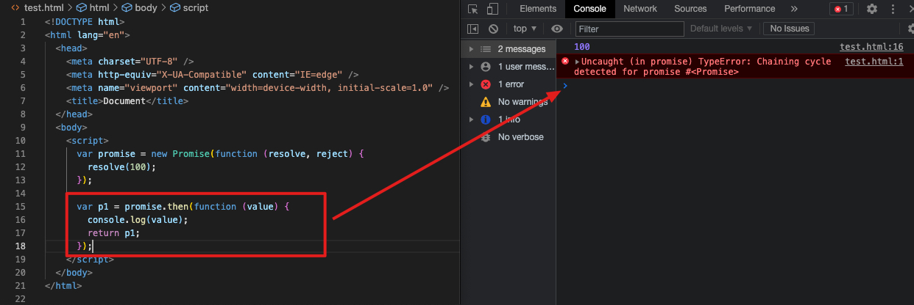
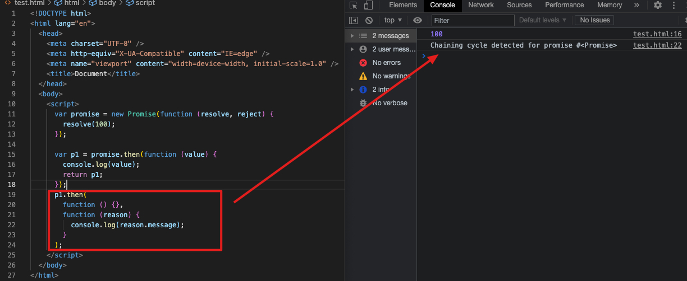
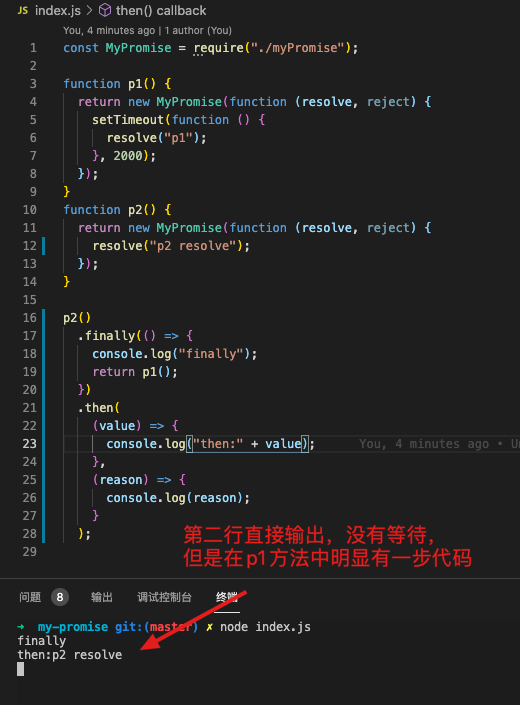

## 一、实现简单的 promise

1.promise 就是一个类，在执行这个类的时候，需要传递一个回调函数执行器（称为执行器）进去，执行器会立即执行。这个回调函数有两个参数(resolve、reject)，这两个参数其实都是函数，调用它们可以更改 promise 的状态。

2.promise 中有三种状态，分别为成功 fulfilled、失败 rejected、等待 pending，一旦状态确定就不可更改。
pending->fulfilled
pending->rejected

3.resolve 和 reject 函数是用来更改状态的。resolve 把状态变为 fulfilled，reject 把状态变为 rejected。

4.then 方法内部做的事情就是判断状态。如果状态是成功，则调用成功的回调函数，否则调用失败的回调函数，then 方法是被定义在原型对象中的。

5.then 成功回调有一个参数，表示成功之后的值，失败回调有一个参数，表示失败之后的原因

```javascript
// myPromise.js
const PENDING = 'pending';
const FULFILLED = 'fulfilled';
const REJECTED = 'rejected';

class MyPromise {
  constructor(executor) {
    executor(this.resolve, this.reject);
  }
  // promise状态
  status = PENDING;
  // 成功之后的值
  value = undefined;
  // 失败后的原因
  reason = undefined;

  // 把resolve和reject用箭头函数写，使this指向promise的实例对象
  resolve = (value) => {
    if (this.status !== PENDING) return;
    // 将状态更改为成功
    this.status = FULFILLED;
    // 保存成功之后的值
    this.value = value;
  };
  reject = (reason) => {
    if (this.status !== PENDING) return;
    this.status = REJECTED;
    // 保存失败后的原因
    this.reason = reason;
  };
  then(successCallback, failCallback) {
    if (this.status === FULFILLED) {
      successCallback(this.value);
    } else if (this.status === REJECTED) {
      failCallback(this.reason);
    }
  }
}

module.exports = MyPromise;
```

调试代码：

```javascript
// index.js,终端用命令node index.js执行
const MyPromise = require('./myPromise');
let promise = new MyPromise((resolve, reject) => {
  // resolve('成功')
  reject('失败');
});

promise.then(
  (value) => {
    console.log(value);
  },
  (reason) => {
    console.log(reason);
  },
);
```

## 二、在 Promise 类中加入异步逻辑

:::success{title=实现思路}

当在执行器中加入异步代码时，then 方法也会立即执行，执行时会判断状态，此时肯定是 Pending 状态，此时不能立即调用 successCallback 或 failCallback 函数，此时应该将成功回调和失败回调存储起来，当异步代码执行完成之后，再去调用。

总结：执行器中有异步代码时，成功回调和失败回调会分别在 resolve 和 reject 中执行，否则是直接在 then 方法中执行。
:::

```javascript
const MyPromise = require('./myPromise')
let promise = new MyPromise((resolve, reject) => {
+   setTimeout(() => {
        // resolve('成功')
        reject('失败')
+   }, 2000)

})

promise.then(value => {
    console.log(value)
}, reason => {
    console.log(reason)
})
```

```javascript
const PENDING = 'pending'
const FULFILLED = 'fulfilled'
const REJECTED = 'rejected'

class MyPromise{
    constructor(executor) {
        executor(this.resolve, this.reject)
    }
    // promise状态
    status = PENDING
    // 成功之后的值
    value = undefined
    // 失败后的原因
    reason = undefined
    // 成功回调
+   successCallback = undefined
    // 失败回调
+   failCallback = undefined

    // 把resolve和reject用箭头函数写，使this指向promise的实例对象
    resolve = value => {
        if (this.status !== PENDING) return;
        // 将状态更改为成功
        this.status = FULFILLED
        // 保存成功之后的值
        this.value = value
        // 判断成功回调是否存在，如果存在 调用
+       this.successCallback && this.successCallback(this.value)
    }
    reject = reason => {
        if (this.status !== PENDING) return;
        this.status = REJECTED
        // 保存失败后的原因
        this.reason = reason
+       this.failCallback && this.failCallback(this.reason)
    }
    then(successCallback, failCallback) {
        if (this.status === FULFILLED) {
            successCallback(this.value)
        } else if (this.status === REJECTED) {
            failCallback(this.reason)
        } else {
            // 等待
            // 将成功回调和失败回调存储
+           this.successCallback = successCallback
+           this.failCallback = failCallback
        }
    }
}

module.exports = MyPromise
```

## 三、实现 then 方法多次调用添加多个处理函数

then 方法的多次调用：同一个 promise 对象中的 then 方法是可以被多次调用的，当 then 方法被多次调用时，每一个 then 方法中传递的回调函数都是要被执行的。

```javascript
const PENDING = "pending";
const FULFILLED = "fulfilled";
const REJECTED = "rejected";

class MyPromise {
  constructor(executor) {
    executor(this.resolve, this.reject);
  }
  // promise状态
  status = PENDING;
  // 成功之后的值
  value = undefined;
  // 失败后的原因
  reason = undefined;
  // 成功回调
- successCallback = undefined
+ successCallback = [];
  // 失败回调
- failCallback = undefined
+ failCallback = [];

  // 把resolve和reject用箭头函数写，使this指向promise的实例对象
  resolve = (value) => {
    if (this.status !== PENDING) return;
    // 将状态更改为成功
    this.status = FULFILLED;
    // 保存成功之后的值
    this.value = value;
    // 判断成功回调是否存在，如果存在 调用
    // this.successCallback && this.successCallback(this.value)
+   while (this.successCallback.length) this.successCallback.shift()(this.value);
  };
  reject = (reason) => {
    if (this.status !== PENDING) return;
    this.status = REJECTED;
    // 保存失败后的原因
    this.reason = reason;
    // this.failCallback && this.failCallback(this.reason);
+   while (this.failCallback.length) this.failCallback.shift()(this.reason);
  };
  then(successCallback, failCallback) {
    if (this.status === FULFILLED) {
      successCallback(this.value);
    } else if (this.status === REJECTED) {
      failCallback(this.reason);
    } else {
      // 等待
      // 将成功回调和失败回调存储
-     this.successCallback = successCallback
-     this.failCallback = failCallback
+     this.successCallback.push(successCallback);
+     this.failCallback.push(failCallback);
    }
  }
}

module.exports = MyPromise;

```

## 四、实现 then 方法的链式调用

promise 是可以被链式调用的，且后面 then 方法的回调函数拿到的值实际上是上一个 then 方法回调函数的返回值。

这一步骤主要实现下面两个功能：

1.实现链式调用。
实现思路：在 MyPromise 的 then 方法中返回一个新的 promise 对象

2.上一个 then 方法的回调函数返回的值（有两种：普通值、promise 对象）传递给下一个 then 方法的回调函数。
实现思路：在 then 方法的回调函数中可以返回普通值，也可以返回 promise 对象，如果返回的是普通值，可以直接调用 resolve 方法传递给下一个 promise 对象；如果返回的是一个 promise 对象，需要先查看返回的 promise 对象的状态，如果是成功则调用 resolve 方法把成功的状态传递给下一个 promise 对象，失败状态的话雷同。

```javascript
const PENDING = "pending";
const FULFILLED = "fulfilled";
const REJECTED = "rejected";

class MyPromise {
  constructor(executor) {
    executor(this.resolve, this.reject);
  }
  // promise状态
  status = PENDING;
  // 成功之后的值
  value = undefined;
  // 失败后的原因
  reason = undefined;
  // 成功回调
  successCallback = [];
  // 失败回调
  failCallback = [];

  // 把resolve和reject用箭头函数写，使this指向promise的实例对象
  resolve = (value) => {
    if (this.status !== PENDING) return;
    // 将状态更改为成功
    this.status = FULFILLED;
    // 保存成功之后的值
    this.value = value;
    // 判断成功回调是否存在，如果存在 调用
    // this.successCallback && this.successCallback(this.value)
    while (this.successCallback.length)
      this.successCallback.shift()(this.value);
  };
  reject = (reason) => {
    if (this.status !== PENDING) return;
    this.status = REJECTED;
    // 保存失败后的原因
    this.reason = reason;
    // this.failCallback && this.failCallback(this.reason);
    while (this.failCallback.length) this.failCallback.shift()(this.reason);
  };
  then(successCallback, failCallback) {
+   let promise2 = new MyPromise((resolve, reject) => {
      if (this.status === FULFILLED) {
-       successCallback(this.value)
+       let x = successCallback(this.value);
        // 判断x的值是普通值还是promise对象
        // 如果是普通值，直接调用resolve
        // 如果是promise对象，查看promise对象返回的结果
        // 再根据promise对象返回的结果决定调用resolve还是reject
+       resolvePromise(x, resolve, reject);
-       resolve(x)
      } else if (this.status === REJECTED) {
        failCallback(this.reason);
      } else {
        // 等待
        // 将成功回调和失败回调存储
        this.successCallback.push(successCallback);
        this.failCallback.push(failCallback);
      }
    });
+   return promise2;
  }
}

// 新增resolvePromise
function resolvePromise(x, resolve, reject) {
  if (x instanceof MyPromise) {
    // 下面两种方法均可
    // x.then(
    //   (value) => resolve(value),
    //   (reason) => reject(reason)
    // );
    x.then(resolve, reject);
  } else {
    // 普通值
    resolve(x);
  }
}
module.exports = MyPromise;
```

```javascript
const MyPromise = require('./myPromise');
let promise = new MyPromise((resolve, reject) => {
  resolve('成功');
});

function other() {
  return new MyPromise((resolve, reject) => {
    resolve('other');
  });
}
promise
  .then((value) => {
    console.log(value);
    // 此处返回普通值100或一个promise对象
    // return 100
    return other();
  })
  .then((value) => {
    // 如果上一个是返回的100，这里就会打印出100，如果是返回other()，则打印出other
    console.log(value);
  });
```

## 五、then 方法链式调用识别 promise 对象自返回

在 then 方法中是可以返回 promise 对象的，但是在 then 方法的回调函数中不能返回当前 then 方法所返回的 promise 对象。否则会发生循环调用。这种情况需要被识别并进行预先处理

### 1.原生 Promise 的处理





### 2.实现步骤

resolvePromise 方法增加参数，将当前 then 方法所返回的 promise 对象传入，与回调函数所返回的值进行比较就可以判断是否返回了当前 then 方法所返回的 promise 对象。这种情况就需要在 resolvePromise 方法中抛错。

注意将 promise 对象传入 resolvePromise 方法时还无法获取到这个值，需要变成异步代码。

```javascript
// myPromise.js
const PENDING = "pending";
const FULFILLED = "fulfilled";
const REJECTED = "rejected";

class MyPromise {
  constructor(executor) {
    executor(this.resolve, this.reject);
  }
  // promise状态
  status = PENDING;
  // 成功之后的值
  value = undefined;
  // 失败后的原因
  reason = undefined;
  // 成功回调
  successCallback = [];
  // 失败回调
  failCallback = [];

  // 把resolve和reject用箭头函数写，使this指向promise的实例对象
  resolve = (value) => {
    if (this.status !== PENDING) return;
    // 将状态更改为成功
    this.status = FULFILLED;
    // 保存成功之后的值
    this.value = value;
    // 判断成功回调是否存在，如果存在 调用
    // this.successCallback && this.successCallback(this.value)
    while (this.successCallback.length)
      this.successCallback.shift()(this.value);
  };
  reject = (reason) => {
    if (this.status !== PENDING) return;
    this.status = REJECTED;
    // 保存失败后的原因
    this.reason = reason;
    // this.failCallback && this.failCallback(this.reason);
    while (this.failCallback.length) this.failCallback.shift()(this.reason);
  };
  then(successCallback, failCallback) {
    let promise2 = new MyPromise((resolve, reject) => {
      if (this.status === FULFILLED) {
+       setTimeout(() => {
          let x = successCallback(this.value);
          // 判断x的值是普通值还是promise对象
          // 如果是普通值，直接调用resolve
          // 如果是promise对象，查看promise对象返回的结果
          // 再根据promise对象返回的结果决定调用resolve还是reject
          // 此处是在实例化promise2过程中获取promise2的，获取不到。（promise2要在实例化完成之后才有值）,解决方法是变成异步代码
-         resolvePromise(x, resolve, reject);
+         resolvePromise(promise2, x, resolve, reject);
+       }, 0);
      } else if (this.status === REJECTED) {
        failCallback(this.reason);
      } else {
        // 等待
        // 将成功回调和失败回调存储
        this.successCallback.push(successCallback);
        this.failCallback.push(failCallback);
      }
    });
    return promise2;
  }
}
// resolvePromise增加promise2参数
function resolvePromise(promise2, x, resolve, reject) {
+ if (promise2 === x) {
+   // 返回了自己
+   return reject(
+     new TypeError("Chaining cycle detected for promise #<Promise>")
+   );
+ }
  if (x instanceof MyPromise) {
    // 下面两种方法均可
    // x.then(
    //   (value) => resolve(value),
    //   (reason) => reject(reason)
    // );
    x.then(resolve, reject);
  } else {
    // 普通值
    resolve(x);
  }
}
module.exports = MyPromise;
```

```javascript
// index.js
const MyPromise = require('./myPromise');
let promise = new MyPromise((resolve, reject) => {
  resolve('成功');
});

let p1 = promise.then((value) => {
  console.log(value);
  // return 100
  // return other();
  return p1;
});

p1.then(
  (value) => {
    console.log(value);
  },
  (reason) => {
    console.log(reason);
  },
);
```

## 六、then 方法的参数变为可变参数

```javascript
const PENDING = "pending";
const FULFILLED = "fulfilled";
const REJECTED = "rejected";

class MyPromise {
  constructor(executor) {
    executor(this.resolve, this.reject);
  }
  // promise状态
  status = PENDING;
  // 成功之后的值
  value = undefined;
  // 失败后的原因
  reason = undefined;
  // 成功回调
  successCallback = [];
  // 失败回调
  failCallback = [];

  // 把resolve和reject用箭头函数写，使this指向promise的实例对象
  resolve = (value) => {
    if (this.status !== PENDING) return;
    // 将状态更改为成功
    this.status = FULFILLED;
    // 保存成功之后的值
    this.value = value;
    // 判断成功回调是否存在，如果存在 调用
    // this.successCallback && this.successCallback(this.value)
    while (this.successCallback.length)
      this.successCallback.shift()(this.value);
  };
  reject = (reason) => {
    if (this.status !== PENDING) return;
    this.status = REJECTED;
    // 保存失败后的原因
    this.reason = reason;
    // this.failCallback && this.failCallback(this.reason);
    while (this.failCallback.length) this.failCallback.shift()(this.reason);
  };
  then(successCallback, failCallback) {
+   successCallback = successCallback ? successCallback : (value) => value;
+   failCallback = failCallback ? failCallback : (reason) => { throw reason; };
    let promise2 = new MyPromise((resolve, reject) => {
      if (this.status === FULFILLED) {
        setTimeout(() => {
          let x = successCallback(this.value);
          // 判断x的值是普通值还是promise对象
          // 如果是普通值，直接调用resolve
          // 如果是promise对象，查看promise对象返回的结果
          // 再根据promise对象返回的结果决定调用resolve还是reject
          // 此处是在实例化promise2过程中获取promise2的，获取不到。（promise2要在实例化完成之后才有值）,解决方法是变成异步代码
          resolvePromise(promise2, x, resolve, reject);
        }, 0);
      } else if (this.status === REJECTED) {
        failCallback(this.reason);
      } else {
        // 等待
        // 将成功回调和失败回调存储
        this.successCallback.push(successCallback);
        this.failCallback.push(failCallback);
      }
    });
    return promise2;
  }
}

function resolvePromise(promise2, x, resolve, reject) {
  if (promise2 === x) {
    // 返回了自己
    return reject(
      new TypeError("Chaining cycle detected for promise #<Promise>")
    );
  }
  if (x instanceof MyPromise) {
    // 下面两种方法均可
    // x.then(
    //   (value) => resolve(value),
    //   (reason) => reject(reason)
    // );
    x.then(resolve, reject);
  } else {
    // 普通值
    resolve(x);
  }
}
module.exports = MyPromise;
```

```javascript
const MyPromise = require('./myPromise');
let promise = new MyPromise((resolve, reject) => {
  resolve('成功');
});

promise
  .then()
  .then()
  .then(
    (value) => {
      console.log(value);
    },
    (reason) => console.log(reason),
  );
```

## 七、捕获错误及 then 链式调用其他状态代码补充

### 1.简述

思路：需要在执行构造器以及执行回调函数时捕获错误。

### 2.在执行构造器捕获错误

```javascript
class MyPromise {
  constructor(executor) {
+   try {
      executor(this.resolve, this.reject);
+   } catch (e) {
+     this.reject(e);
+   }
  }
}
```

### 3.执行回调函数时捕获错误

```javascript
class MyPromise {
    resolve = (value) => {
        ...
-       while (this.successCallback.length) this.successCallback.shift()(this.value);
+       while (this.successCallback.length) this.successCallback.shift()();
    };
    reject = (value) => {
        ...
-       while (this.failCallback.length) this.failCallback.shift()(this.reason);
+       while (this.failCallback.length) this.failCallback.shift()();
    };
    then(successCallback, failCallback) {
        ...
        let promise2 = new MyPromise((resolve, reject) => {
        if (this.status === FULFILLED) {
            setTimeout(() => {
+              try {
                    let x = successCallback(this.value);
                    resolvePromise(promise2, x, resolve, reject);
+              } catch (e) {
+                  reject(e);
+              }
            }, 0);
        } else if (this.status === REJECTED) {
-           failCallback(this.reason)
+           setTimeout(() => {
+               try {
+                   let x = failCallback(this.reason);
+                   resolvePromise(promise2, x, resolve, reject);
+               } catch (e) {
+                   reject(e);
+               }
+           }, 0);
        } else {
            // 等待
            // 将成功回调和失败回调存储
-           this.successCallback.push(successCallback)
-           this.failCallback.push(failCallback)
+           this.successCallback.push(() => {
                setTimeout(() => {
                    try {
                        let x = successCallback(this.value);
                        resolvePromise(promise2, x, resolve, reject);
                    } catch (e) {
                        reject(e);
                    }
                }, 0);
            });
+           this.failCallback.push(() => {
                setTimeout(() => {
                    try {
                        let x = failCallback(this.reason);
                        resolvePromise(promise2, x, resolve, reject);
                    } catch (e) {
                        reject(e);
                    }
                }, 0);
            });
        }
    });
    return promise2;
  }
}
```

### 4.完整的类 promise

```javascript
// myPromise.js
const PENDING = 'pending';
const FULFILLED = 'fulfilled';
const REJECTED = 'rejected';

class MyPromise {
  constructor(executor) {
    try {
      executor(this.resolve, this.reject);
    } catch (e) {
      this.reject(e);
    }
  }
  // promise状态
  status = PENDING;
  // 成功之后的值
  value = undefined;
  // 失败后的原因
  reason = undefined;
  // 成功回调
  successCallback = [];
  // 失败回调
  failCallback = [];

  // 把resolve和reject用箭头函数写，使this指向promise的实例对象
  resolve = (value) => {
    if (this.status !== PENDING) return;
    // 将状态更改为成功
    this.status = FULFILLED;
    // 保存成功之后的值
    this.value = value;
    // 判断成功回调是否存在，如果存在 调用
    while (this.successCallback.length) this.successCallback.shift()();
  };
  reject = (reason) => {
    if (this.status !== PENDING) return;
    this.status = REJECTED;
    // 保存失败后的原因
    this.reason = reason;
    while (this.failCallback.length) this.failCallback.shift()();
  };
  then(successCallback, failCallback) {
    successCallback = successCallback ? successCallback : (value) => value;
    failCallback = failCallback
      ? failCallback
      : (reason) => {
          throw reason;
        };
    let promise2 = new MyPromise((resolve, reject) => {
      if (this.status === FULFILLED) {
        setTimeout(() => {
          try {
            let x = successCallback(this.value);
            resolvePromise(promise2, x, resolve, reject);
          } catch (e) {
            reject(e);
          }
        }, 0);
      } else if (this.status === REJECTED) {
        setTimeout(() => {
          try {
            let x = failCallback(this.reason);
            resolvePromise(promise2, x, resolve, reject);
          } catch (e) {
            reject(e);
          }
        }, 0);
      } else {
        // 等待
        // 将成功回调和失败回调存储
        this.successCallback.push(() => {
          setTimeout(() => {
            try {
              let x = successCallback(this.value);
              resolvePromise(promise2, x, resolve, reject);
            } catch (e) {
              reject(e);
            }
          }, 0);
        });
        this.failCallback.push(() => {
          setTimeout(() => {
            try {
              let x = failCallback(this.reason);
              resolvePromise(promise2, x, resolve, reject);
            } catch (e) {
              reject(e);
            }
          }, 0);
        });
      }
    });
    return promise2;
  }
}

function resolvePromise(promise2, x, resolve, reject) {
  if (promise2 === x) {
    // 返回了自己
    return reject(
      new TypeError('Chaining cycle detected for promise #<Promise>'),
    );
  }
  if (x instanceof MyPromise) {
    // 下面两种方法均可
    // x.then(
    //   (value) => resolve(value),
    //   (reason) => reject(reason)
    // );
    x.then(resolve, reject);
  } else {
    // 普通值
    resolve(x);
  }
}
module.exports = MyPromise;
```

## 八、Promise.all 方法的实现

### 1.实现思路

首先，all 方法的调用是 Promise.all()，即类 Promise 中的一个静态方法。此方法接受一个数组，在循环这个数组时，需要判断该元素是普通值还是 promise 对象。如果是普通值，就直接放入结果数组中，如果是 promise 对象，就先去执行这个 promise 对象，再把执行结果放入结果数组中。

注意事项：需要考虑传入的 promise 对象里有异步代码的情况

### 2.踩坑记录

```javascript
  static all(array) {
    let result = [];
    function addData(key, value) {
      result[key] = value;
    }
    return new MyPromise((resolve, reject) => {
      for (let i = 0; i < array.length; i++) {
        let current = array[i];
        if (current instanceof MyPromise) {
          // promise对象
          current.then(
            (value) => addData(i, value),
            (reason) => reject(reason)
          );
        } else {
          // 普通值
          addData(i, array[i]);
        }
      }
      resolve(result);
    });
  }
```

调试结果如下图所示，p1 方法中因为有异步代码，因此在异步代码未执行完成就赋值了结果数组，导致输出的值是个空值。


更改代码如下图，resolve(result)放到 addData 方法里执行，由于 addData 方法要用到 resolve 方法，所以需要移动到了 for 循环里。

```javascript
static all(array) {
    let result = [];
    let index = 0;

    return new MyPromise((resolve, reject) => {
      function addData(key, value) {
        result[key] = value;
        index++;
        if (index === array.length) {
          resolve(result);
        }
      }
      for (let i = 0; i < array.length; i++) {
        let current = array[i];
        if (current instanceof MyPromise) {
          // promise对象
          current.then(
            (value) => addData(i, value),
            (reason) => reject(reason)
          );
        } else {
          // 普通值
          addData(i, array[i]);
        }
      }
    });
  }

```

# 三、完整的 类 MyPromise

```javascript
const PENDING = 'pending';
const FULFILLED = 'fulfilled';
const REJECTED = 'rejected';

class MyPromise {
  constructor(executor) {
    try {
      executor(this.resolve, this.reject);
    } catch (e) {
      this.reject(e);
    }
  }
  // promise状态
  status = PENDING;
  // 成功之后的值
  value = undefined;
  // 失败后的原因
  reason = undefined;
  // 成功回调
  successCallback = [];
  // 失败回调
  failCallback = [];

  // 把resolve和reject用箭头函数写，使this指向promise的实例对象
  resolve = (value) => {
    if (this.status !== PENDING) return;
    // 将状态更改为成功
    this.status = FULFILLED;
    // 保存成功之后的值
    this.value = value;
    // 判断成功回调是否存在，如果存在 调用
    while (this.successCallback.length) this.successCallback.shift()();
  };
  reject = (reason) => {
    if (this.status !== PENDING) return;
    this.status = REJECTED;
    // 保存失败后的原因
    this.reason = reason;
    while (this.failCallback.length) this.failCallback.shift()();
  };
  then(successCallback, failCallback) {
    successCallback = successCallback ? successCallback : (value) => value;
    failCallback = failCallback
      ? failCallback
      : (reason) => {
          throw reason;
        };
    let promise2 = new MyPromise((resolve, reject) => {
      if (this.status === FULFILLED) {
        setTimeout(() => {
          try {
            let x = successCallback(this.value);
            resolvePromise(promise2, x, resolve, reject);
          } catch (e) {
            reject(e);
          }
        }, 0);
      } else if (this.status === REJECTED) {
        setTimeout(() => {
          try {
            let x = failCallback(this.reason);
            resolvePromise(promise2, x, resolve, reject);
          } catch (e) {
            reject(e);
          }
        }, 0);
      } else {
        // 等待
        // 将成功回调和失败回调存储
        this.successCallback.push(() => {
          setTimeout(() => {
            try {
              let x = successCallback(this.value);
              resolvePromise(promise2, x, resolve, reject);
            } catch (e) {
              reject(e);
            }
          }, 0);
        });
        this.failCallback.push(() => {
          setTimeout(() => {
            try {
              let x = failCallback(this.reason);
              resolvePromise(promise2, x, resolve, reject);
            } catch (e) {
              reject(e);
            }
          }, 0);
        });
      }
    });
    return promise2;
  }
  static all(array) {
    let result = [];
    let index = 0;

    return new MyPromise((resolve, reject) => {
      function addData(key, value) {
        result[key] = value;
        index++;
        if (index === array.length) {
          resolve(result);
        }
      }
      for (let i = 0; i < array.length; i++) {
        let current = array[i];
        if (current instanceof MyPromise) {
          // promise对象
          current.then(
            (value) => addData(i, value),
            (reason) => reject(reason),
          );
        } else {
          // 普通值
          addData(i, array[i]);
        }
      }
    });
  }
}

function resolvePromise(promise2, x, resolve, reject) {
  if (promise2 === x) {
    // 返回了自己
    return reject(
      new TypeError('Chaining cycle detected for promise #<Promise>'),
    );
  }
  if (x instanceof MyPromise) {
    // 下面两种方法均可
    // x.then(
    //   (value) => resolve(value),
    //   (reason) => reject(reason)
    // );
    x.then(resolve, reject);
  } else {
    // 普通值
    resolve(x);
  }
}
module.exports = MyPromise;
```

## 九、Promise.resolve 方法的实现

:::success{title=实现思路}
先判断传入的参数是否是 promise 对象，如果是 promise 对象，就直接返回，如果不是，就创建一个 promise 对象，把给定的值包裹在这个创建的 promise 对象中，然后返回这个 promise 对象。
:::

```javascript
static resolve(value) {
    if (value instanceof MyPromise) return value;
    return new MyPromise((resolve) => resolve(value));
}
```

```javascript
Promise.resolve('foo');
// 等价于
new Promise((resolve) => resolve('foo'));
```

## 十、finally 方法的实现

### 1.概述

finally()方法用来制定不管 Promise 对象最后状态如何，都会执行的操作

```javascript
promise
.then( result => {…} )
.catch( error => {…} )
.finally(()=> {…});
```

finally 方法有两个特点：
1、当前 promise 对象的状态无论是成功还是失败，finally 中的回调函数始终会被执行一次。
2、finally 方法后面链式调用 then 方法能够拿到当前 promise 对象最终返回的结果。

实现思路：
finally 方法不是一个静态方法，它需要定义在 Promise 类的原型对象上。在 finally 方法内部，需要知道 promise 对象状态（调用 this.then 方法得到状态)；要实现在 finally 方法后可以链式调用 then，就需要返回一个 promise 对象，而调用的 this.then 方法本身就返回的是一个 promise 对象

注意事项：需要处理在 finally 方法中 return 一个 promise 对象的情况。需要借助 resolve 方法，将 callback 方法执行的结果传递进去，无论 finally 方法中返回的是普通值还是 promise，都将其转化成 promise，然后执行这个 promise。

### 2.踩坑记录

```javascript
finally(callback) {
    return this.then(
      (value) => {
        callback();
        return value;
      },
      (reason) => {
        callback();
        throw reason;
      }
    );
  }
```



更改如下：

```javascript
finally(callback) {
    return this.then(
      (value) => {
        return MyPromise.resolve(callback().then(() => value));
      },
      (reason) => {
        return MyPromise.resolve(
          callback().then(() => {
            throw reason;
          })
        );
      }
    );
  }
```

### 3.完整的 类 MyPromise

```javascript
const PENDING = 'pending';
const FULFILLED = 'fulfilled';
const REJECTED = 'rejected';

class MyPromise {
  constructor(executor) {
    try {
      executor(this.resolve, this.reject);
    } catch (e) {
      this.reject(e);
    }
  }
  // promise状态
  status = PENDING;
  // 成功之后的值
  value = undefined;
  // 失败后的原因
  reason = undefined;
  // 成功回调
  successCallback = [];
  // 失败回调
  failCallback = [];

  // 把resolve和reject用箭头函数写，使this指向promise的实例对象
  resolve = (value) => {
    if (this.status !== PENDING) return;
    // 将状态更改为成功
    this.status = FULFILLED;
    // 保存成功之后的值
    this.value = value;
    // 判断成功回调是否存在，如果存在 调用
    while (this.successCallback.length) this.successCallback.shift()();
  };
  reject = (reason) => {
    if (this.status !== PENDING) return;
    this.status = REJECTED;
    // 保存失败后的原因
    this.reason = reason;
    while (this.failCallback.length) this.failCallback.shift()();
  };
  then(successCallback, failCallback) {
    successCallback = successCallback ? successCallback : (value) => value;
    failCallback = failCallback
      ? failCallback
      : (reason) => {
          throw reason;
        };
    let promise2 = new MyPromise((resolve, reject) => {
      if (this.status === FULFILLED) {
        setTimeout(() => {
          try {
            let x = successCallback(this.value);
            resolvePromise(promise2, x, resolve, reject);
          } catch (e) {
            reject(e);
          }
        }, 0);
      } else if (this.status === REJECTED) {
        setTimeout(() => {
          try {
            let x = failCallback(this.reason);
            resolvePromise(promise2, x, resolve, reject);
          } catch (e) {
            reject(e);
          }
        }, 0);
      } else {
        // 等待
        // 将成功回调和失败回调存储
        this.successCallback.push(() => {
          setTimeout(() => {
            try {
              let x = successCallback(this.value);
              resolvePromise(promise2, x, resolve, reject);
            } catch (e) {
              reject(e);
            }
          }, 0);
        });
        this.failCallback.push(() => {
          setTimeout(() => {
            try {
              let x = failCallback(this.reason);
              resolvePromise(promise2, x, resolve, reject);
            } catch (e) {
              reject(e);
            }
          }, 0);
        });
      }
    });
    return promise2;
  }
  finally(callback) {
    return this.then(
      (value) => {
        return MyPromise.resolve(callback().then(() => value));
      },
      (reason) => {
        return MyPromise.resolve(
          callback().then(() => {
            throw reason;
          }),
        );
      },
    );
  }
  static all(array) {
    let result = [];
    let index = 0;

    return new MyPromise((resolve, reject) => {
      function addData(key, value) {
        result[key] = value;
        index++;
        if (index === array.length) {
          resolve(result);
        }
      }
      for (let i = 0; i < array.length; i++) {
        let current = array[i];
        if (current instanceof MyPromise) {
          // promise对象
          current.then(
            (value) => addData(i, value),
            (reason) => reject(reason),
          );
        } else {
          // 普通值
          addData(i, array[i]);
        }
      }
    });
  }
  static resolve(value) {
    if (value instanceof MyPromise) return value;
    return new MyPromise((resolve) => resolve(value));
  }
}

function resolvePromise(promise2, x, resolve, reject) {
  if (promise2 === x) {
    // 返回了自己
    return reject(
      new TypeError('Chaining cycle detected for promise #<Promise>'),
    );
  }
  if (x instanceof MyPromise) {
    // 下面两种方法均可
    // x.then(
    //   (value) => resolve(value),
    //   (reason) => reject(reason)
    // );
    x.then(resolve, reject);
  } else {
    // 普通值
    resolve(x);
  }
}
module.exports = MyPromise;
```

## 十一、catch 方法的实现

### 1.概述

用来处理当前 promise 对象最终的失败回调函数。也可以在这个方法执行之后链式调用 then

实现思路：在 catch 方法内部调用 then 方法，在调用 then 方法时的成功回调函数传入 undefined，在失败回调函数传入一个回调函数，就能执行 catch 方法中的失败回调。

### 2.函数代码

```javascript
catch(failCallback) {
    return this.then(undefined, failCallback);
  }
```

### 3.完整的 类 MyPromise

```javascript
const PENDING = 'pending';
const FULFILLED = 'fulfilled';
const REJECTED = 'rejected';

class MyPromise {
  constructor(executor) {
    try {
      executor(this.resolve, this.reject);
    } catch (e) {
      this.reject(e);
    }
  }
  // promise状态
  status = PENDING;
  // 成功之后的值
  value = undefined;
  // 失败后的原因
  reason = undefined;
  // 成功回调
  successCallback = [];
  // 失败回调
  failCallback = [];

  // 把resolve和reject用箭头函数写，使this指向promise的实例对象
  resolve = (value) => {
    if (this.status !== PENDING) return;
    // 将状态更改为成功
    this.status = FULFILLED;
    // 保存成功之后的值
    this.value = value;
    // 判断成功回调是否存在，如果存在 调用
    while (this.successCallback.length) this.successCallback.shift()();
  };
  reject = (reason) => {
    if (this.status !== PENDING) return;
    this.status = REJECTED;
    // 保存失败后的原因
    this.reason = reason;
    while (this.failCallback.length) this.failCallback.shift()();
  };
  then(successCallback, failCallback) {
    successCallback = successCallback ? successCallback : (value) => value;
    failCallback = failCallback
      ? failCallback
      : (reason) => {
          throw reason;
        };
    let promise2 = new MyPromise((resolve, reject) => {
      if (this.status === FULFILLED) {
        setTimeout(() => {
          try {
            let x = successCallback(this.value);
            resolvePromise(promise2, x, resolve, reject);
          } catch (e) {
            reject(e);
          }
        }, 0);
      } else if (this.status === REJECTED) {
        setTimeout(() => {
          try {
            let x = failCallback(this.reason);
            resolvePromise(promise2, x, resolve, reject);
          } catch (e) {
            reject(e);
          }
        }, 0);
      } else {
        // 等待
        // 将成功回调和失败回调存储
        this.successCallback.push(() => {
          setTimeout(() => {
            try {
              let x = successCallback(this.value);
              resolvePromise(promise2, x, resolve, reject);
            } catch (e) {
              reject(e);
            }
          }, 0);
        });
        this.failCallback.push(() => {
          setTimeout(() => {
            try {
              let x = failCallback(this.reason);
              resolvePromise(promise2, x, resolve, reject);
            } catch (e) {
              reject(e);
            }
          }, 0);
        });
      }
    });
    return promise2;
  }
  finally(callback) {
    return this.then(
      (value) => {
        return MyPromise.resolve(callback().then(() => value));
      },
      (reason) => {
        return MyPromise.resolve(
          callback().then(() => {
            throw reason;
          }),
        );
      },
    );
  }
  catch(failCallback) {
    return this.then(undefined, failCallback);
  }
  static all(array) {
    let result = [];
    let index = 0;

    return new MyPromise((resolve, reject) => {
      function addData(key, value) {
        result[key] = value;
        index++;
        if (index === array.length) {
          resolve(result);
        }
      }
      for (let i = 0; i < array.length; i++) {
        let current = array[i];
        if (current instanceof MyPromise) {
          // promise对象
          current.then(
            (value) => addData(i, value),
            (reason) => reject(reason),
          );
        } else {
          // 普通值
          addData(i, array[i]);
        }
      }
    });
  }
  static resolve(value) {
    if (value instanceof MyPromise) return value;
    return new MyPromise((resolve) => resolve(value));
  }
}

function resolvePromise(promise2, x, resolve, reject) {
  if (promise2 === x) {
    // 返回了自己
    return reject(
      new TypeError('Chaining cycle detected for promise #<Promise>'),
    );
  }
  if (x instanceof MyPromise) {
    // 下面两种方法均可
    // x.then(
    //   (value) => resolve(value),
    //   (reason) => reject(reason)
    // );
    x.then(resolve, reject);
  } else {
    // 普通值
    resolve(x);
  }
}
module.exports = MyPromise;
```

## [Github 链接](https://github.com/aojiaodemeng/my-promise.git)
