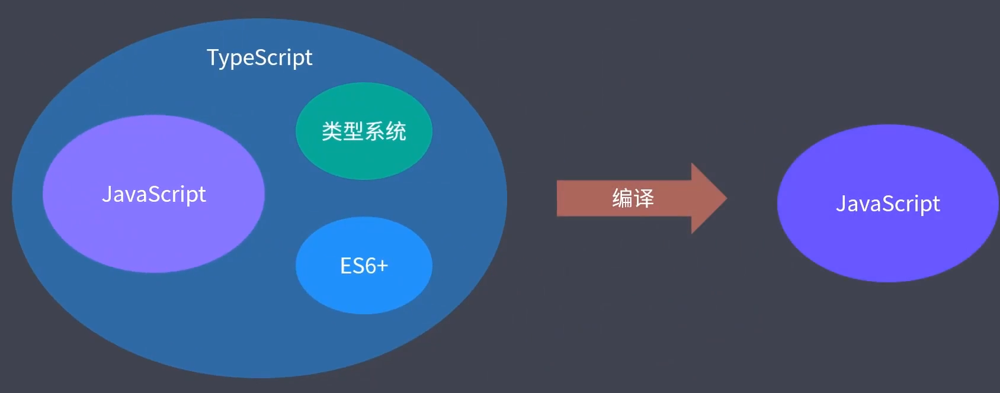
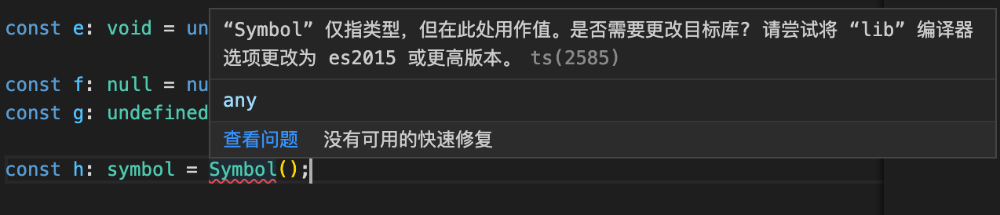
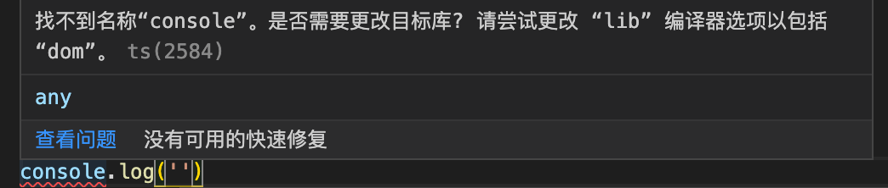
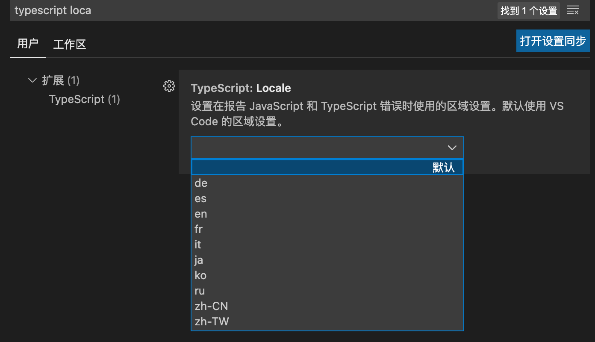
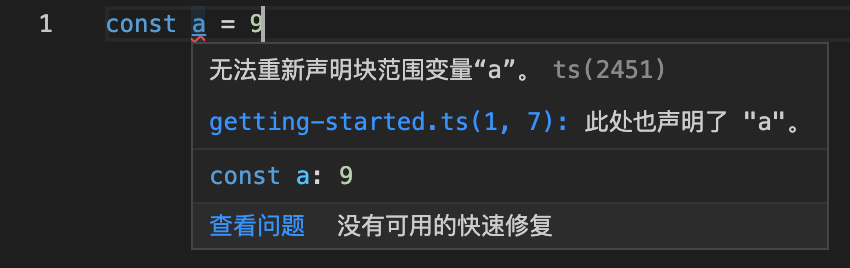

Typescript 是 Javascript 的超集，即在 Javascript 的基础上扩展了一些功能，下面是两种的关系：



由于 Typescript 会被编译成 Javascript，因此 Typescript 在任何一种 Javascript 运行环境下都支持。

相较于 Flow，Typescript 作为一门编程语言，功能更为强大，生态也更健全、更完善。目前来说，Typescript 可以说是前端领域中的第二语言。

## Typescript 缺点

- 语言本身多了很多概念，造成学习成本大，但是 ts 属于渐进式，即可以当作 js 去使用，很多概念都可以不用知道也可以上手。可以完全按照 Javascript 标准语法编写代码。
- 项目初期，Typescript 会增加一些成本。比如编写很多的类型声明

## Typescript 快速上手

```
yarn init --yes
yarn add typescript --dev   // 安装typescript在项目本地

yarn tsc ***.ts  // 执行完该命令之后会在ts文件同级生成一个编译之后的同名js文件，tsc-typescript compile
```

## Typescript 配置文件

tsc 命令不仅仅用来编译指定的 ts 文件，还可以编译整个项目/工程，在编译工程之前，一般要创建 ts 的配置文件。

```
yarn tsc --init   // 自动生成ts配置文件——tsconfig.json
yarn tsc // 编译工程
```

| 属性      | 作用                             | 默认值                                                                                   |
| --------- | -------------------------------- | ---------------------------------------------------------------------------------------- |
| target    | 指定 ts 编译成 js 所用的 es 标准 | es5，会把所有新特性转换成 es5 标准的代码，将其改为 es2015 就不会去转换 es2015 的新特性了 |
| module    | 输出的代码采用的模块化方式       | commonjs                                                                                 |
| outDir    | 编译结果输出的文件夹             | './'，可以将其设置为"dist"                                                               |
| rootDir   | 配置源代码，即 ts 所在的文件夹   | 一般设置为 src                                                                           |
| sourceMap | 开启 源代码映射                  | 一般设置为 true                                                                          |
| strict    | 是否开启严格模式                 |

## Typescript 原始类型与标准库声明

标准库就是内置对象所对应的声明文件，在代码中使用内置对象，就必须要引用对应的标准库，否则 TS 找不到对应的类型，从而报错。

```javascript
const a: string = 'hh';
const b: number = 100;
const c: boolean = true;

const d: string = null; // 严格模式下会报错
// 相当于 Flow，string、number、boolean 这三种类型在严格模式下是可以允许默认为空（可以赋值为 null 或 undefined）

const e: void = undefined; // 一般用在函数没有返回值，标记返回值类型；void类型只能存放null或undefined；严格模式下只能是undefined

const f: null = null;
const g: undefined = undefined;

const h: symbol = Symbol();
```

其中，由于 symbol 类型是属于 ES2015 的新特性，如果 ts 配置中所配置的所用 es 标准为 es5，即 target="es5"，则会报如下图中的错:



- 解决方法 1——target 由"es5"设置为"es2015":
  可以将 target 值改为"es2015"

- 解决方法 2——lib 设置为['ES2015','DOM']:
  如果必须要编译到 ES5，可以使用 lib 选项指定所引用的标准库。这样对于 symbol 的使用就不会报错了，但是这时发现 console 却报错了：
  
  这是因为 console 对象在浏览器环境中是 dom 对象所提供的，而如果在 lib 选项中只设置了 es2015 的话，那么其他的标准库就都被覆盖掉了，（注意在 Typescript 中 Bom 和 Dom 都被归结为一个标准库文件了，即 Dom），可以设置 lib 为['ES2015','DOM']。

## Typescript 中文错误消息

Typescript 本身支持多语言的错误消息，默认跟随操作系统的语言设置。
可以在执行编译命令的时候可以添加语言设置参数：

```
yarn tsc --locale zh-CN
```

而对于 VScode 里的错误消息，可以在配置选项里设置：


## Typescript 作用域问题

在不同文件中存在相同变量名称，这种情况肯定存在，如果变量定义在全局作用域里，typescript 会报“重复定义变量的”的错误：


可以用一个立即执行函数创建一个单独作用域：

```
(function(){
    const a = 9
})()
```

或者在文件中使用 export 导出，这样这个文件就会作为一个模块，模块是有自己的模块作用域的：

```
const a = 9
export {}   // 这里是export的语法，并不是导出一个空对象的意思
```
