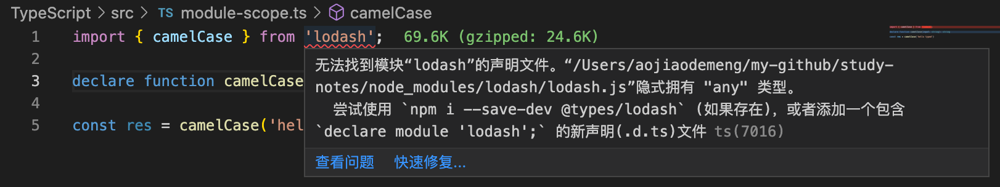

## 类的基本使用

类的作用：描述一类具体事物的抽象特征，从代码程度上来说，用来描述一类具体对象的抽象成员。
在 ES6 以前，Javascript 都是通过函数+原型模拟实现类。ES6 开始 Javascript 中有了专门的 class，而 Typescript 中则增强了 class 的相关语法。

Typescript 相对于 ECMAScript 新增了哪些内容：

- 1.类的属性在使用之前必须类型声明

```typescript
class Person {
  name: string;
  constructor(name: string, age: number) {
    this.name = name; // 未报错
    this.age = age; // 报错类型“Person”上不存在属性“age”。
  }
}
```

## 类的访问修饰符

定义成员可访问的级别

| 访问修饰符 | 描述                                                          |
| ---------- | ------------------------------------------------------------- |
| private    | 私有属性，只能在类的内部访问                                  |
| public     | 默认值，公有属性                                              |
| protected  | 在外部不能访问，跟 private 区别在于，protected 可以被子类访问 |

而对于构造函数 constructor 的访问修饰符，默认也是 public，如果设置成了 private，那么这个类型不能被外部实例化，也不能被继承，这样只能在类的内部添加一个静态方法，在这个静态方法中创建实例；如果设置成了 protected，也不能被外部实例化，但是可以被继承。

```typescript
class Person {
  name: string;
  private constructor(name: string) {
    this.name = name;
  }
}
const jack = new Person(); // 报错：类“Person”的构造函数是私有的，仅可在类声明中访问。
```

```typescript
class Person {
  name: string;
  private constructor(name: string) {
    this.name = name;
  }

  static create(name: string) {
    return new Person(name);
  }
}
const jack = Person.create('jack');
```

## 类的只读属性

如果有访问修饰符，则只读属性放在修饰符后面

```typescript
class Person {
  private readonly name: string;
  constructor(name: string) {
    this.name = name;
  }
}
```

## 类与接口

```typescript
interface EatAndRun {
  eat(food: string): void;
  run(distance: number): void;
}
class Person implements EatAndRun {
  eat(food: string): void {
    console.log('eat');
  }
  run(distance: number) {
    console.log('run');
  }
}

class Animal implements EatAndRun {
  eat(food: string): void {
    console.log('eat1');
  }
  run(distance: number) {
    console.log('run1');
  }
}
```

注意，实际开发中，一般是一个接口约束一个能力，一个类型实现多个接口，低耦合原则:

```typescript
interface Eat {
  eat(food: string): void;
}
interface Run {
  run(distance: number): void;
}
class Person implements Eat, Run {
  eat(food: string): void {
    console.log('eat');
  }
  run(distance: number) {
    console.log('run');
  }
}

class Animal implements Eat, Run {
  eat(food: string): void {
    console.log('eat1');
  }
  run(distance: number) {
    console.log('run1');
  }
}
```

## 抽象类

抽象类不同于接口的是：抽象类可以包含一些具体的实现。

定义抽象类的方式：在 class 关键词之前添加 abstract。抽象类只能被继承，不能通过 new 创建实例对象。抽象类里可以定义抽象方法，抽象方法不需要方法体，当父类有这个抽象方法，子类就需要实现这个方法。

```typescript
export {};
abstract class Animal {
  // 抽象类
  eat(food: string): void {
    console.log('eat1');
  }
  abstract run(distance: number): void; // 抽象方法
}
class Dog extends Animal {
  run(distance: number): void {
    // 子类修正父类的抽象方法
    console.log('run');
  }
}

const d = new Dog();
```

## 泛型

泛型：声明时不指定具体的类型，使用时再指定。目的是极大程度的复用代码。

```typescript
function createNumberArray(length: number, value: number): number[] {
  const arr = Array<number>(length).fill(value);
  return arr;
}

function createStringArray(length: number, value: string): string[] {
  const arr = Array<string>(length).fill(value);
  return arr;
}

// 使用泛型，不明确类型的地方使用T
function createArray<T>(length: number, value: T): T[] {
  const arr = Array<T>(length).fill(value);
  return arr;
}
const res = createArray<string>(3, 'foo');
```

## 类型声明

在开发过程中难免会用到 npm 的第三方模块，这些模块不一定都是通过 Typescript 编写的，因此其提供的成员不会有强类型的体验。比如 lodash，就需要安装类型说明模块 types/lodash。如果没有对应的声明模块，可以通过 declare 语句自定义声明。

```
import { camelCase } from 'lodash';
declare function camelCase(input: string): string
const res = camelCase('hello typed')
```

安装了 lodash，但是没有安装类型声明文件 types/lodash，因此在代码中会报错：


## Typescript 接口 interface

interface 可以理解为一种规范或契约。接口用来约束对象的结构。接口可以设定可选、只读成员

```typescript
interface IPost {
  title: string;
  subTitle?: string; // 可选
  readonly summary: string; // 只读
  [Math.random()]: '2'; // 动态
}
function printPost(post) {
  console.log(post.title);
}
```
