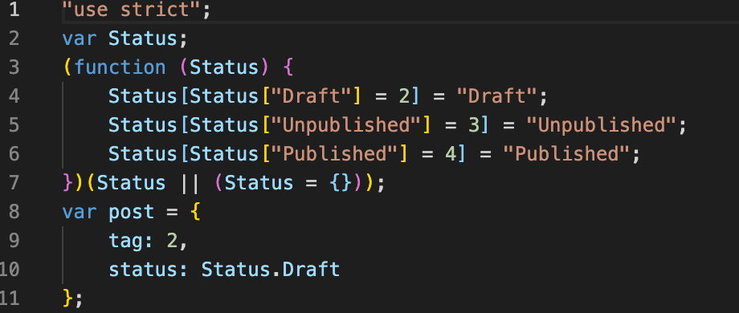

## Object 类型

Object 类型不单指对象，还有数组、函数。

```javascript
const foo: object = function () {}; // 也可以是{} || []
const obj: {} = {}; // 只能是对象
```

## 数组类型

```javascript
const arr1: Array<number> = [1, 2, 3];
const arr2: number[] = [1, 2, 3];

function sum(...args: number[]){
    return args.reduce(prev,current) => prev+current, 0)
}
```

## 元组类型

元组类型是一种特殊的数据结构，元组就是一个明确元素数量以及每个元素类型的数组，各个元素的类型可以不相同。比如在 React 中的 useState 返回的就是一个元组类型。

```javascript
const tuple: [number, string] = [18, '123'];
```

## 枚举类型

```javascript
enum Status {
    Draft = 2,  // 这里指定了从2开始累加，表示后面的Unpublished与Published分别是3、4；如果设置的是字符串类型，则无法自增
    Unpublished,
    Published
}
const post = {
  tag: 2, // 1 || 3, 不用枚举类型，用字面量形式
  status: Status.Draft
};
```

编译之后会发现一个双向键值对的对象，双向键值对可以通过键获取到值，也可以通过值获取到键。这样可以动态的根据枚举值去获取枚举的名称。



## 函数类型

在 Javascript 中有函数定义方式：函数声明和函数表达式。这两种方式如何进行类型约束：

```javascript
// 函数声明
function fun1(a: number): string {
  return 'fun1';
}

// 函数表达式
const fun2 = function (a: number): string {
  return 'fun2';
};
```

## 任意类型

由于 Javascript 是弱类型的关系，很多内置 API 本身接收任意类型的参数。Typescript 提供了 any 这种类型，其不会进行类型检查。

```javascript
let foo: any = 'string';
```

## 隐式类型推断

在 Typescript 中，如果没有明确通过类型注解去标记变量的类型，Typescript 就会根据变量的使用情况去推断便来那个类型，这个行为就叫做隐式类型推断。如果 Typescript 无法判断出类型就会标记为 any。

```javascript
let foo = 1;
foo = '123'; // 报错

let foo2; // 判定为any
foo2 = 123;
foo2 = '123';
```

## 类型断言

在某些情况下，Typescript 无法判断出变量的类型，而作为开发者，可以根据变量使用情况推断出类型。

类型断言可以告诉 Typescript 变量的类型是什么，但它并不是类型转换。类型断言是属于编译阶段的概念，而类型转换属于代码执行阶段的概念。

```typescript
const nums = [1, 2, 3];
const res = nums.find((i) => i > 0); // 这里明显会返回一个number，但是typescript却推断出是一个number或undefined。这时就可以进行 as关键词 或<number>断言，告诉typescript res是一个number

const num1 = res as number;
const num2 = <number>res; // 不过当在代码中使用jsx时，这种方法会与jsx语法产生冲突
```
