## 1.环境搭建

可参照[Flutter 文档](https://flutter.cn/)

- **1.下载 Flutter SDK**
  按照[官网-macOS install](https://docs.flutter.dev/get-started/install/macos)步骤下载 Flutter SDK
- **2.解压文件**
  下载之后将压缩包解压到目标文件夹，例如想要将 Flutter 安装在 development 这个文件夹下，那么就可以如此操作：

  ```
  cd ~/development
  unzip ~/Downloads/flutter_macos_3.10.1-stable.zip

  ```

- **3.配置 PATH**
  这一步目的是让系统能找到 Flutter 命令，这样我们就可以全局调用 flutter 命令了。
  bash 时，环境变量配置在用户目录   **.bash_profile**  下，使用 zsh 时，环境变量配置在用户目录   **.zshrc**  文件下，输入以下对应命令进入编辑模式：

  ```
  vim ~/.bash_profile    // bash
  vim ~/.zshrc           // zsh

  ```

  然后配置 PATH：

  ```
  export PATH="$PATH:`pwd`/flutter/bin"

  ```

- **4.配置依赖源**
  Flutter 为国内开发者提供了临时的镜像服务，访问速度更快（配置文件同上）。

  ```
  export PUB_HOSTED_URL=https://pub.flutter-io.cn
  export FLUTTER_STORAGE_BASE_URL=https://storage.flutter-io.cn

  ```

- **5.执行`flutter doctor`检测命令**
  如果有出现 ❌ 的，就逐一处理。
- **6.安装开发工具、模拟器，配置编辑器**
  - 安装**Android Studio**、 Android 模拟器（IOS 环境安装 XCode）
  - IDE 安装 Flutter 扩展插件
- **7.按照官网创建项目**

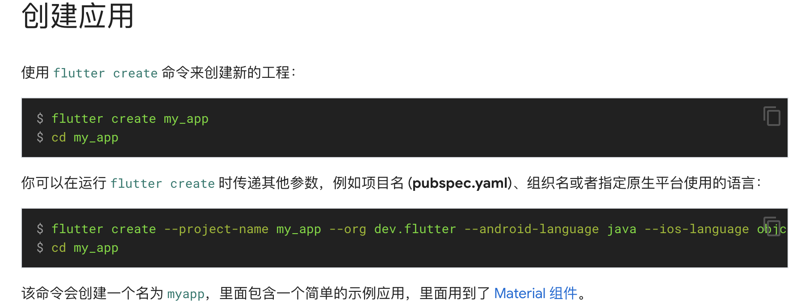

#### 启动项目

打开 VSCode，然后点击菜单“查看”-“命令面板”-“Flutter：Lunch Emulator”，再点击菜单“运行”-“启动调试”。

## 2.Flutter 实现一个简单页面

#### step1:lib 文件夹下新建 widgets/page_content.dart

```js
import 'package:flutter/material.dart';

class PageContent extends StatelessWidget {
  final String name;

  // 添加name参数
  // const PageContent({Key key, this.name}) : super(key: key);
  const PageContent({super.key, required this.name});

  @override
  Widget build(BuildContext context) {
    return Scaffold(
      appBar: AppBar(
        title: Text('当前页面：$name'),
      ),
    );
  }
}
```

#### step2:lib 文件夹下新建 pages/home/index.dart

```js
import 'package:flutter/material.dart';
import 'package:rental_app/widgets/page_content.dart';

class HomePage extends StatelessWidget {
  // const HomePage({Key key}) : super(key: key);
  const HomePage({super.key});

  @override
  Widget build(BuildContext context) {
    return Container(child: PageContent(name: '首页'));
  }
}
```

#### step3:lib 文件夹下新建 application.dart

```js
import 'package:flutter/material.dart';
import 'package:rental_app/pages/home/index.dart';

class Application extends StatelessWidget {
  // const Application({Key key}) : super(key: key);
  const Application({super.key});
  @override
  Widget build(BuildContext context) {
    return MaterialApp(
      home: HomePage(),
    );
  }
}
```

#### step4:更改 main.dart

```js
+ import 'package:rental_app/application.dart';

void main() {
- runApp(const MyApp());
+ runApp(const Application());
}

- class MyApp extends StatelessWidget {}
```

## 3.引入路由框架 fluro

#### step1：在 pubspec.yaml 文件中添加 Fluro 依赖

```js
dependencies: fluro: '^2.0.5';
```

保存文件之后会自动下载。

#### step2：在 lib 文件夹下新建 pages/login.dart

```js
import 'package:flutter/material.dart';
import 'package:rental_app/widgets/page_content.dart';

class LoginPage extends StatelessWidget {
  const LoginPage({super.key});

  @override
  Widget build(BuildContext context) {
    return Container(child: PageContent(name: '登陆'));
  }
}
```

#### step3:使用 fluro，配置路由

##### step3-1:新建 routes.dart 文件

```js
import 'package:fluro/fluro.dart';
import 'package:flutter/material.dart';
import 'package:rental_app/pages/home/index.dart';
import 'package:rental_app/pages/login.dart';

class Routes {
  static String home = '/';
  static String login = '/login';

  static Handler _homeHandler = Handler(
      handlerFunc: (BuildContext? context, Map<String, dynamic> params) {
    return HomePage();
  });

  static Handler _loginHandler = Handler(
      handlerFunc: (BuildContext? context, Map<String, dynamic> params) {
    return LoginPage();
  });

  static void configureRoutes(FluroRouter router) {
    router.define(home, handler: _homeHandler);
    router.define(login, handler: _loginHandler);
  }
}
```

##### step3-2:修改 application.dart 文件

```js
import 'package:fluro/fluro.dart';
import 'package:rental_app/pages/login.dart';
import 'package:rental_app/routes.dart';

class Application extends StatelessWidget {
	Widget build(BuildContext context) {

+		FluroRouter router = FluroRouter();
+   Routes.configureRoutes(router);

    return MaterialApp(
-      home: HomePage(),
+			 onGenerateRoute: router.generator,
    );
  }
}
```

##### step3-3:修改页面 page_content.dart

```js
class PageContent extends StatelessWidget {
	Widget build(BuildContext context) {
		return Scaffold(
				appBar: AppBar(
          title: Text('当前页面：$name'),
        ),
+       body: ListView(children: <Widget>[
+          TextButton(
+             child: Text(Routes.home),
+             onPressed: () => {Navigator.pushNamed(context, Routes.home)}),
+         TextButton(
+             child: Text(Routes.login),
+             onPressed: () => {Navigator.pushNamed(context, Routes.login)})
        ]));
		)
	}
}
```

##### 效果：

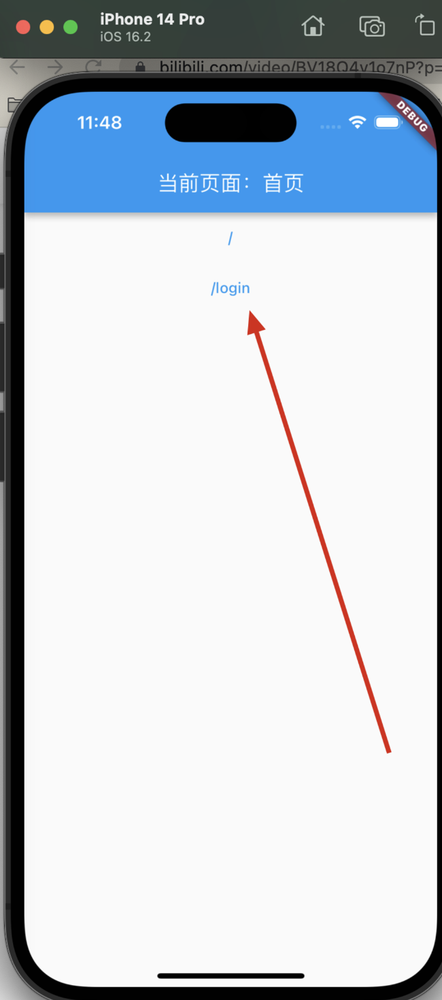

#### step4: 优化路由配置

需要解决的问题：

- 错误页面如何处理？
- 带参数的页面如何处理？


##### step4-1:新建 not_found.dart 文件

```js
import 'package:flutter/material.dart';

class NotFoundPage extends StatelessWidget {
  const NotFoundPage({super.key});

  @override
  Widget build(BuildContext context) {
    return Scaffold(
        appBar: AppBar(title: Text('404')),
        body: Center(child: Text('您访问的页面不存在')));
  }
}
```

##### step4-2.新建 room_detail/index.dart 文件

```js
import 'package:flutter/material.dart';
import 'package:rental_app/widgets/page_content.dart';

class RoomDetailPage extends StatelessWidget {
  final String roomId;
  const RoomDetailPage({super.key, required this.roomId});

  @override
  Widget build(BuildContext context) {
    return Scaffold(appBar: AppBar(title: Text('roomId: $roomId')));
  }
}
```

##### step4-3.更改 routes.dart 文件，加入以下内容

```js
import 'package:rental_app/pages/not_found.dart';
import 'package:rental_app/pages/room_detail/index.dart';

class Routes {
  static String roomDetail = '/room/:roomId';


  static Handler _notFoundHandler = Handler(
      handlerFunc: (BuildContext? context, Map<String, dynamic> params) {
    return NotFoundPage();
  });
  static Handler _roomDetailHandler = Handler(
      handlerFunc: (BuildContext? context, Map<String, dynamic> params) {
    return RoomDetailPage(roomId: params['roomId'][0]);
  });
  static void configureRoutes(FluroRouter router) {
    router.define(roomDetail, handler: _roomDetailHandler);
    router.notFoundHandler = _notFoundHandler;
  }
}
```

##### step4-4:修改 page_content.dart 测试

```dart
import 'package:flutter/material.dart';
import 'package:rental_app/routes.dart';

class PageContent extends StatelessWidget {
  final String name;

  // 添加name参数
  // const PageContent({Key key, this.name}) : super(key: key);
  const PageContent({super.key, required this.name});

  @override
  Widget build(BuildContext context) {
    return Scaffold(
        appBar: AppBar(
          title: Text('当前页面：$name'),
        ),
        body: ListView(children: <Widget>[
          TextButton(
              child: Text(Routes.home),
              onPressed: () => {Navigator.pushNamed(context, Routes.home)}),
          TextButton(
              child: Text(Routes.login),
              onPressed: () => {Navigator.pushNamed(context, Routes.login)}),
          TextButton(
              child: Text('不存在的页面'),
              onPressed: () =>
                  {Navigator.pushNamed(context, '/testNotfoundaaaaa')}),
          TextButton(
              child: Text('房屋详情页，id:22'),
              onPressed: () => {Navigator.pushNamed(context, '/room/22')})
        ]));
  }
}
```

## 4.登陆页/注册页

#### 登陆页

涉及的内容：

- 无状态组件 → 有状态组件

##### Commit 链接：

https://github.com/aojiaodemeng/rental_app/commit/38b0f9e845332ea5d6b03034de8cbbe37595f633

##### 细节处理 1——路由跳转（必要时不用 push，用 replace）

```js
-Navigator.pushNamed(context, 'login') +
  Navigator.pushReplacementNamed(context, 'login');
```

##### Commit 链接：

https://github.com/aojiaodemeng/rental_app/commit/aed3672ca9f063b1402833ec03284b010ebdfff0

## 5.首页

#### step1: 轮播

插件：

- [flutter_swiper | Flutter Package](https://github.com/best-flutter/flutter_swiper),`flutter_swiper`版本不兼容，出现‘null safety’提示，改用下面：
- [card_swiper | Flutter Package](https://pub.dev/packages/card_swiper)

`pubspec.yaml`添加：

```js
card_swiper: '^2.0.4';
```

##### 细节处理 1——轮播图的高度跟随屏幕宽度动态变化

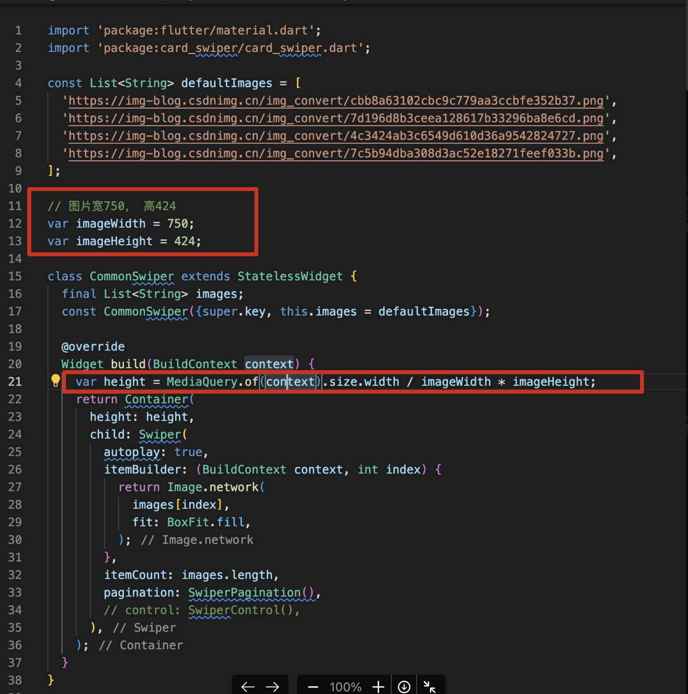

- MediaQuery.of(context).size.width —— 获取屏幕宽度

#### step2——如何引入静态图片

在项目根目录下新建 static/images 文件夹，将静态文件图片拷贝到此文件夹下，然后在`pubspec.yaml`文件里引入：

```js
assets:
    # 首页——第一个tab-导航图标
    - static/images/home_index_navigator_total.png
    - static/images/home_index_navigator_map.png
    - static/images/home_index_navigator_share.png
    ...
```

#### step3——组件 CommonImage 封装

目前存在的问题：

- 轮播图使用网络图片时，偶尔会出现超时，如何解决？
- 涉及到图片方面的优化，是否需要修改很多处？

解决方法：封装一个组件

##### 细化方案：

1.根据资源地址是可以区分本地资源和网络的资源的（网络图片地址以 http 开头，本地图片地址以 static 开头），所以无论是使用本地图片还是网络图片，都可以共用一个图片组件

2.网络图片添加本地缓存，延长图片网络请求超时时间！可以使用第三方组件：[AdvancedNetworkImage](https://pub.flutter-io.cn/packages/flutter_advanced_networkimage/changelog)（但是版本不匹配，改使用**[cached_network_image](https://pub.flutter-io.cn/packages/cached_network_image)**）


#### step3: SearchBar 封装

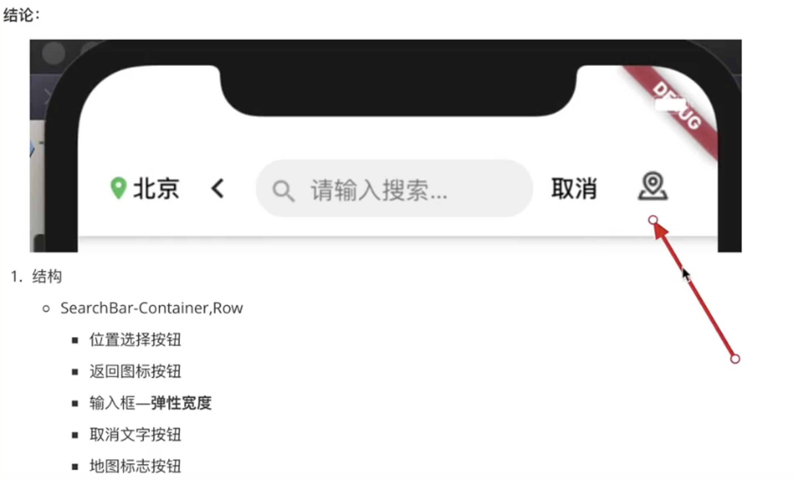

##### 有状态组件里，取参数

```js
通过 widget.*** 获取参数
```

##### 优化


存在问题：

- 当点击搜索框时，代码逻辑是跳转到 search 页面，但是点击返回后，发现搜索框还是聚焦状态。

```js
onTap: () {
+  if (widget.onSearchSubmit == null) {
+   _focus.unfocus(); // 使之失去焦点
+  }
   widget.onSearch!();
},
```

#### step4: 已登陆/未登陆视图切换

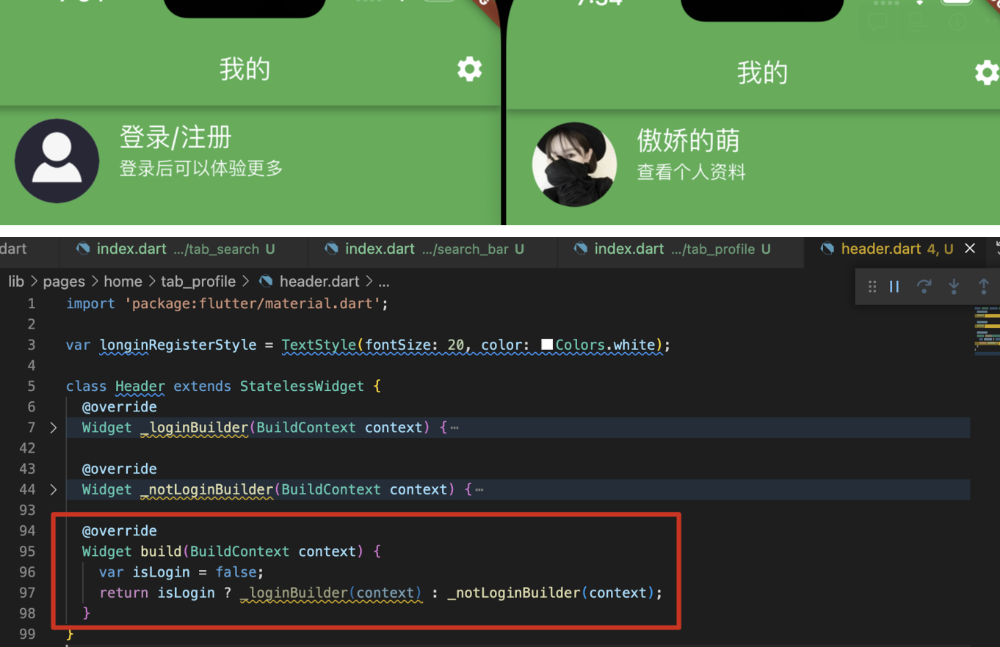

## 6.设置页/管理发布页

#### 设置页

效果：
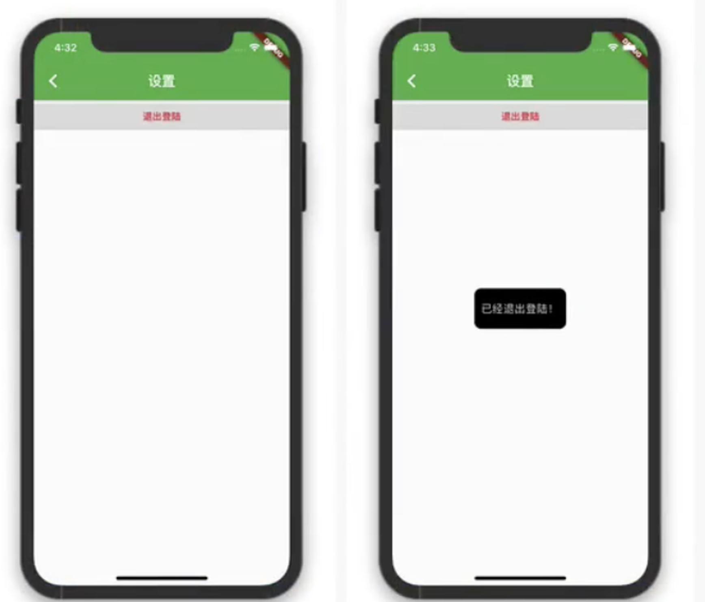

#### step1: 引入 fluttertoast

[fluttertoast | flutter package](https://pub-web.flutter-io.cn/packages/fluttertoast)

#### 房屋管理发布页

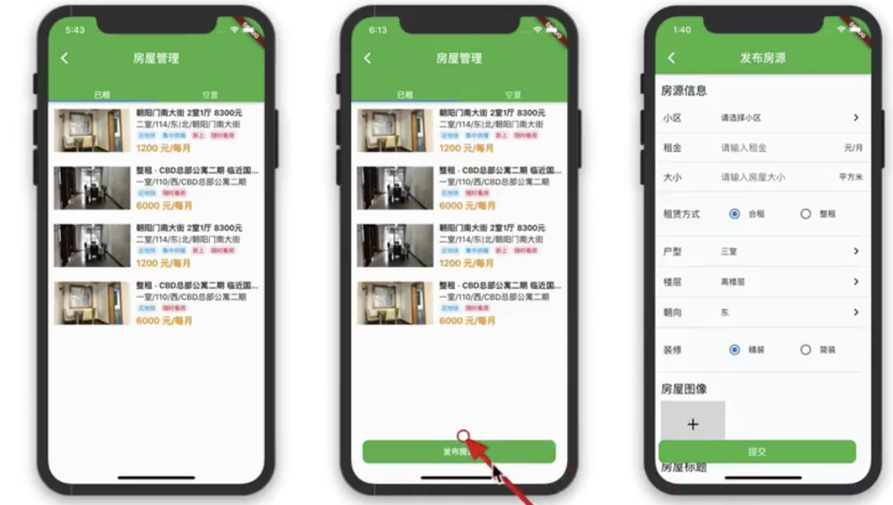
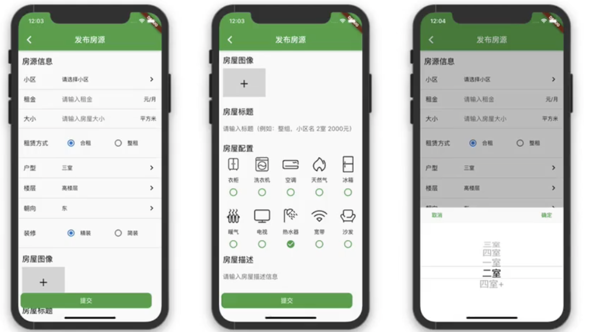
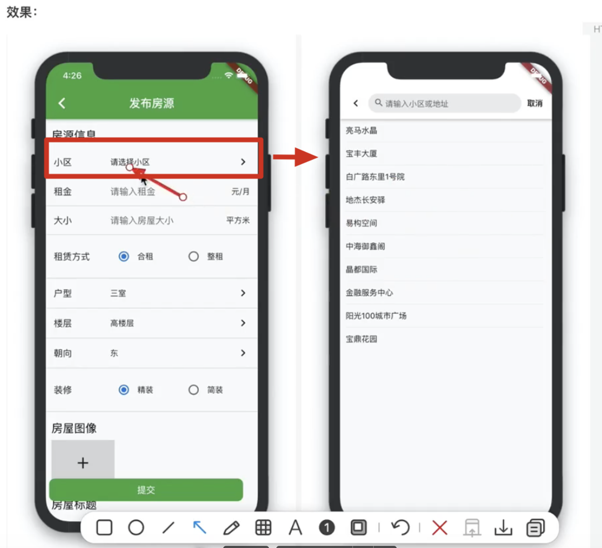

#### CommonPicker

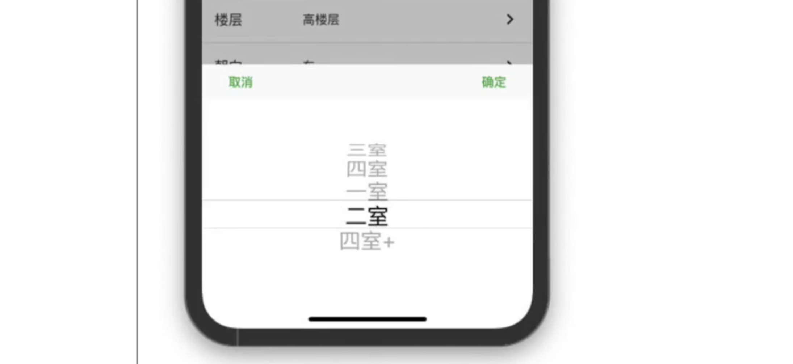


#### CommonImagePicker

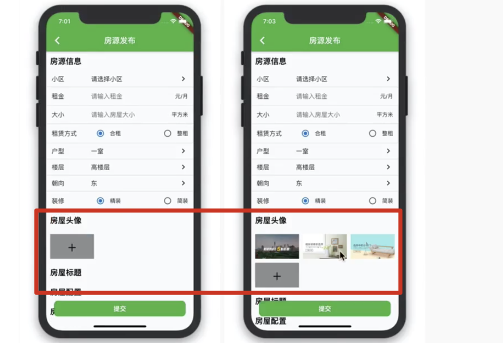

使用 [image_picker 库](https://github.com/flutter/packages/tree/main/packages/image_picker/image_picker)

注意，这里进行一些配置：需要获取相册权限等，才能访问模拟器内部的相册系统：
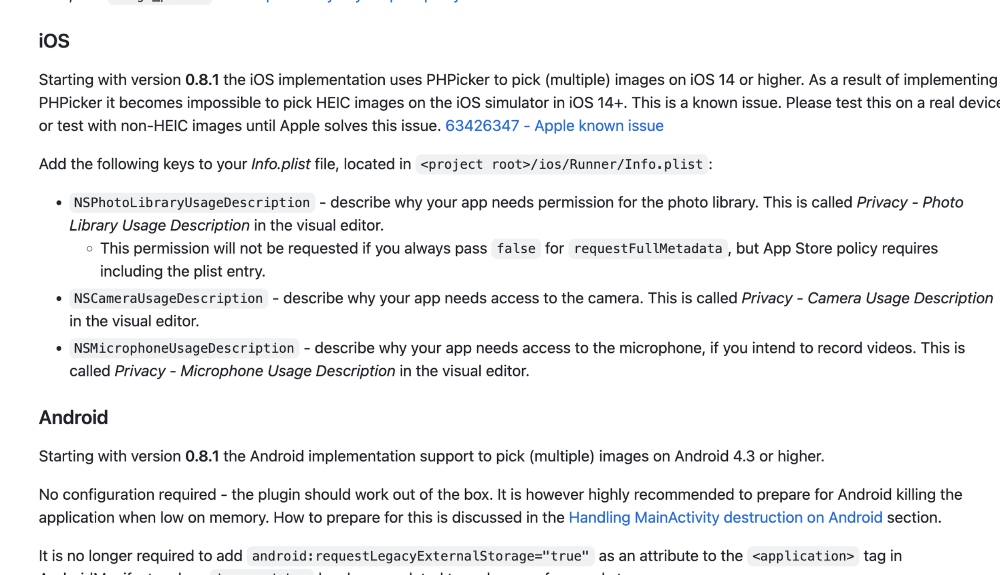
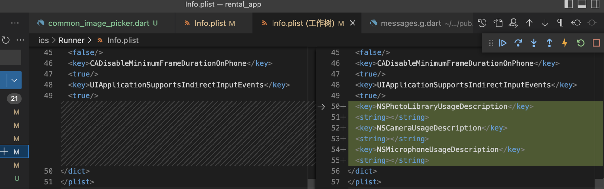

#### Icon 的引入

- 准备 ttf 文件
- 在`pubspec.yaml`文件引入
  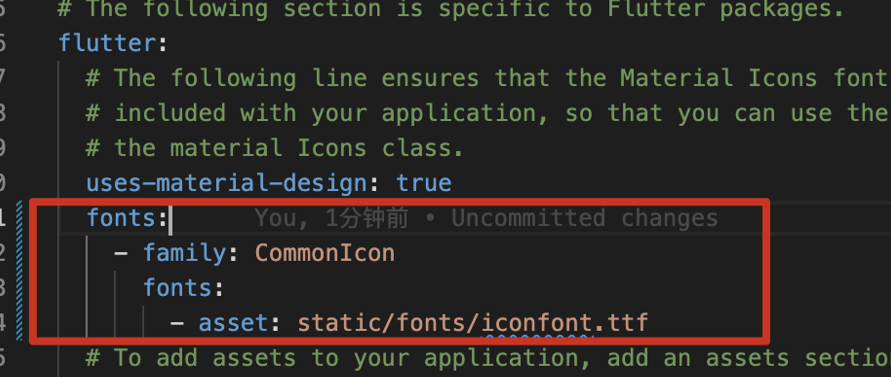

- 使用

```js

Icon(IconData(0xe918,fontFamily: 'CommonIcon'), size: 40),

// '0xe918':svg 中的 unicode
```

## 7.详情页

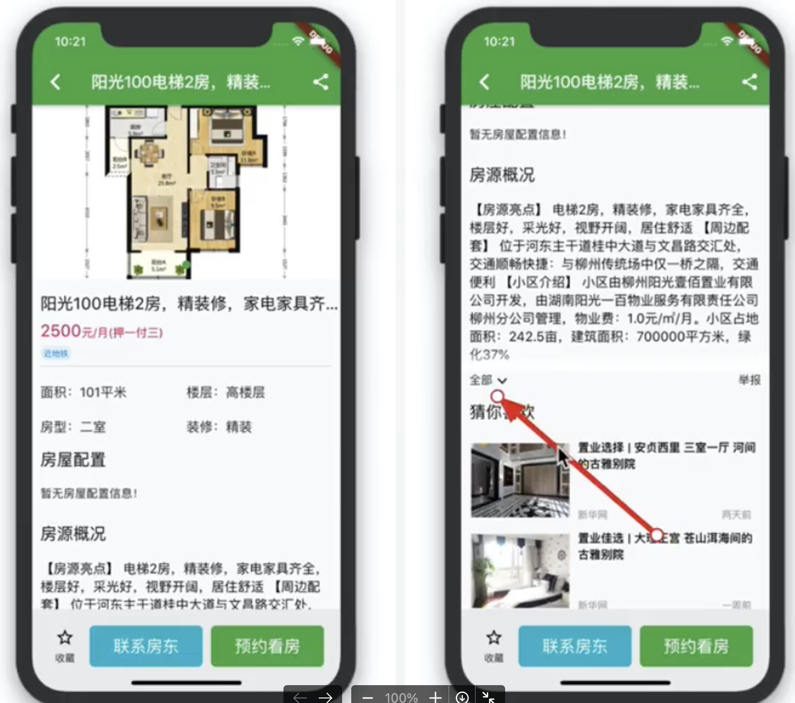

#### 分享功能

- 需要安装[share 库](https://pub.flutter-io.cn/packages/share)

#### CommonTag 改造：

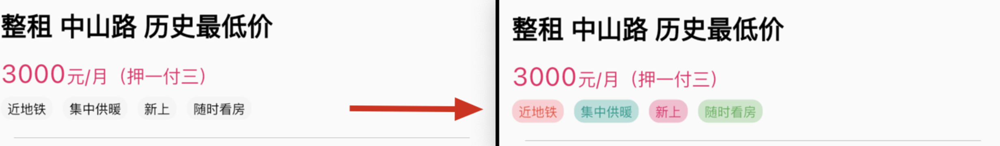

改造前代码：

```js
import 'package:flutter/material.dart';

class CommonTag extends StatelessWidget {
  final String title;
  final Color color;
  final Color backgroundColor;

  static const Color defaultBGcolor = Color.fromRGBO(245, 245, 245, 1.0);

  const CommonTag(
      {Key? key,
      required this.title,
      this.color = Colors.black,
      this.backgroundColor = defaultBGcolor})
      : super(key: key);

  @override
  Widget build(BuildContext context) {
    return Container(
      margin: EdgeInsets.only(right: 4),
      padding: EdgeInsets.only(left: 5, right: 5, top: 2, bottom: 2),
      child: Text(title, style: TextStyle(fontSize: 10, color: color)),
      decoration: BoxDecoration(
        borderRadius: BorderRadius.circular(8),
        color: backgroundColor,
      ),
    );
  }
}
```

改造后代码：

```js
import 'package:flutter/material.dart';

class CommonTag extends StatelessWidget {
  final String title;
  final Color color;
  final Color backgroundColor;

  static const Color defaultBGcolor = Color.fromRGBO(245, 245, 245, 1.0);

  const CommonTag.origin(
      {Key? key,
      required this.title,
      this.color = Colors.black,
      this.backgroundColor = Colors.grey})
      : super(key: key);

  factory CommonTag(String title) {
    switch (title) {
      case '近地铁':
        return CommonTag.origin(
          title: title,
          color: Colors.red,
          backgroundColor: Colors.red.shade100,
        );
      case '随时看房':
        return CommonTag.origin(
          title: title,
          color: Colors.green,
          backgroundColor: Colors.green.shade100,
        );
      case '集中供暖':
        return CommonTag.origin(
          title: title,
          color: Colors.teal,
          backgroundColor: Colors.teal.shade100,
        );
      case '新上':
        return CommonTag.origin(
          title: title,
          color: Colors.pink,
          backgroundColor: Colors.pink.shade100,
        );
      default:
        return CommonTag.origin(title: title);
    }
  }

  @override
  Widget build(BuildContext context) {
    return Container(
      margin: EdgeInsets.only(right: 4),
      padding: EdgeInsets.only(left: 5, right: 5, top: 2, bottom: 2),
      child: Text(title, style: TextStyle(fontSize: 10, color: color)),
      decoration: BoxDecoration(
        borderRadius: BorderRadius.circular(8),
        color: backgroundColor,
      ),
    );
  }
}
```

#### FilterBar

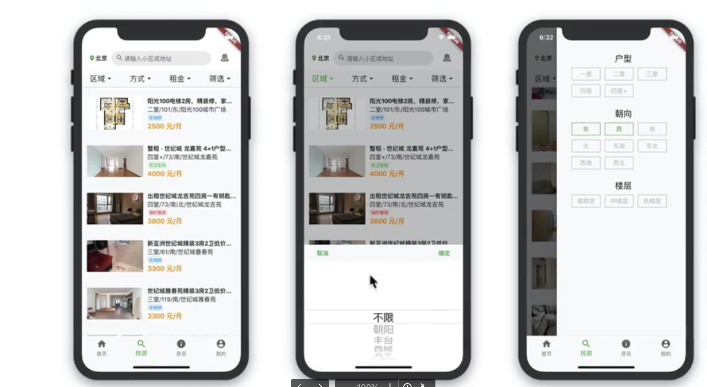

#### Flutter 状态管理

安装库[scoped_model](https://pub.flutter-io.cn/packages/scoped_model/example)


## 8.dio 封装

[dio | Dart Package](https://pub.dev/packages/dio)


#### 封装 DioHttp

为什么要封装？

- dio 的 api 变了或者后续使用其他组件替代 dio 时，需要修改的代码较多

参考文章：

[[Example code] - Dio Interceptors in flutter Example](https://www.flutterdecode.com/dio-interceptors-in-flutter-example/)

[Flutter Dio 源码分析(一)–Dio 介绍](https://www.liujunmin.com/flutter/dio_introduce.html)

[Flutter Dio 源码分析(三)--深度剖析](https://www.jianshu.com/p/f1f2c2116d67)

[Efficient CRUD Operations in Flutter: A Guide to Implementing HTTP Requests with Clean Architecture and Dio](https://clouds.hashnode.dev/efficient-crud-operations-in-flutter-a-guide-to-implementing-http-requests-with-clean-architecture-and-dio?ref=hackernoon.com#heading-understanding-clean-architecture)

#### step1:`config.dart`文件里 url 常量设置

```js
class Config {
  static const CommonIcon = 'CommonIcon';
  static const BaseUrl = 'https://mock.apifox.cn/m1/2965656-0-default';
  static const LocalUrl = 'http://0.0.0.0:3000/api/v1';
}
```

#### step1: 新建 utils/dio.dart 文件

```js
import 'package:dio/dio.dart';
import 'package:rental_app/config.dart';

/// dio网络请求配置表 自定义
class DioConfig {
  static const baseURL = Config.LocalUrl; //域名
  static const timeout = 10000; //超时时间
}

// 网络请求工具类
class DioRequest {
  late Dio dio;
  static DioRequest? _instance;

  /// 构造函数
  DioRequest() {
    dio = Dio();
    dio.options = BaseOptions(
        baseUrl: DioConfig.baseURL,
        connectTimeout: const Duration(seconds: 5),
        receiveTimeout: const Duration(seconds: 3),
        contentType: 'application/json; charset=utf-8',
        headers: {});

    /// 请求拦截器 and 响应拦截机 and 错误处理
    dio.interceptors.add(InterceptorsWrapper(onRequest: (options, handler) {
      print("\n================== 请求数据 ==========================");
      print("url = ${options.uri.toString()}");
      print("headers = ${options.headers}");
      print("params = ${options.data}");
      return handler.next(options);
    }, onResponse: (response, handler) {
      print("\n================== 响应数据 ==========================");
      print("code = ${response.statusCode}");
      print("data = ${response.data}");
      print("\n");
      handler.next(response);
    }, onError: (DioError e, handler) {
      print("\n================== 错误响应数据 ======================");
      print("type = ${e.type}");
      print("message = ${e.message}");
      print("\n");
      return handler.next(e);
    }));
  }
  static DioRequest getInstance() {
    return _instance ??= DioRequest();
  }
}
```

#### step3:新建 service/login.dart

```js

import 'dart:convert';
import 'package:rental_app/utils/dio.dart';

class LoginService {

  /// 登录接口
  static login(value) async {
    var response =
        await DioRequest.getInstance().dio.post('/login', data: value);
    var data = jsonDecode(response.toString());

    // 对返回的身份凭证全局持久化存储
    return data;
  }

  // 登录接口
  static register(value) async {
    var response =
        await DioRequest.getInstance().dio.post('/user/add', data: value);
    var data = jsonDecode(response.toString());

    /// 对返回的身份凭证全局持久化存储
    return data;
  }


}
```

## 9.登陆页联调

#### A、先来完成注册页面的简单联调

修改`pages/register.dart`页面：

```js
import 'dart:convert';

import 'package:flutter/material.dart';
import 'package:rental_app/utils/common_toast.dart';
import 'package:rental_app/widgets/page_content.dart';

import '../services/login.dart';
import '../utils/string_is_null_or_empty.dart';
import 'package:dio/dio.dart';

class _RegisterPageState extends State<RegisterPage> {
+	 var passwordController = TextEditingController();
+  var repeatPasswordController = TextEditingController();

+  _registerHandler() async {
    var username = usernameController.text;
    var password = passwordController.text;
    var repeatPassword = repeatPasswordController.text;
    if (password != repeatPassword) {
      CommonToast.showToast('两次输入密码不一致');
      return;
    }
    if (stringIsNullOrEmpty(username) || stringIsNullOrEmpty(password)) {
      CommonToast.showToast('用户名或密码不能为空');
      return;
    }

    const url = '/user/registered';
    var params = {'username': username, 'password': password, "role": 1};
    LoginService.register(params).then((res) {
      int status = res["status"];
      String message = res["message"] ?? "内部错误";
      CommonToast.showToast(message);
      if (status.toString().startsWith('2')) {
        Navigator.of(context).pushReplacementNamed('login');
      }
    });
  }

	...

	TextField(
              obscureText: true,
+              controller: passwordController,
              decoration: InputDecoration(
                labelText: '密码',
                hintText: '请输入密码',
              )),
	...
}
```

此时，可以调试成功，实现基本的注册功能。

#### B、问题与分析、封装 Store


[shared_preferences | Flutter Package](https://pub.dev/packages/shared_preferences)

[scoped_model | Flutter Package](https://pub-web.flutter-io.cn/packages/scoped_model/install)

shared_preferences 能够实现本地缓存，但是我们也需要将其进行封装：


##### step1:新建文件 utils/store.dart

```js
import 'package:shared_preferences/shared_preferences.dart';

enum StoreKeys {
  token,
}

class Store {
  static late StoreKeys storeKeys;
  final SharedPreferences _store;
  static Future<Store> getInstance() async {
    SharedPreferences prefs = await SharedPreferences.getInstance();
    return Store._internal(prefs);
  }

  Store._internal(this._store);

  getString(StoreKeys key) async {
    return _store.get(key.toString());
  }

  setString(StoreKeys key, String value) async {
    return _store.setString(key.toString(), value);
  }

  getStringList(StoreKeys key) async {
    return _store.getStringList(key.toString());
  }

  setStringList(StoreKeys key, List<String> value) async {
    return _store.setStringList(key.toString(), value);
  }
}
```

#### C、实现 AuthModel

我们需要共享存储 App 的登陆状态，需要实现一个 AuthModel。


##### step1：新建 scoped_model/auth.dart

```js
import 'package:flutter/material.dart';
import 'package:rental_app/utils/store.dart';
import 'package:rental_app/utils/string_is_null_or_empty.dart';
import 'package:scoped_model/scoped_model.dart';

class AuthModel extends Model {
  String _token = '';
  String get token => _token;

  bool get isList => _token is String && _token != '';

  void initApp(BuildContext context) async {
    Store store = await Store.getInstance();
    String token = store.getString(StoreKeys.token);
    if (stringIsNullOrEmpty(token)) {
      login(token, context);
    }
  }

  void login(String token, BuildContext context) {
    _token = token;
    notifyListeners();
  }

  void logout() {
    _token = '';
    notifyListeners();
  }
}
```

##### step2:在 application 里使用 AuthModel

```js
import 'package:fluro/fluro.dart';
import 'package:flutter/material.dart';
import 'package:rental_app/routes.dart';
import 'package:rental_app/scoped_modal/auth.dart';
import 'package:rental_app/scoped_modal/room_filter.dart';
import 'package:scoped_model/scoped_model.dart';

class Application extends StatelessWidget {
  const Application({super.key});
  @override
  Widget build(BuildContext context) {
    FluroRouter router = FluroRouter();
    Routes.configureRoutes(router);

    return ScopedModel<AuthModel>(
        model: AuthModel(),
        child: ScopedModel<FilterBarModel>(
            model: FilterBarModel(),
            child: MaterialApp(
              theme: ThemeData(primarySwatch: Colors.green),
              onGenerateRoute: router.generator,
            )));
  }
}
```


#### D、登陆页联调


login.dart

```js
import 'dart:async';

import 'package:flutter/material.dart';
import 'package:rental_app/scoped_modal/auth.dart';
import 'package:rental_app/utils/scoped_model_helper.dart';
import 'package:rental_app/widgets/page_content.dart';
import 'package:scoped_model/scoped_model.dart';
import '../services/login.dart';
import '../utils/store.dart';
import '../utils/string_is_null_or_empty.dart';
import 'package:rental_app/utils/common_toast.dart';
import 'package:dio/dio.dart';

class LoginPage extends StatefulWidget {
  // const HomePage({Key key}) : super(key: key);
  const LoginPage({super.key});

  @override
  State<LoginPage> createState() => _LoginPageState();
}

class _LoginPageState extends State<LoginPage> {
  bool showPassword = false;
  var usernameController = TextEditingController();
  var passwordController = TextEditingController();

  _loginHandler() async {
    var username = usernameController.text;
    var password = passwordController.text;

    if (stringIsNullOrEmpty(username) || stringIsNullOrEmpty(password)) {
      CommonToast.showToast('用户名或密码不能为空');
      return;
    }

    var params = {'username': username, 'password': password};

    LoginService.login(params).then((res) async {
      int status = res["status"];
      print(res);
      String message = res["message"] ?? "内部错误";
      print(status);
      print(message);
      CommonToast.showToast(message);
      if (status.toString().startsWith('2')) {
        String token = res['token'];
        Store store = await Store.getInstance();
        await store.setString(StoreKeys.token, token);

        ScopedModelHelper.getModel<AuthModel>(context).login(token, context);
        Timer(Duration(seconds: 1), () {
          Navigator.of(context).pop();
        });
      }
    });

  }

  @override
  Widget build(BuildContext context) {
    return Scaffold(
      appBar: AppBar(title: Text('登陆')),
      body: SafeArea(
        minimum: EdgeInsets.all(30),
        child: ListView(children: <Widget>[
          TextField(
              controller: usernameController,
              decoration:
                  InputDecoration(labelText: '用户名', hintText: '请输入用户名')),
          Padding(padding: EdgeInsets.all(10)),
          TextField(
              obscureText: !showPassword,
              controller: passwordController,
              decoration: InputDecoration(
                  labelText: '密码',
                  hintText: '请输入密码',
                  suffixIcon: IconButton(
                    icon: Icon(
                        showPassword ? Icons.visibility_off : Icons.visibility),
                    onPressed: () => {
                      setState(() {
                        showPassword = !showPassword;
                      })
                    },
                  ))),
          Padding(padding: EdgeInsets.all(10)),
          SizedBox(
              child: ElevatedButton(
                  onPressed: () {
                    _loginHandler();
                  },
                  child: Text('登陆'))),
          Padding(padding: EdgeInsets.all(10)),
          Row(mainAxisAlignment: MainAxisAlignment.center, children: <Widget>[
            Text('还没有账号，'),
            TextButton(
                child: Text('去注册'),
                onPressed: () =>
                    {Navigator.pushReplacementNamed(context, 'register')})
          ])
        ]),
      ),
    );
  }
}
```

#### E、使用 AuthModel，退出登陆

看 git 提交

#### F、完善个人信息


##### step1:新建 lib/models/user_info.dart

```js
class UserInfo {
  final String avatar;
  final String gender;
  final String nickname;
  final String phone;
  final int id;

  UserInfo(this.avatar, this.gender, this.nickname, this.phone, this.id);

  factory UserInfo.fromJson(Map<String, dynamic> json) => UserInfo(
        json["avatar"] as String,
        json["gender"] as String,
        json["nickname"] as String,
        json["phone"] as String,
        json["id"] as int,
      );
}
```

##### step2:在 lib/scoped_model/auth.dart 增加\_getUserInfo 方法

```js
import 'package:flutter/material.dart';
import 'package:rental_app/models/user_info.dart';
import 'package:rental_app/services/login.dart';
import 'package:rental_app/utils/store.dart';
import 'package:rental_app/utils/string_is_null_or_empty.dart';
import 'package:scoped_model/scoped_model.dart';

class AuthModel extends Model {
  String _token = '';
  late UserInfo _userInfo;

  String get token => _token;
  UserInfo get userInfo => _userInfo;

  bool get isLogin => _token is String && _token != '';

  void initApp(BuildContext context) async {
    Store store = await Store.getInstance();
    String token = store.getString(StoreKeys.token);
    if (stringIsNullOrEmpty(token)) {
      login(token, context);
    }
  }

  _getUserInfo(BuildContext context) async {
    // TODO:
    // var res = await LoginService.getArticles();
    // var userInfo = UserInfo.fromJson(res);
    var userInfo = UserInfo.fromJson({
      'nickname': 'hh',
      'gender': 'male',
      'avatar':
          "https://tva1.sinaimg.cn/large/006y8mN6ly1g6tbnovh8jj30hr0hrq3l.jpg",
      'id': 1,
      'phone': '198',
    });
    _userInfo = userInfo;
    notifyListeners();
  }

  void login(String token, BuildContext context) {
    _token = token;
    notifyListeners();
    _getUserInfo(context);
  }

  void logout() {
    _token = '';
    // _userInfo = null;
    notifyListeners();
  }
}
```

##### step3:修改 header.dart 方法


```js
import 'package:flutter/material.dart';
import 'package:rental_app/config.dart';
import 'package:rental_app/scoped_modal/auth.dart';
import 'package:rental_app/utils/scoped_model_helper.dart';

var longinRegisterStyle = TextStyle(fontSize: 20, color: Colors.white);

class Header extends StatelessWidget {
  @override
  Widget _loginBuilder(BuildContext context) {
    var userInfo = ScopedModelHelper.getModel<AuthModel>(context).userInfo;

    String userName = userInfo?.nickname ?? '傲娇的萌';
    String userImage = userInfo?.avatar ??
        'https://tva1.sinaimg.cn/large/006y8mN6ly1g6tbnovh8jj30hr0hrq3l.jpg';

    // 头像是相对地址，所以需要做些处理
    if (!userImage.startsWith('http')) {
      userImage = Config.LocalUrl + userImage;
    }

    return Container(
      padding: EdgeInsets.only(left: 20, top: 10, bottom: 20),
      decoration: BoxDecoration(color: Colors.green),
      height: 95,
      child: Row(
        children: [
          Container(
            height: 65,
            width: 65,
            margin: EdgeInsets.only(right: 15),
            child: CircleAvatar(
                backgroundImage: NetworkImage(
                    'https://tva1.sinaimg.cn/large/006y8mN6ly1g6tbnovh8jj30hr0hrq3l.jpg')),
          ),
          Column(
            crossAxisAlignment: CrossAxisAlignment.start,
            children: [
              Text(
                userName,
                style: longinRegisterStyle,
              ),
              Text(
                '查看个人资料',
                style: TextStyle(color: Colors.white),
              )
            ],
          )
        ],
      ),
    );
  }

  @override
  Widget _notLoginBuilder(BuildContext context) {
    return Container(
      padding: EdgeInsets.only(left: 20, top: 10, bottom: 20),
      decoration: BoxDecoration(color: Colors.green),
      height: 95,
      child: Row(
        children: [
          Container(
            height: 65,
            width: 65,
            margin: EdgeInsets.only(right: 15),
            child: CircleAvatar(
                backgroundImage: NetworkImage(
                    'https://tva1.sinaimg.cn/large/006y8mN6ly1g6tbgbqv2nj30i20i2wen.jpg')),
          ),
          Column(
            crossAxisAlignment: CrossAxisAlignment.start,
            children: [
              Row(
                children: [
                  Padding(padding: EdgeInsets.only(top: 6)),
                  GestureDetector(
                    child: Text('登录', style: longinRegisterStyle),
                    onTap: () {
                      Navigator.of(context).pushNamed('login');
                    },
                  ),
                  Text(
                    '/',
                    style: longinRegisterStyle,
                  ),
                  GestureDetector(
                    child: Text('注册', style: longinRegisterStyle),
                    onTap: () {
                      Navigator.of(context).pushNamed('register');
                    },
                  ),
                ],
              ),
              Text(
                '登录后可以体验更多',
                style: TextStyle(color: Colors.white),
              )
            ],
          )
        ],
      ),
    );
  }

  @override
  Widget build(BuildContext context) {
    var isLogin = ScopedModelHelper.getModel<AuthModel>(context).isLogin;
    return isLogin ? _loginBuilder(context) : _notLoginBuilder(context);
  }
}
```

#### G、model 生成半自动化

问题：已经定义了 UserInfo 里的字段，但是在红框部分又要写一遍。

[](https://github.com/google/json_serializable.dart/tree/master/example)


修改 lib/models/user_info.dart

```js
import 'package:json_annotation/json_annotation.dart';
part 'user_info.g.dart';

@JsonSerializable()
class UserInfo {
  final String avatar;
  final String gender;
  final String nickname;
  final String phone;
  final int id;

  UserInfo(this.avatar, this.gender, this.nickname, this.phone, this.id);

  // 不使用json_annotation
  // factory UserInfo.fromJson(Map<String, dynamic> json) => UserInfo(
  //       json["avatar"] as String,
  //       json["gender"] as String,
  //       json["nickname"] as String,
  //       json["phone"] as String,
  //       json["id"] as int,
  //     );

  // 使用json_annotation
  factory UserInfo.fromJson(Map<String, dynamic> json) =>
      _$UserInfoFromJson(json);

  Map<String, dynamic> toJson() => _$UserInfoToJson(this);
}
```

然后终端执行：

```js
dart run build_runner build
```

就会自动生成 user_info.g.dart 文件：


#### 延伸：如果后端返回的字段，不是我们前端定义的，比如前端是 phone，后端返回的对应字段确实 telephone，怎么办？

#### 1.加入一行代码：

```js
@JsonKey(name: 'telephone')
```


然后重新执行：

```js
dart run build_runner build
```

重新生成 user_info.g.dart 文件。


#### H、优化现有 model


首先以 GeneralType 为例，前端定义的 GeneralType 数据类型是这样的：

```js
class GeneralType {
  final String name;
  final String id;

  GeneralType(this.name, this.id);
}
```

但是后端返回的数据类型 key 分别是 lable、value，这时我们就可以跟 user_info 一样。

##### step1:新建 lib/models/general_type.dart

```js
import 'package:json_annotation/json_annotation.dart';
part 'general_type.g.dart';

@JsonSerializable()
class GeneralType {
  @JsonKey(name: 'label')
  final String name;
  @JsonKey(name: 'value')
  final String id;

  GeneralType(this.name, this.id);

  factory GeneralType.fromJson(Map<String, dynamic> json) =>
      _$GeneralTypeFromJson(json);

  Map<String, dynamic> toJson() => _$GeneralTypeToJson(this);
}
```

然后执行：

```js
dart run build_runner build
```

然后将之前的 GeneralType 注释或删除，在引入 GeneralType 的地方，更改引入 models 里的 GeneralType：


同理，还有 RoomListItemData、RoomDetailData。这里省略。

## 10.城市选择器


[city_pickers | Flutter Package](https://pub.dev/packages/city_pickers)


#### step1-1:引入第三方库 city_pickers

```js
city_pickers: ^1.3.0
```

#### step1-2:设置开通的城市（可切换的城市）

config.dart

```js
+ import 'package:rental_app/pages/home/tab_search/filter_bar/data.dart';

class Config {

+  static List<GeneralType> AvailableCitys = [
    GeneralType('北京', 'AREA|88cff55c-aaa4-e2e0'),
    GeneralType('上海', 'AREA|dbf46d32-7e76-1196'),
    GeneralType('深圳', 'AREA|a6649a11-be98-b150'),
    GeneralType('广州', 'AREA|e4940177-c04c-383d'),
  ];
}
```

#### step1-3:本地缓存里增加 city 的 key

store.dart

```js
enum StoreKeys {
	token,
+	city
}
```

#### step1-4:增加 city.model

新增 lib/scoped_model/city.dart 文件

```js
import 'package:rental_app/pages/home/tab_search/filter_bar/data.dart';
import 'package:scoped_model/scoped_model.dart';
import 'package:rental_app/config.dart';

class CityModel extends Model {
  GeneralType _city = Config.AvailableCitys.first;

  set city(GeneralType data) {
    _city = data;
    notifyListeners();
  }

  GeneralType get city {
    return _city;
  }
}
```

#### step1-5:增加获取城市 id 的方法

lib/utils/scoped_model_helper.dart

```js
+import 'package:rental_app/config.dart';
+import 'package:rental_app/scoped_model/city.dart';

class ScopedModelHelper {
+  static String getAreaId(context) {
    return ScopedModelHelper.getModel<CityModel>(context).city?.id ??
        Config.AvailableCitys.first.id;
  }
}
```

#### step1-6:application 引入 CityModel


#### step2-1:实现城市选择功能

lib/widget/search_bar/index.dart

#### 引入新的依赖：

```js
import 'dart:convert';
import 'package:city_pickers/city_pickers.dart';
import 'package:rental_app/config.dart';
import 'package:rental_app/pages/home/tab_search/filter_bar/data.dart';
import 'package:rental_app/scoped_model/city.dart';
import 'package:rental_app/utils/common_toast.dart';
import 'package:rental_app/utils/scoped_model_helper.dart';
import 'package:rental_app/utils/store.dart';
import 'package:scoped_model/scoped_model.dart';
import 'package:collection/collection.dart';
```

其中，还需要安装 collection 库，因为用到了 firstWhereOrNull 方法（firstWhere 方法无法返回 null，会出现类型报错）

#### 编写方法：\_getCity、\_changeLocation、\_saveCity

```js
_changeLocation() async {
    Result? result = await CityPickers.showCitiesSelector(
        context: context, theme: ThemeData(primaryColor: Colors.green));

    if (null == result) return;
    String? cityName = result.cityName;

    if (cityName == null) return;

    GeneralType? city = Config.AvailableCitys.firstWhereOrNull(
        (city) => cityName.startsWith(city.name));
    print(city);
    if (city == null) {
      CommonToast.showToast('该城市未开通');
      return;
    }

    _saveCity(city);
  }

_saveCity(GeneralType city) async {
    if (city == null) return;
    // 存到了全局存储里
    ScopedModelHelper.getModel<CityModel>(context).city = city;
    // 存到本地缓存里
    var store = await Store.getInstance();
    var cityString = json.encode(city.toString());
    store.setString(StoreKeys.city, cityString);
  }

_getCity() async {
    var store = await Store.getInstance();
    var cityString = await store.getString(StoreKeys.city);
    if (null == cityString) return;
    // var city = GeneralType.fromJson(json.decode(cityString));
    var city = json.decode(cityString);
    ScopedModelHelper.getModel<CityModel>(context).city = city;
  }
```

#### 页面使用动态数据：


#### 完整的 search_bar/index.dart

```js
import 'dart:convert';
import 'package:city_pickers/city_pickers.dart';
import 'package:flutter/material.dart';
import 'package:rental_app/config.dart';
import 'package:rental_app/pages/home/tab_search/filter_bar/data.dart';
import 'package:rental_app/scoped_model/city.dart';
import 'package:rental_app/utils/common_toast.dart';
import 'package:rental_app/utils/scoped_model_helper.dart';
import 'package:rental_app/utils/store.dart';
import 'package:scoped_model/scoped_model.dart';
import 'package:collection/collection.dart';

import '../common_image.dart';

class SearchBarWrapper extends StatefulWidget {
  final bool? showLocation;
  final Function? goBackCallback;
  final String? inputValue;
  final String defaultInputValue;
  final Function? onCancel;
  final bool? showMap;
  final Function? onSearch;
  final ValueChanged<String>? onSearchSubmit;

  const SearchBarWrapper(
      {Key? key,
      this.showLocation,
      this.goBackCallback,
      this.inputValue,
      this.defaultInputValue = '请输入搜索词',
      this.onCancel,
      this.showMap,
      this.onSearch,
      this.onSearchSubmit})
      : super(key: key);

  @override
  _SearchBarState createState() => _SearchBarState();
}

class _SearchBarState extends State<SearchBarWrapper> {
  String _searchWord = '';
  late TextEditingController _controller;
  late FocusNode _focus;
  void _onClean() {
    setState(() {
      _searchWord = '';
      _controller.clear();
    });
  }

  _saveCity(GeneralType city) async {
    if (city == null) return;
    // 存到了全局存储里
    ScopedModelHelper.getModel<CityModel>(context).city = city;
    // 存到本地缓存里
    var store = await Store.getInstance();
    var cityString = json.encode(city.toString());
    store.setString(StoreKeys.city, cityString);
  }

  _changeLocation() async {
    Result? result = await CityPickers.showCitiesSelector(
        context: context, theme: ThemeData(primaryColor: Colors.green));

    if (null == result) return;
    String? cityName = result.cityName;

    if (cityName == null) return;

    GeneralType? city = Config.AvailableCitys.firstWhereOrNull(
        (city) => cityName.startsWith(city.name));
    print(city);
    if (city == null) {
      CommonToast.showToast('该城市未开通');
      return;
    }

    _saveCity(city);
  }

  _getCity() async {
    var store = await Store.getInstance();
    var cityString = await store.getString(StoreKeys.city);
    if (null == cityString) return;
    // var city = GeneralType.fromJson(json.decode(cityString));
    var city = json.decode(cityString);
    ScopedModelHelper.getModel<CityModel>(context).city = city;
  }

  @override
  void initState() {
    // TODO: implement initState
    _controller = TextEditingController(text: widget.inputValue);
    _focus = FocusNode();
    super.initState();
  }

  @override
  Widget build(BuildContext context) {
    var city = ScopedModelHelper.getModel<CityModel>(context).city;
    print(city.name);
    if (city == null) {
      city = Config.AvailableCitys.first;
      _getCity();
    }
    return Row(
      mainAxisAlignment: MainAxisAlignment.spaceBetween,
      children: [
        if (widget.showLocation != null)
          Padding(
            padding: EdgeInsets.only(right: 10),
            child: GestureDetector(
              onTap: () {
                _changeLocation();
              },
              child: Row(
                children: [
                  Icon(
                    Icons.room,
                    color: Colors.green,
                    size: 16,
                  ),
                  Text(
                    city.name,
                    style: TextStyle(color: Colors.black, fontSize: 14),
                  ),
                ],
              ),
            ),
          ),
        if (widget.goBackCallback != null)
          Padding(
            padding: EdgeInsets.only(right: 10),
            child: GestureDetector(
              onTap: widget.goBackCallback as GestureTapCallback,
              child: Icon(
                Icons.chevron_left,
                color: Colors.black,
                size: 16,
              ),
            ),
          ),
        Expanded(
          child: Container(
            height: 34,
            decoration: BoxDecoration(
                borderRadius: BorderRadius.circular(17),
                color: Colors.grey[200]),
            child: TextField(
              focusNode: _focus,
              onChanged: (String value) {
                setState(() {
                  _searchWord = value;
                });
              },
              onTap: () {
                if (widget.onSearchSubmit == null) {
                  _focus.unfocus(); // 使之失去焦点
                }
                widget.onSearch!();
              },
              onSubmitted: widget.onSearchSubmit,
              controller: _controller,
              textInputAction: TextInputAction.search,
              style: TextStyle(fontSize: 14),
              decoration: InputDecoration(
                  contentPadding: EdgeInsets.only(top: 1, left: -10),
                  border: InputBorder.none,
                  icon: Padding(
                    padding: EdgeInsets.only(left: 10, top: 2),
                    child: Icon(
                      Icons.search,
                      size: 18,
                      color: Colors.grey,
                    ),
                  ),
                  suffixIcon: GestureDetector(
                    onTap: () {
                      print('清理');
                      _onClean();
                    },
                    child: Icon(
                      Icons.clear,
                      size: 18,
                      color: _searchWord == '' ? Colors.grey[200] : Colors.grey,
                    ),
                  ),
                  hintText: '请输入搜索词',
                  hintStyle: TextStyle(color: Colors.grey, fontSize: 14)),
            ),
          ),
        ),
        if (widget.onCancel != null)
          Padding(
            padding: const EdgeInsets.only(right: 10.0),
            child: GestureDetector(
              child: Text(
                '取消',
                style: TextStyle(
                    fontWeight: FontWeight.w600,
                    color: Colors.black,
                    fontSize: 14),
              ),
              onTap: widget.onCancel! as GestureTapCallback,
            ),
          ),
        if (widget.showMap != null)
          CommonImage(
            src: 'static/icons/widget_search_bar_map.png',
            width: 40,
            height: 40,
          ),
      ],
    );
  }
}
```

## 11.登陆过期处理

比如我们在点击“提交”按钮时，由于登陆信息过期了，造成后端给我们返回的信息未按预期。此时我们可以使用 dio 的拦截器来进行处理。


dio.dart

> 注意：dio 里无法直接获取到 context，因此需要在请求 api 时将 context 添加到 extra 里

```js
import 'dart:convert';
import 'dart:js';

import 'package:dio/dio.dart';
import 'package:flutter/material.dart';
import 'package:rental_app/config.dart';
import 'package:rental_app/scoped_model/auth.dart';
import 'package:rental_app/utils/common_toast.dart';
import 'package:rental_app/utils/scoped_model_helper.dart';
import 'package:rental_app/routes.dart';

/// dio网络请求配置表 自定义
class DioConfig {
  static const baseURL = Config.LocalUrl; //域名
  static const timeout = 10000; //超时时间
}

// 网络请求工具类
class DioRequest {
  late Dio dio;
  static DioRequest? _instance;

  /// 构造函数
  DioRequest() {
    dio = Dio();
    dio.options = BaseOptions(
        baseUrl: DioConfig.baseURL,
        connectTimeout: const Duration(seconds: 5),
        receiveTimeout: const Duration(seconds: 3),
        contentType: 'application/json; charset=utf-8',
        extra: {
          'context': context
        }, // dio里无法直接获取到context，因此需要在请求api时将context添加到extra里
        headers: {});

    /// 请求拦截器 and 响应拦截机 and 错误处理
    dio.interceptors.add(InterceptorsWrapper(onRequest: (options, handler) {
      print("\n================== 请求数据 ==========================");
      print("url = ${options.uri.toString()}");
      print("headers = ${options.headers}");
      print("params = ${options.data}");
      return handler.next(options);
    }, onResponse: (Response res, handler) {
      print("\n================== 响应数据 ==========================");
      print("code = ${res.statusCode}");
      print("data = ${res.data}");
      print("\n");

      if (null == res) {
        handler.next(res);
      }
      var status = json.decode(res.toString())['status'];
      if (404 == status) {
        CommonToast.showToast('接口地址错误！');
        // return res;
        // handler.next(res);
      }
      if (status.toString().startsWith("4")) {
        var context = res.extra['context'];
        ScopedModelHelper.getModel<AuthModel>(context).logout();
        CommonToast.showToast('登陆过期');
        Navigator.pushNamed(context, Routes.login);
        // return res;
        // handler.next(res);
      }
      handler.next(res);
    }, onError: (DioError e, handler) {
      print("\n================== 错误响应数据 ======================");
      print("type = ${e.type}");
      print("message = ${e.message}");
      print("\n");
      return handler.next(e);
    }));
  }
  static DioRequest getInstance() {
    return _instance ??= DioRequest();
  }
}
```

## 12.启动页


#### step1: 新建 pages/loading.dart 文件

```js
import 'dart:async';

import 'package:flutter/material.dart';
import 'package:rental_app/scoped_model/auth.dart';
import 'package:rental_app/utils/scoped_model_helper.dart';

class LoadingPage extends StatefulWidget {
  const LoadingPage({super.key});

  @override
  State<LoadingPage> createState() => _LoadingPageState();
}

class _LoadingPageState extends State<LoadingPage> {
  // 生命周期里实现延迟跳转和调用initApp
  @override
  void initState() {
    Timer(Duration(seconds: 3), () {
      Navigator.of(context).pushReplacementNamed('/');
    });
    Timer.run(() {
      ScopedModelHelper.getModel<AuthModel>(context).initApp(context);
    });
    super.initState();
  }

  @override
  Widget build(BuildContext context) {
    return Container(
        decoration: BoxDecoration(
            image: DecorationImage(
                fit: BoxFit.fill,
                image: AssetImage('static/images/loading.jpg'))));
  }
}
```

#### step2:注册 loading 页面

lib/routes.dart 加入以下代码：

```js
import 'package:rental_app/pages/loading.dart';

class Routes {
	static String loading = '/loading';

	static Handler _loadingHandler = Handler(
      handlerFunc: (BuildContext? context, Map<String, dynamic> params) {
    return LoadingPage();
  });

	router.define(loading, handler: _loadingHandler);
}
```

#### step3:application 配置 initialRoute


##### step3-1: 修改之前的错误代码


#### 问题 1：

此时就可以看到启动页面了，但是有个新的问题，左上角出现了一个返回按钮：


解决方法：


#### 问题 2: 退出登陆之后，然后重启 app，发现还是登陆状态

原因：退出登录时没有清除缓存

auth.dart

```js

void logout() async {
    _token = '';
    _userInfo = null;
    notifyListeners();

+    Store store = await Store.getInstance();
+   await store.setString(StoreKeys.token, '');
  }
```

#### 问题 3:token 存在但过期了，那么从落地页进来时就会跳到登陆页，登陆成功之后会再次回到落地页，但此时落地页没办法到首页


```js
// 如果当前在落地启动页
if (ModalRoute.of(context).settings.name == Routes.loading) {
  return res;
}
```

## 13.构建打包


#### step1:修改应用名称

修改/ios/Runner/info.plist 文件里的 CFBundleName 对应值


#### step2:修改图标和背景图

替换 Assets.xcassets 文件即可，这里没有视频中提到的现有静态资源，就不操作了。


#### step3:构建

```js
flutter build ios
```

构建成功之后，build 文件夹下的 iphoneos/Runner.app 就是打包之后的文件。
