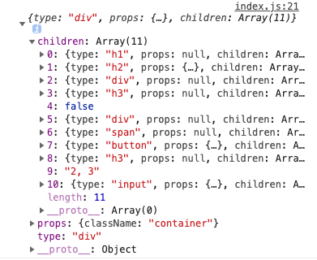
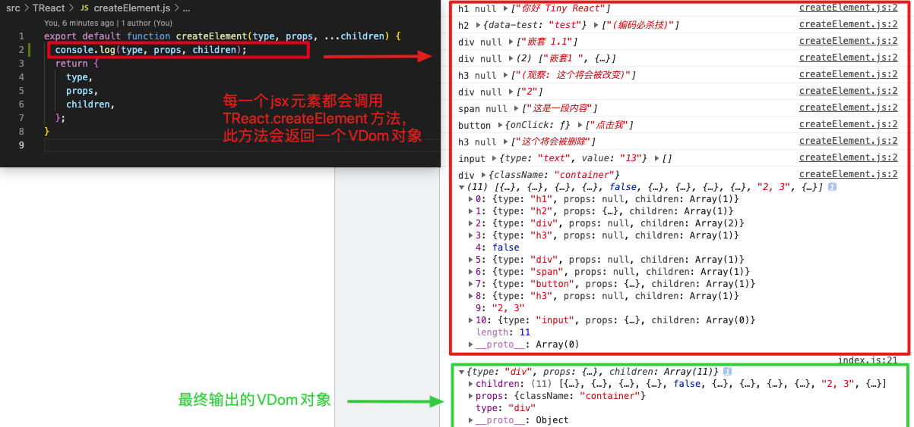
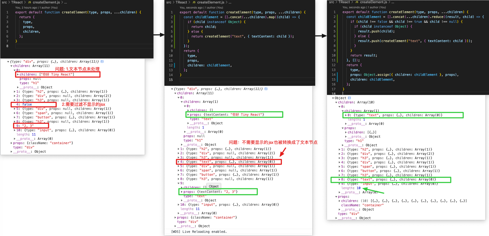

## step1.创建 VDom 对象

### 一. babel 插件，转换 jsx

#### 1.创建/编写.babelrc 文件，配置@babel/preset-react，将 pragma 默认项 React.createElement 转换成 TReact.createElement

[babel-preset-react](https://www.babeljs.cn/docs/babel-preset-react)

```react
{
    "presets": [
        "@babel/preset-env",
        [
            "@babel/preset-react",
            {
                "pragma": "TReact.createElement"
            }
        ]
    ]
}
```

#### 2.创建/编写 TReact/createElement.js 文件

```
export default function createElement(type, props, ...children) {
  return {
    type,
    props,
    children,
  };
}

```

#### 3. 创建/编写 src/index.js

```
import TReact from "./TReact";

const virtualDOM = (
  <div className="container">
    <h1>你好 Tiny React</h1>
    <h2 data-test="test">(编码必杀技)</h2>
    <div>
      嵌套1 <div>嵌套 1.1</div>
    </div>
    <h3>(观察: 这个将会被改变)</h3>
    {2 == 1 && <div>如果2和1相等渲染当前内容</div>}
    {2 == 2 && <div>2</div>}
    <span>这是一段内容</span>
    <button onClick={() => alert("你好")}>点击我</button>
    <h3>这个将会被删除</h3>
    2, 3
    <input type="text" value="13" />
  </div>
);

console.log(virtualDOM);
```

#### 总结：

此时可以看到浏览器终端输出：



这是因为在执行到“console.log(virtualDOM);”这行代码时，由于 babel 的设置，每一个 jsx 元素都会去调用 TReact.createElement 方法，这个方法会返回一个 VDom 对象：



### 二. 完善 CreateElement 方法，在创建 VDom 过程中把文本字符串转换成对象类型

转换过程中需要注意布尔值节点和 null 值节点

```
export default function createElement(type, props, ...children) {
  const childElement = [].concat(...children).map((child) => {
    if (child instanceof Object) {
      return child;
    } else {
      return createElement("text", { textContent: child });
    }
  });
  return {
    type,
    props,
    children: childElement,
  };
}
```



### 三、将 VDom 转换成真实 Dom，并渲染

#### 1.在 html 文件中创建父级元素

```
<!DOCTYPE html>
<html lang="en">
   ...
   <body>
+    <div id="root"></div>
   </body>
</html>
```

#### 2.创建外部方法 render 以及 内部方法 diff、mountElement、 mountNativeElement

##### 2-1.创建 TReact/render.js 文件，方法的作用就是将 VDom 对象 转换成真实 dom 对象

TReact/render.js

```
import diff from "./diff";
export default function render(virtualDOM, container, oldDOM) {
  diff(virtualDOM, container, oldDOM);
}
```

在 src/index.js 文件中调用 render 方法。

```
  import TReact from "./TReact";
+ const root = document.getElementById("root");
  const virtualDOM = (...);
  console.log(virtualDOM);
+ TReact.render(virtualDOM, root);
```

##### 2-2.创建内部方法 diff、mountElement、 mountNativeElement

TReact/diff.js

```
import mountElement from "./mountElement";
export default function diff(virtualDOM, container, oldDOM) {
  // 判断oldDOM是否存在
  if (!oldDOM) {
    mountElement(virtualDOM, container);
  }
}
```

TReact/mountElement.js

```
import mountNativeElement from "./mountNativeElement";

export default function mountElement(virtualDOM, container) {
  // Component VS NativeElement
  mountNativeElement(virtualDOM, container);
}

```

TReact/mountNativeElement.js

```
import mountElement from "./mountElement";

export default function mountNativeElement(virtualDOM, container) {
  let newElement = null;
  if (virtualDOM.type === "text") {
    // 文本节点
    newElement = document.createTextNode(virtualDOM.props.textContent);
  } else {
    // 元素节点
    newElement = document.createElement(virtualDOM.type);
  }

  // 递归创建子节点
  virtualDOM.children.forEach((child) => {
    mountElement(child, newElement);
  });
  console.log(newElement);
  // 将转换之后的DOM对象放置在页面中
  container.appendChild(newElement);
}

```

此时，jsx 元素已经可以显示在页面中了。

### 三、为 DOM 对象添加属性

#### 1.创建 TReact/updateNodeElement.js 文件

```
export default function updateNodeElement(newElement, virtualDOM) {
  // 获取节点对应的属性对象
  const newProps = virtualDOM.props;
  Object.keys(newProps).forEach((propName) => {
    // 获取属性值
    const newPropsValue = newProps[propName];
    // 判断属性是否是事件属性 onClick => click
    if (propName.slice(0, 2) === "on") {
      // 事件名称
      const eventName = propName.toLocaleLowerCase().slice(2);
      // 为元素添加事件
      newElement.addEventListener(eventName, newPropsValue);
    } else if (propName === "value" || propName === "checked") {
      newElement[propName] = newPropsValue;
    } else if (propName !== "children") {
      if (propName === "className") {
        newElement.setAttribute("class", newPropsValue);
      } else {
        newElement.setAttribute(propName, newPropsValue);
      }
    }
  });
}
```

#### 2.在创建元素节点之后，调用 updateNodeElement 方法，为 DOM 添加属性

```
+ import updateNodeElement from "./updateNodeElement";
  export default function createDOMElement(virtualDOM) {
    if (virtualDOM.type === "text") {...} else {
      // 元素节点
      newElement = document.createElement(virtualDOM.type);
      // 为元素添加属性
+     updateNodeElement(newElement, virtualDOM);
    }
  }
```

## step2:组件的渲染

### 一、函数组件的渲染

#### 1.src/index.js

```
import TReact from "./TReact";
const root = document.getElementById("root");

// 函数组件
function Heart(props) {
  return (
    <div>
      {props.title}
      &hearts;
      <Demo />
    </div>
  );
}

// 函数组件
function Demo() {
  return <div>Demo</div>;
}

TReact.render(<Heart title="hello title" />, root);

```

#### 2.src/TReact/mountElement.js

```
import mountNativeElement from "./mountNativeElement";
import isFunction from "./isFunction";
import mountComponent from "./mountComponent";

export default function mountElement(virtualDOM, container) {
  if (isFunction(virtualDOM)) {
    // Component
    mountComponent(virtualDOM, container);
  } else {
    //NativeElement
    mountNativeElement(virtualDOM, container);
  }
}
```

#### 3.src/TReact/isFunction.js

```
export default function isFunction(virtualDOM) {
  return virtualDOM && typeof virtualDOM.type === "function";
}
```

#### 4.src/TReact/mountComponent.js

```
import isFunction from "./isFunction";
import isFunctionComponent from "./isFunctionComponent";
import mountNativeElement from "./mountNativeElement";

export default function mountComponent(virtualDOM, container) {
  let nextVirtualDOM = null;

  // 判断组件是类组件还是函数组件
  if (isFunctionComponent(virtualDOM)) {
    // 函数组件 调用 buildFunctionalComponent 方法处理函数组件
    nextVirtualDOM = buildFunctionComponent(virtualDOM);
  }
  // 判断得到的 Virtual Dom 是否是组件
  if (isFunction(nextVirtualDOM)) {
    // 如果是组件 继续调用 mountComponent 解剖组件
    mountComponent(nextVirtualDOM, container);
  } else {
    mountNativeElement(nextVirtualDOM, container);
  }
}

function buildFunctionComponent(virtualDOM) {
  return virtualDOM.type(virtualDOM.props || {});
}

```

#### 5.src/TReact/isFunctionComponent.js

```
import isFunction from "./isFunction";
export default function isFunctionComponent(virtualDOM) {
  const type = virtualDOM.type;
  return (
    type && isFunction(virtualDOM) && !(type.prototype && type.prototype.render)
  );
}

```

### 二、类组件的渲染

类组件本身也是 Virtual DOM，可以通过 Virtual DOM 中的 type 属性值确定当前要渲染的组件是类组件还是函数组件。

在确定当前要渲染的组件为类组件以后，需要实例化类组件得到类组件实例对象，通过类组件实例对象调用类组件中的 render 方法，获取组件要渲染的 Virtual DOM。

类组件需要继承 Component 父类，子类需要通过 super 方法将自身的 props 属性传递给 Component 父类，父类会将 props 属性挂载为父类属性，子类继承了父类，自己本身也就自然拥有 props 属性了。这样做的好处是当 props 发生更新后，父类可以根据更新后的 props 帮助子类更新视图。

#### 1.src/index.js

```
import TReact from "./TReact";
const root = document.getElementById("root");

// 定义Alert类组件时，它是Component的子类，可以在内部中调用父类，把this.props传递给父类，让父类去执行this.props=props
class Alert extends TReact.Component {
  // 通过constructor拿到props
  // 在buildClassComponent这个方法里，实例化时传递进来的
  constructor(props) {
    // 调用super方法将props传递给父类
    super(props);
  }
  render() {
    return (
      <div>
        hello Component
        {this.props.name}
        {this.props.age}
      </div>
    );
  }
}
TReact.render(<Alert name="张三" age={20} />, root);
```

#### 2.src/TReact/Component.js——外部方法，需要导出

```
export default class Component {
  // 在子类中调用super其实就是调用这个父类的constructor
  constructor(props) {
    // 这样父类就有this.props属性了，子类继承父类，因此子类也有了this.props属性
    this.props = props;
  }
}
```

#### 3.src/TReact/mountComponent.js

```
import isFunction from "./isFunction";
import isFunctionComponent from "./isFunctionComponent";
import mountNativeElement from "./mountNativeElement";

export default function mountComponent(virtualDOM, container) {
  let nextVirtualDOM = null;

  // 判断组件是类组件还是函数组件
  if (isFunctionComponent(virtualDOM)) {
    // 函数组件
    nextVirtualDOM = buildFunctionComponent(virtualDOM);
  } else {
    // 类组件
    nextVirtualDOM = buildClassComponent(virtualDOM);
  }

  if (isFunction(nextVirtualDOM)) {
    // 函数组件返回的virtualDOM还是一个函数组件
    mountComponent(nextVirtualDOM, container);
  } else {
    // 函数组件返回的virtualDOM是一个基本元素（有可能是下面两种情况
    // <div> 基本元素 </div>
    // <div> 包含了函数组件 <Text /> </div>）
    mountNativeElement(nextVirtualDOM, container);
  }
}

...

function buildClassComponent(virtualDOM) {
  // 这里的参数virtualDOM.props，其实是传递给了类组件里的constructor
  const component = new virtualDOM.type(virtualDOM.props || {});
  // 通过实例对象去调用render函数
  const nextVirtualDom = component.render();
  return nextVirtualDom;
}

```

## step3:更新 Dom 元素

### 一、DOM 更新——简单文本节点的更新

在进行 Virtual DOM 比对时，需要用到更新后的 Virtual DOM 和更新前的 Virtual DOM，更新后的 Virtual DOM 目前我们可以通过 render 方法进行传递，现在的问题是更新前的 Virtual DOM 要如何获取呢？

对于更新前的 Virtual DOM，对应的其实就是已经在页面中显示的真实 DOM 对象。既然是这样，那么我们在创建真实 DOM 对象时，就可以将 Virtual DOM 添加到真实 DOM 对象的属性中。在进行 Virtual DOM 对比之前，就可以通过真实 DOM 对象获取其对应的 Virtual DOM 对象了，其实就是通过 render 方法的第三个参数获取的，container.firstChild。

#### diff 方法-Virtual DOM 比对

判断 oldVirtualDOM 是否存在， 如果存在则继续判断要对比的 Virtual DOM 类型是否相同，如果类型相同判断节点类型是否是文本，如果是文本节点对比，就调用 updateTextNode 方法（对比文本内容是否发生变化），如果是元素节点对比就调用 setAttributeForElement 方法（对比元素属性是否发生变化）,最上层元素对比完成以后还需要递归对比子元素。当对比的元素节点类型不同时，就不需要继续对比了，直接使用新的 Virtual DOM 创建 DOM 对象，用新的 DOM 对象直接替换旧的 DOM 对象，当前这种情况要将组件刨除，组件要被单独处理。删除节点发生在节点更新以后并且发生在同一个父节点下的所有子节点身上，在节点更新完成以后，如果旧节点对象的数量多于新 VirtualDOM 节点的数量，就说明有节点需要被删除。

updateTextNode 方法用于对比文本节点内容是否发生变化，如果发生变化则更新真实 DOM 对象中的内容，既然真实 DOM 对象发生了变化，还要将最新的 Virtual DOM 同步给真实 DOM 对象。

setAttributeForElement 方法用于设置/更新元素节点属性。思路是先分别获取更新后的和更新前的 Virtual DOM 中的 props 属性，循环新 Virtual DOM 中的 props 属性，通过对比看一下新 Virtual DOM 中的属性值是否发生了变化，如果发生变化 需要将变化的值更新到真实 DOM 对象中。再循环未更新前的 Virtual DOM 对象，通过对比看看新的 Virtual DOM 中是否有被删除的属性，如果存在删除的属性 需要将 DOM 对象中对应的属性也删除掉。

#### 1.src/index.js

```
import TReact from "./TReact";
const root = document.getElementById("root");
const virtualDOM = (
  <div className="container">
    <h1>你好 Tiny React</h1>
    <h2 data-test="test">(编码必杀技)</h2>
    <div>
      嵌套1 <div>嵌套 1.1</div>
    </div>
    <h3>(观察: 这个将会被改变)</h3>
    {2 == 1 && <div>如果2和1相等渲染当前内容</div>}
    {2 == 2 && <div>2</div>}
    <span>这是一段内容</span>
    <button onClick={() => alert("你好")}>点击我</button>
    <h3>这个将会被删除</h3>
    2, 3
    <input type="text" value="13" />
  </div>
);
const modifyDOM = (
  <div className="container">
    <h1>你好 Tiny React2</h1>
    <h2 data-test="test123">(编码必杀技)</h2>
    <div>
      嵌套1 <div>嵌套 1.1</div>
    </div>
    <h3>(观察: 这个将会被改变)</h3>
    {2 == 1 && <div>如果2和1相等渲染当前内容</div>}
    {2 == 2 && <div>2</div>}
    <span>这是一段被修改过的内容</span>
    <button onClick={() => alert("你好！！！！！")}>点击我</button>
    <h3>这个将会被删除</h3>
    2, 3
    <input type="text" value="13" />
  </div>
);

TReact.render(virtualDOM, root);

setTimeout(() => {
  TReact.render(modifyDOM, root);
}, 2000);
```

#### 2.在 render 方法中，赋值 oldDOM

```
export default function render(
  virtualDOM,
  container,
  // oldDOM指向页面旧的dom对象，container就是指id为root的元素
  // 因为jsx元素必须有一个父级，所以可以通过.firstChild方法获取
  oldDOM = container.firstChild
) {
  diff(virtualDOM, container, oldDOM);
}
```

#### 3.src/TReact/createDOMElement.js——创建 dom 元素时，添加\_virtualDOM 属性

```
export default function createDOMElement(virtualDOM) {
  let newElement = null;
  if (virtualDOM.type === "text") {
    // 文本节点
    newElement = document.createTextNode(virtualDOM.props.textContent);
  } else {
    // 元素节点
    newElement = document.createElement(virtualDOM.type);
    // 为元素添加属性
    updateNodeElement(newElement, virtualDOM);
  }

  // 创建dom元素时，添加_virtualDOM属性
+ newElement._virtualDOM = virtualDOM;

  // 递归创建子节点
  virtualDOM.children.forEach((child) => {
    mountElement(child, newElement);
  });

  return newElement;
}

```

#### 4.src/TReact/diff.js——更新 diff 方法

```
import mountElement from "./mountElement";
import updateTextNode from "./updateTextNode";
export default function diff(virtualDOM, container, oldDOM) {
  const oldVirtualDOM = oldDOM && oldDOM._virtualDOM;
  // 判断oldDOM是否存在
  if (!oldDOM) {
    mountElement(virtualDOM, container);
  } else if (oldVirtualDOM && virtualDOM.type === oldVirtualDOM.type) {
    if (virtualDOM.type === "text") {
      // 更新内容
      updateTextNode(virtualDOM, oldVirtualDOM, oldDOM);
    } else {
      // 更新元素属性
    }
    virtualDOM.children.forEach((child, i) => {
      diff(child, oldDOM, oldDOM.childNodes[i]);
    });
  }
}

```

### 二、DOM 更新——节点类型不相同

```
export default function diff(virtualDOM, container, oldDOM) {
  const oldVirtualDOM = oldDOM && oldDOM._virtualDOM;
  // 判断oldDOM是否存在
  if (!oldDOM) {...} else if (oldVirtualDOM && virtualDOM.type === oldVirtualDOM.type){...} else if(
    virtualDOM.type !== oldVirtualDOM.type &&
    typeof virtualDOM.type !== "function"
  ) {
    const newElement = createDOMElement(virtualDOM);
    oldDOM.parentNode.replaceChild(newElement, oldDOM);
  }
}
```

### 三、DOM 更新——删除属性，或其他属性的更新

```
export default function diff(virtualDOM, container, oldDOM) {
  const oldVirtualDOM = oldDOM && oldDOM._virtualDOM;
  // 判断oldDOM是否存在
  if (!oldDOM) {
    mountElement(virtualDOM, container);
  } else if (
    virtualDOM.type !== oldVirtualDOM.type &&
    typeof virtualDOM.type !== "function"
  ) {
    const newElement = createDOMElement(virtualDOM);
    oldDOM.parentNode.replaceChild(newElement, oldDOM);
  } else if (oldVirtualDOM && virtualDOM.type === oldVirtualDOM.type) {
    if (virtualDOM.type === "text") {
      // 更新内容
      updateTextNode(virtualDOM, oldVirtualDOM, oldDOM);
    } else {
      // 更新元素属性
+     updateNodeElement(oldDOM, virtualDOM, oldVirtualDOM);
    }
    virtualDOM.children.forEach((child, i) => {
      diff(child, oldDOM, oldDOM.childNodes[i]);
    });
  }
}
```

```
export default function updateNodeElement(
  newElement,
  virtualDOM,
  oldVirtualDOM = {}
) {
  // 获取节点对应的属性对象
  const newProps = virtualDOM.props || {};
  const oldProps = oldVirtualDOM.props || {};

  Object.keys(newProps).forEach((propName) => {
    // 获取属性值
    const newPropsValue = newProps[propName];
    const oldPropsValue = oldProps[propName];
    if (newPropsValue !== oldPropsValue) {
      // 判断属性是否是事件属性 onClick => click
      if (propName.slice(0, 2) === "on") {
        // 事件名称
        const eventName = propName.toLocaleLowerCase().slice(2);
        // 为元素添加事件
        newElement.addEventListener(eventName, newPropsValue);
        if (oldPropsValue) {
          newElement.removeEventListener(eventName, oldPropsValue);
        }
      } else if (propName === "value" || propName === "checked") {
        newElement[propName] = newPropsValue;
      } else if (propName !== "children") {
        if (propName === "className") {
          newElement.setAttribute("class", newPropsValue);
        } else {
          newElement.setAttribute(propName, newPropsValue);
        }
      }
    }
  });

  // 判断属性被删除的情况
  Object.keys(oldProps).forEach((propName) => {
    const newPropsValue = newProps[propName];
    const oldPropsValue = oldProps[propName];
    if (!newPropsValue) {
      // 属性被删除了
      if (propName.slice(0, 2) === "on") {
        const eventName = propName.toLowerCase().slice(2);
        newElement.removeEventListener(eventName, oldPropsValue);
      } else if (propName !== "children") {
        newElement.removeAttribute(propName);
      }
    }
  });
}

```

### 三、DOM 更新——删除节点

删除节点发生在节点更新以后并且发生在同一个父节点下的所有子节点身上。

在节点更新完成以后，如果旧节点对象的数量多于新 virtualDOM 节点的数量，就说明有节点需要被删除

#### 1.更新 diff 方法

由于删除节点发生在同一个父节点下的所有子节点身上，因此是更新节点类型相同的情况下（virtualDOM.type === oldVirtualDOM.type）

```
export default function diff(virtualDOM, container, oldDOM) {
  const oldVirtualDOM = oldDOM && oldDOM._virtualDOM;
  // 判断oldDOM是否存在
  if (!oldDOM) {
    mountElement(virtualDOM, container);
  } else if (
    virtualDOM.type !== oldVirtualDOM.type &&
    typeof virtualDOM.type !== "function"
  ) {...} else if (oldVirtualDOM && virtualDOM.type === oldVirtualDOM.type) {
    ...

    // 删除节点
    // 获取旧节点
    let oldChildNodes = oldDOM.childNodes;
    if (oldChildNodes.length > virtualDOM.children.length) {
      // 有节点需要被删除
      for (
        let i = oldChildNodes.length - 1;
        i > virtualDOM.children.length;
        i--
      ) {
        unmountNode(oldChildNodes[i]);
      }
    }
  }
}

```

#### 2.新建 src/TReact/unmountNode.js

```
export default function unmountNode(node) {
  node.remove();
}

```

## step4.更新组件

### 一、类组件的更新

#### 1.创建并渲染一个类组件

```javascript
import TReact from './TReact';
const root = document.getElementById('root');

class Alert extends TReact.Component {
  constructor(props) {
    super(props);
    this.state = { title: 'default title' };
    this.handleClick = this.handleClick.bind(this);
  }
  handleClick() {
    this.setState({ title: 'changed title' });
  }
  render() {
    return (
      <div>
        {this.props.name}
        {this.props.age}
        <div>
          {this.state.title}
          <button onClick={this.handleClick}>改变title</button>
        </div>
      </div>
    );
  }
}
TReact.render(<Alert />, root);
```

#### 2.类 Component

##### 2-1.更改子类的 state

setState 方法中，通过调用 this.state 改变了子类的 state。因为 setState 方法是在子类中调用的，因此 this 指向的是子类

##### 2-2.获取并比对新旧 VDom，并进行渲染

通过调用 this.render 方法，获取到最新的要渲染的 virtualDOM 对象
旧的 virtualDOM 保存在页面的 dom 对象中

```javascript
export default class Component {
  // 在子类中调用super其实就是调用这个父类的constructor
  constructor(props) {
    // 这样父类就有this.props属性了，子类继承父类，因此子类也有了this.props属性
    this.props = props;
  }
  setState(state) {
    this.state = Object.assign({}, this.state, state);
    // 获取最新的要渲染的 virtualDOM 对象
    let virtualDOM = this.render();
    // 获取旧的virtualDOM对象进行比对
    let oldDOM = this.getDOM();
    let container = oldDOM.parentNode;
    diff(virtualDOM, container, oldDOM);
  }
  setDOM(dom) {
    this._dom = dom;
  }
  getDOM() {
    return this._dom;
  }
}
```

#### 3.在处理类组件的方法中，用 component 属性保存组件的实例对象

```javascript
function buildClassComponent(virtualDOM) {
  // 这里的参数virtualDOM.props，其实是传递给了类组件里的constructor
  const component = new virtualDOM.type(virtualDOM.props || {});
  // 通过实例对象去调用render函数
  const nextVirtualDom = component.render();
  // 用component属性保存组件的实例对象
  nextVirtualDom.component = component;
  return nextVirtualDom;
}
```

#### 4.获取组件的实例对象，并调用类 Component 的 setDOM 方法，将旧的 DOM 保存下来

```javascript
export default function mountNativeElement(virtualDOM, container) {
  const newElement = createDOMElement(virtualDOM);
  // 将转换之后的DOM对象放置在页面中
  container.appendChild(newElement);
  // 要调用component类中的setDOM方法，需要获取到组件的实例对象
  let component = virtualDOM.component;
  if (component) {
    component.setDOM(newElement);
  }
}
```

### 二、不是同一个组件的情况

#### 1.diff 方法——判断要更新的是 VDom 是否是组件，并调用 diffComponent 方法

```javascript
export default function diff(virtualDOM, container, oldDOM) {
    const oldComponent = oldVirtualDOM && oldVirtualDOM.component;
    if(!oldDOM){...}else if (typeof virtualDOM.type === "function") {
        // 要更新的是组件
        // 1) 组件本身的 virtualDOM 对象 通过它可以获取到组件最新的 props
        // 2) 要更新的组件的实例对象 通过它可以调用组件的生命周期函数 可以更新组件的 props 属性 可以获取到组件返回的最新的 Virtual DOM
        // 3) 要更新的 DOM 象 在更新组件时 需要在已有DOM对象的身上进行修改 实现DOM最小化操作 获取旧的 Virtual DOM 对象
        // 4) 如果要更新的组件和旧组件不是同一个组件 要直接将组件返回的 Virtual DOM 显示在页面中 此时需要 container 做为父级容器
        diffComponent(virtualDOM, oldComponent, oldDOM, container)
    }
}
```

#### 2.diffComponent 方法——判断是否是同一个组件，如果不是同一个组件就不需要做组件更新操作，直接调用 mountElement 方法将组件返回的 Virtual DOM 添加到页面中。

```javascript
import mountElement from './mountElement';
export default function diffComponent(
  virtualDOM,
  oldComponent,
  oldDOM,
  container,
) {
  if (isSameComponent(virtualDOM, oldComponent)) {
    // 同一个组件，进行组件更新操作
    console.log('同一个组件，进行组件更新操作');
  } else {
    // 先删除原来的组件
    mountElement(virtualDOM, container, oldDOM);
  }
}

// 判断是否是同一个组件
function isSameComponent(virtualDOM, oldComponent) {
  return oldComponent && virtualDOM.type === oldComponent.constructor;
}
```

#### 3.mountElement 方法——新增 oldDOM 参数，作用是在将 DOM 对象插入到页面前 将页面中已存在的 DOM 对象删除 否则无论是旧 DOM 对象还是新 DOM 对象都会显示在页面中

###### 4.mountNativeElement 方法——删除原有的旧 DOM 对象

```javascript
export default function mountNativeElement(virtualDOM, container, oldDOM) {
  // 如果旧的DOM对象存在 删除
  if (oldDOM) {
    unmount(oldDOM);
  }
  ...
}
```

### 三、同一个组件的情况

#### 1.先在 Component 类中添加生命周期函数，子类要使用的话直接覆盖就可以

```javascript
// Component.js
export default class Component {
  // 生命周期函数
  componentWillMount() {}
  componentDidMount() {}
  componentWillReceiveProps(nextProps) {}
  shouldComponentUpdate(nextProps, nextState) {
    return nextProps != this.props || nextState != this.state;
  }
  componentWillUpdate(nextProps, nextState) {}
  componentDidUpdate(prevProps, preState) {}
  componentWillUnmount() {}
}
```

#### 2.diffComponent 里，增加同一个组件情况更新时调用 updateComponent 方法

```javascript
// diffComponent.js
if (isSameComponent(virtualDOM, oldComponent)) {
  // 属同一个组件 做组件更新
  updateComponent(virtualDOM, oldComponent, oldDOM, container);
}
```

#### 3.新建 updateComponent 方法用于更新组件操作

在 updateComponent 方法中调用组件的生命周期函数，更新组件获取最新 Virtual DOM，最终调用 diff 方法进行更新

```javascript
// updateComponent.js
export default function updateComponent(
  virtualDOM,
  oldComponent,
  oldDOM,
  container,
) {
  // 生命周期函数
  oldComponent.componentWillReceiveProps(virtualDOM.props);
  if (
    // 调用 shouldComponentUpdate 生命周期函数判断是否要执行更新操作
    oldComponent.shouldComponentUpdate(virtualDOM.props)
  ) {
    // 将未更新的 props 保存一份
    let prevProps = oldComponent.props;
    // 生命周期函数
    oldComponent.componentWillUpdate(virtualDOM.props);
    // 更新组件的 props 属性 updateProps 方法定义在 Component 类型
    oldComponent.updateProps(virtualDOM.props);
    // 因为组件的 props 已经更新 所以调用 render 方法获取最新的 Virtual DOM
    const nextVirtualDOM = oldComponent.render();
    // 将组件实例对象挂载到 Virtual DOM 身上
    nextVirtualDOM.component = oldComponent;
    // 调用diff方法更新视图
    diff(nextVirtualDOM, container, oldDOM);
    // 生命周期函数
    oldComponent.componentDidUpdate(prevProps);
  }
}
```

## step5.ref 属性获取元素 DOM 对象获取组件实例对象

### 一、给元素和组件添加 ref 属性

给组件添加 ref 属性，是获取该组件的实例对象。

为节点添加 ref 属性可以获取到这个节点的 DOM 对象，比如在 DemoRef 类中，为 input 元素添加了 ref 属性，目的是获取 input DOM 元素对象，在点击按钮时获取用户在文本框中输入的内容。

```javascript
class DemoRef extends TReact.Component {
  constructor(props) {
    super(props);
    this.handleClick = this.handleClick.bind(this);
  }
  handleClick() {
    console.log(this.input.value);
    console.log(this.alert);
  }

  componentDidMount() {
    console.log('componentDidMount');
  }
  render() {
    return (
      <div>
        <input type="text" ref={(input) => (this.input = input)} />
        <button onClick={this.handleClick}>按钮</button>
        <Alert name="2" ref={(alert) => (this.alert = alert)} />
      </div>
    );
  }
}
TReact.render(<DemoRef />, root);
```

### 二、在创建节点时将创建出来的 DOM 对象传递给 ref 所存储的方法

实现思路是在创建节点时判断其 Virtual DOM 对象中是否有 ref 属性，如果有就调用 ref 属性中所存储的方法并且将创建出来的 DOM 对象作为参数传递给 ref 方法，这样在渲染组件节点的时候就可以拿到元素对象并将元素对象存储为组件属性了。

```javascript
// createDOMElement.js
if (virtualDOM.props && virtualDOM.props.ref) {
  virtualDOM.props.ref(newElement);
}
```

### 三、在挂载类组件完成后，调用 ref 方法

实现思路是在 mountComponent 方法中，如果判断了当前处理的是类组件，就通过类组件返回的 Virtual DOM 对象中获取组件实例对象，判断组件实例对象中的 props 属性中是否存在 ref 属性，如果存在就调用 ref 方法并且将组件实例对象传递给 ref 方法。

```javascript
// mountComponent.js
export default function mountComponent(virtualDOM, container, oldDOM) {
  let nextVirtualDOM = null;
+ let component = null;
  // 判断组件是类组件还是函数组件
  if (isFunctionComponent(virtualDOM)) {
    // 函数组件
    nextVirtualDOM = buildFunctionComponent(virtualDOM);
  } else {
    // 类组件
    nextVirtualDOM = buildClassComponent(virtualDOM);
+   component = nextVirtualDOM.component;
  }

  if (isFunction(nextVirtualDOM)) {
    // 函数组件返回的virtualDOM还是一个函数组件
    mountComponent(nextVirtualDOM, container, oldDOM);
  } else {
    // 函数组件返回的virtualDOM是一个基本元素（有可能是下面两种情况
    // <div> 基本元素 </div>
    // <div> 包含了函数组件 <Text /> </div>）
    mountNativeElement(nextVirtualDOM, container, oldDOM);
  }
// 此时组件已挂载完毕，可以调用componentDidMount
+ if (component) {
+   if (component.props && component.props.ref) {
+     component.props.ref(component);
+   }
+ }
}
```

## step6.使用 key 属性进行节点对比

### 一、key 属性的存在必要性

在 React 中，渲染列表数据时通常会在被渲染的列表元素上添加 key 属性，key 属性就是数据的唯一标识，帮助 React 识别哪些数据被修改或删除了，从而达到 DOM 最小化操作的目的。

key 属性不需要全局唯一，但是在同一个父节点下的兄弟节点之间必须是唯一的。即，在比对同一个父节点下类型相同的子节点时需要用到 key 属性。

### 二、实现思路

在两个元素进行比对时，如果类型相同，就循环旧的 DOM 对象的子元素，查看其身上是否有 key 属性，如果有就将这个子元素的 DOM 对象存储在一个 js 对象中，接着循环要渲染的 Virtual DOM 对象的子元素，在循环过程中获取到这个子元素的 key 属性，然后使用这个 key 属性到 js 对象中查找 DOM 对象，如果能找到就说明这个元素是已经存在的，是不需要重新渲染的，如果通过 key 属性找不到这个元素，就说明这个元素是新增的是需要渲染的，就调用 mountElement 方法把新增元素追加到页面中。

### 三、具体步骤

#### 1.jsx

```javascript
// src/index.js
class KeyDemo extends TReact.Component {
  constructor(props) {
    super(props);
    this.state = {
      persons: [
        { id: 1, name: 'name1' },
        { id: 2, name: 'name2' },
        { id: 3, name: 'name3' },
        { id: 4, name: 'name4' },
      ],
    };
    this.handleClick = this.handleClick.bind(this);
  }
  handleClick() {
    const newState = JSON.parse(JSON.stringify(this.state));
    // 此行代码调试key能找到（元素调换了位置）的情况
    // newState.persons.push(newState.persons.shift());
    // 此行代码调试key不能找到（新增了元素）的情况
    newState.persons.splice(1, 0, { id: 100, name: 'name new' });
    this.setState(newState);
  }
  render() {
    return (
      <div>
        <ul>
          {this.state.persons.map((person) => (
            <li key={person.id}>{person.name}</li>
          ))}
        </ul>
        <button onClick={this.handleClick}>按钮</button>
      </div>
    );
  }
}
TReact.render(<KeyDemo />, root);
```

#### 2.diff

```javascript
// diff.js
else if (oldVirtualDOM && virtualDOM.type === oldVirtualDOM.type) {
  ...
  // 将拥有key属性的元素放入 keyedElements 对象中
  let keyedElements = {}
  for (let i = 0, len = oldDOM.childNodes.length; i < len; i++) {
    let domElement = oldDOM.childNodes[i]
    if (domElement.nodeType === 1) {
      let key = domElement.getAttribute("key")
      if (key) {
        keyedElements[key] = domElement
      }
    }
  }
  let hasNoKey = Object.keys(keyedElements).length === 0

  // 如果没有找到拥有 key 属性的元素 就按照索引进行比较
  if (hasNoKey) {
    // 递归对比 Virtual DOM 的子元素
    virtualDOM.children.forEach((child, i) => {
      diff(child, oldDOM, oldDOM.childNodes[i])
    })
  } else {
    // 使用key属性进行元素比较
    virtualDOM.children.forEach((child, i) => {
      // 获取要进行比对的元素的 key 属性
      let key = child.props.key
      // 如果 key 属性存在
      if (key) {
        // 到已存在的 DOM 元素对象中查找对应的 DOM 元素
        let domElement = keyedElements[key]
        // 如果找到元素就说明该元素已经存在 不需要重新渲染
        if (domElement) {
          // 虽然 DOM 元素不需要重新渲染 但是不能确定元素的位置就一定没有发生变化
          // 所以还要查看一下元素的位置
          // 看一下 oldDOM 对应的(i)子元素和 domElement 是否是同一个元素 如果不是就说明元素位置发生了变化
          if (oldDOM.childNodes[i] && oldDOM.childNodes[i] !== domElement) {
            // 元素位置发生了变化
            // 将 domElement 插入到当前元素位置的前面 oldDOM.childNodes[i] 就是当前位置
            // domElement 就被放入了当前位置
            oldDOM.insertBefore(domElement, oldDOM.childNodes[i])
          }
        } else {
          // 第一个参数：新增元素
          // 第二个参数：父级
          // 第三个参数：要插入的地方的兄弟节点
          mountElement(child, oldDOM, oldDOM.childNodes[i])
        }
      }
    })
  }
}

```

#### 3.新增元素的情况处理

```javascript
export default function mountNativeElement(virtualDOM, container, oldDOM) {
  const newElement = createDOMElement(virtualDOM);

  if (oldDOM) {
    container.insertBefore(newElement, oldDOM);
  } else {
    // 将转换之后的DOM对象放置在页面中
    container.appendChild(newElement);
  }
  // 判断旧的dom对象是否存在，如果存在删除
  if (oldDOM) {
    unmountNode(oldDOM);
  }
  // 要调用component类中的setDOM方法，需要获取到组件的实例对象
  let component = virtualDOM.component;
  if (component) {
    component.setDOM(newElement);
  }
}
```

## step7.删除节点

### 一、节点卸载——实现比对 key 后直接删除

在比对节点的过程中，如果旧节点的数量多于要渲染的新节点的数量就说明有节点被删除了，继续判断 keyedElements 对象中是否有原属性，如果没有就使用索引方式删除，如果有就要使用 key 属性比对的方式进行删除。

实现思路是循环旧节点，在循环旧节点的过程中获取旧节点对应的 key 属性，然后根据 key 属性在新节点中查找这个旧节点，如果找到就说明这个节点没有被删除，如果没有找到，就说明节点被删除了，调用卸载节点的方法卸载节点即可。

```javascript
// diff.js
// 删除节点
// 获取旧节点
let oldChildNodes = oldDOM.childNodes;
if (oldChildNodes.length > virtualDOM.children.length) {
  if (hasNoKey) {
    // 有节点需要被删除
    for (
      let i = oldChildNodes.length - 1;
      i > virtualDOM.children.length;
      i--
    ) {
      unmountNode(oldChildNodes[i]);
    }
  } else {
    // 通过key属性删除节点
    for (let i = 0; i < oldChildNodes.length; i++) {
      let oldChild = oldChildNodes[i];
      let oldChildKey = oldChild._virtualDOM.props.key;
      let found = false;
      for (let n = 0; n < virtualDOM.children.length; n++) {
        if (oldChildKey === virtualDOM.children[n].props.key) {
          found = true;
          break;
        }
      }
      if (!found) {
        unmountNode(oldChild);
      }
    }
  }
}
```

### 二、节点卸载——完善细节

卸载节点除了删除节点即可，还需要考虑以下情况：

1.删除的节点是文本节点，可以直接删除

2.删除的节点由组件生成，需要调用组件卸载生命周期函数

3.删除的节点中包含了其他组件生成的节点，需要调用其他组件的卸载生命周期函数

4.删除的节点身上有 ref 属性，还需要删除通过 ref 属性传递给组件的 DOM 节点对象

5.删除的节点身上有事件，需要删除事件对应的事件处理函数

```javascript
export default function unmountNode(node) {
  // 获取节点的_virtualDOM对象
  const virtualDOM = node._virtualDOM;
  // 1.文本节点可以直接删除
  if (virtualDOM.type === 'text') {
    node.remove();
    return;
  }

  // 2.看一下节点是否是由组件生成的
  let component = virtualDOM.component;
  // 如果component存在就说明节点是由组件生成的
  if (component) {
    component.componentWillUnmount();
  }
  // 3.看一下节点身上是否有ref属性
  if (virtualDOM.props && virtualDOM.props.ref) {
    virtualDOM.props.ref(null);
  }

  // 4.看一下节点的属性中是否有事件属性
  Object.keys(virtualDOM.props).forEach((propName) => {
    if (propName.slice(0, 2) === 'on') {
      const eventName = propName.toLowerCase().slice(0, 2);
      const eventHandler = virtualDOM.props[propName];
      node.removeEventListener(eventName, eventHandler);
    }
  });

  // 5.递归删除子节点
  if (node.childNodes.length > 0) {
    for (let i = 0; i < node.childNodes.length; i++) {
      unmountNode(node.childNodes[i]);
      i--;
    }
  }
  // 删除节点
  node.remove();
}
```

## [Github 链接]()
