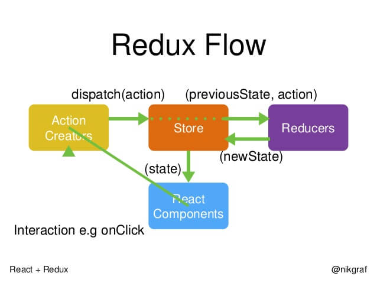
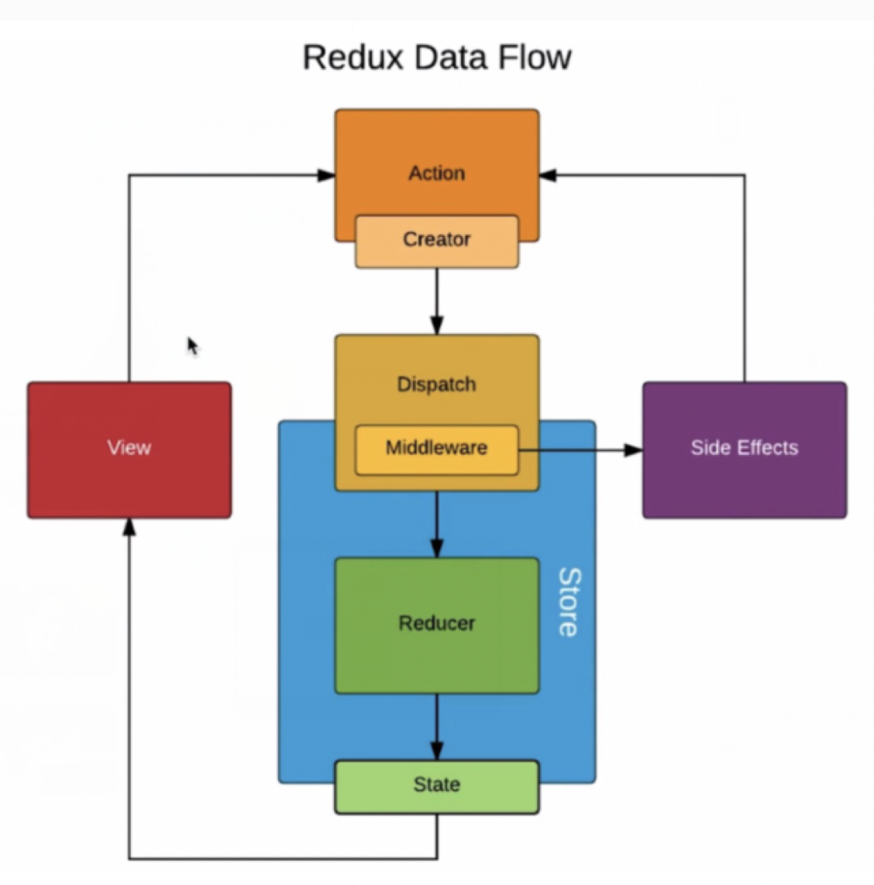
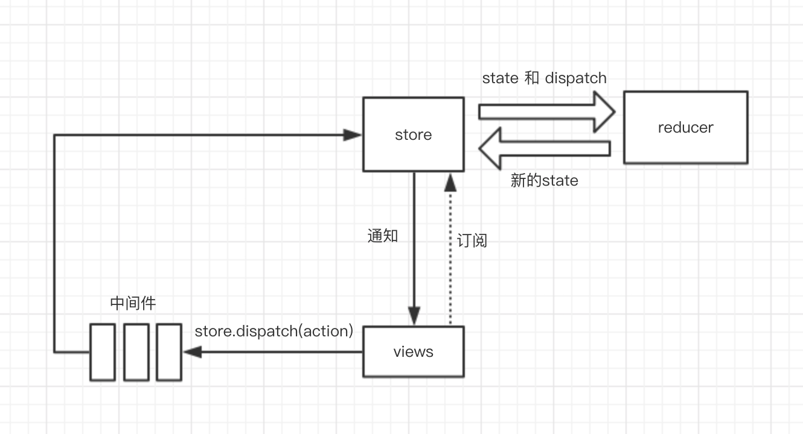

主要内容：

- 组件通信
- 为什么 React 并不推荐优先考虑使用 Context？
- Redux 原理及工作流程
- 在 React 中页面重新加载时怎样保留数据？React 数据持久化有什么实践吗？

参考资料：  
[React 入门教程](http://caibaojian.com/react/flux.html)  
[Redux 入门教程（一）：基本用法](http://www.ruanyifeng.com/blog/2016/09/redux_tutorial_part_one_basic_usages.html)  
[Redux 入门教程（二）：中间件与异步操作](http://www.ruanyifeng.com/blog/2016/09/redux_tutorial_part_two_async_operations.html)

## 组件通信

组件通信的方式有：props、Context（跨层级通信）、发布订阅模式、Redux 或 Mobx 等全局状态管理⼯具

### 父子组件

- props：父组件通过传递给子组件的 props 进行通信，子组件不能直接更新父组件传递过来的数据，而是需要通过调用父组件传递过来的方法去更新数据。

### 跨级组件

- props：父组件向子组件的子组件进行通信，可以使用 props，组件之间一层一层进行传递，但是如果层级很深就增加了复杂度，而且有些 props 可能对于某些中间组件是不需要的。
- context：context 相当于一个大容器，可以把要通信的内容放在这个容器中，这样不管嵌套多深，都可以随意取用，因此，对于跨越多层的全局数据可以使用 context 使用。例如当前认证的⽤户、主题或⾸选语⾔。

### 非嵌套关系组件

没有任何包含关系的组件，包括兄弟组件以及不在同一个父级中的非兄弟组件。

- 使用自定义事件通信（发布订阅模式）
- 通过 redux 等进行全局状态管理

## 为什么 React 并不推荐优先考虑使用 Context？

- 处于实验阶段，在后面的版本中可能有较大变化，会给升级带来较大影响和麻烦
- context 的更新需要通过 setState 触发，但是在进行跨组件访问时，如果中间的子组件通过一些方法不影响更新（比如 shouldComponentUpdate 返回 false），那么就无法保证 context 的更新一定使用 context 的子组件，因此其可靠性有待关注
- 尽管不建议在 app 根中使用 context，但是独有组件而言，由于影响范围小于 app，如果可以做到高内聚，不破坏组件树之间的依赖关系，可以考虑使用 context

简而言之，只要你能确保 Context 是可控的，使用 Context 并无大碍，甚至如果能够合理的应用，Context 其实可以给 React 组件开发带来很强大的体验。

## Redux 原理及工作流程

Redux 是一个用来管理数据状态的 UI 状态的 JS 应用工具。随着 JavaScript 单页应用（SPA）开发日趋复杂，管理不断变化的 state 日益困难。单纯的 Redux 是一个状态机，是没有 ui 呈现的，react-redux 作用是将 Redux 的状态机和 React 的 UI 呈现绑定在一起，当你 dispatch action 改变 state 的时候，会自动更新页面。

- 没有 redux，组件间的传值需要传递。redux 就是把组件之间的数据放到一个公用的存储区域 store 去存储，组件改变数据就不需要传递了，改变 store 里面的数据，其它组件会感知到改变，再来取数据。
- redux 实质：Redux = Reducer+Flux，Redux 基于简化版本的 Flux 框架，Flux 是 Facebook 开发的一个框架。
- store 是唯一的,只有 store 能够改变自己的内容,Reducer 必须是纯函数(给定固定的输入，就一定会有固定的输出，而且不会有任何副作用)
- 中间件是对 dispatch 方法的一个封装或升级（中间是指 action 和 reducer 的中间），中间件（以 redux-thunk 为例）会根据所传的参数的不同执行不同的事情，若参数是对象的话会直接传给 store，当传递给 reducer 的是一个函数的话，那么就先把函数执行结束，他会自己「吃掉」这个函数，不会传递给 reduces，防止 reduces 遇到一个函数而不知所措。redux-thunk 中间件可以让 action 创建函数先不返回一个 action 对象，而是返回一个函数，函数传递一个参数(dispatch),在函数体内进行业务逻辑的封装。

  

### Redux

Redux=Reducer+Flux.

工作流：

- step1:页面行为产生一个 action，通过 dispatch 方法发出（如果是异步请求，即延迟发出 action，则需要用到中间件）
- step2:reducer 接收到这个 action，以及当前的 state，返回一个新的 state
- step3:view 监听 reducer 里的数据变化，就会更新 view

### React-redux

单纯的 Redux 只是一个状态机，是没有 UI 呈现的，react- redux 作用是将 Redux 的状态机和 React 的 UI 呈现绑定在一起，当你 dispatch action 改变 state 的时候，会自动更新页面。

## React 数据持久化

### React 数据持久化有什么实践吗？

在 react 中，通过 redux 存储全局数据时，如果用户刷新了页面，那么通过 redux 存储的全局数据就会全部清空，此时就会有全局数据持久化存储的需求。首先想到的就是 localStorage，localStorage 是没有时间限制的数据存储，可以通过它来实现数据的持久化存储。

但是在已经使用 redux 来管理和存储全局数据的基础上，再去使用 localStorage 来读写数据，这样不仅是工作量巨大，还容易出错，此时就轮到**redux-persist**这个结合了 redux 来达到持久数据存储功能的框架出场了。**redux-persist**会将 redux 的 store 中的数据缓存到浏览器的 localStorage 中。

### 在 React 中页面重新加载时怎样保留数据？

- redux-persist：redux 数据持久化好帮手
- data.js：使用 webpack 构建的项目，可以新建文件 data.js，将数据保存在其中，跳转页面后获取
- localStorage：在进入选择地址页面之前，componentWillUnMount 时，将数据存储到 localStorage 中，每次进入页面读取 localStorage，返回或进入除了选择地址以外的页面，清掉存储的 localStorage
- history API： History API 的 pushState 函数可以给历史记录关联一个任意的可序列化 state，所以可以在路由 push 的时候将当前页面的一些信息存到 state 中，下次返回到这个页面的时候就能从 state 里面取出离开前的数据重新渲染。react-router 直接可以支持。这个方法适合一些需要临时存储的场景。

[History.pushState()-MDN](https://developer.mozilla.org/zh-CN/docs/Web/API/History/pushState)
