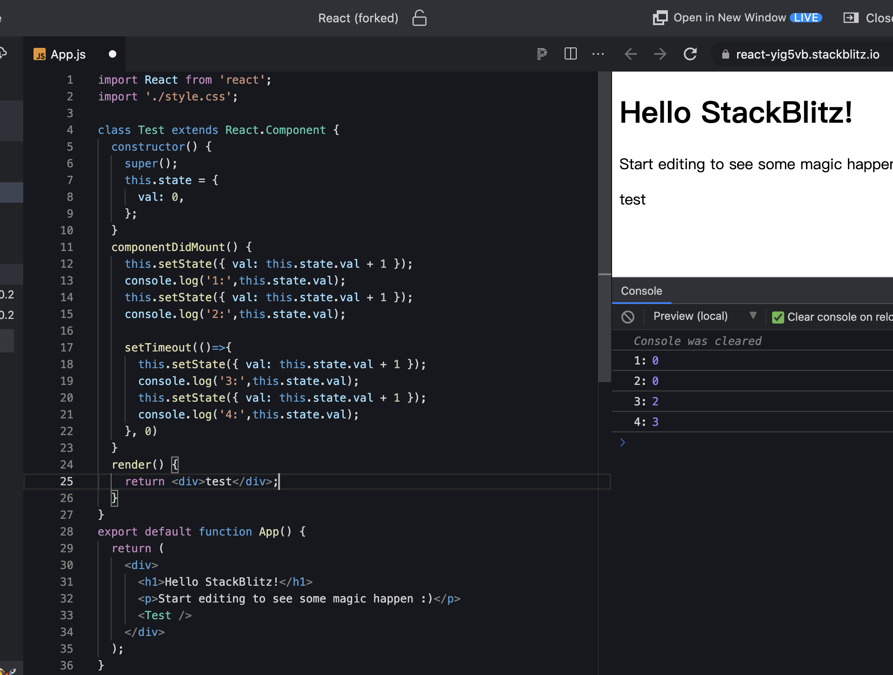
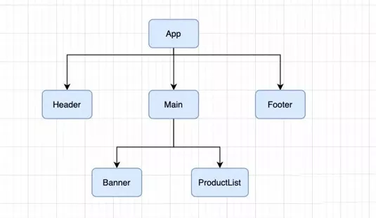
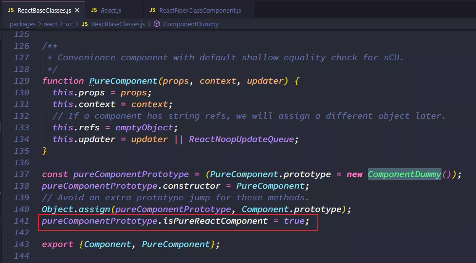
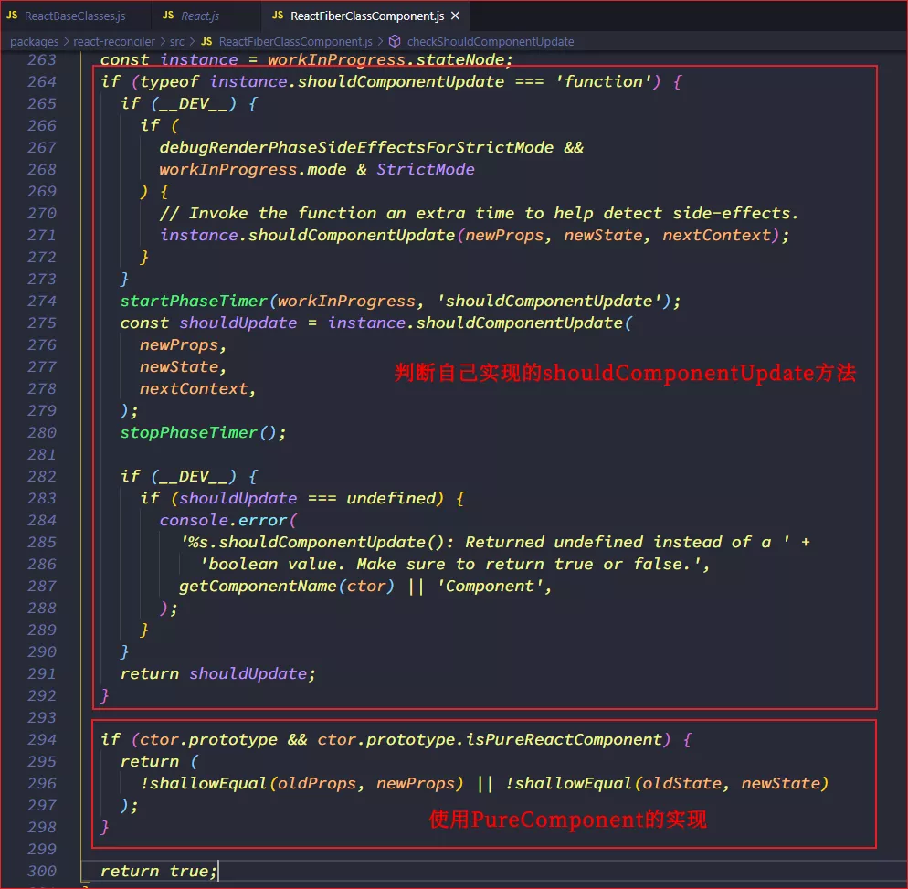
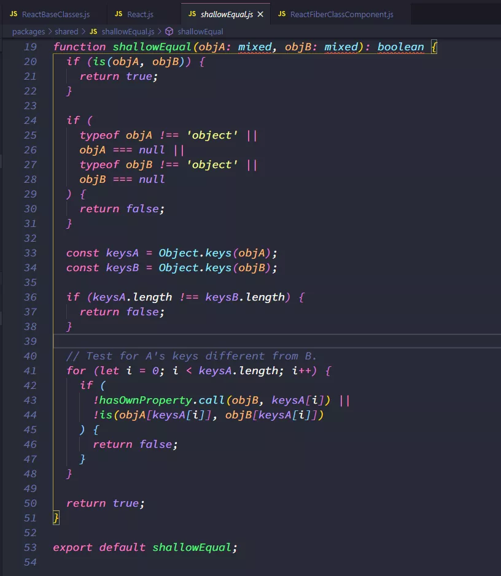

## setState 的同步和异步

### 为什么使用 setState？

开发中不能直接修改 state，这样 React 并不知道数据发生了变化，React 并没有实现类似于 Vue2 中的 Object.defineProperties 或者 Vue3 中的 Proxy 的方法来监听数据的变化。因此必须通过 setState 来告知 React 数据发生了变化

### 在组件中并没有实现 setState 方法，为何可以调用？

setState 方法是从 Component 中继承过来的。

```javascript
Component.prototype.setState = function(partialState, callback){
    ...
}
```

### 为什么 setState 设计为异步呢？

setState 设计为异步，可以显著的提高性能。

如果每次调用 setState 都进行一次更新，那么意味着 render 函数会被频繁的调用界面重新渲染，这样的效率很低。最好的方法是获取到多个更新，之后进行批量更新。如果同步更新了 setState，但还没有执行 render 函数，那么 state 和 props 不能保持同步，state 和 props 不能保持一致性，会在开发中产生很多问题。

### 如何获得异步更新后的值？

- 方法 1:setState 的回调

```javascript
// setState第二个参数是一个回调函数，会在state更新后执行
this.setState({ massage: '你好' }, () => {
  console.log(this.state.message);
});
```

- 方法 2:componentDidUpdate 生命周期函数

### setState 一定是异步的吗？

在组件生命周期或 React 合成事件中，setState 是异步的；在 setTimeout 或原生 DOM 事件中，setState 是同步的。

```javascript
setTimeout(() => {
  this.setState({ massage: '你好' }, () => {
    console.log(this.state.message);
  });
}, 0);

document.getElementById('btn').addEventListener('click', (e) => {
  this.setState({ massage: '你好' }, () => {
    console.log(this.state.message);
  });
});
```

## setState 的合并

### 数据的合并

通过 setState 去修改某个数据，是不会对其他 state 中的数据产生影响的。源码中其实是有对原对象和新对象进行合并的。

```javascript
case UpdateState:{
    return Object.assign({}, prevState, partialState)
}
```

### 多个 state 的合并

当我们的多次调用了 setState，只会生效最后一次 state

```javascript
increment(){
    // setState的本身的合并问题：当我们调用了多个setState为什么state状态只更改了一次？
    // 因为：在React源码中执行setState时，会对其进行多次setState进行合并，多次调用setState只有最后一次生成
    this.setState({count: this.state.count+1})
    this.setState({count: this.state.count+1})
    this.setState({count: this.state.count+1})
}

// setState合并时进行累加：给setState传递函数，使用前一次state中值
increment(){
    this.setState((prevState, props)=>{
        return { count: prevState.count + 1}
    })
    this.setState((prevState, props)=>{
        return { count: prevState.count + 1}
    })
    this.setState((prevState, props)=>{
        return { count: prevState.count + 1}
    })
}
```



## React 更新机制

已知 React 的渲染流程：JSX->虚拟 dom->真实 dom
而 React 的更新流程：props/state 改变->render 函数重新执行->产生新的 dom 树->新旧 dom 树进行 diff->计算出差异进行更新->更新到真实的 dom

React 在 props 或 state 发生改变时，会调用 React 的 render 方法创建一颗不同的树，React 需要基于这两颗不同的树之间的差别来判断如何有效的更新 UI。如果一个树参考另外一棵树进行完全比较更新，那么即使是最先进的算法，该算法的复杂程度是 O(n3^33)，其中 n 是树中元素的数量。如果在 React 中使用了该算法，那么展示 1000 个元素所需要执行的计算量将在十亿的量级范围。更新性能就会变得非常低效。于是 React 对这个算法进行了优化，将其优化成了 O(n)。

如何优化？

- 同层节点之间相互比较，不会垮节点比较
- 不同类型的节点，产生不同的树结构
- 开发中可以通过 key 来指定哪些节点在不同的渲染下保持稳定

### 情况 1:对比不同类型的元素

当节点为不同的元素，React 会拆卸原有的树，并且建立起新的树：

- 当一个元素从 a 标签变为 span 标签就会触发一个完整的重建流程
- 当卸载一棵树时，对应的 dom 节点也会被销毁，组件实例将执行 componentWillUnmount 方法
- 当建立一颗新的树时，对应的 dom 节点会被创建以及插入到 dom 中，组件实例将执行 componentWillMount 方法，紧接着 componentDidMount

```javascript
// 这里的代码，React就会销毁Count组件，并重新装载一个新的组件，而不会对Count复用
<div><Count/></div>
<span><Count/></span>
```

### 情况 2:对比同一类型的元素

当比对两个相同类型的 React 元素时，React 会保留 dom 节点，仅对比更新有改变的属性。如果是更新同类型的组件元素，组件会保持不变，React 会更新该组件的 props，并且调用 componentWillReceiveProps 和 componentWillUpdate 方法，下一步再调用 render 方法，diff 算法将在之前的结果以及新的结果中进行递归。

### 情况 3:对子节点进行递归

在默认条件下，当递归 dom 节点的子元素时，react 会同时遍历两个子元素的列表，当产生差异时生成一个 mutation。

```javascript
// 1.在最后插入一条数据——>前面两个比较是完全相同的，所以不会产生mutation
<ul>
<li>first</li>
<li>second</li>
</ul>
// 变更后
<ul>
<li>first</li>
<li>second</li>
<li>third</li>
</ul>
```

```javascript
// 2.在前面插入一条数据->React会对每一个子元素产生一个mutation，而不是保持<li>first</li>与<li>second</li>的不变，这种低效的比较方式会带来一定的性能问题
<ul>
<li>first</li>
<li>second</li>
</ul>
// 变更后
<ul>
<li>third</li>
<li>first</li>
<li>second</li>
</ul>
```

## React 性能优化

### key 的优化

在前面遍历列表时，总是会提示一个警告，让我们加入一个 key 属性。结合上面的例子，如果是第一种情况（在最后位置插入数据），有无 keu 意义并不大；如果是第二种情况（在前面插入数据），在没有 key 的情况下，所有的 li 都需要进行修改，如果有 key，React 会使用 key 来匹配原有树上的子元素以及最新树上的子元素。

key 的注意事项：

- key 应该是唯一的
- key 不要使用随机数（随机数在下一次 render 时，会重新生成一个数字）
- 使用 index 作为 key，对性能是没有优化的

### render 函数被调用



在上图的案例中，在 App 中增加了一个计数器的代码，当点击+1 时，会重新调用 App 的 render 函数，而当 App 的 render 函数被调用时，所有的子组件的 render 函数都会被重新调用，进行 diff 算法，性能必然是很低的。

- 事实上，很多的组件没有必须要重新 render
- 它们调用 render 应该有一个前提，就是依赖的数据（state、props）发生改变时，再调用自己的 render 方法。

如何来控制 render 方法是否被调用呢？—— 通过 shouldComponentUpdate 方法即可

### shouldComponentUpdate

shouldComponentUpdate 简称 SCU，主要作用是：控制当前类组件对象是否调用 render 方法。
这个方法接受参数，并且需要有返回值，

- 方法的参数：参数一，nextProps 修改之后，最新的 props 属性；参数二：nextState 修改之后，最新的 state 属性。
- 方法的返回值：一个 boolean 值，true 表示需要调用 render 方法，false 表示不需要调用

比如在 App 增加一个 message 属性，JSX 中并没有依赖这个 message，那么它的作用改变不应该引起重新渲染，但是通过 setState 修改 state 中的值，所以最后 render 方法还是被重新调用了。

```
// 决定当前类组件是否调用render方法
shouldComponentUpdate(nextProps, nextState){
  // 默认是return true
  // 不需要在页面上渲染则不调用render函数
  return false
}
```

### pureComponent

如果所有的类，我们都需要手动来实现 shouldComponentUpdate，那么会给开发者增加非常多的工作量。

设想下在 shouldComponentUpdate 中的各种判断目的是什么？props 或 state 中数据是否发生了改变，来决定 shouldComponentUpdate 返回 true 或 false。

事实上，react 已经考虑到了这一点，所以 react 已经默许帮我们实现好了，如何实现呢？

- 将 class 继承自 PureComponent
- 内部会进行浅层对比最新的 state 和 props，如果组件内没有依赖 props 或 state 将不会调用 render
- 解决的问题：比如某些子组件没有依赖父组件的 state 或 props，但却调用了 render 函数




### shallowEqual 方法

shallowEqual 方法就是进行浅层比较。


### 高阶组件 memo

函数式组件如何解决 render：在没有依赖 state 或 props 但却重新渲染 render 问题。
我们需要使用一个高阶组件 memo，将之前的 Header、Banner、ProductList 都通过 memo 函数进行一层包裹，Footer 没有使用 memo 函数进行包裹，最终的效果是，当 counter 发生改变时，Header、Banner、ProductList 的函数不会重新执行，而 Footer 的函数会被重新执行。

```javascript
import React, { PureComponent, memo } from 'react';
// memoHeader:没有依赖props，不会被重新调用render渲染
const MemoHeader = memo(function Header() {
  console.log('Header被调用');
  return <h2>我是header组件</h2>;
});
```
