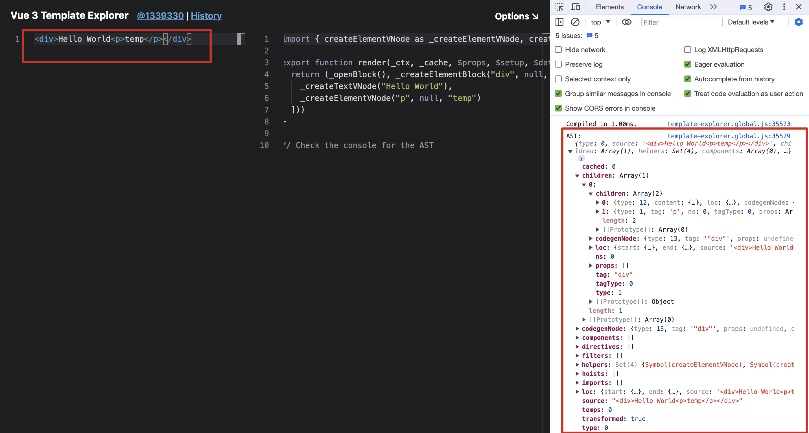
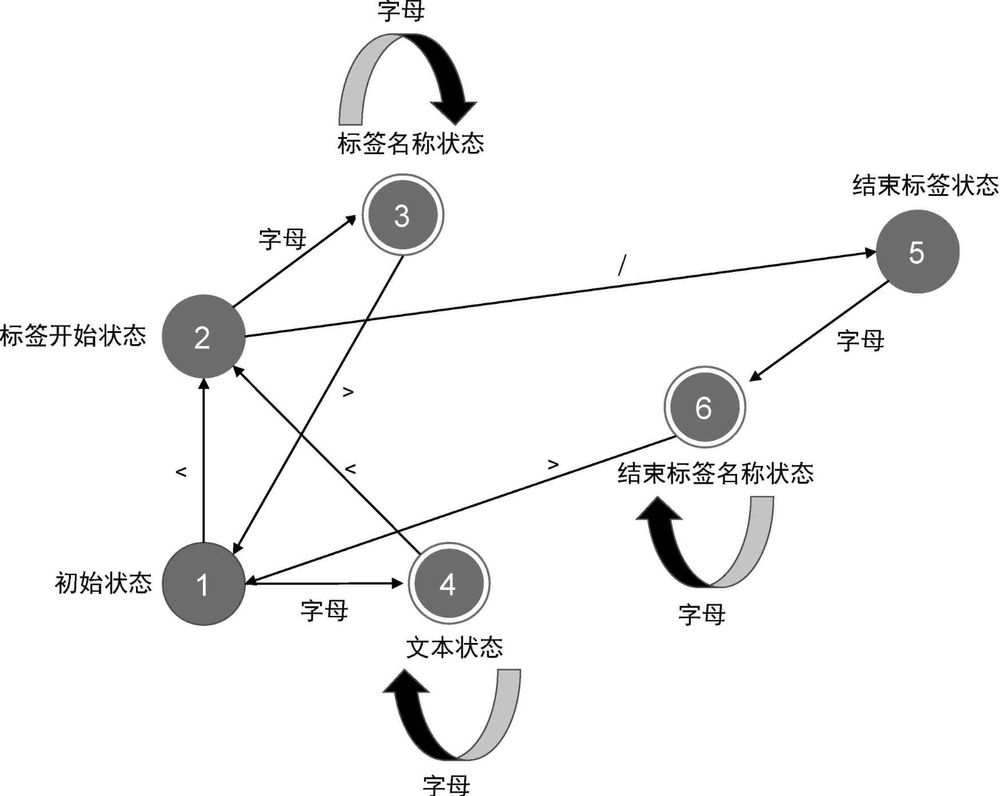
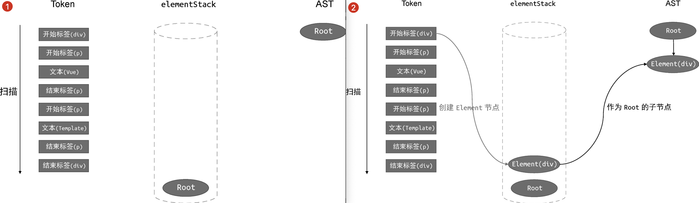
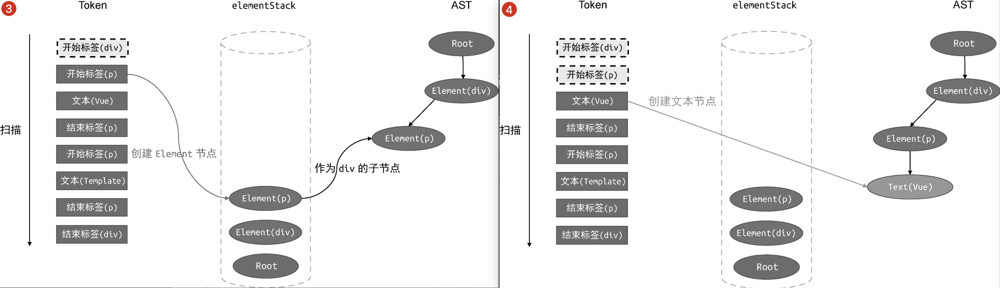
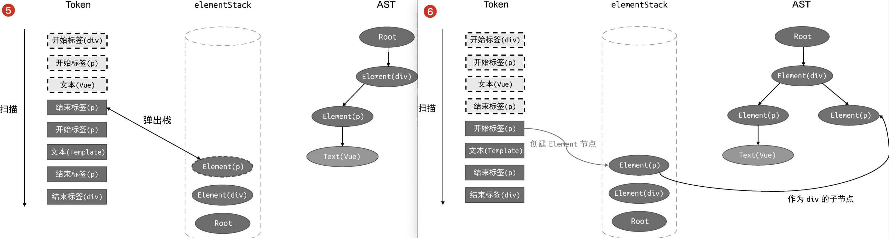
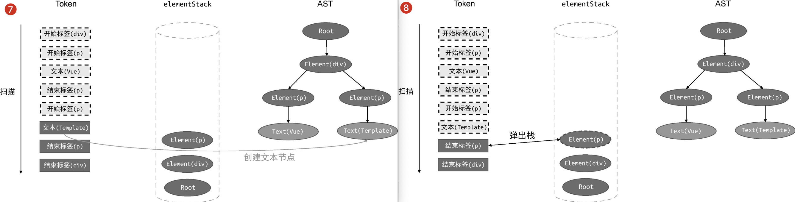
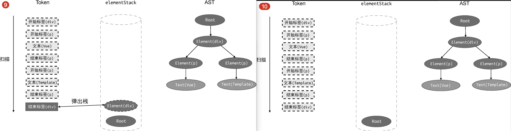
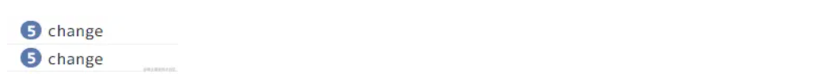
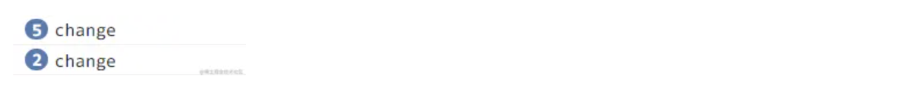

Vue.js 模版编译器的基本结构和工作流程，主要由三个部分组成：

- parser（解析器）：将模版字符串解析为模版 AST
- transformer（转换器）：将模版 AST 转换为 JavaScript AST
- generator（生成器）：根据 JavaScript AST 生成渲染函数代码

## 学习

[Vue3 源码 12: 编译过程介绍及分析模版 AST 的生成过程](https://juejin.cn/post/7083762488503697416?searchId=20240207001030F11EA332D58E985382A5#heading-5)

## parser

### 1.什么是 AST？

进入[此网站](https://template-explorer.vuejs.org/)直观查看 AST：


可以看到，所谓的 AST 其实就是一个对象，该对象可以用来描述我们传入的模版字符串。

### 2.Tokenize

通过有限状态自动机，将模版字符串解析为一个个 token，这个过程就是 tokenize 函数做的事。

:::success{title=什么是有限状态自动机？}
所谓“有限状态”，就是指有限个状态，而“自动机”意味着随着字符的输入，解析器会自动地在不同状态间迁移。
以 `<p>Vue</p>`为例：

:::

比如解析这段模版：

```js
const tokens = tokenize(`<p>Vue</p>`);
```

得到三个 token， 如下：

```js
const tokens = [
  { type: 'tag', name: 'p' }, // 开始标签
  { type: 'text', name: 'Vue' }, // 文本节点
  { type: 'tagEnd', name: 'p' }, // 结束标签
];
```

#### tokenize 函数实现

```js
01 // 定义状态机的状态
02 const State = {
03   initial: 1,    // 初始状态
04   tagOpen: 2,    // 标签开始状态
05   tagName: 3,    // 标签名称状态
06   text: 4,       // 文本状态
07   tagEnd: 5,     // 结束标签状态
08   tagEndName: 6  // 结束标签名称状态
09 }
10 // 一个辅助函数，用于判断是否是字母
11 function isAlpha(char) {
12   return char >= 'a' && char <= 'z' || char >= 'A' && char <= 'Z'
13 }
14
15 // 接收模板字符串作为参数，并将模板切割为 Token 返回
16 function tokenize(str) {
17   // 状态机的当前状态：初始状态
18   let currentState = State.initial
19   // 用于缓存字符
20   const chars = []
21   // 生成的 Token 会存储到 tokens 数组中，并作为函数的返回值返回
22   const tokens = []
23   // 使用 while 循环开启自动机，只要模板字符串没有被消费尽，自动机就会一直运行
24   while(str) {
25     // 查看第一个字符，注意，这里只是查看，没有消费该字符
26     const char = str[0]
27     // switch 语句匹配当前状态
28     switch (currentState) {
29       // 状态机当前处于初始状态
30       case State.initial:
31         // 遇到字符 <
32         if (char === '<') {
33           // 1. 状态机切换到标签开始状态
34           currentState = State.tagOpen
35           // 2. 消费字符 <
36           str = str.slice(1)
37         } else if (isAlpha(char)) {
38           // 1. 遇到字母，切换到文本状态
39           currentState = State.text
40           // 2. 将当前字母缓存到 chars 数组
41           chars.push(char)
42           // 3. 消费当前字符
43           str = str.slice(1)
44         }
45         break
46       // 状态机当前处于标签开始状态
47       case State.tagOpen:
48         if (isAlpha(char)) {
49           // 1. 遇到字母，切换到标签名称状态
50           currentState = State.tagName
51           // 2. 将当前字符缓存到 chars 数组
52           chars.push(char)
53           // 3. 消费当前字符
54           str = str.slice(1)
55         } else if (char === '/') {
56           // 1. 遇到字符 /，切换到结束标签状态
57           currentState = State.tagEnd
58           // 2. 消费字符 /
59           str = str.slice(1)
60         }
61         break
62       // 状态机当前处于标签名称状态
63       case State.tagName:
64         if (isAlpha(char)) {
65           // 1. 遇到字母，由于当前处于标签名称状态，所以不需要切换状态，
66           // 但需要将当前字符缓存到 chars 数组
67           chars.push(char)
68           // 2. 消费当前字符
69           str = str.slice(1)
70         } else if (char === '>') {
71           // 1.遇到字符 >，切换到初始状态
72           currentState = State.initial
73           // 2. 同时创建一个标签 Token，并添加到 tokens 数组中
74           // 注意，此时 chars 数组中缓存的字符就是标签名称
75           tokens.push({
76             type: 'tag',
77             name: chars.join('')
78           })
79           // 3. chars 数组的内容已经被消费，清空它
80           chars.length = 0
81           // 4. 同时消费当前字符 >
82           str = str.slice(1)
83         }
84         break
85       // 状态机当前处于文本状态
86       case State.text:
87         if (isAlpha(char)) {
88           // 1. 遇到字母，保持状态不变，但应该将当前字符缓存到 chars 数组
89           chars.push(char)
90           // 2. 消费当前字符
91           str = str.slice(1)
92         } else if (char === '<') {
93           // 1. 遇到字符 <，切换到标签开始状态
94           currentState = State.tagOpen
95           // 2. 从 文本状态 --> 标签开始状态，此时应该创建文本 Token，并添加到 tokens 数组
96           // 注意，此时 chars 数组中的字符就是文本内容
97           tokens.push({
98             type: 'text',
99             content: chars.join('')
100           })
101           // 3. chars 数组的内容已经被消费，清空它
102           chars.length = 0
103           // 4. 消费当前字符
104           str = str.slice(1)
105         }
106         break
107       // 状态机当前处于标签结束状态
108       case State.tagEnd:
109         if (isAlpha(char)) {
110           // 1. 遇到字母，切换到结束标签名称状态
111           currentState = State.tagEndName
112           // 2. 将当前字符缓存到 chars 数组
113           chars.push(char)
114           // 3. 消费当前字符
115           str = str.slice(1)
116         }
117         break
118       // 状态机当前处于结束标签名称状态
119       case State.tagEndName:
120         if (isAlpha(char)) {
121           // 1. 遇到字母，不需要切换状态，但需要将当前字符缓存到 chars 数组
122           chars.push(char)
123           // 2. 消费当前字符
124           str = str.slice(1)
125         } else if (char === '>') {
126           // 1. 遇到字符 >，切换到初始状态
127           currentState = State.initial
128           // 2. 从 结束标签名称状态 --> 初始状态，应该保存结束标签名称 Token
129           // 注意，此时 chars 数组中缓存的内容就是标签名称
130           tokens.push({
131             type: 'tagEnd',
132             name: chars.join('')
133           })
134           // 3. chars 数组的内容已经被消费，清空它
135           chars.length = 0
136           // 4. 消费当前字符
137           str = str.slice(1)
138         }
139         break
140     }
141   }
142
143   // 最后，返回 tokens
144   return tokens
145 }

```

### 3.Parser (Tokens->AST)

根据 Token 列表构建 AST 的过程，其实就是对 Token 列表进行扫描的过程。从第一个 Token 开始，顺序地扫描整个 Token 列表，直到列表中的所有 Token 处理完毕。

比如以下模版，首先先得到 token 列表，然后再构建出 AST：

```js
const tokens = tokenize(`<div><p>Vue</p><p>Template</p></div>`);
tokens = [
  { type: 'tag', name: 'div' }, // div 开始标签节点
  { type: 'tag', name: 'p' }, // p 开始标签节点
  { type: 'text', content: 'Vue' }, // 文本节点
  { type: 'tagEnd', name: 'p' }, // p 结束标签节点
  { type: 'tag', name: 'p' }, // p 开始标签节点
  { type: 'text', content: 'Template' }, // 文本节点
  { type: 'tagEnd', name: 'p' }, // p 结束标签节点
  { type: 'tagEnd', name: 'div' }, // div 结束标签节点
];
const ast = parse(`<div><p>Vue</p><p>Template</p></div>`);
ast = {
  type: 'Root', // AST 的逻辑根节点
  children: [
    {
      type: 'Element', // 模板的 div 根节点
      tag: 'div',
      children: [
        {
          type: 'Element', // div 节点的第一个子节点 p
          tag: 'p',
          children: [
            {
              type: 'Text', // p 节点的文本节点
              content: 'Vue',
            },
          ],
        },
        {
          type: 'Element', // div 节点的第二个子节点 p
          tag: 'p',
          children: [
            {
              type: 'Text', // p 节点的文本节点
              content: 'Template',
            },
          ],
        },
      ],
    },
  ],
};
```








```js
01 // parse 函数接收模板作为参数
02 function parse(str) {
03   // 首先对模板进行标记化，得到 tokens
04   const tokens = tokenize(str)
05   // 创建 Root 根节点
06   const root = {
07     type: 'Root',
08     children: []
09   }
10   // 创建 elementStack 栈，起初只有 Root 根节点
11   const elementStack = [root]
12
13   // 开启一个 while 循环扫描 tokens，直到所有 Token 都被扫描完毕为止
14   while (tokens.length) {
15     // 获取当前栈顶节点作为父节点 parent
16     const parent = elementStack[elementStack.length - 1]
17     // 当前扫描的 Token
18     const t = tokens[0]
19     switch (t.type) {
20       case 'tag':
21         // 如果当前 Token 是开始标签，则创建 Element 类型的 AST 节点
22         const elementNode = {
23           type: 'Element',
24           tag: t.name,
25           children: []
26         }
27         // 将其添加到父级节点的 children 中
28         parent.children.push(elementNode)
29         // 将当前节点压入栈
30         elementStack.push(elementNode)
31         break
32       case 'text':
33         // 如果当前 Token 是文本，则创建 Text 类型的 AST 节点
34         const textNode = {
35           type: 'Text',
36           content: t.content
37         }
38         // 将其添加到父节点的 children 中
39         parent.children.push(textNode)
40         break
41       case 'tagEnd':
42         // 遇到结束标签，将栈顶节点弹出
43         elementStack.pop()
44         break
45     }
46     // 消费已经扫描过的 token
47     tokens.shift()
48   }
49
50   // 最后返回 AST
51   return root
52 }
```

### 4.AST 的转换与插件化架构

### 5.模版 AST-> JS AST

### 6.代码生成

## 编译优化

### block 树

### v-if 与 v-for

### v-once 与 v-memo

- v-once 用于不会发生改变的动态绑定，比如动态数据是定义的常量， vue2 和 vue3 都支持
- v-memo 常配合 v-for 使用，用于渲染长列表，减小不必要的更新

#### 1.v-once

vue2 和 vue3 均支持 v-once。

v-once 命令常用于不会发生改变的动态绑定中，所对应的虚拟节点会被缓存到 cache 数组中，后续更新导致渲染函数重新执行时会优先读取缓存的数据而不会创建虚拟节点。
例如：

```js
<div v-once>{{ SOME_CONSTANT }}</div>
```

#### 2.v-memo

Vue3.2 新增了 v-memo，v-memo 所做的与我们现有的计算属性一样，只不过 v-memo 的对象是 DOM。

它可以接受一个数组，数组中存放依赖的值，数组中的依赖值都没有发生变化时，使用 v-memo 的组件/元素将跳过组件更新（包括其子树）。

假设我们有一个长列表需要渲染，并且列表项会因为用户的操作发生变化：

```vue
<template>
  <div class="memo-demo">
    <ul>
      <li
        v-for="item in 5"
        :key="item"
        :class="{ active: item === active }"
        @click="handleItemClick(item)"
        :ref="handleRefChange"
      >
        {{ item }}
      </li>
    </ul>
  </div>
</template>
<script setup>
import { ref } from 'vue';

const handleRefChange = () => {
  console.log('change');
};
const active = ref(1);
const handleItemClick = (item) => {
  active.value = item;
};
</script>
<style scoped>
.active {
  color: red;
}
</style>
```

- 上面代码中的 handleRefChange 会在每次绑定 ref 的元素更新时（包括初始化）被调用，可以在浏览器控制台中看到 li 元素初始化的时候被调用 5 次（因为遍历生成了 5 个 li 元素）
- 点击其中一个非 active 的 li 元素时，我们会发现 handleRefChange 又再次被调用了 5 次，也就是 5 个 li 元素都发生了更新（因为它们所依赖的 active 值变化了）



实际上，我们并不需要对每个 li 元素都进行更新，只需要对所依赖 item === active 的值发生更新的时候才进行更新即可。在这种情况下，我们可以使用 v-memo 指令来实现优化：

```vue
<li
  v-for="item in 5"
  :key="item"
  :class="{ active: item === active }"
  @click="handleItemClick(item)"
  v-memo="[item === active]"
  :ref="handleRefChange"
>
    {{ item }}
  </li>
```

当使用了 v-meomo 指令之后，我们就会发现每次点击非 active 的 li 元素的之后，handleRefChange 只被调用 2 次，因为只有点击之前「active 的 li 元素」和「被点击的 li 元素」所依赖的 item === active 值会发现变化：



通过 v-memo 指令，我们可以在更新内容很多时减少一些不必要的更新，从而对性能进行优化。

## 解析器
