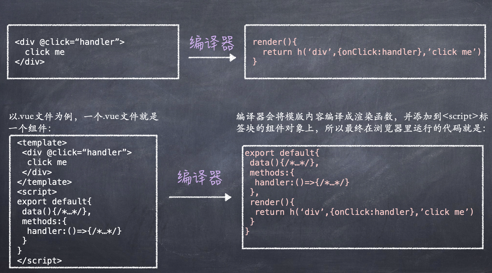

## 文档

#### 官方文档

风格指南：https://vuejs.org/style-guide/
性能：https://vuejs.org/guide/best-practices/performance.html#overview
安全：https://vuejs.org/guide/best-practices/security.html
访问性：https://vuejs.org/guide/best-practices/accessibility.html
发布：https://vuejs.org/guide/best-practices/production-deployment.html

#### 网友网站

[Vue3 源码剖析](https://www.yangyitao.com/vue3/)

## 命令式和声明式

- 命令式：更关注过程
- 声明式：更关注结果

声明式的更新性能消耗 = 找出差异的性能消耗 + 直接修改的性能消耗。为了在 减小开发者心智负担 、更新页面性能 和 可维护性 三者之间进行权衡选择，框架选择声明式。

而在最小化找出差异的性能消耗这方面，虚拟 DOM 是一个很好的选择。

- 编译时：HTML 字符串 -> 操作 dom 的 js 代码
- 运行时：虚拟 dom -> 操作 dom 的 js 代码
- 编译时+运行时：HTML 字符串 -> 虚拟 dom -> 操作 dom 的 js 代码

Vue3 是一个编译时+运行时的框架。

## 框架设计核心要素

### 1.提升开发体验

- 比如提供良好的警告信息

### 2.控制框架代码的体积

- 开发环境能提供良好告警信息，但不会增加生产环境代码体积（配合变量\_\_DEV\_\_）

### 3.Tree-shaking

- 构建过程会消除永远不会被执行的代码
- 会产生副作用的函数不会被移除，框架合理使用变量/\*#\_\_PURE\_\_\*/进行注释
- 不过只有 ESM 模式下才能 Tree-Shaking，因为 Tree-Shaking 依赖 ESM 的静态结构

### 4.需求场景不同，构建产物不同

- 用户可以直接在 HTML 页面使用`<script>`标签引入框架 -> 构建产物（即 vue.global.js）需要是 `IIFE` （Invoked Function Expression）格式，即立即调用的函数表达式
- 目前主流浏览器对原生 ESM 的支持不错，能够使用`<script>`标签引入`IIFE`格式的资源，也可以用`<script type="module">标签`引入 `ESM` 格式的资源
- 用于服务端渲染时，Vue.js 的代码是在 Node.js 环境中运行的，就需要可以在 Nodejs 中通过 require 语句引用资源，此时模块格式是 CommonJS，简称`cjs`

### 5.特性开关

- 比如`__VUE_OPTIONS_API__` 开关用于设置是否使用组件选项 API

  ```js
  // vue2
  export default {
    data(){},
    computed:{}
  }
  //vue3
  export default{
    setup(){
      const count = ref(0)
      const doubleCount = computed(()=>count.value*2)
    }
  }
  ```

### 6.错误处理

- a、提供了 registerErrorHandler 函数用于注册错误处理程序，callWithErrorhandling 函数内部捕获错误，把错误传递给用户注册的错误处理程序。
- b、注册统一的错误处理函数：

```js
import App from 'App.vue';
const app = createApp(App);
app.config.errorHandler = () => {
  // 错误处理程序
};
```

### 7.TS 类型支持

- 使用 TS 编写代码与对 TS 类型支持友好是两回事，后者需要编写更多代码完善类型支持

## Vue3 的设计思路

### 组件本质

虚拟 dom 是用来描述真实 dom 的普通 JS 对象，渲染器负责将虚拟 dom 渲染为真实 dom 对象。而<u>组件就是一组 DOM 元素的封装</u>，这组 DOM 元素就是组件要渲染的内容。

可以定义一个函数来代表组件，也可以使用一个 JS 对象来表达组件。

#### 1.函数代表组件

可以定义一个函数来代表组件，函数的返回值是虚拟 dom，代表组件要渲染的内容。另外，函数代表的组件用虚拟 dom 来描述，用其 tag 属性存储组件函数。

```js
const MyComponent = function(){
  return {
    tag:'div',
    props:{
      onClick:()=>alert('hello')
    }
    children:'click me'
  }
}

const vnode = {
  tag: MyComponent    // 此时的tag属性不是标签名称（div、span等），而是组件函数
}
```

#### 2.用一个 JS 对象来表达组件

用一个 JS 对象来表达组件，这个对象有一个 render 函数，其返回值代表组件要渲染的内容。此时 tag 属性值为 `object`

```js
const MyComponent = {
  render(){
    return {
      tag:'div',
      props:{
        onClick:()=>alert('hello')
      }
      children:'click me'
    }
  }
}

const vnode = {
  tag: 'object'
}
```

### vue.js 渲染页面的流程

编译器的作用是将模版编译为渲染函数：



渲染器的作用是把虚拟 DOM 对象渲染为真实 DOM 元素。它的工作原理是递归地遍历虚拟 DOM 对象，并调用原生 DOM API 来完成真实 DOM 的创建。渲染器的精髓在于后续的更新，它会通过 Diff 算法找出变更点，并且只会更新需要更新的内容。

无论是使用模版还是直接手写渲染函数，对于一个组件来说，它要渲染的内容最终都是通过渲染函数产生的，然后渲染器再把渲染函数返回的虚拟 DOM 渲染为真实 DOM，这就是模版的工作原理，也是 Vue.js 渲染页面的流程。
