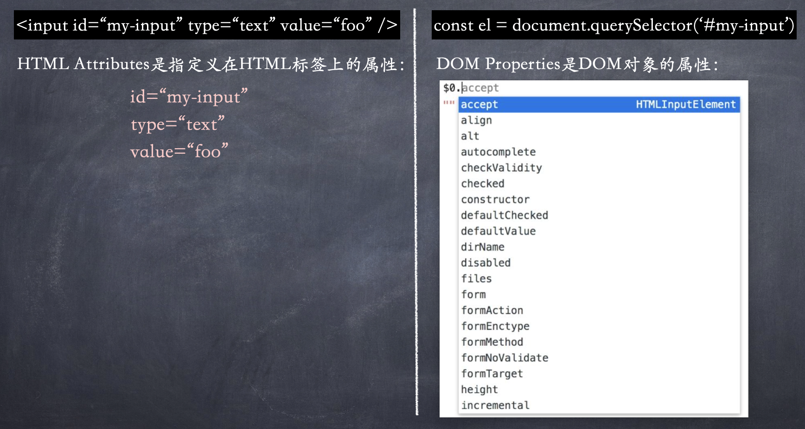
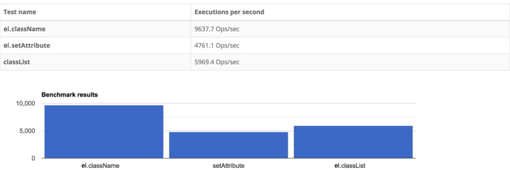
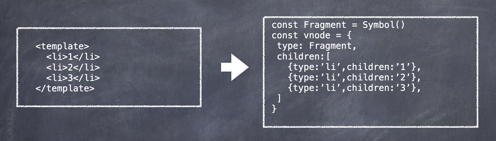
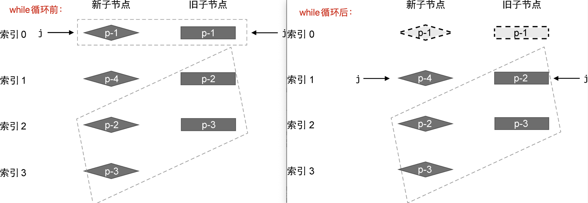
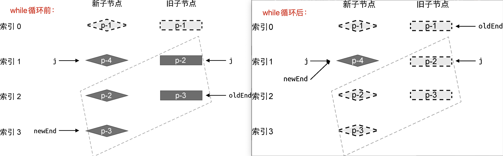
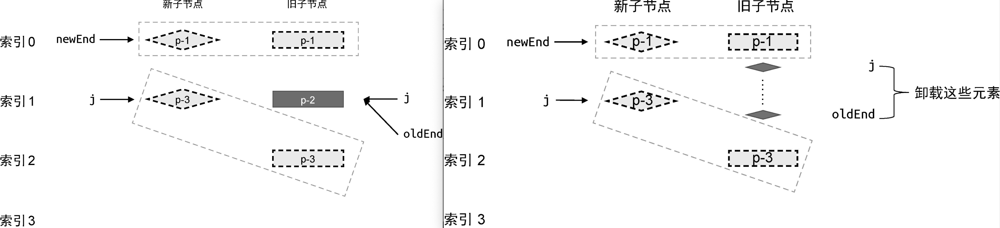
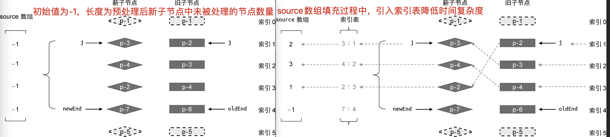
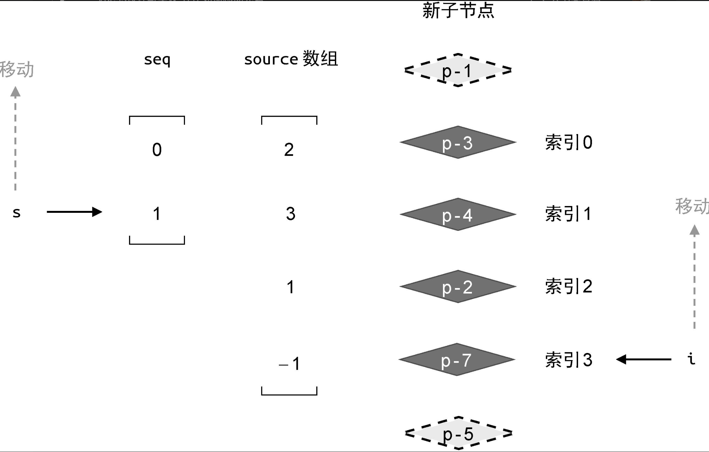

## 渲染器与响应系统

### 渲染器概念

- 渲染器英文是 renderer，不要将 renderer 和 render 弄混了，前者代表渲染器，后者是动词，表示“渲染”。
- 渲染器的作用是将虚拟 DOM 渲染为特定平台上的真实元素。在浏览器平台上，就是将虚拟 DOM 渲染为真实 DOM 元素。
- 渲染器本质上是一个对象，内部主要三个方法 render、hydrate、createApp：
  - render 主要处理渲染逻辑
  - hydrate 主要处理服务端渲染逻辑
  - createApp 就是创建 vue 实例的方法
  ```js
  function createRenderer(){
    function render(vnode, container){ ... }
    function hydrate(vnode, container){ ... }
    return {render, hydrate}
  }
  const renderer = createRenderer();
  renderer.render(vnode, document.querySelector('#app'));
  ```

### 跨平台

在浏览器平台上，渲染器可以利用 DOM API 完成 DOM 元素的创建、修改和删除。
为了让渲染器不直接依赖浏览器平台特有的 API，将这些用来创建、修改和删除元素的操作（浏览器特定的 API）抽象成可配置的对象，就可以实现渲染器的跨平台能力。

```js
// 不同平台，options的值不一样
function createRenderer(options){
  // 通过options得到操作DOM的API，在patch方法中可以用到这些方法
  const {createElement, insert, setElementText} = options
  function patch(n1, n2, container){
    if(!n1){  // n1不存在，意味着挂载，则调用mountElement函数完成挂载
      mountElement(n2,container)
    }else{
      // n1存在，意味着打补丁（更新）
    }
  }
  function render(vnode, container){ ... }
  return {render}
}


const renderer = createRenderer({
  createElement(tag){ //创建元素
    return document.createElement(tag)
  },
  insert(el,parent, anchor=null){  //插入元素
    parent.insertBefore(el, anchor)
  },
  setElementText(el,text){  //用于设置元素的文本节点
    el.textContent=text
  }
});
renderer.render(vnode, document.querySelector('#app'));

```

### 渲染器与响应系统关系

渲染器不仅能够渲染真实 DOM 元素，还是框架跨平台能力的关键。

渲染静态字符串：

```js
let count = 1;
renderer(`<h1>${count}</h1>`, document.getElementById('app'));
```

结合响应系统，自动调用渲染器完成页面的渲染和更新：

```js
const count = ref(1)
effect((=>{
  renderer(`<h1>${count}</h1>`, document.getElementById('app'))
}))
count.value++
```

在上述代码中，首先定义了一个响应式数据 count，它是一个 ref，然后在副作用函数内调用 renderer 函数执行渲染。副作用函数执行完毕后，会与响应式数据建立响应数据。当我们修改 count.value 的值时，副作用函数会重新执行，完成重新渲染。

## 渲染器核心功能：挂载与更新

### HTML Attributes 与 DOM Properties



- 1.很多（并非所有）HTML Attributes 都有与之对应的 DOM Properties。
- 2.<u>HTML Attributes 的作用是设置与之对应的 DOM Properties 的初始值。</u>一旦值改变，DOM Properties 始终存储着当前值，而通过 getAttribute 函数得到的仍然是初始值：
  ```js
  <input value="foo" />; // 假设input标签初识值是“foo”，后续用户修改了文本框的内容，为bar
  el.getAttribute('value'); // 仍然输出foo
  el.value; // 输出bar
  el.defaultValue; // 用defaultValue来访问初始值
  ```
- 3.一个 HTML Attributes 可能关联多个 DOM Properties：
  ```html
  <input value="foo" />
  <!-- value="foo"与el.value和el.defaultValue都有关联 -->
  ```

### 设置属性的方式

#### 1.浏览器中的解析

对于普通的 HTML 文件来说，当浏览器解析 HTML 代码后，会自动分析 HTML Attributes 并设置合适的 DOM Properties。但用户编写在 Vue 中的模版不会被浏览器解析，需要先解析成虚拟 DOM。

#### 2.框架中的解析

HTML Attributes 与 DOM Properties 会影响 DOM 属性的添加方式。为元素设置属性的方式有两种：

- setAttribute（注意这个方法会把值字符串化，比如 el.setAttribute('disabled',false)等同于 el.setAttribute('disabled','false')，实际效果就是禁用了）
- 直接通过元素的 DOM Properties 来设置

:::success{title=最佳实践}

- 优先设置元素的 DOM Properties，同时对布尔类型的 DOM Properties 做特殊处理（即当设置的值为空字符串时，将其矫正为布尔值 true）
- 对于特殊属性特殊处理，比如 input 标签的 form 属性是只读的，只能用 setAttribute 来设置（要设置的属性没有对应的 DOM Properties，也用 setAttribute）
  :::

```js
01 function shouldSetAsProps(el, key, value) {
02   // 特殊处理
03   if (key === 'form' && el.tagName === 'INPUT') return false
04   // 兜底
05   return key in el
06 }
07
08 function mountElement(vnode, container) {
09   const el = createElement(vnode.type)
10   // 省略 children 的处理
11
12   if (vnode.props) {
13     for (const key in vnode.props) {
14       const value = vnode.props[key]
15       // 使用 shouldSetAsProps 函数判断是否应该作为 DOM Properties 设置
16       if (shouldSetAsProps(el, key, value)) {
17         const type = typeof el[key]
18         if (type === 'boolean' && value === '') {
19           el[key] = true
20         } else {
21           el[key] = value
22         }
23       } else {
24         el.setAttribute(key, value)  // 如果要设置的属性没有对应的 DOM Properties，则使用setAttribute设置
25       }
26     }
27   }
28
29   insert(el, container)
30 }
```

### class 属性与 style 属性

Vue 对 class 和 style 属性做了增强，允许对象类型作为值。

#### 1.设置类名的方式

- class 为字符串值
- class 为对象值
- class 为数组（元素为字符串或对象）

```js
<p class="foo bar"></p>

<p :class="cls"></p>
const cls = {foo: true, bar:false}

<p :class="arr"></p>
const arr = ['foo bar', {baz: true}]
```

#### 2.设置 class 的方法

在浏览器中为一个元素设置 class 有三种方式，即：

- setAttribute
- el.className
- el.classList

下图给出了三种方式为元素设置 1000 次 class 的性能，结论表示：<u>el.className 性能最优</u>。


### 事件处理

### 卸载

### Fragment

Fragment（片段）是 Vue3 新增的一个 vnode 类型。在 Vue2 中，组件的模版不允许存在多个根节点，但 Vue3 支持多个，是因为引入了 Fragment 概念，它是一个虚拟节点，本身不渲染任何内容，虚拟器只会渲染 Fragment 的子节点。注意 unmount 也需要支持 Fragment 类型的虚拟节点的卸载。


```js
function patch(n1, n2, container) {
  if (n1 && n1.type !== n2.type) {
    unmount(n1);
    n1 = null;
  }
  if (n2.type === Fragment) { // 处理Fragment类型的vnode
    if (!n1) { // 如果旧vnode不存在，只需要将Fragment的children逐个挂载即可
      n2.children.forEach((c) => patch(null, c, container));
    } else { // 如果旧vnode存在，则只需要更新Fragment的children即可
      patchChildren(n1, n2, container);
    }
  }else if(type === 'string'){...}
}
```

```js
function unmount(vnode) {
  // 在卸载时，如果卸载的 vnode 类型为 Fragment，则需要卸载其 children
  if (vnode.type === Fragment) {
    vnode.children.forEach((c) => unmount(c));
    return;
  }
  const parent = vnode.el.parentNode;
  if (parent) {
    parent.removeChild(vnode.el);
  }
}
```

## 简单 Diff

## 双端 Diff

简单 diff 算法能够实现 dom 节点的复用，但有的时候会做一些没必要的移动。双端 diff 算法是从两端进行对比，需要 4 个指针，分别指向新旧两个节点的头尾。

## 快速 Diff

Vue 2 中用的 diff 算法是双端 Diff。Vue3 中用的 diff 算法是快速 Diff 算法。

### 纯文本 Diff 算法

快速 Diff 算法借鉴了纯文本 Diff 算法中的对两段文本进行预处理步骤。

在对两段文本进行 Diff 之前，先进行全等比较，全等则不进入核心 diff 的步骤：

```js
if (text1 === text2) return;
```


### step1: 前置节点处理

对于前置节点，建立索引 j，初始值为 0，用来指向两组子节点的开头：


然后开启一个 while 循环查找所有相同的前置节点，并调用 patch 函数进行打补丁，直到遇到不相同的节点为止：

```js
01 function patchKeyedChildren(n1, n2, container) {
02   const newChildren = n2.children
03   const oldChildren = n1.children
04   // 处理相同的前置节点
05   // 索引 j 指向新旧两组子节点的开头
06   let j = 0
07   let oldVNode = oldChildren[j]
08   let newVNode = newChildren[j]
09   // while 循环向后遍历，直到遇到拥有不同 key 值的节点为止
10   while (oldVNode.key === newVNode.key) {
11     // 调用 patch 函数进行更新
12     patch(oldVNode, newVNode, container)
13     // 更新索引 j，让其递增
14     j++
15     oldVNode = oldChildren[j]
16     newVNode = newChildren[j]
17   }
19 }
```

当 while 循环终止时，图中的例子，索引 j 的值为 1。

### step2: 后置节点处理

处理相同的后置节点：由于新旧两组子节点的数量可能不同，所以需要两个索引 newEnd 和 oldEnd，分别指向新旧两组子节点中的最后一个节点。


然后再开启一个 while 循环，并从后向前遍历这两组子节点，直到遇到 key 值不同的节点为止，在 while 循环内，同样需要调用 patch 函数进行打补丁，然后递减两个索引 oldEnd、newEnd 的值：

```js
01 function patchKeyedChildren(n1, n2, container) {
02   const newChildren = n2.children
03   const oldChildren = n1.children
04   // 1.更新相同的前置节点
05   let j = 0
06   let oldVNode = oldChildren[j]
07   let newVNode = newChildren[j]
08   while (oldVNode.key === newVNode.key) {
09     patch(oldVNode, newVNode, container)
10     j++
11     oldVNode = oldChildren[j]
12     newVNode = newChildren[j]
13   }
14
15   // 2.更新相同的后置节点
16   // 索引 oldEnd 指向旧的一组子节点的最后一个节点
17   let oldEnd = oldChildren.length - 1
18   // 索引 newEnd 指向新的一组子节点的最后一个节点
19   let newEnd = newChildren.length - 1
20
21   oldVNode = oldChildren[oldEnd]
22   newVNode = newChildren[newEnd]
23
24   // while 循环从后向前遍历，直到遇到拥有不同 key 值的节点为止
25   while (oldVNode.key === newVNode.key) {
26     // 调用 patch 函数进行更新
27     patch(oldVNode, newVNode, container)
28     // 递减 oldEnd 和 nextEnd
29     oldEnd--
30     newEnd--
31     oldVNode = oldChildren[oldEnd]
32     newVNode = newChildren[newEnd]
33   }
34
35 }
```

### step3: 挂载新增节点

:::success{title=判断}
oldEnd < j : 代表在预处理过程中，所有旧子节点都处理完毕了
newEnd >= j : 代表预处理过程之后，在新的一组子节点中存在未被处理的节点，这些节点就是新增节点
:::

```js
01 function patchKeyedChildren(n1, n2, container) {
02   const newChildren = n2.children
03   const oldChildren = n1.children
04   // 更新相同的前置节点
05   // 省略部分代码
06
07   // 更新相同的后置节点
08   // 省略部分代码
09
10   // 预处理完毕后，如果满足如下条件，则说明从 j --> newEnd 之间的节点应作为新节点插入
11   if (j > oldEnd && j <= newEnd) {
12     // 锚点的索引
13     const anchorIndex = newEnd + 1
14     // 锚点元素
15     const anchor = anchorIndex < newChildren.length ? newChildren[anchorIndex].el : null
16     // 采用 while 循环，调用 patch 函数逐个挂载新增节点
17     while (j <= newEnd) {
18       patch(null, newChildren[j++], container, anchor)
19     }
20   }
21
22 }
```

### step4: 删除节点



```js
01 function patchKeyedChildren(n1, n2, container) {
02   const newChildren = n2.children
03   const oldChildren = n1.children
04   // 更新相同的前置节点
05   // 省略部分代码
06
07   // 更新相同的后置节点
08   // 省略部分代码
09
10   if (j > oldEnd && j <= newEnd) {
11     // 省略部分代码
12   } else if (j > newEnd && j <= oldEnd) {
13     // j -> oldEnd 之间的节点应该被卸载
14     while (j <= oldEnd) {
15       unmount(oldChildren[j++])
16     }
17   }
18
19 }
```

### step5: 判断是否需要移动 dom 节点

经过预处理后，无论是新的一组子节点，还是旧的一组子节点，都有部分节点未经处理。这时就需要我们进一步处理。怎么处理呢？其实无论是简单 Diff 算法，还是双端 Diff 算法，抑或本章介绍的快速 Diff 算法，它们都遵循同样的处理规则：

- 判断是否有节点需要移动，以及应该如何移动
- 找出那些需要被添加或移除的节点

经过预处理后节点存在一种情况，即不满足下列任意一个条件，就需要考虑是否需要对节点进行移动：

- j > oldEnd && j <= newEnd；
- j > newEnd && j <= oldEnd；

#### 1.source 数组

需要构造一个数组 source，用来存储新的一组子节点中的节点在旧的一组子节点中的位置索引，后面将会使用它计算出一个最长递增子序列，并用于辅助完成 DOM 移动的操作。

:::success{title=数组}

- 长度等于新的一组子节点在经过预处理之后剩余未处理节点的数量
- source 中每个元素的初始值都是 -1
- 值为新的子节点在旧子节点中的位置索引
  :::



#### 2.索引表`keyIndex`

:::success{title=填充数组的算法优化}

常规操作下，我们可以开启一个嵌套的 for 循环，外层循环遍历旧节点，内部循环遍历新节点，目的就是查找相同 key 值的新节点，依次来填充 source 数组的值。但这样时间复杂度就很高，为`O(n1*n2)`，为了优化算法，我们可以引入一个索引表`keyIndex`，用来存储节点的 key 和节点位置索引之间的映射，可以将时间复杂度降至`O(n)`。

具体操作：

- 使用两个平级的 for 循环，第一个 for 循环构建索引表
- 第二个 for 循环用来遍历旧的一组子节点
  :::

#### 3.判断是否需要移动 DOM

:::success{title=判断是否需要移动 DOM}
在简单 Diff 算法中提过，如果在遍历过程中遇到的索引值呈现递增趋势，则说明不需要移动节点，反之则需要。
新增三个变量：

- moved：代表是否需要移动节点
- pos：代表遍历旧的一组子节点的过程中遇到的最大索引值 k
- patched：数量标识，代表已经更新过的节点数量，patched 值应该小于新的一组子节点中需要更新的节点数量

在第二个 for 循环中，比较 moved 和 pos 两个值来判断是否需要移动。
:::

```js
// 1.构造source数组
const count = newEnd - j + 1;
const source = new Array(count).fill(-1);

// 2.构建索引表keyIndex
const keyIndex = {};
let newStart = j;
let oldStart = j;
for (let i = newStart; i <= newEnd; i++) {
  keyIndex[newChildren[i].key] = i;
}

// 3.判断是否需要移动DOM
let patched = 0;
let moved = false;
let pos = 0;
for (let i = oldStart; i <= oldEnd; i++) {
  oldVNode = oldChildren[i];
  if (patched <= count) {
    const k = keyIndex[oldVNode.key];
    if (typeof k !== 'undefined') {
      newVNode = newChildren[i];
      patch(oldVNode, newVNode, container);
      patched++; // 每更新一个节点，都将patched变量+1
      source[k - newStart] = i;
      if (k < pos) {
        moved = true;
      } else {
        pos = k;
      }
    } else {
      unmount(oldVNode);
    }
  } else {
    // 如果更新过的节点数量大于需要更新的节点数量，则卸载多余的节点
    unmount(oldVNode);
  }
}
```

### step6. 💥 最长递增子序列

在之前的步骤中已经实现了两个目标：

- 根据 moved 的值判断是否需要进行 DOM 移动操作
- 构建 source 数组，数组存储着新的一组子节点中的节点在旧的一组子节点中的位置

接下来需要根据 source 数组计算出一个**最长递增子序列**，从而知道不需要移动的 DOM 节点。

#### Vue 框架中的 getSequence

Vue3.0 的源码 👉 [vuejs/core/renderer.ts](https://github.com/vuejs/core/blob/540e26f49c09edf09b6a60ac2a978fdec52686bf/packages/runtime-core/src/renderer.ts)

Vue3 中用 getSequence 函数来计算数组的最长递增子序列，不过返回值不是跟力扣题一样返回长度，而是返回最长递增子序列中的元素在 source 数组中的位置索引。
比如 source 数组[2,3,1,-1]中的最长递增子序列是[2,3]，但 getSequence 函数返回的是[0,1]，因为返回的是元素在数组中的位置索引。

```js
01 function getSequence(arr) {
02   const p = arr.slice()
03   const result = [0]
04   let i, j, u, v, c
05   const len = arr.length
06   for (i = 0; i < len; i++) {
07     const arrI = arr[i]
08     if (arrI !== 0) {
09       j = result[result.length - 1]
10       if (arr[j] < arrI) {
11         p[i] = j
12         result.push(i)
13         continue
14       }
15       u = 0
16       v = result.length - 1
17       while (u < v) {
18         c = ((u + v) / 2) | 0
19         if (arr[result[c]] < arrI) {
20           u = c + 1
21         } else {
22           v = c
23         }
24       }
25       if (arrI < arr[result[u]]) {
26         if (u > 0) {
27           p[i] = result[u - 1]
28         }
29         result[u] = i
30       }
31     }
32   }
33   u = result.length
34   v = result[u - 1]
35   while (u-- > 0) {
36     result[u] = v
37     v = p[v]
38   }
39   return result
40 }
```

### step7: 💥 移动节点

为了完成节点的移动，需要创建两个索引值 i 和 s：

- 索引 i 指向新的一组子节点中的最后一个节点
- 索引 s 指向最长递增子序列中的最后一个元素



```js
01 if (moved) {
02   const seq = lis(sources)
03
04   // s 指向最长递增子序列的最后一个元素
05   let s = seq.length - 1
06   let i = count - 1
07   for (i; i >= 0; i--) {
08     if (source[i] === -1) {
09       // 省略部分代码
10     } else if (i !== seq[s]) {
11       // 说明该节点需要移动
12       // 该节点在新的一组子节点中的真实位置索引
13       const pos = i + newStart
14       const newVNode = newChildren[pos]
15       // 该节点的下一个节点的位置索引
16       const nextPos = pos + 1
17       // 锚点
18       const anchor = nextPos < newChildren.length
19         ? newChildren[nextPos].el
20         : null
21       // 移动
22       insert(newVNode.el, container, anchor)
23     } else {
24       // 当 i === seq[s] 时，说明该位置的节点不需要移动
25       // 并让 s 指向下一个位置
26       s--
27     }
28   }
29 }
```

### 函数结构

```js
function patchKeyedChildren(n1, n2, container) {
  // 1.更新相同的前置节点

  // 2.更新相同的后置节点
  if (j > oldEnd && j <= newEnd) {
    // 3.挂载新增节点
  } else if (j > newEnd && j <= oldEnd) {
    // 4.删除节点
  } else {
    // 5.判断是否需要移动DOM
    for (let i = oldStart; i <= oldEnd; i++) {}

    if (moved) {
      // 6.如果moved为true，则需要进行DOM移动操作
    }
  }
}
```
