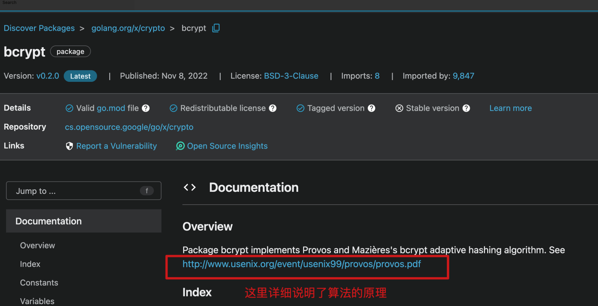
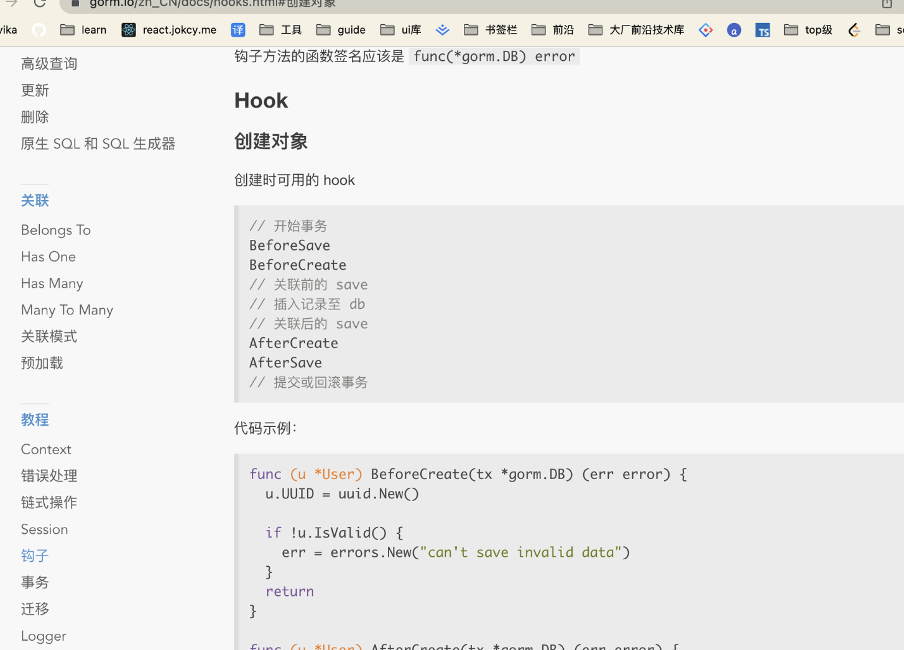

一般为了安全起见，用户的密码都是以秘文形式存储在数据库里的。对于加密形式我们可以参考这个电子书 [astaxie /build-web-application-with-golang / 9.5 存储密码](https://github.com/astaxie/build-web-application-with-golang/blob/master/zh/09.5.md)。

这里推荐两种方案：

- bcrypt 方案：https://pkg.go.dev/golang.org/x/crypto/bcrypt （bcrypt 是比较通用方案，一般的语言库都有这个方案）
  

- **scrypt 方案（文章的专家方案）**：https://pkg.go.dev/golang.org/x/crypto/scrypt
  这个方案目前在区块链领域用的比较多，这个算法目前几乎是不可能被破解的，但目前中文资料比较少

我们这里采用第二种方案，这是内置库，也不用安装。

# 思路

- 首先我们先写一个加密的功能函数
- 加密后的数据需要存入数据库（这里可以用到[gorm 的钩子函数](https://gorm.io/docs/hooks.html)-beforeSave，或者直接在相应的需要存数据库的功能函数里执行加密函数）

# 一、加密函数

打开 model/User.go 文件，增加 ScryptPw 函数：

```js
import （
"encoding/base64"
"golang.org/x/crypto/scrypt"  // 内置库，会自动引入
"log"
）

// 密码加密
func ScryptPw(password string) string {
	const KeyLen = 10
	salt := make([]byte, 8)
	salt = []byte{12, 32, 4, 6, 66, 22, 222, 11}

	HashPw, err := scrypt.Key([]byte(password), salt, 16384, 8, 1, KeyLen)
	if err != nil {
		log.Fatal(err)
	}
	fpw := base64.StdEncoding.EncodeToString(HashPw)
	return fpw
}
```

# 二、添加加密逻辑

## 方法一 2：在存入密码的函数里添加加密逻辑

修改 model/User.go 文件的新增用户函数

```js
// 新增用户
func CreateUser(data *User) int {
+	  data.Password = ScryptPw(data.Password)
	  err := db.Create(&data).Error
	  if err != nil {
	  	return errmsg.ERROR // 500
	  }
	  return errmsg.SUCCESS
}
```

## 方法 2：使用 gorm 的钩子函数

golang 不是面向对象的编程语言，所以没有类的概念，也没有继承的概念，但是 golang 可以利用结构体来实现类似的概念。


### 修改 model/User.go 文件的新增用户函数并编写 BeforeSave 函数

```js
// 新增用户
func CreateUser(data *User) int {
+ 	//data.Password = ScryptPw(data.Password)
	err := db.Create(&data).Error
	if err != nil {
		return errmsg.ERROR // 500
	}
	return errmsg.SUCCESS
}

+ func (u *User) BeforeSave(tx *gorm.DB) (err error) {
+ 	u.Password = ScryptPw(u.Password)
+ 	return
+ }
```

BeforeSave 方法会自动调用。
