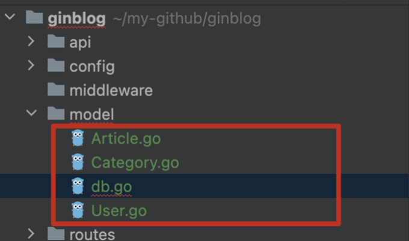
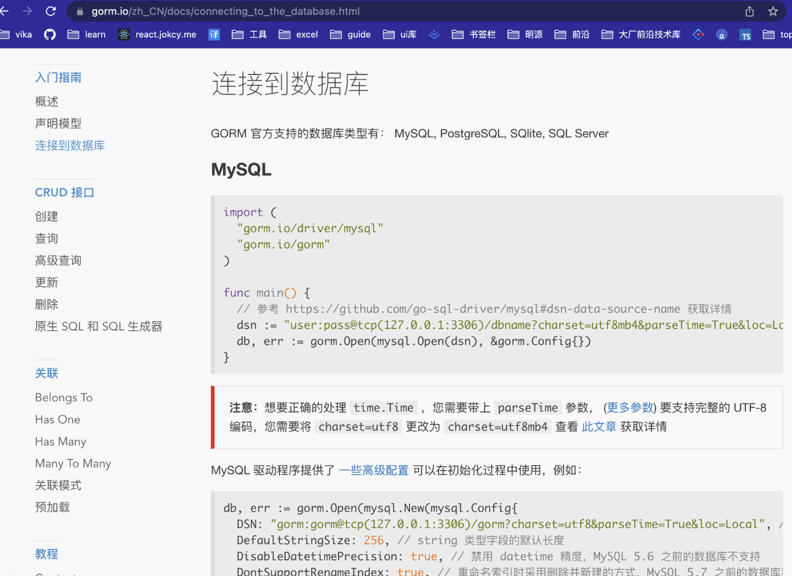
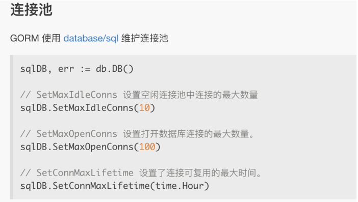
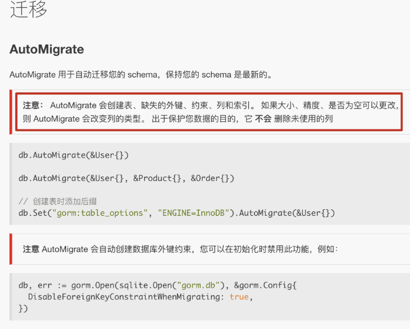
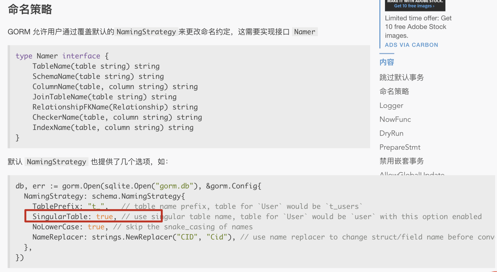
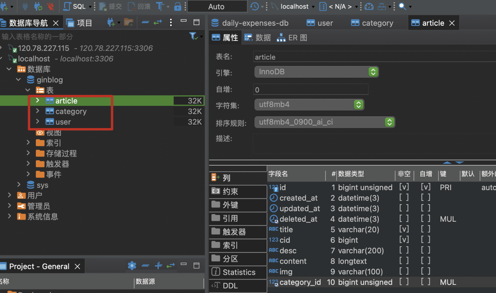

# 总结

- 使用 [GORM](https://gorm.io/) 数据库：几乎整合涵盖了 Mysql 的所有功能，并默认了几个参数，比如 id、创建时间、更新时间，删除是软删除，没有特殊需求我们就不需要自己写回调函数

# 一、安装 gorm

```js
go get -u gorm.io/gen
```

# 二、建立相关数据模型文件，配置

model 文件夹下新增下面四个文件：


其中，db.go 为数据库入口文件；其他是相关业务数据模型文件

## 1.编写 db 入口文件，根据官方文档连接 mysql 数据库



## 2.维护连接池



这里连接池设置了三个参数，因为 GORM 并不是直接连接我们的数据库，而是虚拟一个连接池，使用时再连接，所以这几个参数我们必须要设置一下。

另外，连接可复用的最大时间的设置一般不要大于进框架的时间，在下面的代码里，其实有一个默认参数，即 timeout，如果超过了这个时间就会跟客户端断开连接；所以如果数据库连接时间大于框架连接时间就会抛出错误。

```js
// routes/router.go
r.Run(utils.HttpPort);
```

这里我们就设置`SetConnMaxLifetime` 为 10s。

## 3.向数据库迁移模型



```js

db.AutoMigrate(&User{},&Article{}, &Category{})  // 迁移我们自己创建的模型
```

另外，对于用模型建立的数据，会自动加复数，这边我们不需要复数形式


那么此时的 db.go 文件内容如下：

```js
package model

import (
	"fmt"
	"ginblog/utils"
	"gorm.io/driver/mysql"
	"gorm.io/gorm"
	"gorm.io/gorm/schema"
	"time"
)

var db *gorm.DB
var err error

// 连接配置数据库
func InitDb() {
	dsn := fmt.Sprintf("%s:%s@tcp(%s:%s)/%s?charset=utf8mb4&parseTime=True&loc=Local",
		utils.DbUser,
		utils.DbPassWord,
		utils.DbHost,
		utils.DbPort,
		utils.DbName,
	)
	fmt.Printf(dsn)
	db, err := gorm.Open(mysql.Open(dsn), &gorm.Config{
		NamingStrategy: schema.NamingStrategy{SingularTable: true},
	})

	if err != nil {
		fmt.Printf("连接数据库失败，请检查参数：", err)
	}

	db.AutoMigrate(&User{}, &Category{}, &Article{})

	sqlDB, err := db.DB()

	// SetMaxIdleConns 设置空闲连接池中连接的最大数量
	sqlDB.SetMaxIdleConns(10)
	// SetMaxOpenConns 设置打开数据库连接的最大数量。
	sqlDB.SetMaxOpenConns(100)
	// SetConnMaxLifetime 设置了连接可复用的最大时间。
	sqlDB.SetConnMaxLifetime(10 * time.Second)

	//db.Close()
}
```

# 三、写模型

## 1.model/user.go

```js
package model

import "gorm.io/gorm"

type User struct {
	gorm.Model
	Username string `gorm:"type:varchar(20);not null" json:"username"`
	Password string `gorm:"type:varchar(20);not null" json:"password"`
	Role     int    `gorm:"type:int" json:"role"`
}
```

## 2.model/Article.go

```js
package model

import "gorm.io/gorm"

type Article struct {
	gorm.Model
	CategoryId string
	Category   Category
	Title      string `gorm:"type:varchar(20);not null" json:"title"`
	Cid        int    `gorm:"type:int;not null" json:"cid"`
	Desc       string `gorm:"type:varchar(200)" json:"desc"`
	Content    string `gorm:"type:longtext" json:"content"`
	Img        string `gorm:"type:varchar(100)" json:"img"`
}
```

## 3.model/Category.go

```js
package model

import "gorm.io/gorm"

type Category struct {
	gorm.Model
	Name string `gorm:"type:varchar(20);not null" json:"name"`
}
```

# 四、main.go 文件里引用数据库

```
package main

import (
+  "ginblog/model"
   "ginblog/routes"
)

func main() {
   // 引用数据库
+  model.InitDb()
   routes.InitRouter()
}

```

然后打开我们的 mysql 数据库，打开之后运行我们的项目。

如果没有错误，就可以看到我们的数据库里就会自动创建我们的三张表格：


