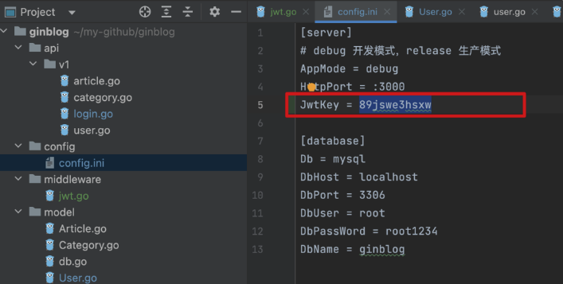
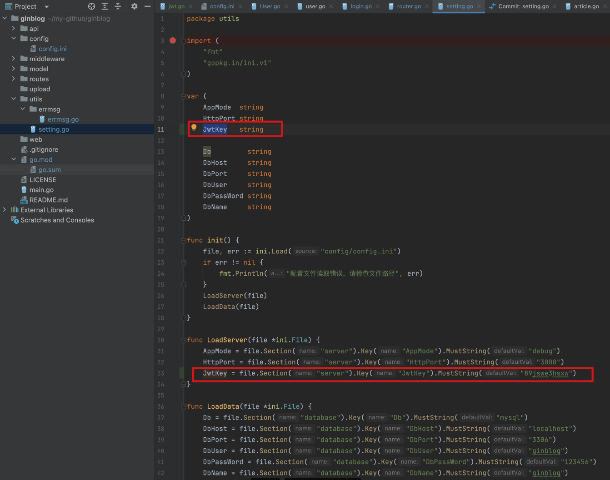
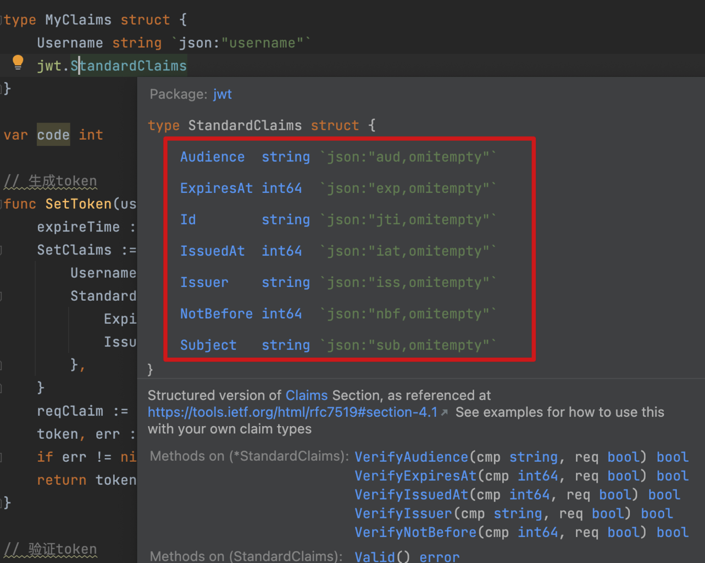
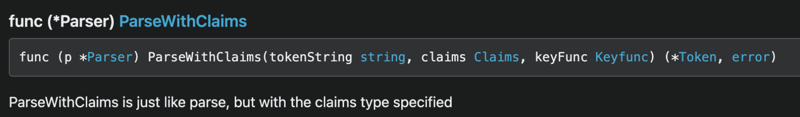

登录接口，涉及到认证，如果业务只是设计到 web 端，那么可以用 cookie 来实现，或者其他方式，但是如果是移动端，比如微信小程序是没有 cookie 的，目前主流的方式是使用 JWT（JSON Web Token）方式。

这里我们使用这个包：https://pkg.go.dev/github.com/dgrijalva/jwt-go/v4

# 一、安装

```js
go get -u github.com/dgrijalva/jwt-go
```

# 二、添加网站参数配置

## 2.1 配置网站参数：`JwtKey`变量

新增`JwtKey` 变量，值可以自定义：


并在 setting.go 中导入：


# 三、errmsg.go 新增 code

```js
const (
	...
	ERROR_USER_NO_RIGHT    = 1008
)
var codemsg = map[int]string{
	...
	ERROR_USER_NO_RIGHT:    "该用户无权限",
}
```

# 四、新建 middleware/jwt.go

认证需要有几个步骤：生成 token、验证 token。在此基础上，我们还需要有一个 jwt 中间件，来控制一些验证的逻辑。

## 4-1.不知道是啥

```js
var JwtKey = []byte(utils.JwtKey)
```

## 4-2.**结构体 MyClaims**

需要一个结构体 MyClaims 来接收参数：

```js
type MyClaims struct {
	Username string `json:"username"`
	Password string `json:"password"`
	jwt.StandardClaims
}
```

注意结构体 MyClaims 要与 User.go 文件里的 User 结构体保持一致（也就是说用用户名和密码来控制鉴权的）：

```js
type User struct {
	gorm.Model
	Username string `gorm:"type:varchar(20);not null" json:"username"`
	Password string `gorm:"type:varchar(20);not null" json:"password"`
	Role     int    `gorm:"type:int" json:"role"`
}
```

同时，需要将 Username 与 Password 绑定为 json，并加入 jwt.StandardClaims 内置结构体：


## 4-3.生成 token

需要注意的是，token 里尽量不携带敏感信息，比如 password

```js
// 生成token
func SetToken(username string) (string, int) {
	expireTime := time.Now().Add(10 * time.Hour)
	SetClaims := MyClaims{
		Username: username,
		StandardClaims: jwt.StandardClaims{
			ExpiresAt: expireTime.Unix(),
			Issuer:    "ginblog",
		},
	}
	reqClaim := jwt.NewWithClaims(jwt.SigningMethodHS256, SetClaims)
	token, err := reqClaim.SignedString(JwtKey)
	if err != nil {
		return "", errmsg.ERROR
	}
	return token, errmsg.SUCCESS
}
```

## 4-3.验证 token



```js
// 验证token
func CheckToken(token string) (*MyClaims, int) {
	setToken, _ := jwt.ParseWithClaims(token, &MyClaims{}, func(token *jwt.Token) (interface{}, error) {
		return JwtKey, nil
	})
	if key, _ := setToken.Claims.(*MyClaims); setToken.Valid {
		return key, errmsg.SUCCESS
	} else {
		return nil, errmsg.ERROR
	}
}
```

## 4-4.jwt 中间件

```js
package middleware

import (
	"ginblog/utils"
	"ginblog/utils/errmsg"
	"github.com/dgrijalva/jwt-go"
	"github.com/gin-gonic/gin"
	"net/http"
	"strings"
	"time"
)

var JwtKey = []byte(utils.JwtKey)

type MyClaims struct {
	Username string `json:"username"`
	jwt.StandardClaims
}

var code int

// 生成token
func SetToken(username string) (string, int) {
	expireTime := time.Now().Add(10 * time.Hour)
	SetClaims := MyClaims{
		Username: username,
		StandardClaims: jwt.StandardClaims{
			ExpiresAt: expireTime.Unix(),
			Issuer:    "ginblog",
		},
	}
	reqClaim := jwt.NewWithClaims(jwt.SigningMethodHS256, SetClaims)
	token, err := reqClaim.SignedString(JwtKey)
	if err != nil {
		return "", errmsg.ERROR
	}
	return token, errmsg.SUCCESS
}

// 验证token
func CheckToken(token string) (*MyClaims, int) {
	setToken, _ := jwt.ParseWithClaims(token, &MyClaims{}, func(token *jwt.Token) (interface{}, error) {
		return JwtKey, nil
	})
	if key, _ := setToken.Claims.(*MyClaims); setToken.Valid {
		return key, errmsg.SUCCESS
	} else {
		return nil, errmsg.ERROR
	}
}

// jwt中间件
func JwtToken() gin.HandlerFunc {
	return func(c *gin.Context) {
		tokenHeader := c.Request.Header.Get("Authorization")
		code := errmsg.SUCCESS
		if tokenHeader == "" {
			code = errmsg.ERROR_TOKEN_EXIST
			c.JSON(http.StatusOK, gin.H{
				"code":    code,
				"message": errmsg.GetErrMsg(code),
			})
			c.Abort()
			return
		}
		checkToken := strings.SplitN(tokenHeader, " ", 2)
		if len(checkToken) != 2 && checkToken[0] != "Bearer" {
			code = errmsg.ERROR_TOKEN_TYPE_WRONG
			c.JSON(http.StatusOK, gin.H{
				"code":    code,
				"message": errmsg.GetErrMsg(code),
			})
			c.Abort()
			return
		}
		key, tCode := CheckToken(checkToken[1])

		if tCode == errmsg.ERROR {
			code = errmsg.ERROR_TOKEN_WRONG
			c.JSON(http.StatusOK, gin.H{
				"code":    code,
				"message": errmsg.GetErrMsg(code),
			})
			c.Abort()
			return
		}
		if time.Now().Unix() > key.ExpiresAt {
			code = errmsg.ERROR_TOKEN_RUNTIME
			c.JSON(http.StatusOK, gin.H{
				"code":    code,
				"message": errmsg.GetErrMsg(code),
			})
			c.Abort()
			return
		}

		c.Set("username", key.Username)
		c.Next()
	}
}
```
