gin 官网给出了上传文件的示例 demo。

[gin 官网-上传文件](https://gin-gonic.com/zh-cn/docs/examples/upload-file/single-file/)

[gin 官网-静态文件服务](https://gin-gonic.com/zh-cn/docs/examples/serving-static-files/)

[七牛云-Go SDK 文档](https://developer.qiniu.com/kodo/1238/go)

一般不会采用本地上传，因为图片文件读取比较频繁，磁盘读写频率会很高，本地服务性能就会受到很多影响。另外，带宽是比较贵的，如果带宽比较小，图片又很多很大，加载到客户端访问的时候，就会占用大量的带宽，带宽小的时候也会有加载缓慢的情况。

目前主流的做法不会把上传和本地服务部署在一个服务器里，一般都是用第三方储存对象。此项目也是打算采用后者，上传到第三方服务器里。即不占用磁盘读写，也不占用带宽，这样能够极大优化访问体验。

这里使用七牛云。

# 一、准备工作

注册之后，先认证，认证之后就会有每月 10G 的免费空间。
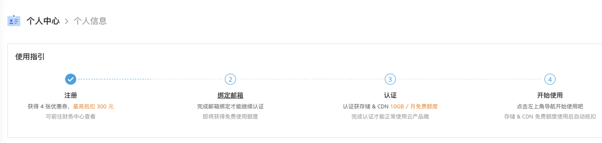

然后新建一个空间：
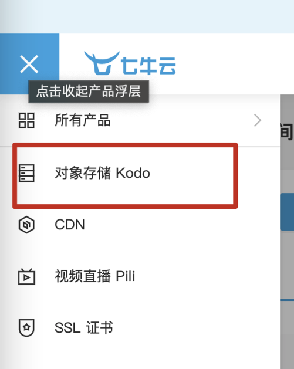
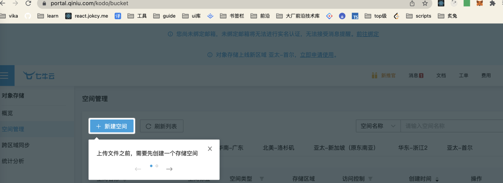
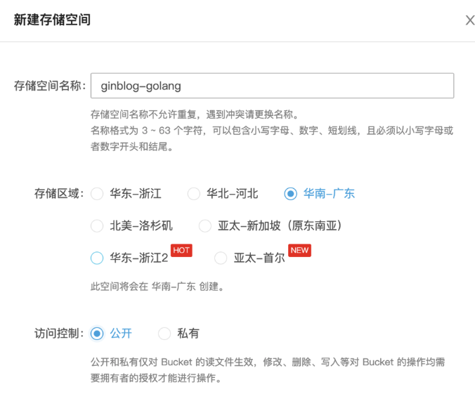
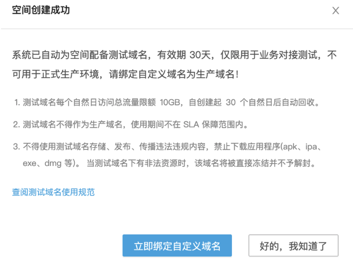

创建密钥：
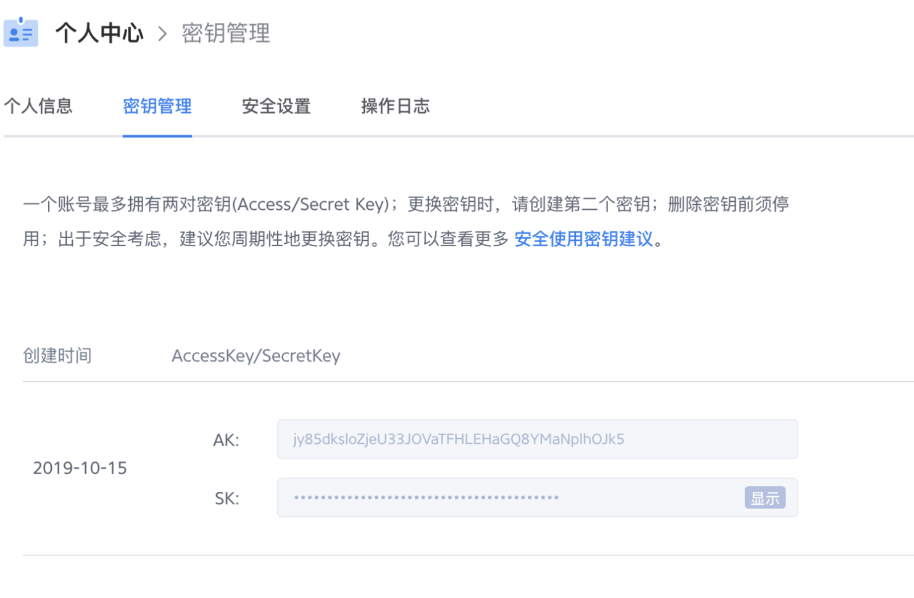

# 二、业务代码

## 1.项目里配置七牛云相关信息

### config.ini 文件：

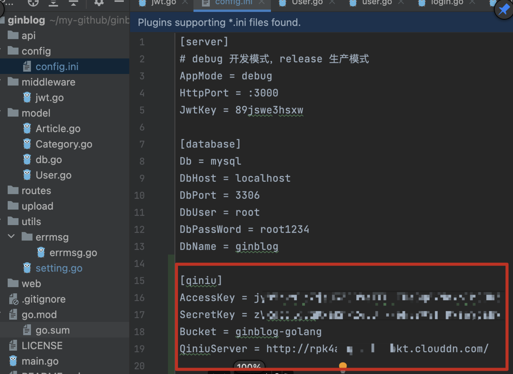
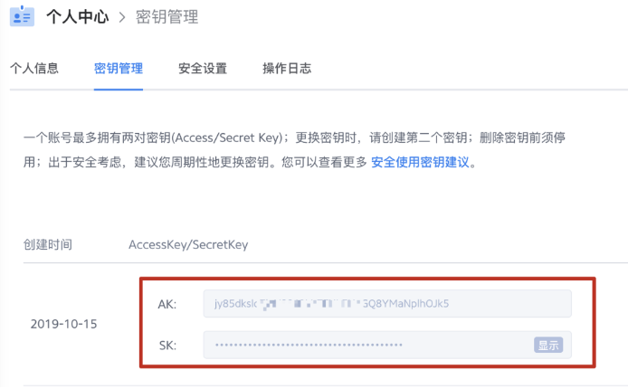
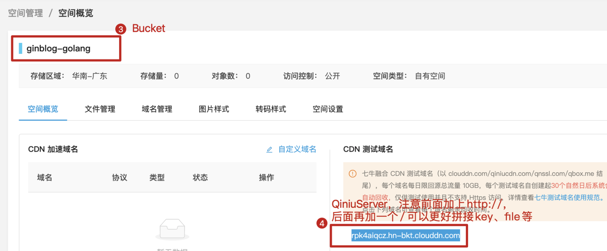

### setting.go 文件：

```js
var(
	...
	AccessKey   string
	SecretKey   string
	Bucket      string
	QiniuServer string
)

func init() {
	...
	LoadQiniu(file)
}

func LoadQiniu(file *ini.File) {
	AccessKey = file.Section("qiniu").Key("AccessKey").String()
	SecretKey = file.Section("qiniu").Key("SecretKey").String()
	Bucket = file.Section("qiniu").Key("Bucket").String()
	QiniuServer = file.Section("qiniu").Key("QiniuServer").String()
}
```

## 2.安装 Go SDK

[Go SDK*SDK 下载*对象存储 - 七牛开发者中心](https://developer.qiniu.com/kodo/1238/go)

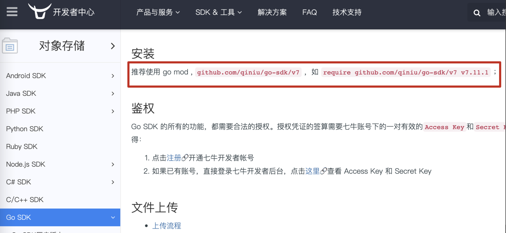

### 在 go.mod 文件里添加以下：

```js
require (
	...
	github.com/qiniu/go-sdk/v7 v7.11.1
)
```

然后终端执行：

```js
go mod download
```

然后就会进行下载，下载完成后，在 go.mod 文件里看到的`github.com/qiniu/go-sdk/v7 v7.11.1`这行代码就会由灰色变成绿色。（视频里是这么讲的，但是我这个实践没有变绿）

## 三、新建 model/Upload.go 文件

在 model 文件夹里新建 Uplaod.go 文件，（本应该放在 server 服务层里，因为我们的这个项目比较简单，服务层跟模型层是写在一个文件夹里的，本应该是分开的，一般服务端文件夹叫 ervers）

这里的代码可以参考七牛云官网

```js
package model

import (
	"context"
	"ginblog/utils"
	"ginblog/utils/errmsg"
	"github.com/qiniu/go-sdk/v7/auth/qbox"
	"github.com/qiniu/go-sdk/v7/storage"
	"mime/multipart"
)

var AccessKey = utils.AccessKey
var SecretKey = utils.SecretKey
var Bucket = utils.Bucket
var ImgUrl = utils.QiniuServer

func UploadFile(file multipart.File, fileSize int64) (string, int) {
	putPolicy := storage.PutPolicy{
		Scope: Bucket,
	}
	mac := qbox.NewMac(AccessKey, SecretKey)
	upToken := putPolicy.UploadToken(mac)
	cfg := storage.Config{
		Region:          &storage.ZoneHuadong,
		UseCdnDomains: false,
		UseHTTPS:      false,
	}
	putExtra := storage.PutExtra{}
	formUploader := storage.NewFormUploader(&cfg)
	ret := storage.PutRet{}
	err := formUploader.PutWithoutKey(context.Background(), &ret, upToken, file, fileSize, &putExtra)
	if err != nil {
		return "", errmsg.ERROR
	}
	url := ImgUrl + ret.Key
	return url, errmsg.SUCCESS
}
```

## 四、新建 api/v1/upload.go

```js

package v1

import (
	"ginblog/model"
	"ginblog/utils/errmsg"
	"github.com/gin-gonic/gin"
	"net/http"
)

func Upload(c *gin.Context) {
	file, fileHeader, _ := c.Request.FormFile("file")

	fileSize := fileHeader.Size

	url, code := model.UploadFile(file, fileSize)
	c.JSON(http.StatusOK, gin.H{
		"status":  code,
		"message": errmsg.GetErrMsg(code),
		"url":     url,
	})
}
```

## 五、router.go

```js
// 上传文件
auth.POST('upload', v1.Upload);
```

## 六、测试

先调用登陆接口获取到 token：
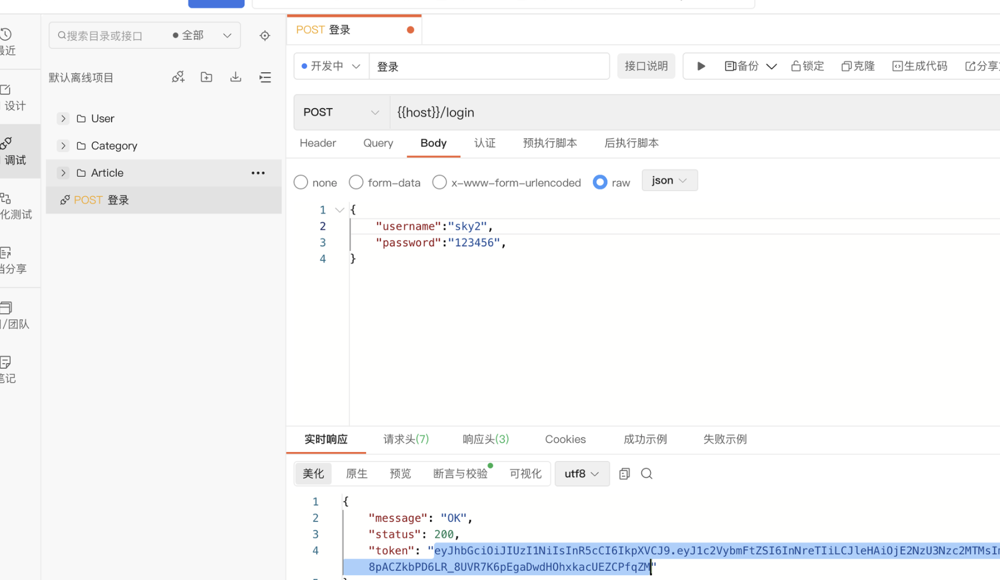
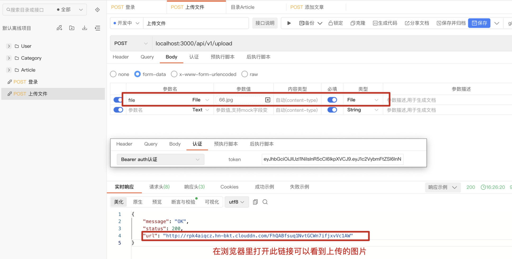
在七牛云控制台也可以看到上传的图片：
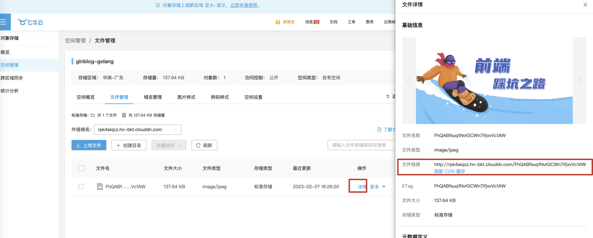
