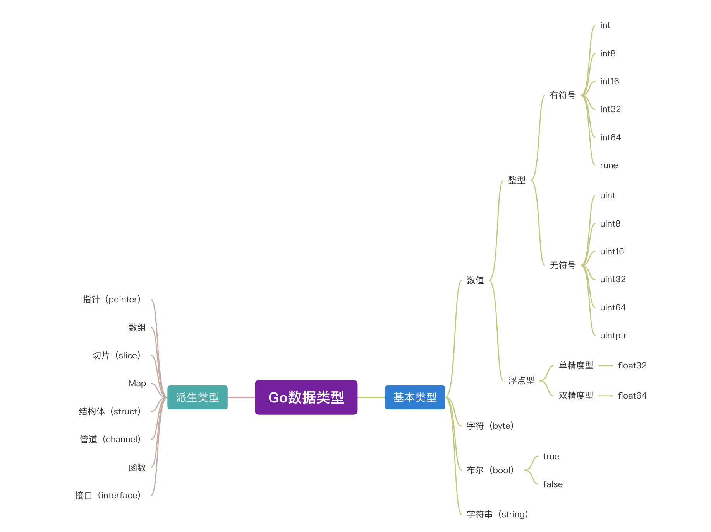

## 数据类型



## 复合字面值

Go 中复合类型包括结构体、数组、切片和 map。对于复合类型变量，最常见的值构造方式就是对其内部元素进行逐个赋值，如下：

```go
// 结构体
var s myStruct
s.name = "Jane"
s.age = 25

// 数组
var arr [3]int
arr[0] = 1
arr[1] = 2
arr[3] = 3

// 切片
s := make([]int, 3, 3)
s[0] = 1
s[1] = 2
s[2] = 3

// map
m := make(map[int]string)
m[1] = "Jane"
m[2] = "Koe"
```

这样逐一进行初值构造有点麻烦，我们可以使用 Go 提供的复合字面值（composite literal）来构造复合类型变量的初值，复合字面值分为两部分：

- 类型
- {}，这里面就是字面值

那么在上述的例子中，我们可以用复合字面值来进行改造：

```go
s := myStruct{"Jane", 25}
arr := [3]int{1,2,3}
s := []int{1,2,3}
m := map[int]string{1:"Jane",2:"Koe"}
```

### 结构体复合字面值

用复合字面值形式对 struct 类型变量进行值构造，有两个优点：

- 结构体定义与结构体使用之间解藕
- 结构体在用复合字面值形式进行初值构造时，可以不按定义时的顺序进行构造，未进行构造的那些字段也会默认采用相应的零值。

### 数组/切片复合字面值

对于数组/切片类型而言，若元素为复合类型时，可以省去元素复合字面量中的类型：

```go

type Point struct {
  x float64
  y float64
}
slice1 := []Point{
  {1.1,1.2},   // 即元素Point{1.1,1.2}
  {1.2,1.3}   // 即元素Point{1.2,1.3}
}

```

### map 复合字面值

对于 map 类型，当 key 或 value 为复合类型时，可以省去 key 或 value 中的复合字面量中的类型（Go1.5 版本+）：

```go
var myMap = map[string]Point{
  "QR": {1.1,1.2},   // 即"QR": Point{1.1,1.2}
  "PHONE": {1.2,1.3}   // 即"PHONE": Point{1.2,1.3}
}

```

> 结论：对于复合类型，应该首选复合字面值作为其初值构造器。
