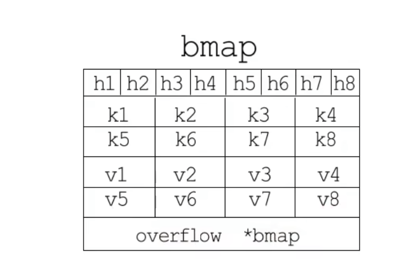
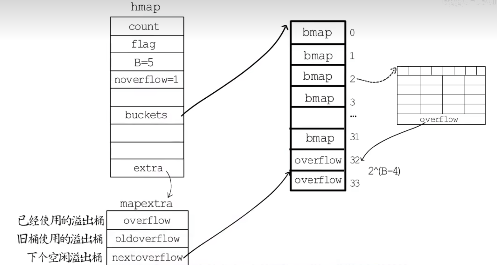

Go 语言中，有些会将 map 称为哈希表或字典。

## Hash 结构

提到 hash 结构，就会想到有键值对，哈希表通常会有一堆桶来存储键值对，而每个键值对要放到哪个桶，是有一定算法的：

- 1.首先是用哈希函数对“键”处理，得到一个哈希值 hash，这个 hash 值会放到桶中，桶编号为 0 ～ m-1（假设一共 m 个桶）
- 2.这一步一般有两个方法：
  - 取模法：哈希值与桶的个数 m 取模， hash % m = 桶的编号
  - 与运算：哈希值与 m-1 进行与运算，hash & (m-1) = 桶的编号
    为了确保运算结果落在区间[0,m-1]而不会出现空桶，就要限制桶的个数 m 必须是 2 的整数次幂（这样 m 的二进制表示一定只有一位为 1，比如 m=4，二进制表示法就是 100）。

如果后续有新的键值对选择同一个桶，有可能发生哈希冲突，也就是 hash 碰撞，此时可以有移位法、开链法、开树法。

哈希冲突的发生会影响哈希表的读写效率，选择散列均匀的哈希函数可以减少哈希冲突的发生，适时的扩容也是保障读写效率的有效手段，通常会把存储键值对的数目与桶的数目的比值（count/m）（称为负载因子）作为是否需要扩容的判断依据。

## Map 与 Hash 结构

Golang 中 Map 类型的底层实现就是哈希表。选择桶时用的是与运算法，如果遇到 hash 碰撞，用的是开链法。

## hmap

Map 类型的变量本质上是一个指针，指向 hmap 结构体（hmap 是 map 类型的 header，可以理解为 map 类型的描述符，存储了后续 map 类型操作所需的所有信息）：

```go
type hmap struct {
  count int   // 键值对数目
  B     uint  // 2^B=bucket，记录桶的数目是2的多少次幂

  buckets     unsafe.Pointer  // 指向bucket数组的指针，记录桶在哪
  oldbuckets  unsafe.Pointer  // 在扩容阶段指向前一个bucket数组的指针，记录旧桶在哪
  nevacuate   unintptr        // 记录渐进式扩容阶段下一个要迁移的旧桶编号
}
```

## bmap

map 使用的桶，是 bmap 结构，一个桶里可以放 8 个键值对，但是为了让内存排列更加紧凑，8 个 key 放一起，8 个 value 放一起，在 8 个 key 的前面则是 8 个 tophash，每个 tophash 都是对应哈希值的高 8 位。而在 8 个 value 的后面是一个 bmap 指针，指向一个溢出桶，溢出桶的内存布局与“常规桶”相同，是为了减少扩容次数而引入的，当一个桶存满了还有可用的溢出桶时，就会在桶后面链一个溢出桶，继续往里存。


- 每个 tophash 占一个字节，存着键值对中的 key 值的哈希值的高 8 位
- key 和 value 都是 string 类型，所以 64 位下每个 key 和 value 都占用 16 字节，

实际上，如果哈希表要分配的桶的数目大于 2^4，就认为使用到溢出桶的几率较大，就会预分配 2^(B-4)个溢出桶备用，这些溢出桶与常规桶在内存中是连续的，只是前 2^B 个用作常规桶，后面的用作溢出桶，hmap 结构体最后有一个 extra 字段，指向一个 mapextra 结构体。


## mapextra

hmap 结构体中的 extra 指向一个 mapextra 结构体，里面记录的都是溢出桶相关的信息：

- overflow：记录目前已经被使用的溢出桶的地址
- oldoverflow：用于在扩容阶段存储旧桶用到的那些溢出桶的地址
- nextoverflow：指向下一个空闲溢出桶

## 扩容规则

Go 语言 map 的默认负载因子是 6.5

## Q1:map 是什么？如何使用？

map 是一种无序的键值对集合，也称为字典或哈希表，有以下特点：

- key 值必须是唯一的，函数、切片、map 不可作为 key 值
- 不支持“零值可用”，未显式赋值的 map 为零值，即 nil，这样的 map 是不可进行操作的

**零值不可用：**

```go
var m map[string]int     // m = nil
m["key"]=1               // panic: assignment to entry in nil map
```

**基本使用：**

```go
package main

import "fmt"

func main() {
	// 1.使用make函数创建map，键值类型分别为string和int
	grades := make(map[string]int)

	// 2.添加键值对
	grades["a"] = 80

	// 3.获取值
	b := grades["a"]

	fmt.Println(grades["a"])
	fmt.Println(b)

  // 4.遍历map
  for key,value := range grades {
		fmt.Println(key,value)
	}
}
```

## Q2:map 为什么是无序的？

遍历 Map 时，是按顺序遍历 bucket ，然后再按顺序遍历 bucket 中 的 key（bucket 里面是个链表）。然而，Map 在扩容时，key 会发生迁移，从旧 bucket 迁移到新的 bucket，这种情况下，是做不到有序遍历的。

## Q2:map 如何有序遍历？
