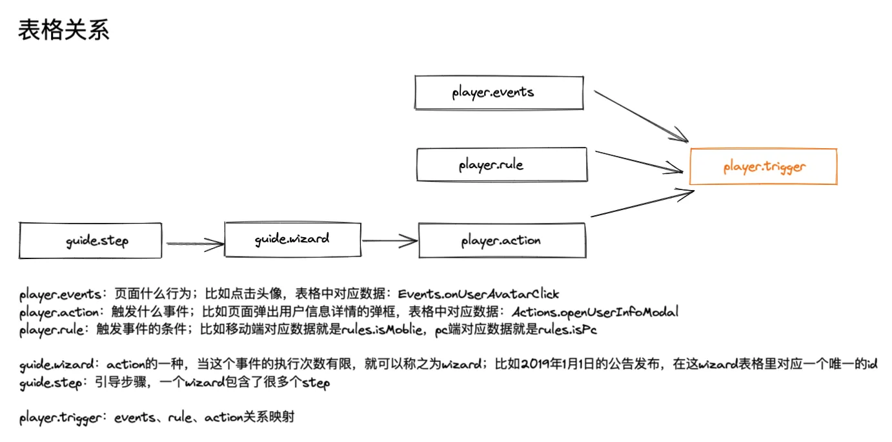
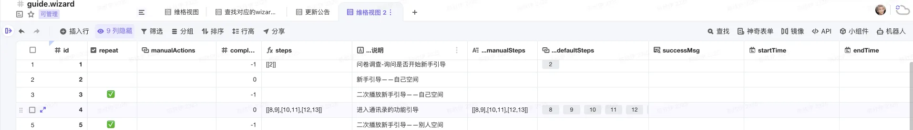
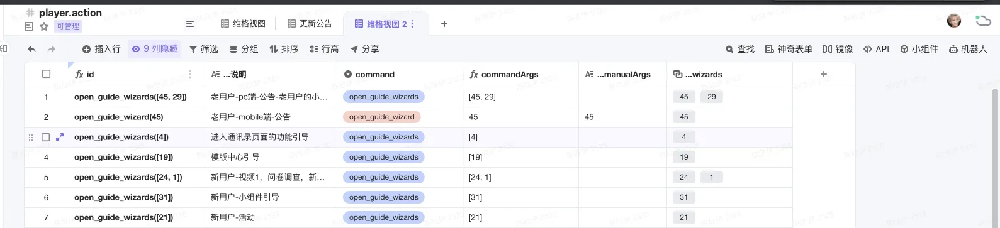
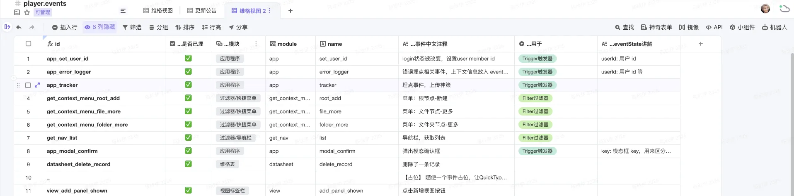
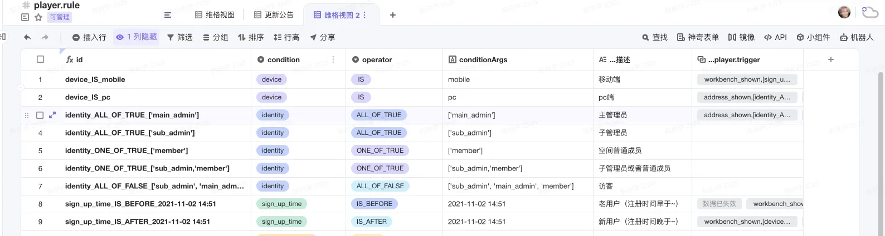
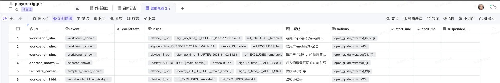

# 面试题

## 一、从输入 URL 到页面加载完成

`URL 解析`->`缓存判断`->`DNS 解析`->`TCP 三次握手`->`Http 请求`->`服务端处理和响应`->`TCP 四次挥手`->`浏览器解析和渲染`->`页面加载完成`

### 1.口头表述

输入内容后，`浏览器进程`的 `UI进程`会判断是搜索关键字还是一个 url，如果是后者就通过 `IPC 通道`将信息传递给`网络进程`，首先网络进程会判断本地是否有缓存，没有就进行 DNS 解析，获取到请求域名的 IP 地址，再进行 TCP 三次挥手，此时就可以发起 HTTP 请求，当得到响应之后，进行 TCP 四次挥手，渲染进程的工作结束，进入渲染进程，这一块主要就是浏览器解析 HTML 文档，遇到 JS 和 CSS，分别构造 DOM 树和 CSSOM 树，当两者都构建好了之后，就会进行样式计算，比如把有些样式的相对值改成绝对值，如 em->px,然后可以进行布局了，也就是计算元素的几何位置，通过样式计算和布局计算就构建出了渲染树，此时就可以开始绘制（paint）了，在绘制之前还有一个分层的操作，绘制之后会进行分块，然后就交给 `GPU 进程`进行光栅化操作，之后将信息交给 `GPU 硬件（显卡）`完成最终的屏幕成像。

### 2.DOMContentLoaded 和 window.onload

- DOMContentLoaded 事件是在纯 HTML 加载和解析之后触发；（而不必等待样式表，图片或者子框架完成加载。）
- window.onload 事件不但文档完全加载和解析完毕，相关资源都要加载完毕，比如图片和 CSS 文件等；

### 3.script 标签为什么放在 不同位置

### 4.defer 和 async

### 5.回流和重绘

回流是重新构建渲染树的过程，重绘是重新绘制的过程

### 6.CRP（关键渲染路径）优化

## 二、Promise

- promise 协程
- promsie 实现一个并发请求
- 手写一个 promise

## 三、原型链

- 原型链，哪里会使用到

## 四、垃圾回收机制

- （结合内存讲解）

## 五、描述项目，遇到最难的问题以及解决

## 六、CSS

### 1.BFC

### 2.有哪些布局

- web worker
- 1.0 2.0 版本区别 Hapck
- 浏览器内存
- setState 如何触发更新操作 context、 redux
- 低代码
- 项目中的难点，捏造一个
- 错误捕获，

## 项目难点-Player 系统

- 组件（继承）、如何实现函数式调用
- 利于沟通（chrome 插件+低代码）
- 发布订阅
- 查找算法（webworker）
- 引导步骤可以中断，中断后如何继续

### 1.数据库/表格设计









### 2.组件实现（继承+函数式调用）

### 3.EventBus

```js
class EventBus {
  constructor() {
    this.events = {}; // 存储事件及其对应的回调函数列表
  }

  // 订阅事件
  subscribe(eventName, callback) {
    this.events[eventName] = this.events[eventName] || []; // 如果事件不存在，创建一个空的回调函数列表
    this.events[eventName].push(callback); // 将回调函数添加到事件的回调函数列表中
  }

  // 发布事件
  publish(eventName, data) {
    if (this.events[eventName]) {
      this.events[eventName].forEach((callback) => {
        callback(data); // 执行回调函数，并传递数据作为参数
      });
    }
  }

  // 取消订阅事件
  unsubscribe(eventName, callback) {
    if (this.events[eventName]) {
      this.events[eventName] = this.events[eventName].filter(
        (cb) => cb !== callback,
      ); // 过滤掉要取消的回调函数
    }
  }
}

// 使用

// 创建全局事件总线对象
const eventBus = new EventBus();

const callback1 = (data) => {
  console.log('Callback 1:', data);
};

const callback2 = (data) => {
  console.log('Callback 2:', data);
};

// 订阅事件
eventBus.subscribe('event1', callback1);
eventBus.subscribe('event1', callback2);

// 发布事件
eventBus.publish('event1', 'Hello, world!');

// 输出：
// Callback 1: Hello, world!
// Callback 2: Hello, world!

// 取消订阅事件
eventBus.unsubscribe('event1', callback1);

// 发布事件
eventBus.publish('event1', 'Goodbye!');

// 输出：
// Callback 2: Goodbye!
```

### 3.chrome 插件

- 1.选择环境
- 2.数据更改（清除所有、清除部分）
- 3.云函数（express）

## 低代码平台

### 1.组件通信

### 2.

### 有用网站

- [Dooring 低代码](https://dooring.vip/h5_plus/editor?pid=fdcb81db-9f92-4493-bab3-cf6b9e45c646&id=12751&applicationId=2273)
- [面试被问到低代码细节？听我这样吹 🤯（含架构和原理）](https://juejin.cn/post/7276837017231835136?searchId=20240310134555C98245EA43E3302E163A)
- [从零实现一套低代码（保姆级教程） --- 【1】初始化项目，实现左侧组件列表](https://blog.csdn.net/weixin_46726346/article/details/135102092)
- [从零开始实现一个简单的低代码编辑器](https://mp.weixin.qq.com/s?__biz=MzA5MDIyNTM3Mw==&mid=2666581390&idx=1&sn=47be2eaf42edf82da99f60eb51131ba7&chksm=8b0a823cbc7d0b2a1531944a7fd20aa862a52014671ca2b71bae3814ef76eb1be5b0aed86baf&scene=27)
