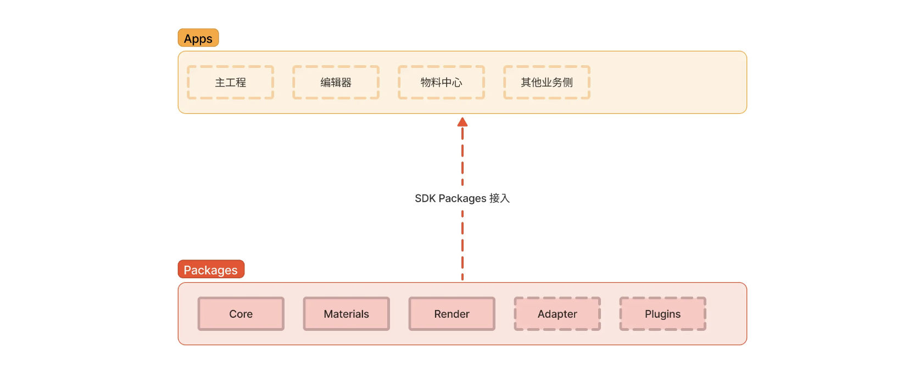
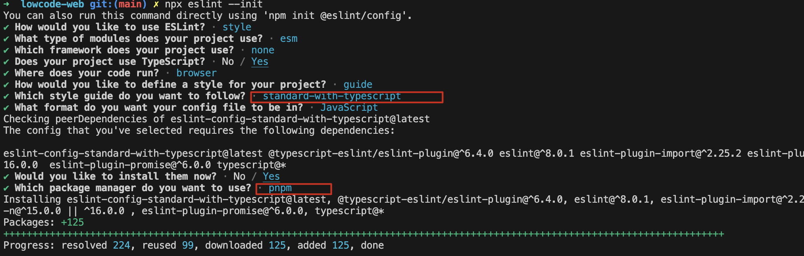

## 项目准备

### step1: 初始化项目

- 1.新建仓库，并 clone 到本地
- 2.初始化项目：执行`pnpm init`初始化项目（本质上和 `npm init` 一致）

### step2: pnpm+monorepo 初始化项目架构

使用 pnpm workspace 来初始化 monorepo 项目的工程架构:



在项目目录下分别创建 `app` 和 `package` 文件夹，以及`pnpm-workspace`配置文件：

```yaml
📦my-project
┣ 📂apps    // 存放应用
┃ ┗ ...
┣ 📂packages   // 存放类库
┃ ┗ ...
┣ 📜package.json
┣ 📜pnpm-workspace.yaml   // 配置文件，用来定义 monorepo 的工作区间
```

在 pnpm-workspace.yaml 中声明 app 和 packages 的工作区：

```yaml
packages:
  - 'apps/**'
  - 'packages/**'
```

### step3: 安装 ESLint 和 TS

对于 Monorepo 的仓库来说，可以在主仓库中创建 ESLint 的检查规则，然后作用于所有子项目。不需要在每一个子包里创建 ESLint。

**1. pnpm 命令根目录安装 ESLint 和 TypeScript**

```js
# -D 运行时依赖
# -w 表示安装到 workspace 根目录下
pnpm add eslint typescript -Dw    // pnpm add eslint@8.46.0 typescript@5.1.6  -Dw
// pnpm config set registry http://registry.npm.taobao.org
```

**2. 初始化项目的相关 ESLint 配置**

初始化 ESLint 配置：

```
npx eslint --init  // 因为eslint不是全局模块的依赖，无法直接执行eslint的脚本命令，需要在前面加npx
```

执行命令后，可以选择 Standard 规范库、以及支持 TS：

执行成功后，根目录会产生文件：`.eslintrc.js`，[ESLint 配置文档查阅](https://eslint.org/docs/latest/use/configure/)

**3. 检测**
通过执行 `eslint --ext .js,.jsx,.ts,.tsx` ，来试试看命令行的不规范代码检查是否是能够使用的，可以正常检测的话，将命令添加到根目录 package.json 执行脚本当中：

```yaml
"script": {

- "lint:js": "eslint --ext .js,.jsx,.ts,.tsx ./",
- "lint:fix": "eslint --fix --cache --ext .js,.jsx,.ts,.tsx ./"
  }
```

执行 lint 脚本后，会将 Error 和 Warning 都输出在控制台。
这里与小册子操作结果不符合。。实际报错了，tsconfig.json 文件咩有

### step4.pnpm+Vite 快速构建子项目

在项目开发中，需要构建我们的一些 Npm 包。Webpack、Rollup 这些打包工具配置无疑是繁琐的。因此，我们需要一个开箱即用的打包构建工具。

关于 `Vite` 作为依赖库的构建工具，原因有以下几个方面：

- 都是通过预置 Rollup 配置作为构建工具，Vite 不仅仅支持类库的打包，同时还可以作为 Bundless 构建器，后续快速移动 Demo 服务，有利于调试；
- Vite 社区生态好，维护力度大，插件维护也可观，方便后续进行集成扩展。

通过 `pnpm create` 使用 vite 套件新建一个以 react-ts 为模版的项目

```js
cd packages
pnpm create vite core --template react-ts
```

然后：

```js
cd core
pnpm install
pnpm run dev
```


### step5.加入 Turborepo

由于我们是一个 Monorepo 的项目，必不可少的就是子包与子包之间的相互依赖，子包与应用之间的相互依赖，所以为了更好的流程化构建项目，对整个工程需要一个好的工具来管理工作区和任务，标准杯构建的工作流程。

[Add Turborepo to your existing monorepo](https://turbo.build/repo/docs/getting-started/existing-monorepo)

根目录下执行：

```
pnpm install turbo  -D
```

然后在根目录下创建`turbo.json`：

```json
{
  "pipeline": {
    "build": {
      "dependsOn": ["^build"],
      "outputs": ["dist/**", ".next/**"]
    },
    "test": {
      "dependsOn": ["build"],
      "inputs": ["test/**/*.ts", "test/**/*.tsx"]
    },
    "lint": {
      "outputs": []
    },
    "dev": {
      "cache": false
    }
  }
}
```

主要是用于构建 CI 使用。在工程 package 中执行 turbo run build --filter @lgnition-web/editor 即可完成构建编辑器应用的相关任务。

## 拖拽方案选择

绝大部分的可视化搭建平台都会使用拖拉拽来完成对应页面的布局，减少非研发成员对于选择物料进行整体布局的学习成本，所以流畅的拖拽功能是基于 GUI 的低代码平台中编辑器模块的核心功能之一。

#### 1.HTML5 原生拖拽方案

[](https://code.juejin.cn/pen/7335454046758961161)

#### 2.第三方库

- 网格拖拽布局：react-gird-layout
- 任意位置拖拽：react-dnd, dnd-kit

[低代码编辑器通用框架——craft.js](https://zhuanlan.zhihu.com/p/649243455?utm_id=0)

总结：

- 使用 `craft.js` 这个开源组件来作为一个中间层实现编辑器相关的拖拽与编排关联
- iframe 实现编辑器画布预览

## 渲染方案探索

### 1.渲染方式

作为工具类的 web 产品，数据量会比一般 web 产品多，对性能要求就会更高，并且性能要求主要体现在渲染方面。

- DOM：比如 React、Vue 这些框架，以及大部分 web 产品
- Canvas：蓝湖、即时设计、figma
- 优势对比：浏览器 DOM 的优势在于每一个节点都是独立开的，并且具有一套完整易用的浏览器事件系统提供给开发者进行调用，而 Canvas 则是在一个画布平面当中，只能通过元素的 x，y 的距离边界来确定交互的元素，然后通过事件的广播进行操作。

如何选择？

- 追求开发体验（代码维护性、开发效率），选择 DOM
- 追求高性能的图形和动画效果，且不需要 SEO，选择 Canvas

### 2.Iframe

选择用 Iframe 将 preview 页面直接嵌入编辑器画布当中，但 Iframe 有个弊端：由于 iframe 的限制原因，每次进入都是一次浏览器上下文重建、资源重新加载的过程，会存在部分资源重复加载引用的问题。 https://www.yuque.com/kuitos/gky7yw/gesexv

-

## craftjs 基础探索

### 1.基本结构

基本结构：

- Editor、Frame 都是库内置的组件，Editor 处于最外层，定义了当前物料组件元素
- Frame 是展示区域，展示的内容可以是来自 children，官网还提供了一个 data 字段，传入数据，Frame 会自动进行渲染，如果是 children 方式的话就需要前端自己渲染
  ```js
  <Frame data='{"ROOT":{"type":"div","isCanvas":true,"props":{},"parent":null,"displayName":"div","custom":{},"nodes":["node-sdiwzXkvQ","node-rGFDi0G6m","node-yNBLMy5Oj"]},"node-sdiwzXkvQ":{"type":{"resolvedName":"Card"},"props":{},"parent":"ROOT","displayName":"Card","custom":{},"_childCanvas":{"main":"canvas-_EEw_eBD_","second":"canvas-lE4Ni9oIn"}}}'>
    <Element is={Container} canvas>
      {' '}
      // defines the Root Node
      <h2>Drag me around</h2>
      <MyComp text="You can drag me around too" />
      <Element is="div" style={{ background: '#333' }}>
        <p>Same here</p>
      </Element>
    </Element>
  </Frame>
  ```
- SettingPanel、ComponentPanel 是自己需要处理的组件，分别是属性编排区、组件选择区

```js
import { Editor, Frame } from '@craftjs/core';

const App = () => {
  return (
    <Editor
      resolver={{ Button, Text }} // 传入物料组件，必传
      enabled={true} // 控制是否可编辑，可以不传
      onRender={RenderNode} // 选中组件时候控制显示组件名称等信息，自定义的，不传就不显示
    >
      <ComponentPanel />
      <Frame>
        <Text>我是需要显示的Text组件</Text>
      </Frame>
      <SettingPanel />
    </Editor>
  );
};
```

### 2.物料组件如何写

```js
const ExampleComponent = ({ enabled, text }) => {
  const {
    connectors: { connect, drag },
    actions: { setProp },
  } = useNode();

  return (
    <div ref={connect}>
      <div>Hi world</div>
      <a ref={drag}>Drag me to move this component</a>
      <button
        onClick={(e) => {
          setProp((props) => {
            props.enabled = !props.enabled;
          });
        }}
      >
        Toggle
      </button>

      <input
        type="text"
        value={text}
        onChange={(e) => {
          setProp((props) => {
            props.text = e.target.value;
          }, 500);
        }}
      />
    </div>
  );
};
```

### 3.属性编排区如何获取数据？

前面物料组件已经传入了 Editor 组件，那么我们就可以用到 craftjs 库提供的 useEditor 方法获取到当前所选中的元素：

```js
import { useEditor } from '@craftjs/core';
const { actions, selected, isEnabled } = useEditor((state, query) => {
  const currentNodeId = query.getEvent('selected').last();
  let selected;

  if (currentNodeId) {
    selected = {
      id: currentNodeId,
      name: state.nodes[currentNodeId].data.name,
      settings:
        state.nodes[currentNodeId].related &&
        state.nodes[currentNodeId].related.settings,
      isDeletable: query.node(currentNodeId).isDeletable(),
    };
  }

  return {
    selected,
    isEnabled: state.options.enabled,
  };
});

return (
  // 1.渲染组件的属性
  // 2.当更改属性值时，还需要更改预览区的数据
  <div data-cy="settings-panel">
    {selected.settings && React.createElement(selected.settings)}
  </div>
);
```

其中 settings 是在定义物料组件时就进行了编写：

```js
import { useNode } from '@craftjs/core';
import {
  Button as MaterialButton,
  FormControl,
  FormLabel,
  RadioGroup,
  Radio,
  FormControlLabel,
} from '@material-ui/core';
import React from 'react';

export const Button = ({ size, variant, color, text, ...props }) => {
  const {
    connectors: { connect, drag },
  } = useNode();
  return (
    <MaterialButton
      ref={(ref) => connect(drag(ref))}
      style={{ margin: '5px' }}
      size={size}
      variant={variant}
      color={color}
      {...props}
    >
      {text}
    </MaterialButton>
  );
};

export const ButtonSettings = () => {
  const {
    actions: { setProp },
    props,
  } = useNode((node) => ({
    props: node.data.props,
  }));

  return (
    <div>
      <FormControl size="small" component="fieldset">
        <FormLabel component="legend">Size</FormLabel>
        <RadioGroup
          defaultValue={props.size}
          onChange={(e) => setProp((props) => (props.size = e.target.value))}
        >
          <FormControlLabel
            label="Small"
            value="small"
            control={<Radio size="small" color="primary" />}
          />
          <FormControlLabel
            label="Medium"
            value="medium"
            control={<Radio size="small" color="primary" />}
          />
          <FormControlLabel
            label="Large"
            value="large"
            control={<Radio size="small" color="primary" />}
          />
        </RadioGroup>
      </FormControl>
      <FormControl component="fieldset">
        <FormLabel component="legend">Variant</FormLabel>
        <RadioGroup
          defaultValue={props.variant}
          onChange={(e) => setProp((props) => (props.variant = e.target.value))}
        >
          <FormControlLabel
            label="Text"
            value="text"
            control={<Radio size="small" color="primary" />}
          />
          <FormControlLabel
            label="Outlined"
            value="outlined"
            control={<Radio size="small" color="primary" />}
          />
          <FormControlLabel
            label="Contained"
            value="contained"
            control={<Radio size="small" color="primary" />}
          />
        </RadioGroup>
      </FormControl>
      <FormControl component="fieldset">
        <FormLabel component="legend">Color</FormLabel>
        <RadioGroup
          defaultValue={props.color}
          onChange={(e) => setProp((props) => (props.color = e.target.value))}
        >
          <FormControlLabel
            label="Default"
            value="default"
            control={<Radio size="small" color="default" />}
          />
          <FormControlLabel
            label="Primary"
            value="primary"
            control={<Radio size="small" color="primary" />}
          />
          <FormControlLabel
            label="Secondary"
            value="secondary"
            control={<Radio size="small" color="primary" />}
          />
        </RadioGroup>
      </FormControl>
    </div>
  );
};

export const ButtonDefaultProps = {
  size: 'small',
  variant: 'contained',
  color: 'primary',
  text: 'Click me',
};

Button.craft = {
  props: ButtonDefaultProps,
  related: {
    settings: ButtonSettings,
  },
};
```

### 4.页面展示的可拖拽的组件

首先要搞清楚一个概念，页面展示的物料组件没，和传入 Editor 组件里的可以不一样，页面展示的可以在后者的基础上进行再次封装，在拖拽结束之后，预览区产生什么组件可以用`connectors.create`进行定义。
以下代码，MaterialButton 是页面展示的可拖拽组件，拖拽结束之后就可以生成已在`Editor`组件注册的`Button`物料组件

```js
import { useEditor } from '@craftjs/core';

const { connectors } = useEditor();

<MaterialButton
  ref={(ref) => connectors.create(ref, <Button text="Click me" size="small" />)}
  variant="contained"
  data-cy="toolbox-button"
>
  Button
</MaterialButton>;
```

### step6.安装 craftjs

根目录执行：

```js
// -w 为全局安装模式，安装后在所有的子包当中都可以直接引用到它，无需重复进行安装。
pnpm add @craftjs/core -w
```

## 前后端交互
