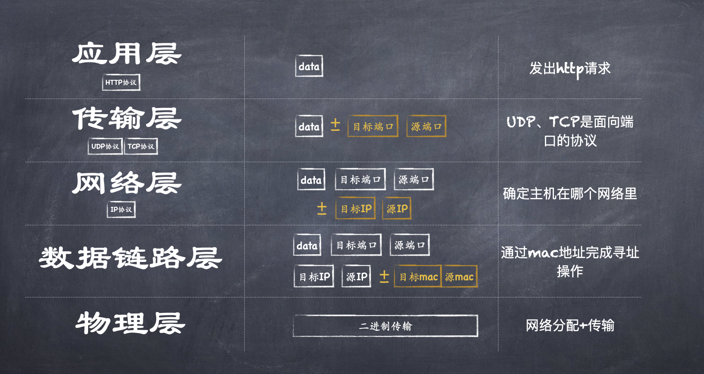
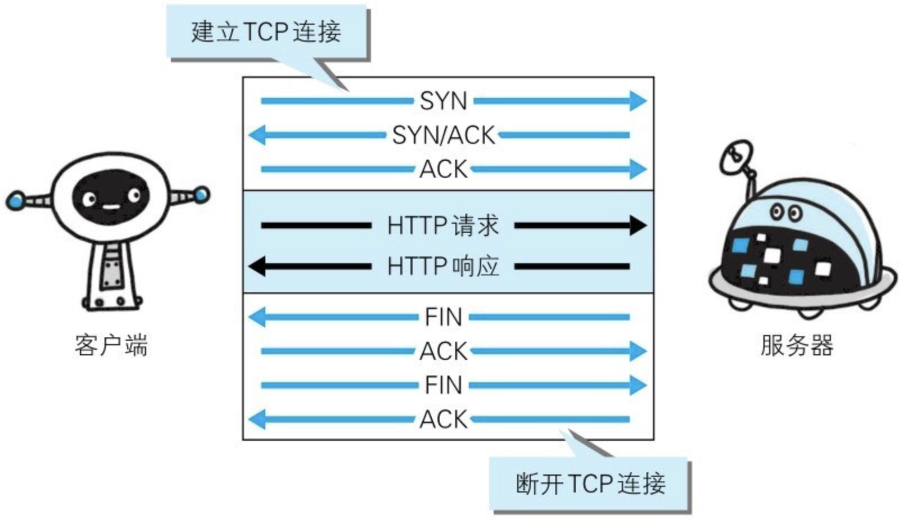
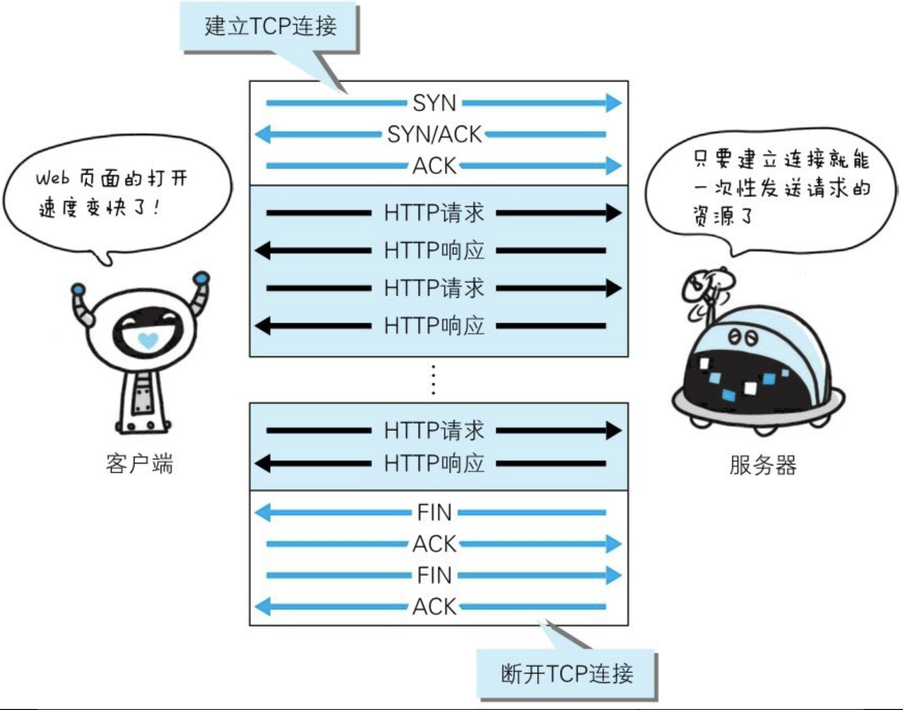
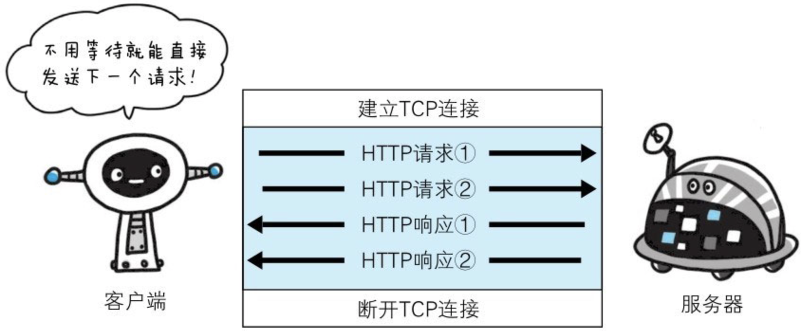
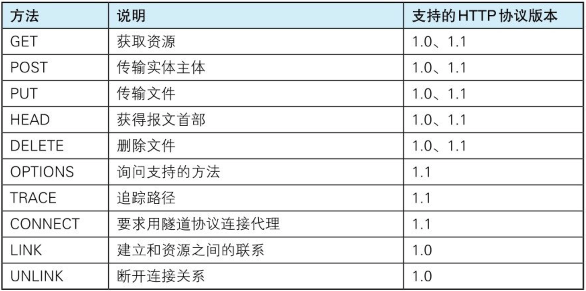
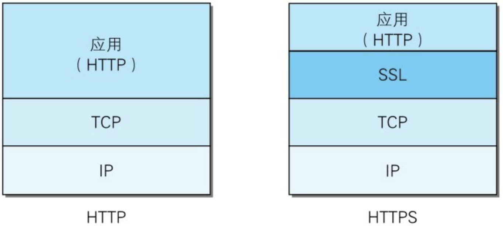

## TCP/IP 分层模型

依据网络层次模型（ TCP/IP 五层划分模式）来说明所传输数据的封装与解封装过程：

- 1.应用层-在应用层产生所要传输的数据，用 data 来表示（data）
- 2.传输层-常见的是 TCP、UDP 协议，两者都是基于端口的协议，端口的作用就是在主机上进程的唯一标识，所以这一层会被包裹上目标端口+源端口（目标端口+源端口+data）
- 3.网络层-一般来说主机都是处于不同的网络里，所以需要 ip 协议来确定目标主机所在的网络，因此数据在这一层会被包裹上目标主机的 ip 地址与当前主机的源 IP（目标 IP+源 IP+目标端口+源端口+data）（此时能够确定某一个网络，并不能在这个网络里哪一台机器是我们想要的）
- 4.数据链路层-通过 mac 地址完成寻址操作，所以数据会被包裹上目标主机与当前主机的 mac 地址（目标 mac+源 mac+目标 IP+源 IP+目标端口+源端口+data）（此时一条数据就被完整封装了）
- 5.物理层-网线无法识别二进制，所以经过网卡的调制之后就会变成高低电压，此时封装的数据就会转换成二进制形式，再经过路由器的网络分配和传输介质的运输，最终就会到达目标主机的网卡
- 6.物理层-进行数据解调，将电压变为二进制，再向上传递至链路层。
- 7.数据链路层-分析目标 mac 地址是否是当前主机的 mac 地址，如果是就拆解数据并继续向上层传递
- 8.网络层-分析目标 ip 是否是自己的 ip，如果是就拆解数据并继续向上层传递
- 9.传输层-分析目标端口是否是自己，如果是就拆解数据并继续向上层传递
- 10.数据层-此时主机 B 就拿到了主机 A 传过来的数据 data 了

## UDP 与 TCP 的区别

- UDP->面向无连接，TCP->面向有连接（需要在通信之前建立连接）
- TCP 可进行丢包时的重发控制，并对此虚乱掉的分包进行顺序控制，UDP 不可
- UDP 可随时发送数据，常用于即时通信、广播等

## 三次握手与四次挥手

为了准确无误地将数据送达目标处，TCP 协议采用了三次握手（three-way handshaking）策略。用 TCP 协议把数据包送出去后，TCP 不会对传达后的情况置之不理，它一定会向对方确认是否成功送达。
握手过程中使用了 TCP 的标志（flag）—— `SYN（synchronize）`和 `ACK（acknowledgement）`。

:::success{title=三次握手与四次挥手涉及到的标志}

- SYN：表示请求建立连接
- FIN：表示断开链接
- ACK：表示信息确认
  :::

发送端首先发送一个带 `SYN` 标志的数据包给对方。接收端收到后，回传一个带有 `SYN/ACK` 标志（应该是先发送 ACK 标志的包再发送 SYN 标志的包，但一般情况下两个请求合并进行）的数据包以示传达确认信息。最后，发送端再回传一个带 `ACK` 标志的数据包，代表“握手”结束。

### Q1：为什么是三次握手，而不是两次/四次握手？

两次握手无法保证消息确认送达，ACK 与 SYN 可以合并以减少一次请求。

### Q2：如何避免历史连接？

在网络拥塞下，旧的 SYN 先到达 server，server 回应 SYN+ACK，client 根据上下文判定是否是历史连接，如果是则回应断开连接。

### Q3：四次挥手为何不能合并为三次？

保证服务端对上一次未处理完成的数据响应处理完。

## 持久连接与管线化

| 版本    | 主要技术                               | 是否默认开启             | 并发                         | 解决的问题                                                                                                                                                    | 描述                                                                       | 图例                                |
| ------- | -------------------------------------- | ------------------------ | ---------------------------- | ------------------------------------------------------------------------------------------------------------------------------------------------------------- | -------------------------------------------------------------------------- | ----------------------------------- |
| HTTP1.0 | -                                      |                          | -                            | -                                                                                                                                                             | -                                                                          |          |
| HTTP1.1 | <Badge type="warning">持久连接</Badge> | 默认开启                 |                              | 每进行一次 HTTP 通信都需要建立一次 TCP 连接                                                                                                                   | 任意一端未提出断开连接则保持 TCP 连接                                      |      |
| http1.1 | <Badge type="warning">管线化</Badge>   | 默认不开启，需服务端支持 | 并发数量有限，比如 chrome->6 | 发送请求之后要等待，直到接收到响应才能发起在一个请求                                                                                                          | 在持久连接基础上实现了管线化机制，即可同时并行发送多个请求，不需要等待响应 |  |
| http2.0 | <Badge type="warning">多路复用</Badge> | -                        | 不需要考虑并发请求量         | 持久连接模式下，多个 http 请求放在一个 TCP 连接里，其响应顺序按请求顺序来的，如果有一个请求出现阻塞，后面的就需要等待，即<Badge type="error">线头阻塞</Badge> | 多个请求复用一个 TCP 连接，TCP 连接分若干流，且互不影响，不需按顺序响应。  | -                                   |

## HTTP 各版本

HTTP/1.0 和 HTTP/1.1 支持的方法：

- HTTP1.1
  - 增加了持久连接、管线化
  - 增加了 OPTIONS、TRACE、CONNECT 三种请求方法，废除了 LINK、UNLINK 两种方法
- HTTP2
  - 多路复用
  - push cache

## HTTPS

通常 HTTP 直接与 TCP 通信。当使用 SSL 时，则演变成先和 SSL 通信，再由 SSL 和 TCP 通信。简言之，HTTPS 是身披 SSL 协议外壳的 HTTP。

### HTTPS 的加密方式

- 对称加密：易泄漏
- 非对称加密：易篡改被冒充，效率低

HTTPS 采用<u>混合加密方式（对称加密+非对称加密）</u>，即非对称加密方式交换共享密钥，以对称加密方式进行通信。

### Q:为什么不一直使用 HTTPS？

## 申请证书的过程

略

## HTTP 状态码

HTTP 状态码由三个十进制数字组成，第一个十进制数字定义了状态码的类型，后两个数字没有分类的作用。响应分为五类：信息响应(100–199)，成功响应(200–299)，重定向(300–399)，客户端错误(400–499)和服务器错误 (500–599)：

|     | 类别                                         | 分类描述                                                                    |
| --- | -------------------------------------------- | --------------------------------------------------------------------------- |
| 1xx | Information(`信息`状态码)                    | 接受的请求正在处理                                                          |
| 2xx | Success（`成功`状态码）                      | 请求正常处理完毕                                                            |
|     | 200, OK（请求成功）                          | OK（请求成功）                                                              |
|     | 204, No Content（无内容）                    | 表示返回的响应报文中不含（也不允许返回）实体的主体部分。                    |
|     | 206, Partial Content（部分内容）             | 客户端进行了范围请求，响应报文内包含由 Content-Range 指定范围的实体内容     |
| 3xx | Redirection（`重定向`状态码）                | 需要进行附加操作以完成请求                                                  |
|     | 301, Moved Permanently（永久移动）           | 所请求资源已被永久移动到了另一个 URL 地址，在 Location 首部字段返回新的 URL |
|     | 302, Found（临时移动）                       | 和 301 不同的是，这种资源的 URI 变更是临时的额，而不是永久的                |
|     | 303, See Other（查看其他地址）               | 请求对应的资源存在着另一个 URI，应使用 GET 方法定向获取请求的资源           |
|     | 304, Not Modified（未修改）                  | 客户端直接使用缓存（虽然被分类在 3xx 中，但跟重定向没关系）                 |
| 4xx | Client Error（`客户端错误`状态码）           | 服务器无法处理请求                                                          |
|     | 400, Bad Request（错误请求）                 | 请求报文中存在错误，需修改请求内容后重新发起请求                            |
|     | 401, Unauthorized（未经授权）                | 第一次收到 401 表示需要用户认证，第二次收到 401 表示用户认证失败            |
|     | 403, Forbidden（拒绝请求）                   | 表明对请求资源的访问被服务器拒绝                                            |
|     | 404, Not Found（无法找到）                   | 服务器上无法找到请求资源                                                    |
| 5xx | Server Error（`服务端错误`状态码）           | 服务器处理请求出错                                                          |
|     | 500, Internal Server Error（内部服务器错误） | 服务器端在执行请求时发生了错误                                              |
|     | 503, Server Unavailable（服务不可用）        | 服务器暂时处于超负载或正在停机维护，暂时无法处理请求                        |

### 401 和 403 区别

- **认证与权限**：401 错误通常与认证（登录）相关，而 403 错误与权限（访问控制）相关。
- **用户信息**：401 错误意味着用户没有提供有效的用户信息，403 错误意味着用户虽然提供了用户信息，但是没有足够的权限。
- **解决方式**：401 错误通常需要用户登录或提供正确的认证信息，而 403 错误可能需要管理员调整权限设置或配置。
