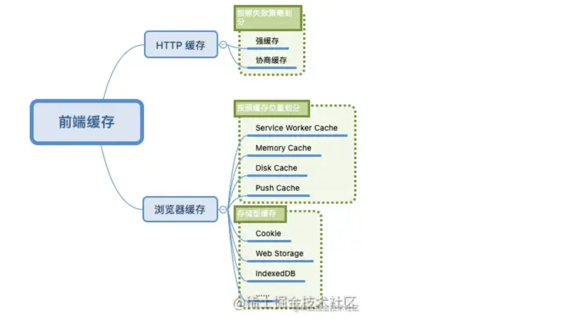
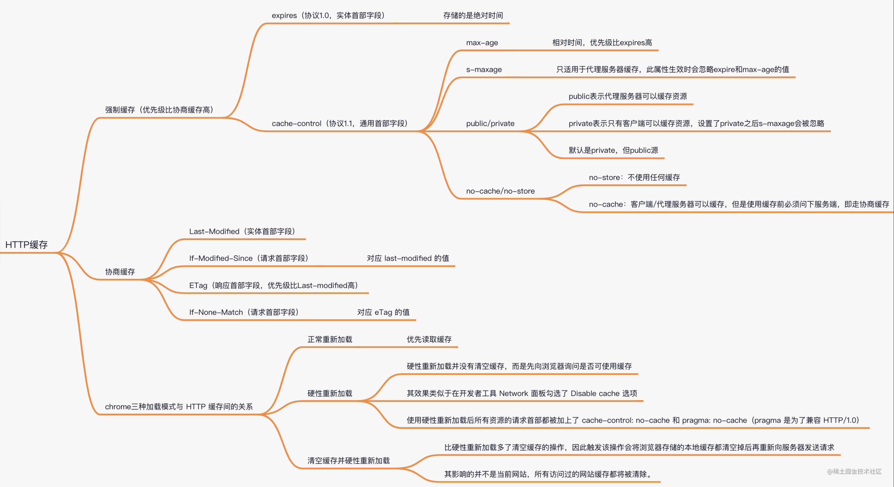

## 引言

## 浏览器缓存

## HTTP 缓存

HTTP 缓存是产生于客户端与服务器之间通信的一种缓存，利用这一缓存可以提升服务器资源的重复利用率，在有效的时间内不必每次都向服务器请求相同的资源，大大减少服务器的压力。

HTTP 缓存**按照失效策略划分**可以分为：

- 强缓存：不与服务器通信，直接从缓存中拿
- 协商缓存：先询问服务器缓存的有效性，再决定是否要重新发送请求

### 强缓存

强缓存涉及到两个首部字段名：`Expires`（实体首部字段）  和  `Cache-Control`（通用首部字段）。

:::success{title=强缓存的实现过程}

1. 浏览器首次请求资源，服务器返回响应时，在 Response Headers 中将过期时间（相对于服务器的时间）写入 expires 字段
2. 浏览器再次请求资源时，浏览器会对比本地时间与 expires 的时间，如果未过期就直接使用缓存，**不再向后端发起请求**
   :::

由于`Expires`是一个绝对时间，是一个时间戳，如果服务器和浏览器之间存在时差，那么就会判定失误，因此在 HTTP 1.1 引入了`Cache-Control`字段。

该字段有四个值：

#### max-age

`max-age`是一个相对时间，是一个时间长度，以客户端请求到此资源的时间为起点，从而规避时间差的问题（与请求到资源的时间做对比）。

如果同时设置了`expires`与`cache-control:max-age=xxx`，那么以后者为主，后者优先级更高。

#### public/private

默认是 private，但是 public 在很多情况下不需要手动设置。

- public 表示代理服务器可以缓存资源
- private 表示只有客户端可以缓存资源，设置了 private 之后 s-maxage 会被忽略

#### s-maxage

s-maxage 就是用于表示 cache 服务器上（比如 cache CDN）的缓存的有效时间的，并只对 public 缓存有效。

#### no-cache/no-store

- no-store 表示不使用任何缓存策略
- no-cache 表示客户端/代理服务器可以缓存，但是使用缓存前必须问下服务端，也就是走**协商缓存**

> 优先级较高的是强缓存，在命中强缓存失败的情况下，才会走协商缓存。

##### no-cache

- no-cache 指令并不意味着完全禁止缓存。实际上，它允许缓存存储响应，但要求在使用该缓存响应之前，必须先向原始服务器验证其有效性。
- 当一个请求带有 no-cache 指令时，浏览器会发送一个条件请求（如使用 If-Modified-Since 或 If-None-Match 头部），询问服务器缓存的内容是否仍然有效。如果服务器确认内容没有变化，就会返回一个 304 （未修改）状态码，指示浏览器可以继续使用缓存的版本；如果内容有变化，服务器则会返回新的内容。

##### no-store

- no-store 指令则是彻底禁止缓存。它要求浏览器和任何中间代理都不应存储任何关于这个请求或响应的信息。
- 当一个响应标有 no-store 指令时，浏览器和代理必须立即删除任何已存储的对应缓存项，并且不得在本地存储请求或响应的任何部分。这意味着每次请求都必须直接发送到服务器，即使网络条件良好，也无法使用缓存的响应。

总结起来，no-cache 是要求在使用缓存响应前进行验证，而 no-store 则是完全禁止存储响应。no-cache 可能仍能提高加载速度，因为它允许在验证后使用缓存，而 no-store 则可能会导致性能下降，因为它强制每次都从服务器获取数据。

### 协商缓存

协商缓存一共涉及到四个首部字段名：

- 实体首部字段`Last-Modified`
- 响应首部字段：`ETag`
- 两个请求首部字段：`If-Modified-Since`、`If-Non-Match`

协商缓存的实现过程：

- 浏览器首次发起请求，服务端返回`Last-Modified`字段
- 浏览器以后每次发起请求，都会携带`If-Modified-Since`（值对应服务端返回`Last-Modified`字段），如果资源无变更，服务端就会返回`304 Not Modified`，表示重定向到浏览器缓存，有改变就返回新的

为了更准确的感知资源的变化，出现了`ETag`和`If-Non-Match`。Etag 是由服务器为每个资源生成的唯一的**标识字符串**，用来感知文件变化。

服务端返回`ETag`字段，浏览器进行保存，`If-Non-Match`的值就对应`ETag`的值。

> 当 Etag 和 Last-Modified 同时存在时，以 Etag 为准。

## chrome 三种加载模式

Chrome 具备三种加载模式，开启开发者工具时在浏览器
左上角刷新按钮上右键鼠标可以进行操作。

#### 1.正常重新加载

这种就是普通的刷新页面，会去读取缓存

#### 2.硬性重新加载

效果类似于在开发者工具 Network 面板勾选了 Disabled cache 选项。使用硬性重新加载后所有资源的请求首部都会被加上`cache-control:no-cache`和`pragma: no-cache`属性，表示不直接使用缓存，要求向源服务器发起请求， pragma 则是为了兼容 HTTP/1.0。

#### 3.清空缓存并硬性重新加载

这个模式就相当于先清空缓存，再重新向服务器发送请求。同时其影响的并不是当前网站，所有访问过的网站缓存都将被清除。
