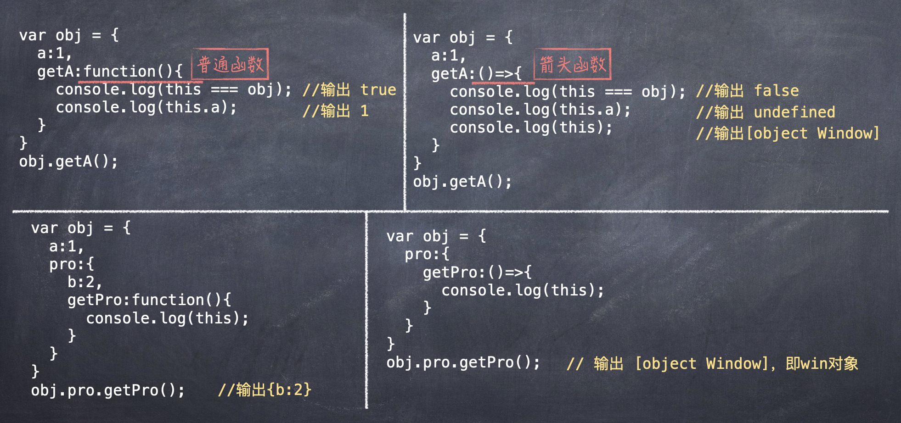
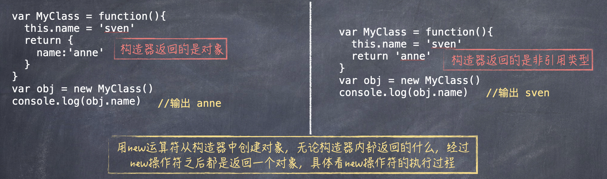

## 前置知识

### this

this 指向主要分为四类：

- 作为对象的方法调用
- 作为普通函数调用
- 构造器调用
- Function.prototype.call 或 Function.prototype.apply 调用

#### 1.作为对象的方法调用

#### 2.作为普通函数调用

当函数不作为对象的属性被调用时，也就是我们常说的普通函数方式，此时的 this 总是指向全局对象，也就是 window 对象。

#### 3.构造器调用

JS 中没有类，但可以从构造器中创建对象，同时也提供了`new运算符`，使构造器看起来更像一个类。

#### 4.Function.prototype.call 或 Function.prototype.apply 调用

跟普通的函数调用相比，用 Function.prototype.call 或 Function.prototype.apply 可以动态的改变传入函数的 this：

### call 和 apply

## 概念

:::info{title=单例模式的核心}
<u>确保只有一个实例，并提供全局访问。</u>
有很多对象只需要一个，比如线程池、全剧缓存、浏览器中的 window 对象等。
:::

:::info{title=适用场景}

- 页面中的登录弹窗：点击按钮出现登陆弹窗，无论单击多少次，弹窗只会创建一次，这个登陆弹窗就合适用单例模式来创建。

:::
