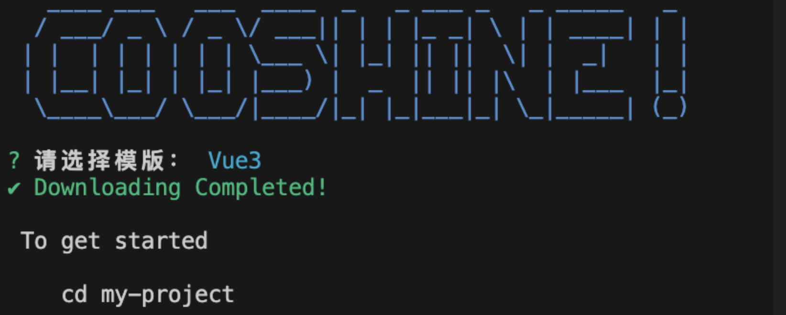

最终效果：



## 准备工作

- 确定 cli 脚手架名称：`cooshine-cli`，先在[npm 官网](https://www.npmjs.com/)搜索下是否有被注册，有被注册就要换个名称
- [Github 地址](https://github.com/aojiaodemeng/cooshine-cli)

## 初始化项目

### step1. 创建项目

- 1.本地创建`cooshine-cli`文件夹
- 2.执行 `npm init`，生成一个`package.json`文件
- 3.创建`bin/index.js`，内容为：
  ```js
  console.log('test');
  ```
- 4.添加`package.json`文件里的`bin`字段

```json
{
  "name": "cooshine-cli",
  "version": "1.0.0",
  "description": "cooshine命令",
  "main": "index.js",
  "bin": {
    "cooshine": "bin/index.js"
  },
  "scripts": {
    "test": "echo \"Error: no test specified\" && exit 1"
  },
  "author": "cooshine",
  "license": "ISC"
}
```

其中的`"cooshine": "bin/index.js"`就是 cli 命令执行是的入口文件，其中命令为 cooshine。

### step2. 本地调试

由于还没有发布包，开发时，执行以下命令，把当前项目中 package.json 的 bin 字段链接到全局变量，就可以在任意文件夹中使用你的 CLI 脚手架命令了：

```yaml
npm link // 添加软链接
npm unlink cooshine-cli// 断开软链接
```

然后执行:

```yaml
cooshine
```

如果输出`bin/index.js`文件里的内容，说明基本项目打通了。

### step3. 发布

登录 npm 账号：

```yaml
 npm login
 npm notice Log in on https://registry.npmjs.org/

 Username: ...
 PassWord: ...
 Email: ...
```

然后执行 `npm publish` 即可。

如果想要再次更新，我们需要 改变 package.json 中的 version 才能使用 npm publish
如果你想删除的话，使用命令 `npm unpublish -f 包名` 即可

### step4. 使用

当我们发布成功后，就要使用刚才的命令,我们使用 `npm install cooshine-cli` 下载到本地，而在 bin 中的命令 cooshine 也可使用了
注意：目前可以使用 cooshine 命令，但还没有写具体操作，所以没有任何效果，接下来讲讲一些基本操作。

## 正式开发

### step1. 安装依赖

主要用到了下面几个第三方库：

- 1.chalk，让你的 CLI 工具五颜六色
- 2.figlet，作用是将字母转化为图片，使之更加醒目。->让你的 CLI 显示一个漂亮的 logo
- 3.commander，解析命令参数
- 4.clear：清空控制台
- 5.inquirer：在命令行中打出交互式的命令
- 6.git-pull-or-clone：将代码下载

```yaml
npm install chalk figlet commander clear inquirer git-pull-or-clone
```

### step2. 显示一个漂亮 logo

使用 `figlet` 和 `chalk` 这两个库来实现。
注意`chalk`安装版本 4 的：

> IMPORTANT: Chalk 5 is ESM. If you want to use Chalk with TypeScript or a build tool, you will probably want to use Chalk 4 for now.

新建`bin/api.js`文件：

```js
const chalk = require('chalk');
module.exports.log = (msg, color = 'green', ...arg) =>
  console.log(chalk[color](msg, arg));
```

新建`bin/index.js`文件：

```js
#! /usr/bin/env node
const { promisify } = require('util');
const figlet = promisify(require('figlet'));
const clear = require('clear');
const { log } = require('../lib/api.js');

const logoText = figlet.textSync('COOSHINE!', {
  horizontalLayout: 'Isometric1',
  verticalLayout: 'default',
  width: 80,
  whitespaceBreak: true,
});
clear();
// 输出绿色的Logo
log(logoText, 'green');
```

执行`cooshine`命令看是否成功输出。

### step3. 查看当前 cli 版本

主要实现内容：定义当前版本，通过 command 设置 -v 和 --version 参数输出版本号

```js
const inquirer = require('@inquirer/prompts');
const { Command } = require('commander');
const program = new Command();

const package = require('../package.json');
// 定义当前版本，通过 command 设置 -v 和 --version 参数输出版本号
program.option('-v, --version', `Cooshine-Cli Version: ${package.version}`);
```

执行`cooshine -v`看是否能输出版本号。

### step4. 设置 init 命令用于创建项目

通过 inquirer 进行问答，设置 init 命令开始创建模板：

```js
const ora = require('ora');
const spinner = ora('Downloading...');

program
  .command('init')
  .argument('<name>')
  .action(async (name) => {
    log(logoText, 'blue');
    // 选择模版
    const template = await inquirer.select({
      message: '请选择模版：',
      choices: templateChoices,
    });
    const cur = templateChoices.find((i) => i.value === template);
    spinner.start();
    download(`direct:${cur.repo}`, name, { clone: true }, (err) => {
      if (err) {
        spinner.fail(chalk.red('下载失败 \n' + err));
        process.exit();
      }
      spinner.succeed(chalk.green('Downloading Completed!'));
    });
  });
```

执行命令：`cooshine init my-project`，并选择模版，看是否成功。
