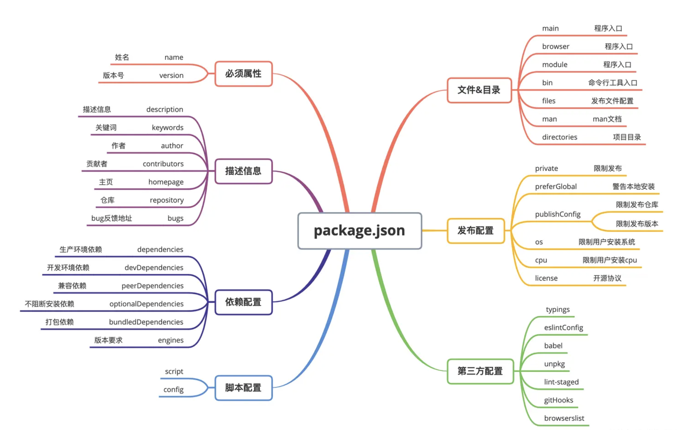
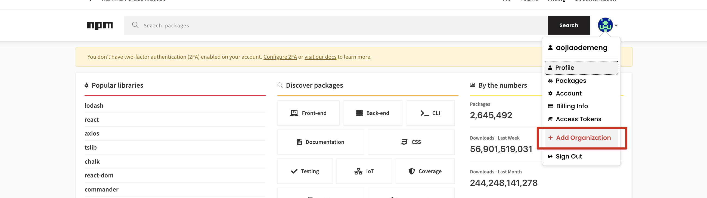
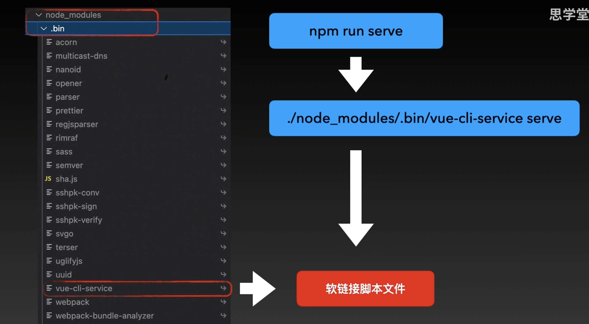
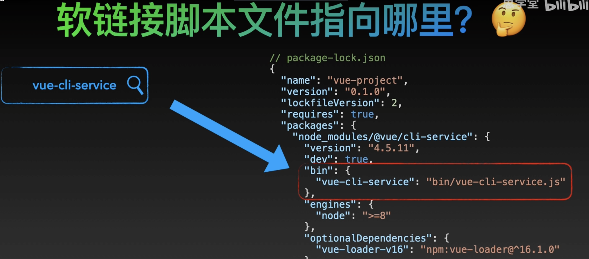
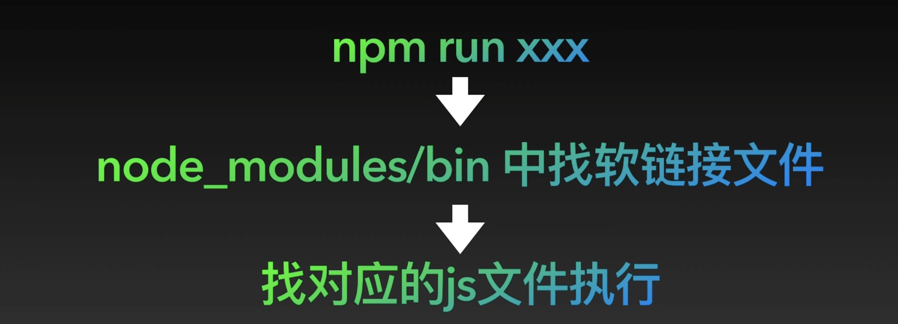

一个包或者子模块不一定发布到 npm 仓库，但一定有 package.json 文件。package.json 所在的目录就代表了一个模块/包，这个 json 文件定义了模块的各种配置，例如基本信息、依赖关系、构建配置等等。所有包管理器(npm/yarn/pnpm)以及绝大多数构建工具都会依赖于这个配置文件的信息。

package.json 中的字段并没有一个绝对统一的标准，除了官方约定的部分标准字段外，很多字段其实是特定的工具约定的，所以我们分析配置的时候，要明确一个关键点，即这个字段到底由谁读取。

package.json 常见配置项如下：


相关文档：

- [官方文档：package.json](https://docs.npmjs.com/cli/v9/configuring-npm/package-json/#homepage)
- [你真的了解 package.json 吗？](https://juejin.cn/post/6987179395714646024)
- [关于前端大管家 package.json，你知道多少？](https://juejin.cn/post/7023539063424548872)

## 1.标识信息 name 与 version

### name 字段

name 是区分 npm 包的唯一标识。当一个 npm 仓库中的包被安装到本地，我们能通过名称引用，而不必写复杂的 node_modules/... 引入路径就是得益于此。

#### npm 包前的@是什么意思？

带有@的包表示该包是范围包。如果有一个包是@test/myPlugs，那么你可以发布一个@my/myPlugs。如果是无范围的包，且存在一个 myPlugs 包，你发布的包名就不能是 myPlugs 了。

在同一范围的包会被安装到同一子目录下。例如 @vue/reactivity 和 @vue/runtime-core 会被安装到 node_modules 目录的 @vue 目录下，vue 不属于任何范围，就会被安装到 node_modules 根目录。

```js
📦node_modules
 ┣ 📂@vue
 ┃ ┣ 📂reactivity
 ┃ ┗ 📂runtime-core
 ┣ 📂vue
```

每个人都可以在[npm.js](https://www.npmjs.com/)建立自己的范围空间。


### version 字段

`version` 字段表示包的版本号，大致符合 `x.x.x` 的格式，严格来说应该叫 `major.minor.patch(主版本号.次版本号.修订号)`，npm 是使用的 semver 语义版本号标准。

- [semver 语义版本号标准](https://semver.org/)
- [【一库】semver：语义版本号标准 + npm 的版本控制器 🧲](https://juejin.cn/post/7122240572491825160)

## 2.入口文件：main、module、browser

| 字段    | 适用环境                                                                          | 描述                                                                     |
| ------- | --------------------------------------------------------------------------------- | ------------------------------------------------------------------------ |
| main    | browser、node                                                                     | 指定加载的入口文件，当 main 字段都不存在时，通常会使用 index.js 作为入口 |
| module  | browser、node，如果 npm 包导出的是 ESM 规范的包，使用 module 来定义入口文件       | 定义 npm 包的 ESM 规范的入口文件                                         |
| browser | 如果 npm 包只在 web 端使用，并且严禁在 server 端使用，使用 browser 来定义入口文件 | 定义 npm 包在 browser 环境下的入口文件                                   |

```js
"main": "./src/index.js",
"browser": "./src/index.js" ,
"module": "./src/index.mjs",   // 注意.js 文件是使用 commonJS 规范的语法(require('xxx'))，.mjs 是用 ESM 规范的语法(import 'xxx')
```

上面三个入口配置是有差别的，特别是在不同的使用场景下。

在 Web 环境中，如果使用 loader 加载 ESM（ES module），那么这三个配置的加载顺序是 `browser→module→main`，如果使用 require 加载 CommonJS 模块，则加载的顺序为 `main→module→browser`。
​
Webpack 在进行项目构建时，有一个 target 选项，默认为 Web，即构建 Web 应用。
如果需要编译一些同构项目，如 node 项目，则只需将 webpack.config.js 的 target 选项设置为 node 进行构建即可。
如果在 Node 环境中加载 CommonJS 模块，或者 ESM，则只有 main 字段有效。

## 3.bin 字段

:::warning{title=思考一个问题}
👉 全局安装 vue-cli 之后，为什么就能在任何目录使用 vue create xxx 来创建项目？
其实是用到了 bin 字段+符号链接。
:::

假如你发布了一个 npm 包，其中带有执行脚本，你希望用户安装你的 npm 包的时候，把可执行的脚本文件也安装下来，就会用到这个 bin 字段。比如 test 包自带一个执行脚本，对应 的 package.json 如下：

```js
📦test
 ┣ 📂bin
 ┃ ┣ jest.js
 ┣ package.json
```

```js
// package.json
{
  "bin":{
    "jest":"./bin/jest.js"
  }
}
```

### 符号链接

符号链接是一种特殊的文件，包含指定文件的路径引用，类似于桌面的快捷打开方式。

局部安装：在项目中局部安装 test 包后，npm 会在项目中的 node_modules/.bin 目录下创建一条符号链接，点击这个文件，就会链接到 bin 字段中定义的 jest.js 文件：

```js
📂node_modules
 ┣ 📂.bin
 ┃ ┣ jest.js
```

全局安装：npm 会在环境变量路径/usr/local/bin 目录下（MAC）创建一个 symbolic，指向 bin 字段中声明的文件，这样在当前用户任意目录下，都可以使用 bin 属性中定义的命令了。

## 4.files 字段 与.npmignore 文件

files 配置是一个数组，用来描述当把 npm 包作为依赖包安装时需要说明的文件列表。当 npm 包发布时，files 指定的文件会被推送到 npm 服务器中，如果指定的是文件夹，那么该文件夹下面所有的文件都会被提交。

```
"files": [
    "LICENSE",
    "Readme.md",
    "index.js",
    "lib/"
 ]
```

如果有不想提交的文件，可以在项目根目录中新建一个.npmignore 文件，并在其中说明不需要提交的文件，防止垃圾文件推送到 npm 上。这个文件的形式和.gitignore 类似。写在这个文件中的文件即便被写在 files 属性里也会被排除在外。比如可以在该文件中这样写：

```
node_modules
.vscode
build
.DS_Store
```

## 5.脚本配置：scripts 与 config

```js
"files": [
    "LICENSE",
    "Readme.md",
    "index.js",
    "lib/"
 ]
```

### scripts 字段

scripts 指定了运行脚本命令的 npm 命令行缩写。还可以结合 pre 和 post 完成前置和后续操作：

```js
"scripts": {
	"dev": "node index.js",
  "predev": "node beforeIndex.js",
  "postdev": "node afterIndex.js"
}
```

当执行`npm run dev`命令时，三个命令都会执行，执行顺序是`predev→dev→postdev`。

### config 字段

config 字段用来配置 scripts 运行时的配置参数。

```js
{
  "name" : "test",
  "config": {"port": 3000}
}

```

如果运行 npm run start，则 port 字段会映射到`npm_package_config_port`环境变量中：

```js
console.log(process.env.npm_package_config_port); // 3000
```

用户可以通过 npm config set 来修改这个值：

```js
npm config set test:port 8000
```

## 6. type:"module"

- type 字段的产生用于定义 package.json 文件和该文件所在目录根目录中.js 文件和无拓展名文件的处理方式。值为'moduel'则当作 es 模块处理；值为'commonjs'则被当作 commonJs 模块处理
- 目前 node 默认的是如果 pacakage.json 没有定义 type 字段，则按照 commonJs 规范处理
- node 官方建议包的开发者明确指定 package.json 中 type 字段的值
- 无论 package.json 中的 type 字段为何值，.mjs 的文件都按照 es 模块来处理，.cjs 的文件都按照 commonJs 模块来处理

## npm run xx 命令执行后发生了什么

假设`package.json`文件部分内容如下：

```json
{
  "name": "npm-test",
  "scripts": {
    "serve": "vue-cli-service serve"
  }
}
```

### 1.为什么不能直接执行`xxx serve`

当我们执行`npm run serve`时，就相当于执行了了右边的`vue-cli-service serve`，但是为什么不能直接执行`vue-cli-service serve`命令呢？

```zsh
vue-cli-service serve  // 直接执行这个命令会返回报错信息：zsh:command not found vue-cli-service
```

当使用命令`npm i @vue-cli-service`安装`vue-cli-service`依赖包后，我们会在`node_modules`文件夹下的`.bin`文件夹会有相应文件`vue-cli-service`，文件右侧会有个小箭头，代表这个文件是软链接脚本文件。

执行`npm run serve`命令就相当于执行了`./node_modules/.bin/vue-cli-service serve`，而如果直接执行`vue-cli-service serve`命令就会找不到对应的软链接脚本文件。



全局搜索`vue-cli-service`，可以在`package-lock.json`文件找到指令的对应关系，其软链接脚本文件执行右侧的 JS 文件。


### 2.总结


当执行`npm run xx`时，就会在`node_modules`文件夹里找到对应的软链接脚本文件，再找到对应的 js 文件执行。
