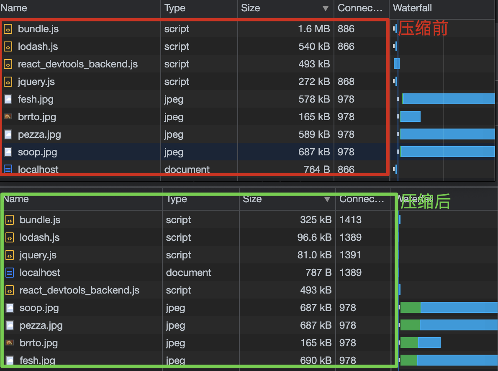
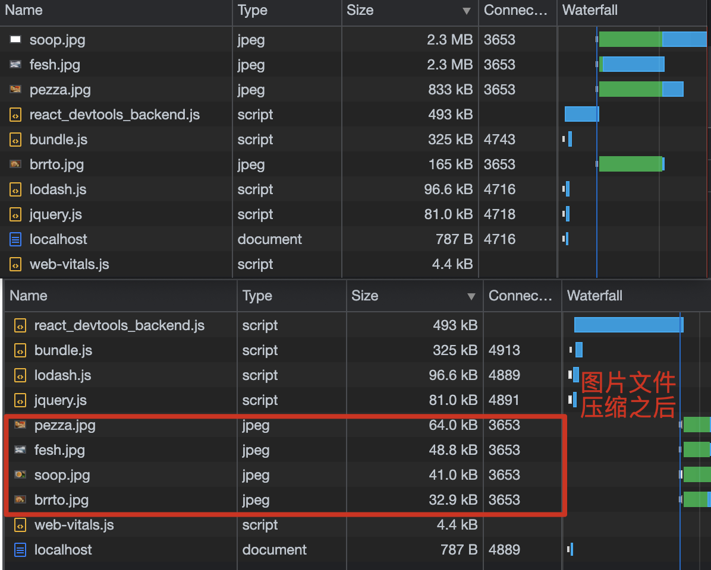
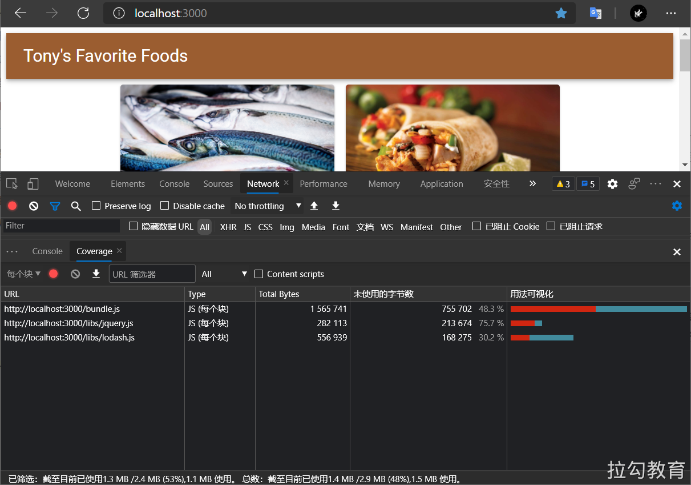
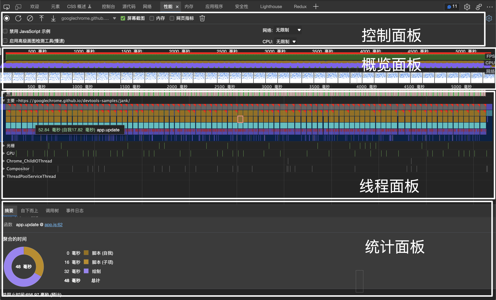

## 常见的检测工具

- Lighthouse
- WebPageTest
- 浏览器 DevTools
  - 浏览器任务管理器
  - Network、Coverage、Memory、Performance、Performance monitor 面板
- 性能监控 Api
- 持续的性能监控方案

## 一、使用 Lighthouse 测试性能

### 1.使用方式

Lighthouse 提供了多种使用方式。 [Npm-Lighthouse](https://github.com/GoogleChrome/lighthouse)

- 在 Chrome DevTools 中使用 Lighthouse
- 使用 Chrome 扩展
- 使用 Node CLI 命令行工具
- 使用 Node 包

Lighthouse 的最终得分由五个指标综合给出，每个指标所占的权重可以见[Lighthouse Scoring Calculator](https://googlechrome.github.io/lighthouse/scorecalc/)

### 2.Lighthouse 练习案例

#### 2-1.练习准备

- step1.进入[官网-chrome 官网-Performance-Optimize website speed](https://developer.chrome.com/docs/devtools/speed/get-started/)
- step2.点击“Set Up”-“Open the source code for the site”
- step3.项目最好 clone 到本地：登录->Remix Project（复制到自己账户下）->Tools->Import and Export-> git clone。（见 root-lapis-rat 文件夹）
- step4.进入刚 clone 下来的项目文件夹 root-lapis-rat，并`npm i`安装依赖,`npm run start`启动服务。
- step5.使用 lighthouse 工具进行评分

#### 2-2.Enable text compression 启用文本压缩

- step1:在 server.js 文件中加入 compression

```js
const express = require('express');
const app = express();
const fs = require('fs');

+ const compression = require('compression')
+ app.use(compression())

app.use(express.static('build'));
const listener = app.listen(process.env.PORT || 1234, function () {
  console.log(`Listening on port ${listener.address().port}`);
});
```

- step2.终端 ctrl+c，再执行`node ./server.js`（因为不是更改源代码，不需要重新构建，直接运行即可），重新回到页面（不用刷新），点击 lighthouse 面板里的“+”，生成新的报告（不会清除上一次的报告），发现分数提高了 1 分（分不在多，提高了就行...）



#### 2-3:Resize images

- step1.进入 src/model.js 文件，将变量 dir 由 big 改为 small。终端 ctrl+c，再执行`npm run start`



#### 2-4.去除未使用到的文件

- step1.进入 template.html 文件中，去掉两个对 lodash.js 以及 jquery.js 文件的引用。优化后，Total Blocking Time 分数上升。

#### 2-5.构建优化

比如将 webpack.config.js 文件中的 mode 改为“production”，生产模式会做相应的构建优化，比如移除未使用的资源。

#### 2-6.代码优化

- step1.清除 App.js 文件里 mineBitcoin 方法（这个方法什么也没做）的调用。

## 二、使用 WebPageTest 测试性能

他测试的功能用 chrome 也能测试出来，不过 WebPageTest 的优势是基于多地点的测试。
[官方网站](https://www.webpagetest.org/)
比如进行淘宝网的测试。除了给出各个维度的指标评分，也会打印出测试过程中 api 请求。

### Waterfall View

会给某些 api 请求进行标黄处理，比如对于资源重定向（302）的 api 请求会标黄，可以进行优化一下。

### Request Details


## 三、使用 Chrome DevTools 测试性能

### 1.浏览器任务管理器

通过 Chrome 任务管理器我们可以查看当前 Chrome 浏览器中，所有进程关于 GPU、网络和内存空间的使用情况，这些进程包括当前打开的各个页签，安装的各种扩展插件，以及 GPU、网络、渲染等浏览器的默认进程，通过监控这些数据，我们可以在有异于其他进程的大幅开销出现时，去定位到可能存在内存泄漏或网络资源加载异常的问题进程。

### 2.Network 网络分析

参考： https://developer.chrome.com/docs/devtools/network/

Network 面板是 Chrome 开发者工具中一个经常会被用到的工具面板，通过它可以查看到网站所有资源的请求情况，包括加载时间、尺寸大小、优先级设置及 HTTP 缓存触发情况等信息，从而帮助我们发现可能由于未进行有效压缩而导致资源尺寸过大的问题，或者未合理配置缓存策略导致二次请求加载时间过长的问题等。

### 3.网络请求阻止

使用场景：禁止某个网络请求，看对页面的影响。  
使用步骤：

- 打开方式：Ctrl+ Shift + P -> Show Network Request Blocking
- 启用网络请求阻止
- 添加阻止规则

### 4.Coverage 面板

Coverage 面板监控并统计出网站应用运行过程中代码执行的覆盖率情况。分析哪些文件里的代码没有用到。

使用步骤：

- 打开方式：Ctrl+ Shift + P -> Coverage



### 5.Memory 面板

分析是否有内存泄露，可以直接看到是哪个变量没有被回收

### 6.Performance 面板

打开测试示例：https://googlechrome.github.io/devtools-samples/jank/

面板信息分为四类：控制面板、概览面板、线程面板以及统计面板。


#### 概览面板

这部分可以可观察到的性能信息为：FPS、CPU 开销和网络请求时间。对每秒帧数而言，尽量保持在 60FPS 才能让动画有比较流畅的视觉体验。

- FPS：比如在 FPS 那一部分，看到大片的红色，就表示页面刷新率很低，正常的话，应该呈现出绿色或者没有颜色。
- CPU：在 CPU 部分，黄色跟紫色占满了，表示主线程占满了，此时如果有其他操作，此时就很难响应。
- 网络：示例中没有进行请求。（在网络下面的部分，呈现了每一帧的画面截图，再往下，就是 Frames）
- Frames：呈现了当前绘制帧的相关信息。包括绘制时间，其中红色部分表示发生了丢帧。

#### 线程面板

- 主要：展现了当前运行的火焰图，x 表示时间进度，y 表示事件，通过鼠标在概览面板上的滚动缩小观察范围，当在线程面板中任务调用有红色标记，表示这个任务是一个长任务（长任务会占用 cpu 时间，无法响应其他操作）


可以看到图中的长任务（点击任务，按 W 和 S 可以进行放大缩小，A 和 D 进行左右移动），还发生了重排：


#### 统计面板

- Summary 页签中会展示各类任务事件耗时的环形图
- Bottom-Up 页签中可以查看各个事件耗费时间的排序列表，列表会包含两个维度：去除子事件后该事件本身的耗时和包含子事件从开始到结束的总耗时。
- Call Tree 页签中可以查看全部或指定火焰图中某个事件的调用栈，如下图所示。
- Event Log 页签中可查看关于每个事件的详细日志信息，如图下图所示。

### 7.FPS 计数器和 Performance monitor


## 参考文章

- https://developer.chrome.com/docs/devtools/
- https://developer.chrome.com/docs/devtools/evaluate-performance/
- https://docs.microsoft.com/zh-cn/microsoft-edge/devtools-guide-chromium/evaluate-performance/
