## 性能定义

[链接 🔗：MDN 上的 Web 性能定义](https://developer.mozilla.org/en-US/docs/Learn/Performance/What_is_web_performance)

Web 性能时网站或应用程序的客观度量和可感知的用户体验。

- 减少整体加载时间：减小文件体积、减少 HTTP 请求、使用预加载
- 使网站尽快可用：仅加载首屏内容，其它内容根据需要进行懒加载
- 平滑和交互性：使用 CSS 替代 JS 动画、减少 UI 重绘
- 感知表现：你的页面可能不能做的更快，但你可以让用户感觉更快。耗时操作要给用户反馈，比如加载动画、进度条、骨架屏等提示信息
- 性能测定：性能指标、性能测试、性能监控持续优化

## 如何进行 Web 性能优化？

- 1.首先需要了解性能指标 - 多快才算快？
- 2.使用专业的工具可量化的评估出网站或应用的性能表现
- 3.然后立足于网站页面响应的生命周期，分析出造成较差性能表现的原因
- 4.最后进行技术改造、可行性分析等具体的优化实施
- 5.迭代优化

## 生命周期

网站页面的生命周期，通俗地讲就是从我们在浏览器的地址栏中输入一个 URL 后，到整个页面渲染出来的过程。整个过程包括域名解析，建立 TCP 连接，前后端通过 HTTP 进行会话，压缩与解压缩，以及前端的关键渲染路径等，把这些阶段拆解开来看，不仅能容易地获得优化性能的启发，而且也能为今后的前端工程师之路构建出完整的知识框架，网站页面加载的生命周期如下图所示。
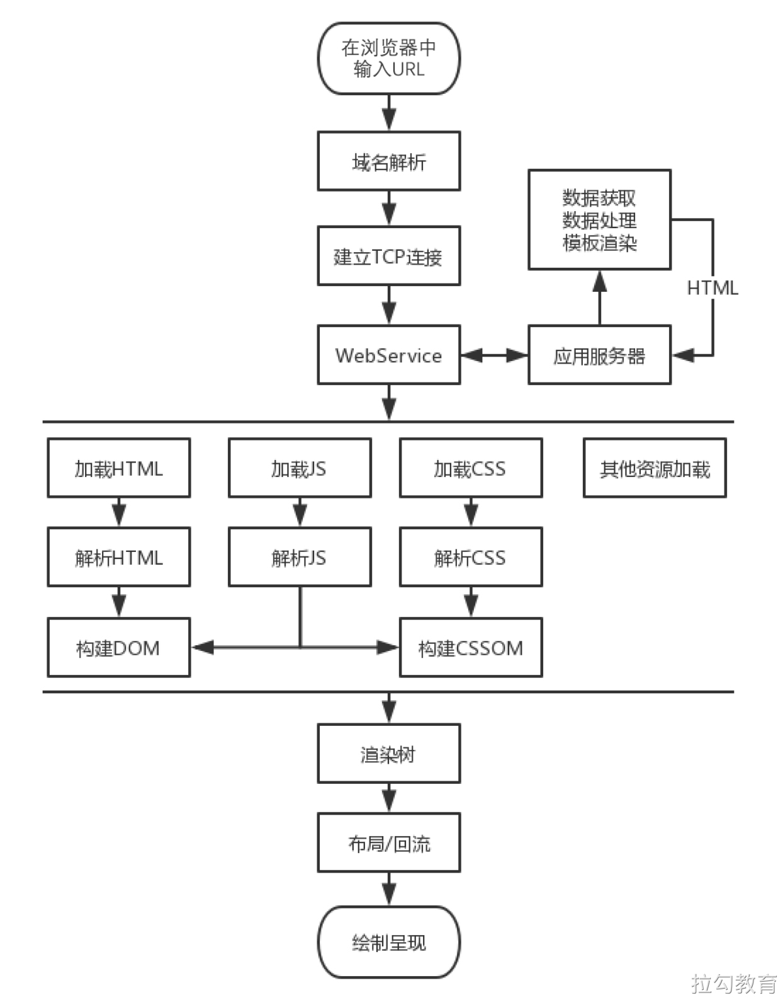

## 优化方案

经过对网站页面性能的测量及渲染过程的了解，相信你对于糟糕性能体验的原因已经比较清楚了，那么接下来便是优化性能，这也是本课程所要呈现给读者的大部分篇幅。本节先简单扼要地介绍一些优化方面的思路。

- 从发出请求到收到响应的优化，比如 DNS 查询、HTTP 长连接、HTTP 2、HTTP 压缩、HTTP 缓存等。
- 关键渲染路径优化，比如是否存在不必要的重绘和回流。
- 加载过程的优化，比如延迟加载，是否有不需要在首屏展示的非关键信息，占用了页面加载的时间。
- 不同的格式类型会有不同的使用场景，在使用的过程中是否恰当。
- 构建优化，比如压缩合并、基于 webpack 构建优化方案等。
- ...

## 性能指标

- [RAIL 性能模型](https://web.dev/rail/)
- [基于用户体验的核心指标](https://web.dev/metrics/)
- [新一代性能指标：Web Vitals](https://web.dev/vitals/)

我们已经知道性能的重要性，但当我们讨论性能的时候，让一个网页变得跟快，具体是指哪些？
事实上性能是相对的：

- 对于一个用户而言，一个站点可能速度很快（在具有功能强大的设备的快速网络上），而对于另一用户而言，一个站点可能会较慢（在具有低端设备的慢速网络上）。
- 两个站点可能会在完全相同的时间内完成加载，但一个站点似乎加载速度会更快（如果它逐步加载内容，而不是等到最后显示任何内容）。
- 一个网站可能会出现快速加载但后来（在全部或没有）慢慢地响应用户的交互。

所以在讨论性能的时候，精确的、可量化的指标很重要。

但是，仅仅因为一个度量标准是基于客观标准并且可以定量地度量的，并不一定意味着这些度量是有用的。

对于 Web 开发人员来说，如何衡量一个 Web 页面的性能一直是一个难题。

最初，我们使用 Time to First Byte、DomContentLoaded 和 Load 这些衡量文档加载进度的指标，但它们不能直接反应用户视觉体验。

为了能衡量用户视觉体验，Web 标准中定义了一些性能指标，这些性能指标被各大浏览器标准化实现，例如 First Paint 和 First Contentful Paint。还有一些由 Web 孵化器社区组（WICG）提出的性能指标，如 Largest Contentful Paint 、Time to Interactive、First Input Delay、First CPU Idle。另外还有 Google 提出的 First Meaningful Paint、Speed Index，百度提出的 First Screen Paint。

这些指标之间并不是毫无关联，而是在以用户为中心的目标中不断演进出来的，有的已经不再建议使用、有的被各种测试工具实现、有的则可以作为通用标准有各大浏览器提供的可用于在生产环境测量的 API。

### RAIL 性能模型

RAIL 是 Response，Animation，Idle 和 Load 的首字母缩写，是一种由 Google Chrome 团队于 2015 年提出的性能模型，用于提升浏览器内的用户体验和性能。

RAIL 模型的理念是”以用户为中心，最终目标不是让您的网站在任何特定设备上都能运行很快，而是使用户满意”。

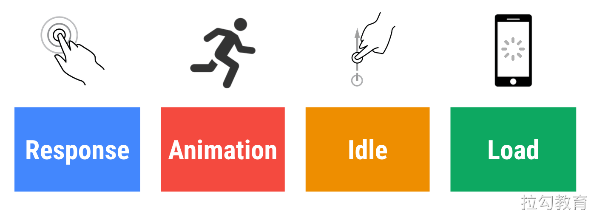

这个名字的由来是四个英文单词的首字母：

- 响应（Response）：应该尽可能快速的响应用户, 应该在 100ms 以内响应用户输入。
- 动画（Animation）：在展示动画的时候，每一帧应该以 16ms 进行渲染，这样可以保持动画效果的一致性，并且避免卡顿。
- 空闲（Idle）：当使用 Javascript 主线程的时候，应该把任务划分到执行时间小于 50ms 的片段中去，这样可以释放线程以进行用户交互。
- 加载（Load）：应该在小于 1s 的时间内加载完成你的网站，并可以进行用户交互。

> 根据网络条件和硬件的不同，用户对性能延迟的理解也有所不同。例如，通过快速的 Wi-Fi 连接在功能强大的台式机上加载站点通常在 1 秒内完成，用户对此已经习以为常。在 3G 连接速度较慢的移动设备上加载网站需要花费更多时间，因此移动用户通常更耐心，在移动设备上加载 5 s 是一个更现实的目标。

这四个单词代表与网站或应用的生命周期相关的四个方面，这些方面会以不同的方式影响整个网站的性能。
我们将用户作为之后性能优化的中心，首先需要了解用户对于延迟的反应。用户感知延迟的时间窗口，如下表所示。

| 延迟         | 用户反映                                                                                                             |
| ------------ | -------------------------------------------------------------------------------------------------------------------- |
| 0 ~ 16ms     | 人眼可以感知每秒 60 帧的动画，即每帧 16 ms，除了浏览器将一帧画面绘制到屏幕上的时间，网站应用大约需要 10ms 来生成一帧 |
| 0 ~ 100ms    | 在该时间范围内响应用户操作，才会是流畅的体验                                                                         |
| 100 ~ 1000ms | 能够感觉到明显的延迟                                                                                                 |
| >1s          | 用户的注意力将离开对执行任务的关注                                                                                   |
| >10s         | 用户感到失望，可能会放弃任务                                                                                         |

#### 1.RAIL 性能模型 - Response

指标：应该尽可能快速的响应用户，应该在 100ms 以内响应用户输入。
网站性能对于响应方面的要求是，在用户感知延迟之前接收到操作的反馈。比如用户进行了文本输入、按钮单击、表单切换及启动动画等操作后，必须在 100ms 内收到反馈，如果超过 100ms 的时间窗口，用户就会感知延迟。

看似很基本的用户操作背后，可能会隐藏着复杂的业务逻辑处理及网络请求与数据计算。对此我们应当谨慎，将较大开销的工作放在后台异步执行，而即便后台处理要数百毫秒才能完成的操作，也应当给用户提供及时的阶段性反馈。

比如在单击按钮向后台发起某项业务处理请求时，首先反馈给用户开始处理的提示，然后在处理完成的回调后反馈完成的提示。
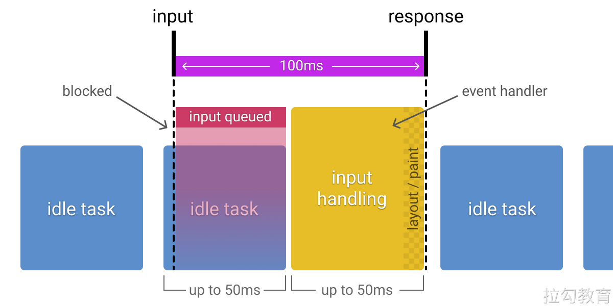

#### 2.RAIL 性能模型 - Animation

指标：在展示动画的时候，每一帧应该以 10ms 进行渲染，这样可以保持动画效果的一致性，并且避免卡顿。

前端所涉及的动画不仅有炫酷的 UI 特效，还包括滚动和触摸拖动等交互效果，而这一方面的性能要求就是流畅。众所周知，人眼具有视觉暂留特性，就是当光对视网膜所产生的视觉在光停止作用后，仍能保留一段时间。

研究表明这是由于视神经存在反应速度造成的，其值是 1/24s，即当我们所见的物体移除后，该物体在我们眼中并不会立即消失，而会延续存在 1/24s 的时间。对动画来说，无论动画帧率有多高，最后我们仅能分辨其中的 30 帧，但越高的帧率会带来更好的流畅体验，因此动画要尽力达到 60fps 的帧率。

目前大多数设备的屏幕刷新率为 60 次/秒，那么浏览器渲染动画或页面的每一帧的速率也需要跟设备屏幕的刷新率保持一致。所以根据 60fps 帧率的计算，每一帧画面的生成都需要经过若干步骤，一帧图像的生成预算为 16ms（1000ms / 60 ≈ 16.66ms），除去浏览器绘制新帧的时间，留给执行代码的时间仅 10ms 左右。如果无法符合此预算，帧率将下降，并且内容会在屏幕上抖动。 此现象通常称为卡顿，会对用户体验产生负面影响。关于这个维度的具体优化策略，会在后面优化渲染过程的相关章节中详细介绍。

- https://googlechrome.github.io/devtools-samples/jank/

#### 3.RAIL 性能模型 - Idle

指标：当使用 Javascript 主线程的时候，应该把任务划分到执行时间小于 50ms 的片段中去，这样可以释放线程以进行用户交互。  
要使网站响应迅速、动画流畅，通常都需要较长的处理时间，但以用户为中心来看待性能问题，就会发现并非所有工作都需要在响应和加载阶段完成，我们完全可以利用浏览器的空闲时间处理可延迟的任务，只要让用户感受不到延迟即可。利用空闲时间处理延迟，可减少预加载的数据大小，以保证网站或应用快速完成加载。  
为了更加合理地利用浏览器的空闲时间，最好将处理任务按 50ms 为单位分组。这么做就是保证用户在发生操作后的 100ms 内给出响应。

#### 4.RAIL 性能模型 - Load

指标：首次加载应该在小于 5s 的时间内加载完成，并可以进行用户交互。对于后续加载，则是建议在 2 秒内完成。

用户感知要求我们尽量在 5s 内完成页面加载，如果没有完成，用户的注意力就会分散到其他事情上，并对当前处理的任务产生中断感。需要注意的是，这里在 5s 内完成加载并渲染出页面的要求，并非要完成所有页面资源的加载，从用户感知体验的角度来说，只要关键渲染路径完成，用户就会认为全部加载已完成。

对于其他非关键资源的加载，延迟到浏览器空闲时段再进行，是比较常见的渐进式优化策略。比如图片懒加载、代码拆分等优化手段。

关于加载方面具体的优化方案，后续也会分出独立内容进行详细介绍。

## 基于用户体验的性能指标

[基于用户体验的性能指标](https://web.dev/metrics/)是 Google 在 web.dev 提出的。

### 1.[First Contentful Paint 首次内容绘制 (FCP)](https://web.dev/fcp/)

FCP（First Contentful Paint）首次内容绘制，浏览器首次绘制来自 DOM 的内容的时间，内容必须是文本、图片（包含背景图）、非白色的 canvas 或 SVG，也包括带有正在加载中的 Web 字体的文本。

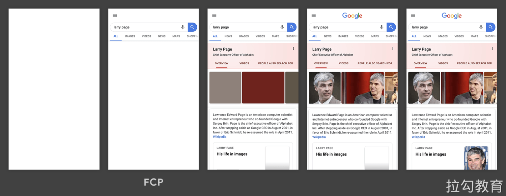

这是用户第一次开始看到页面内容，但仅仅有内容，并不意味着它是有用的内容（例如 Header、导航栏等），也不意味着有用户要消费的内容。

速度指标：
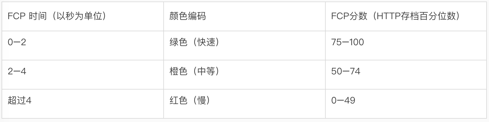

优化方案：

- https://web.dev/fcp/#how-to-improve-fcp

### 2.[Largest Contentful Paint（LCP）](https://web.dev/lcp/)

LCP（Largest Contentful Paint）最大内容绘制，可视区域中最大的内容元素呈现到屏幕上的时间，用以估算页面的主要内容对用户可见时间。

LCP 考虑的元素：

- img 元素
- image 元素内的 svg 元素
- video 元素（封面图）
- 通过 url()函数加载背景图片的元素
- 包含文本节点或其它内联级文本元素子级的块级元素

为了提供良好的用户体验，网站应力争使用 2.5 秒或更短的“最大内容绘画” 。为确保您达到大多数用户的这一目标，衡量移动设备和台式机设备的页面加载量的第 75 个百分位数是一个很好的衡量标准。

以下是一些示例：
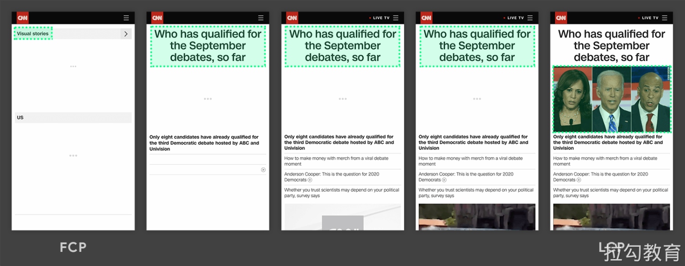
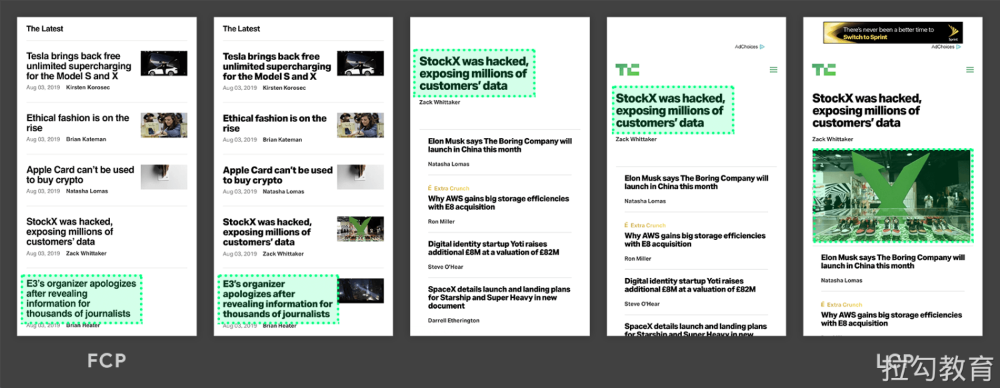

在以上两个时间轴中，最大的元素随内容加载而变化。在第一个示例中，新内容被添加到 DOM 中，并且更改了最大的元素。在第二个示例中，布局发生更改，以前最大的内容从视口中删除。

通常情况下，延迟加载的内容要比页面上已有的内容大，但不一定是这种情况。接下来的两个示例显示了在页面完全加载之前发生的最大内容绘画。
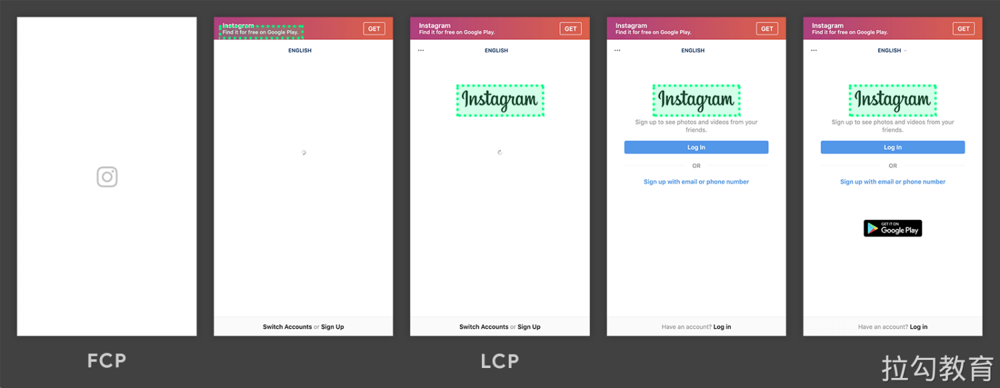
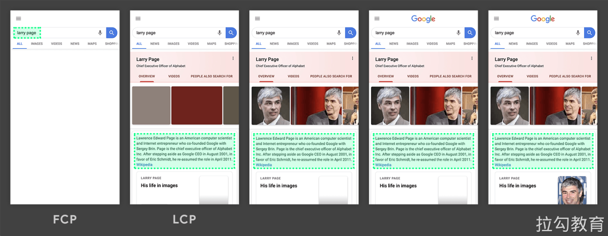

在第一个示例中，Instagram 徽标相对较早地加载，即使逐渐显示其他内容，它仍然是最大的元素。在 Google 搜索结果页面示例中，最大的元素是一段文本，该文本在任何图像或徽标加载完成之前显示。由于所有单个图像均小于此段，因此在整个加载过程中，它始终是最大的元素。

> 在 Instagram 时间轴的第一帧中，您可能会注意到相机徽标周围没有绿色框。那是因为它是一个 svg 元素，并且 svg 元素当前不被视为 LCP 候选对象。

速度指标：
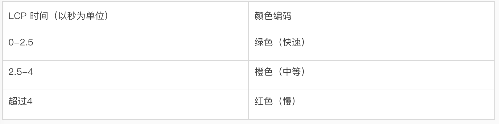
优化方案：

- https://web.dev/optimize-lcp/

。。。

## Web Vitals

Google 开发了许多实用指标和工具，帮助衡量用户体验和质量，从而发掘优化点。一项名为 Web Vitals 的计划降低了学习成本，为网站体验提供了一组统一的质量衡量指标 — Core Web Vitals，其中包括加载体验、交互性和页面内容的视觉稳定性。

有很多方法可以优化网站的用户体验。若能预先了解最佳的优化衡量方法，可以大大节省时间和成本。

Google 在 2020 年 5 月 5 日提出了新的用户体验量化方式 Web Vitals 来衡量网站的用户体验，并将这些衡量结果用作其排名算法的一部分。为了更好的理解这些内容，让我们来看看这些重要指标是什么。

### Core Web Vitals 与 Web Vitals

什么是 Web Vitals，Google 给出的定义是 一个良好网站的基本指标（Essential metrics for a healthy site），过去要衡量一个网站的好坏，需要使用的指标太多了，Web Vitals 可以简化指标的学习曲线，只需聚焦于 Web Vitals 指标的表现即可。

在这些 Web Vitals 中，Google 确定了三个主要衡量指标，即在所有类型的网站中通用的 Core Web Vitals：
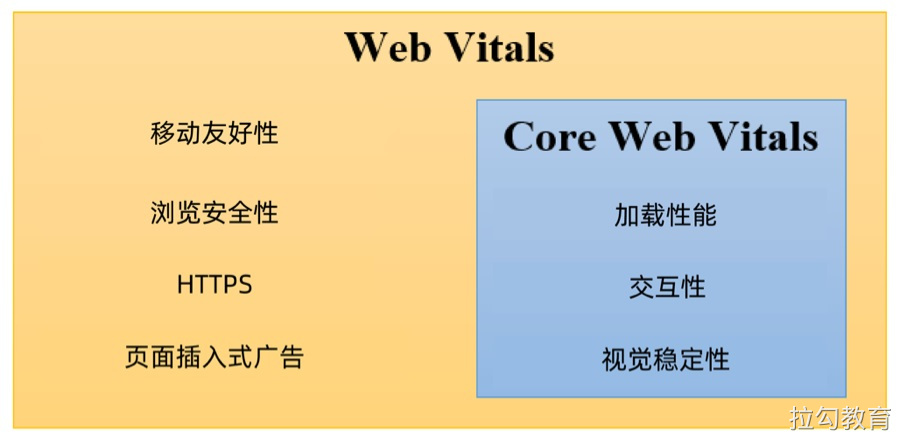

> Core Web Vitals 是应用于所有 Web 页面的 Web Vitals 的子集，是其最重要的核心。

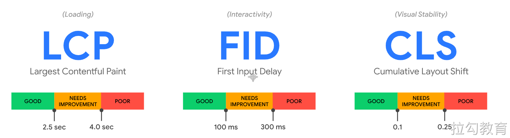

- 加载性能（LCP） — 显示最大内容元素所需时间
- 交互性（FID） — 首次输入延迟时间
- 视觉稳定性（CLS） — 累积布局配置偏移

这三个指标已经经过了一段时间的验证，如 LCP 在 WICG 已经孵化至少 1 年以上，FID 在 Google Chrome Labs 上已经实施 2 年以上，LCP 和 CLS（相关 Layout Instability API）已于今年入 W3C 草拟标准。

### 测量 Web Vitals

- 性能测试工具，比如 Lighthouse
- 使用 [web-vitals](https://github.com/GoogleChrome/web-vitals)库
- 使用浏览器插件 Web Vitals

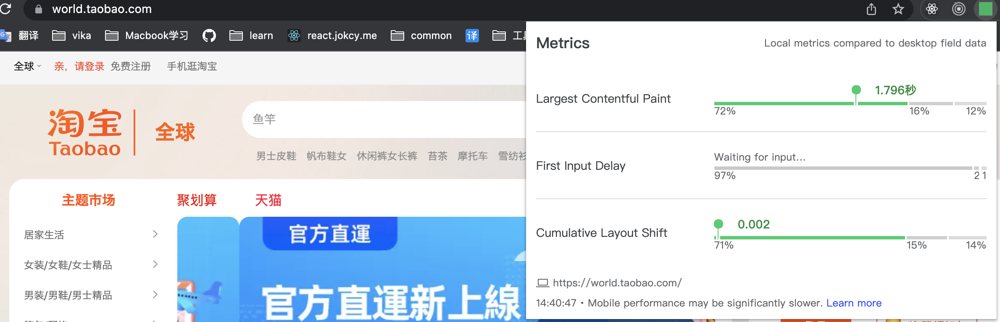

### 优化 Web Vitals

- [Optimize Largest Contentful Paint](https://web.dev/optimize-lcp/)
- [Optimize First Input Delay](https://web.dev/optimize-fid/)
- [Optimize Cumulative Layout Shift](https://web.dev/optimize-cls/)

参考链接：

- https://web.dev/vitals/
- https://juejin.cn/post/6844904168591736846
- https://chrome.google.com/webstore/detail/web-vitals/ahfhijdlegdabablpippeagghigmibma/related
- https://www.uisdc.com/web-vitals

## 其他性能指标

略

## 相关链接

[课程资料](https://www.yuque.com/books/share/bee30889-85b8-442e-be5c-6c683f783e2f/xgqh7t) 密码：xa3i
