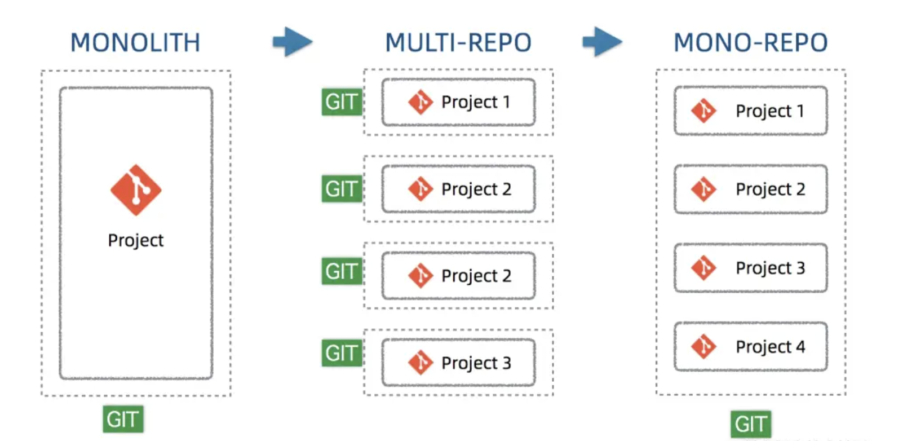
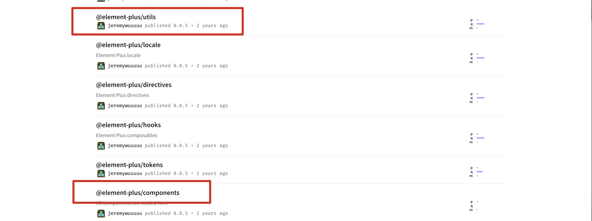

## Monorepo

Monorepo 是一种项目代码管理方式，单个仓库中管理多个项目。（所有的项目在一个代码仓库中，但并不是说代码没有组织的都放在一个文件夹里面。）

相关文档：

- [关于现代包管理器的深度思考——为什么现在我更推荐 pnpm 而不是 npm/yarn?](https://juejin.cn/post/6932046455733485575#heading-14)
- [为什么 pnpm+monorepo 是组件库项目的最佳实践](https://juejin.cn/post/7316409548994625574?searchId=20240214144135606EFCE700E17B367E98#heading-20)
- [【从 0 到 1 搭建 Vue 组件库框架】0. 系列导论](https://juejin.cn/post/7254341178258505788)
- [前端工程化 😼 开源项目都在用的【Monorepo】](https://juejin.cn/post/7285373518836826167?searchId=20240214144135606EFCE700E17B367E98#heading-8)

### 项目管理模式的发展历程(Monolith->MultiRepo->MonoRepo)



| 模式      | 描述                                                                                 | 适用场景                   | 优点                                                                                | 缺点                                                                                                                                                  |
| --------- | ------------------------------------------------------------------------------------ | -------------------------- | ----------------------------------------------------------------------------------- | ----------------------------------------------------------------------------------------------------------------------------------------------------- |
| Monolith  | 单体仓库：整个应用程序由一个单一的代码库、构建和部署流程组成。                       | 简单易懂，适合小型项目     | 所有代码在一个仓库，易于集成和部署、易于复用代码、易于规范代码                      | 小代码牵动全局，维护性差                                                                                                                              |
| MultiRepo | 多仓多模块：将项目拆分为多个独立的仓库，每个仓库独立维护自己的代码和构建流程。       | 适合大型、复杂的项目目     | 单个项目职责单一，可由不同团队管理， 利于进行权限控制（可以针对单个仓库来分配权限） | 代码和配置难以共享 、开发人员容易缺乏对整个项目的整体认知、依赖的治理复杂                                                                             |
| Monorepo  | 单仓多模块：允许在一个代码库中管理多个项目、组件或服务，提供更好的代码共享和重用性。 | 适合中大型项目、多模块项目 | 代码复用、分工明确、独立管理                                                        | 可能随着时间推移变得庞大和复杂，导致构建时间增长和管理困难，git clone、pull 的成本增加。项目粒度的权限管理较为困难，容易产生非 owner 管理者的改动风险 |

在 Monorepo 中，每个子模块仍然是独立的，有独立的版本，可以独立发包，不受其他模块的限制，最重要的是 Monorepo 的 build、test 都是增量的，只有发生更改的子模块会进行构建和测试，而不需要重新构建和测试整个代码库。这可以大大加快持续集成（CI）的速度，提高开发效率。

与 Mulitrepo 相比，Monorepo 中的子模块可以代码共享，可以最大程度复用依赖、复用工作流、复用基础配置。

### element-plus 的项目结构

进入[github 地址：element-plus](https://github.com/element-plus/element-plus)查看，可以知道 element-plus 是通过 monorepo 的方式，将整个 UI 组件库的多个依赖模块都整合到了同一个代码仓中，以其代码仓中的 packages 目录为例子:

```lua
📦element-plus
 ┣ 📂...
 ┣ 📂packages
 ┃ ┣ 📂components         # 各种 UI 组件
 ┃ ┃ ┣ 📂button
 ┃ ┃ ┣ 📂input
 ┃ ┃ ┣ 📂...
 ┃ ┃ ┗ 📜package.json
 ┃ ┣ 📂utils              # 公用方法包
 ┃ ┃ ┗ 📜package.json
 ┃ ┣ 📂theme-chalk        # 组件样式包
 ┃ ┃ ┗ 📜package.json
 ┃ ┣ 📂element-plus       # 组件统一出口
 ┃ ┃ ┗ 📜package.json
 ┣ 📜...
```

在 [npm.js](https://www.npmjs.com/search?q=%40element-plus) 上是可以查到这些对应的包:

像 element-plus 这样将一个大型项目的多个模块集中在一个仓中进行开发的方式，我们称之为 monorepo 模式，这也是大部分现代前端组件库会采用的文件组织方式。它的优势非常多，**用代码权限管控上的缺陷，换来了统一的工程配置、便捷的依赖维护、快速修改响应**。

## 包管理工具

monorepo 的重点在与单仓多包管理，这自然地引出了包管理这一概念。包管理是处理模块之间依赖关系的核心。

### pnpm VS npm VS yarn

目前前端包管理的根基是 npm，在其基础上衍生出了 yarn、pnpm。在 2022 年以后，我们推荐使用 pnpm 来管理项目依赖。pnpm 覆盖了 npm、yarn 的大部分能力，且多个维度的体验都有大幅度提升。

| 名称   | 描述                                                                       | 解决了什么问题                                                                                                                                                                              | 缺点                                               | 相关链接 🔗                                                              |
| ------ | -------------------------------------------------------------------------- | ------------------------------------------------------------------------------------------------------------------------------------------------------------------------------------------- | -------------------------------------------------- | ------------------------------------------------------------------------ |
| npm v2 | 递归依赖                                                                   |                                                                                                                                                                                             | 重复依赖嵌套地狱，空间资源浪费，安装慢，文件路径长 |                                                                          |
| npm v3 | 扁平化依赖                                                                 | 解决了重复依赖的嵌套地狱问题                                                                                                                                                                | 扁平化依赖算法耗时长                               | [issue-npm@3 wants to be faster](https://github.com/npm/npm/issues/8826) |
| npm v5 | 引入 package-lock.json 机制，作用是锁定项目的依赖结构，保证依赖的稳定性    | 解决了 v3 出现的扁平化依赖算法耗时长问题                                                                                                                                                    | 幽灵依赖                                           | [官方文档](https://docs.npmjs.com/cli/v10/configuring-npm/package-json/) |
| yarn   | npm v3 时期出现的 yarn                                                     | yarn 解决的问题基本就是 npm v5 解决的问题，包括使用 yarn.lock 等机制，锁定版本依赖，实现并发网络请求，最大化网络资源利用率，其次还有利用缓存机制，实现了离线模式，目前 yarn 和 npm 差异不大 | 幽灵依赖                                           | [yarn 官网](https://yarnpkg.com/)                                        |
| pnpm   | 基于内容寻址的文件系统来存储磁盘上所有的文件，这样可以做到不会出现重复安装 | 解决了 npm/yarn 存在的幽灵依赖问题                                                                                                                                                          |                                                    | [pnpm 官网](https://www.pnpm.cn/)                                        |

### 扁平依赖的问题

- 依赖结构的不确定性。
- 扁平化算法本身的复杂性很高，耗时较长。
- 项目中仍然可以非法访问没有声明过依赖的包

### 什么是依赖结构不确定性

这是扁平依赖带来的问题，假设 A,B,C 三个测试包，此时需要再加一个 D 包，D 包和 C 包一样都依赖于 B 包，不过 D 包依赖的 B 包版本是 1.0.0，而 C 包依赖的 B 包版本则是 1.0.1。
假如我们在 npm 或者 yarn 的项目中同时安装 C 包和 D 包，那么安装后的项目 node_modules 结构会是下面的哪一种呢？

```js
// 第一种
node_modules
├─ kai_npm_test_a
│  ├─ index.js
│  └─ package.json
│
├─ kai_npm_test_b  // @1.0.1
│  ├─ index.js
│  └─ package.json
│
├─ kai_npm_test_c
|  ├─ index.js
|  └─ package.json
|
└─ kai_npm_test_d
   ├─ node_modules
   |  └─ kai_npm_test_b // @1.0.0
   |     ├─ index.js
   |     └─ package.json
   ├─ index.js
   └─ package.json

```

```js
// 第二种
node_modules
├─ kai_npm_test_a
│  ├─ index.js
│  └─ package.json
│
├─ kai_npm_test_b  // @1.0.0
│  ├─ index.js
│  └─ package.json
│
├─ kai_npm_test_c
|  ├─ node_modules
|  |  └─ kai_npm_test_b // @1.0.1
|  |     ├─ index.js
|  |     └─ package.json
|  ├─ index.js
|  └─ package.json
|
└─ kai_npm_test_d
   ├─ index.js
   └─ package.json

```

分析安装后的项目 node_modules 结构是上面的哪一种，其实就是判断哪个版本的包会被提到“扁平结构”中，网上不少资料说是取决于 package.json 中依赖的位置，声明在前面的会被提出来，但是笔者试验了几次发现其实不是，上面的例子不管我把 C 包写在 D 包前面还是把 D 包写在 C 包前面，安装后的 node_modules 结构都是上面的第一种，也就是说都是 C 包依赖的 B 包@1.0.1 版本会被提出。
其实在安装依赖包时，npm/yarn 会对所有依赖先进行一次排序，按照字典序 kai_npm_test_c 在 kai_npm_test_d 的前面，所以不管 package.json 中的顺序怎么写，被提取出来的都会是 C 包的依赖 B 包。

### npm 与 yarn 的历史遗留问题

- 扁平化依赖算法复杂，需要消耗较多的性能，依赖串行安装还有提速空间。
- 大量文件需要重复下载，对磁盘空间的利用率不足。（虽然在同一个项目中我不会重复的安装依赖 d 了，但是如果我有 100 个项目，100 个项目都需要用到某个包，那么这个包依然会被下载 100 次，也就是在磁盘的不同地方写入 100 次）
- 扁平化依赖虽然解决了不少问题，但是随即带来了依赖非法访问的问题，项目代码在某些情况下可以在代码中使用没有被定义在 package.json 中的包，这种情况就是我们常说的**幽灵依赖**。

### pnpm 优点

- 速度快：多数场景下，安装速度是 npm/yarn 的 2 - 3 倍。
- 基于内容寻址：硬链接节约磁盘空间，不会重复安装同一个包，对于同一个包的不同版本采取增量写入新文件的策略。（用 npm/yarn 的时候，如果 100 个项目都依赖 lodash，那么 lodash 很可能就被安装了 100 次，磁盘中就有 100 个地方写入了这部分代码。但在使用 pnpm 只会安装一次，磁盘中只有一个地方写入，后面再次使用都会直接使用 hardlink。symlink 和 hardlink 机制 (软链接和硬链接)）
- 依赖访问安全性强：优化了 node_modules 的扁平结构，提供了限制依赖的非法访问(幽灵依赖) 的手段。
- 支持 Monorepo：自身能力就对 Monorepo 工程模式提供了有力的支持。在轻量场景下，无需集成 lerna Turborepo 等工具。

[具体对比 npm、yarn、pnpm —— pnpm 确实很香](https://juejin.cn/post/7098260404735836191?searchId=20240214175223AC98EFC7920007517117#heading-6)

### workspace 工作区

包管理工具通过 workspace 功能来支持 Monorepo 模式。
目前最主流的三款包管理工具 npm7+、yarn、pnpm 都已经原生支持 workspace 模式，也就是说不管使用哪个包管理工具，我们都可以实现其与 monorepo 的配合，但最终依然选择 pmpm 作为包管理工具主要是由于 pnpm 很好的解决了 npm 与 yarn 遗留的历史问题。

#### pnpm 的 workspace 模式

pnpm 支持 monorepo 模式的工作机制叫做 [workspace(工作空间)](https://pnpm.io/zh/workspaces)。
它要求在代码仓的根目录下存有 `pnpm-workspace.yaml` 文件指定哪些目录作为独立的工作空间，这个工作空间可以理解为一个子模块或者 npm 包。

例如以下的 pnpm-workspace.yaml 文件定义：a 目录、b 目录、c 目录下的所有子目录，都会各自被视为独立的模块。

```yaml
packages:
  - a
  - b
  - c/*
```

```go
📦my-project
 ┣ 📂a
 ┃ ┗ 📜package.json
 ┣ 📂b
 ┃ ┗ 📜package.json
 ┣ 📂c
 ┃ ┣ 📂c-1
 ┃ ┃ ┗ 📜package.json
 ┃ ┣ 📂c-2
 ┃ ┃ ┗ 📜package.json
 ┃ ┗ 📂c-3
 ┃   ┗ 📜package.json
 ┣ 📜package.json
 ┣ 📜pnpm-workspace.yaml

```

⚠️ 需要注意的是，pnpm 并不是通过目录名称，而是通过目录下 package.json 文件的 name 字段来识别仓库内的包与模块的。
