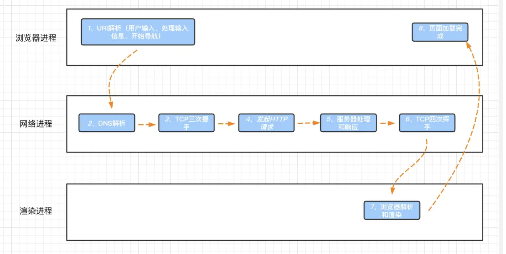

## 简单版

常见的面试题，从输入 url 到网页展现，这个过程发生了什么？
简单回答版本：
`URL 解析`->`缓存判断`->`DNS 解析`->`TCP 三次握手`->`Http 请求`->`服务端处理和响应`->`TCP 四次挥手`->`浏览器解析和渲染`->`页面加载完成`

在这个过程中，可以从三个方面入手：缓存、DNS 解析、渲染

## 详细版

- 用户输入：用户在浏览器导航栏输入内容之后，`浏览器进程`里的 `UI 线程`会先进程解析判断是 URL 还是搜索关键词，如果是 URL，便会通过进程间通信（IPC 通道）将信息传送给`网络进程`。
- 缓存判断：`网络进程`会查找本地缓存是否缓存了该资源。如果有缓存资源，那么直接返回资源给浏览器进程；如果在缓存中没有查找到资源，那么直接进入下一步
- DNS 解析：以获取请求域名的服务器 IP 地址
-

## 浏览器渲染过程

浏览器首先会根据 html 文件构建 DOM 树，根据解析到的 css 文件构建 CSSOM 树，如果遇到 script 标签，则判端是否含有 defer 或者 async 属性，要不然 script 的加载和执行会造成页面的渲染的阻塞。当 DOM 树和 CSSOM 树建立好后，根据它们来构建渲染树。渲染树构建好后，会根据渲染树来进行布局。布局完成后，最后使用浏览器的 UI 接口对页面进行绘制。这个时候整个页面就显示出来了。

## 结合  CRP  进行性能优化

:::info{title=关键渲染路径}
`CRP` 又称`关键渲染路径`，是指浏览器通过把 HTML、CSS 和 JavaScript 转化成屏幕上可显示的像素的步骤顺序。优化关键渲染路径可以提高渲染性能。关键渲染路径包含了 Document Object Model (DOM)，CSS Object Model (CSSOM)，渲染树和布局。
:::

### 构建渲染树

等 DOM 和 CSSOM 都构建好之后，渲染引擎就会构造布局树。
布局树的结构基本上就是复制 DOM 树的结构，不同之处在于 DOM 树中那些不需要显示的元素会被过滤掉，如 display:none 属性的元素、 head 标签、 script 标签等。
复制好基本的布局树结构之后，渲染引擎会为对应的 DOM 元素选择对应的样式信息，这个过程就是样式计算。

## DOMContentLoaded 和 window.onload

- DOMContentLoaded 事件是在纯 HTML 加载和解析之后触发；（而不必等待样式表，图片或者子框架完成加载。）
- window.onload 事件不但文档完全加载和解析完毕，相关资源都要加载完毕，比如图片和 CSS 文件等；

## script 标签为什么放在 不同位置

将 <script> 标签放置在 HTML 文档的 <head> 或 <body> 部分时，会对页面加载和执行产生不同的影响。

- [你知道 <script> 标签的放置位置对页面的影响吗](https://juejin.cn/post/7241966801214259257?searchId=202403070018490B59CDBE2216614C9DD9#heading-1)

总结：放在顶部的话，JS 会阻塞 HTML 解析和渲染进程，而且此时 DOM 结构还没有生成，不可以操作 DOM 元素，如果 JS 脚本必须在<head>中，可以用异步加载，添加`defer`和`async`。

## 参考文档

- [聊一聊前端性能优化 CRP](https://zhuanlan.zhihu.com/p/157542222)
- [「图文讲解」浏览器原理与页面渲染过程](https://juejin.cn/post/7178033357601636409?searchId=20240306234521113D72100988E24E5838)
- [重新认识浏览器是如何渲染一个页面，细节满满](https://juejin.cn/post/7295720738568175651?searchId=20240306234521113D72100988E24E5838#heading-7)

  1.网页中很多图片？http1.1 中采用多域名部署的方式， http2，多路复用，没有并发限制
  2.url 输入到加载完成：输入内容后，浏览器进程的 ui 进程会判断是搜索关键字还是一个 url，如果是后者就通过 IPC 通道将信息传递给网络进程，首先网络进程会判断本地是否有缓存，没有就进行 DNS 解析，获取到请求域名的 IP 地址，再进行 TCP 三次挥手，此时就可以发起 HTTP 请求，当得到响应之后，进行 TCP 四次挥手，渲染进程的工作结束，进入渲染进程，这一块主要就是浏览器解析 HTML 文档，遇到 JS 和 CSS，分别构造 DOM 树和 CSSOM 树，当两者都构建好了之后，就会进行样式计算，比如把有些样式的相对值改成绝对值，如 em->px,然后可以进行布局了，也就是计算元素的几何位置，通过样式计算和布局计算就构建出了渲染树，此时就可以开始绘制（paint）了，在绘制之前还有一个分层的操作，绘制之后会进行分块，然后就交给 GPU 进程进行光栅化操作，之后将信息交给 GPU 硬件（显卡）完成最终的屏幕成像。

  7.DOMContentLoaded 和 window.onload
  8.defer 和 async 9.为什么 script 标签放在底部？ 11.回流和重绘：回流是重新构建渲染树的过程，重绘是重新绘制的过程
  12.CRP（关键渲染路径）优化 3.盒子模型
  4.fiber
  5.vue 生命周期 6.双向数据绑定的原理：Vue 使用一个 Observer 的类来实现数据劫持，在创建 Vue 实例时，Vue 会递归遍历传入的数据对象，
  并使用 Object.defineproxy 方法将对象的属性转化为响应式属性，在访问属性时收集依赖，在属性变化时通知依赖的 Watcher 对象进行更新操作，更新视图，从而实现数据的响应式更新。依赖收集与响应更新过程也被称为发布订阅。
  7.BFC

https://juejin.cn/post/7236593298763776060?searchId=2024030701055983A7AE1E2636C04B9C4C
