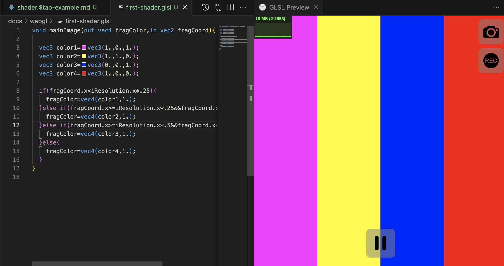
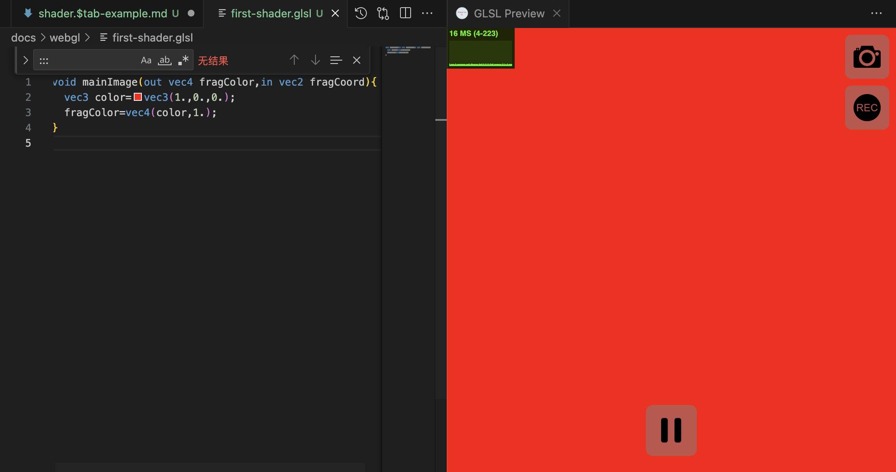
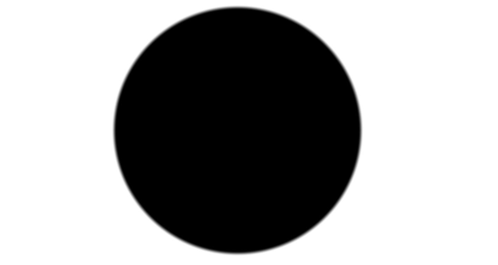

## 1.一个简单的 Shader 例子

### 在线链接

[](https://code.juejin.cn/pen/7406671991303831564)


### 1.1 编写 Shader 的主函数

新建一个 glsl 文件`first-shader.glsl`，编写 Shader 的主体：

```glsl
void mainImage(out vec4 fragColor,in vec2 fragCoord){

}
```

函数接受两个参数：

- fragColor： 4 维，代表输出的像素颜色
- fragCoord： 2 维，代表输入的像素坐标

:::warning{title=注意}
当前如果是在 Shadertoy 的环境下进行的，主函数 main 需写成 mainImage，输出颜色 gl_FragColor 需写成 fragColor，输入坐标 gl_FragCoord 需写成 fragCoord。
:::

### 1.2 输出一个简单的颜色

```glsl
void mainImage(out vec4 fragColor,in vec2 fragCoord){
  vec3 color=vec3(1.,0.,0.);
  fragColor=vec4(color,1.);
}
```

这时，选择“Shader Toy: Show GLSL Preview”命令，就可以看到红色的画面了。


### 1.3 画面输出四种颜色


```glsl
void mainImage(out vec4 fragColor,in vec2 fragCoord){

  vec3 color1=vec3(1.,0.,1.);
  vec3 color2=vec3(1.,1.,0.);
  vec3 color3=vec3(0.,0.,1.);
  vec3 color4=vec3(1.,0.,0.);

  if(fragCoord.x<iResolution.x*.25){
    fragColor=vec4(color1,1.);
  }else if(fragCoord.x>=iResolution.x*.25&&fragCoord.x<iResolution.x*.5){
    fragColor=vec4(color2,1.);
  }else if(fragCoord.x>=iResolution.x*.5&&fragCoord.x<iResolution.x*.75){
    fragColor=vec4(color3,1.);
  }else{
    fragColor=vec4(color4,1.);
  }
}
```

## 2.绘制圆形

### 在线链接

[](https://code.juejin.cn/pen/7406950834153455655)



绘制圆形思路：先计算 UV 坐标上的点到原点的距离，然后根据这些距离的值来设定对应点的颜色。

### 2.1 计算 UV 上点到原点的距离

如何计算 UV 上点到原点的距离? 可以用 GLSL 的内置函数——length 函数来实现。

```
float d=length(uv);
fragColor=vec4(vec3(d),1.);
```

<table>
	<tr><th>代码</th><th>效果</th><th>说明</th></tr >
	<tr >
	    <td style="text-wrap: nowrap;">float d=length(uv);<br/>fragColor=vec4(vec3(d),1.);</td>
	    <td><image src="./img/uv-distance.png" /></td>
      <td>左下角原点是黑色，值是(0,0)，从原点向右上方向辐射的径向渐变，上面每个点的值代表的就是该点到原点的距离，越靠近原点距离越小，越接近黑色，反之越远离原点距离越大，越接近白色。</td>
	</tr>
</table>

### 2.2 居中处理

```
void mainImage(out vec4 fragColor,in vec2 fragCoord){
  vec2 uv=fragCoord/iResolution.xy;
  uv=(uv-.5)*2.;
  float d=length(uv);
  fragColor=vec4(vec3(d),1.);

}
```

<table>
	<tr><th>代码</th><th>效果</th><th>说明</th></tr >
	<tr >
	    <td style="text-wrap: nowrap;">加入代码：uv=(uv-.5)*2.;</td>
	    <td><image src="./img/uv-centered-yuan.png" /></td>
      <td>发现图形确实被挪到了中间，但图形目前的形状是一个椭圆。因为UV坐标的值并不会自动地适应画布的比例，导致了图形被拉伸这一现象。</td>
	</tr>
</table>

### 2.3 修正拉伸

```
void mainImage(out vec4 fragColor,in vec2 fragCoord){
  vec2 uv=fragCoord/iResolution.xy;
  uv=(uv-.5)*2.; //  居中处理
  uv.x*=iResolution.x/iResolution.y; // 修正拉伸
  float d=length(uv);
  fragColor=vec4(vec3(d),1.);
}
```

<table>
	<tr><th>代码</th><th>效果</th><th>说明</th></tr >
	<tr >
	    <td style="text-wrap: nowrap;">加入代码：uv.x*=iResolution.x/iResolution.y;</td>
	    <td><image src="./img/uv-centered-yuan1.png" /></td>
      <td>中点的值是(0,0)，颜色是纯黑色，然而，从中点开始向四周辐射的那些区域，它们的值都大于 0，都不是纯黑色，而我们的目标，是要把其中的一片区域也变成纯黑色，也就是说要把分布在这片区域上面的点的值也变成 0。</td>
	</tr>
</table>

### 2.4 打造纯黑区域

在 Shader 中，值的显示范围只会是[0,1]之间，也就是说，小于 0 的负数实际显示的值还是 0（黑色），大于 1 的数实际显示的值还是 1（白色）。我们可以利用这一点，给距离 d 减去一个值（这里我取了 0.5），制造出一片负数的区域，而这片区域不就是我们所要的黑色吗？

<table>
	<tr><th>代码</th><th>效果</th><th>说明</th></tr >
	<tr >
	    <td style="text-wrap: nowrap;">加入代码：d-=.5;</td>
	    <td><image src="./img/uv-centered-yuan2.png" /></td>
      <td>中间确实出现了纯黑色的圆形区域，然后我们只需把周围的渐变给消除，就能得到真正的圆形。
</td>
	</tr>
</table>

### 2.5 使用 step 函数消除边缘渐变

我们先定义一个中间变量 c，用 if 语句来判断距离 d 的大小，如果大于 0，代表的是除了中间纯黑区域外的渐变区域，将它们的值设为 1（白色）；反之，就代表的是中间的纯黑区域，将它们的值设为 0（黑色），最后将中间变量直接作为结果输出即可。

<table>
	<tr><th>代码</th><th>效果</th><th>说明</th></tr >
	<tr >
	    <td style="text-wrap: nowrap;">加入代码：float c=step(0.,d);</td>
	    <td><image src="./img/uv-centered-yuan3.png" /></td>
      <td>得到了一个实体的圆形。但发现图形的周围有锯齿。
</td>
	</tr>
</table>

### 2.6 使用 smoothstep 函数消除边缘锯齿

<table>
	<tr><th>代码</th><th>效果</th><th>说明</th></tr >
	<tr >
	    <td style="text-wrap: nowrap;">加入代码：float c=smoothstep(0.,.02,d);</td>
	    <td><image src="./img/uv-centered-yuan4.png" /></td>
      <td>得到了一个实体的圆形。
</td>
	</tr>
</table>

## 3.发光的圆

[](https://code.juejin.cn/pen/7406955090722717737)


在实心圆的基础上，取距离 d 的倒数，并且乘上一个比较小的值：

```
// d-=.5;
// float c=smoothstep(0.,.02,d);
float c=.25/d;
```

让发光范围更聚焦：

```
c=pow(c,1.6);
```

## 4.绘制长方形
