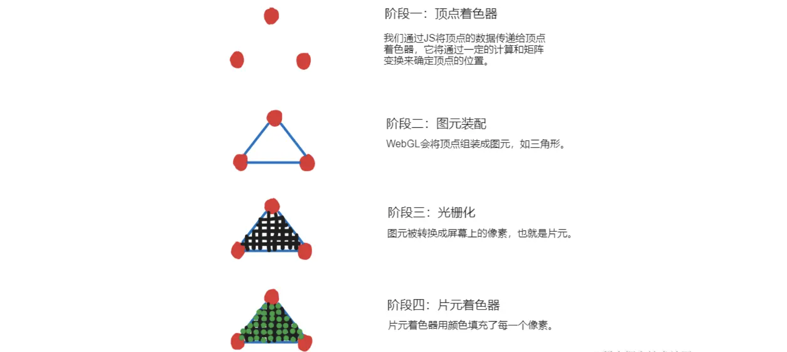
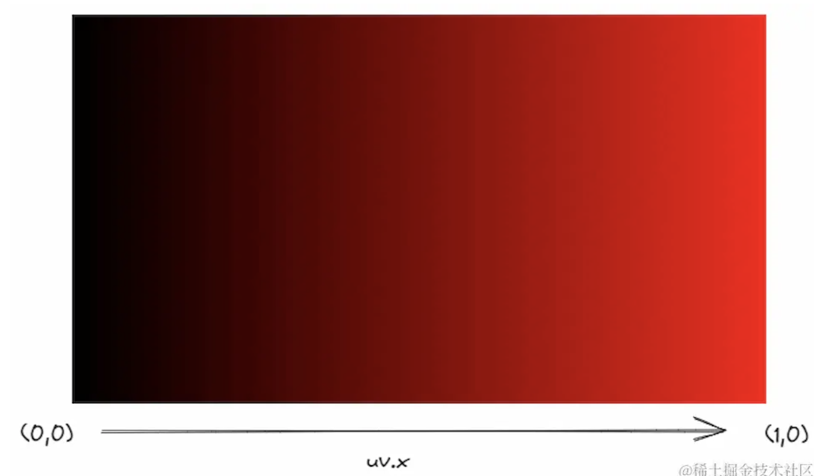
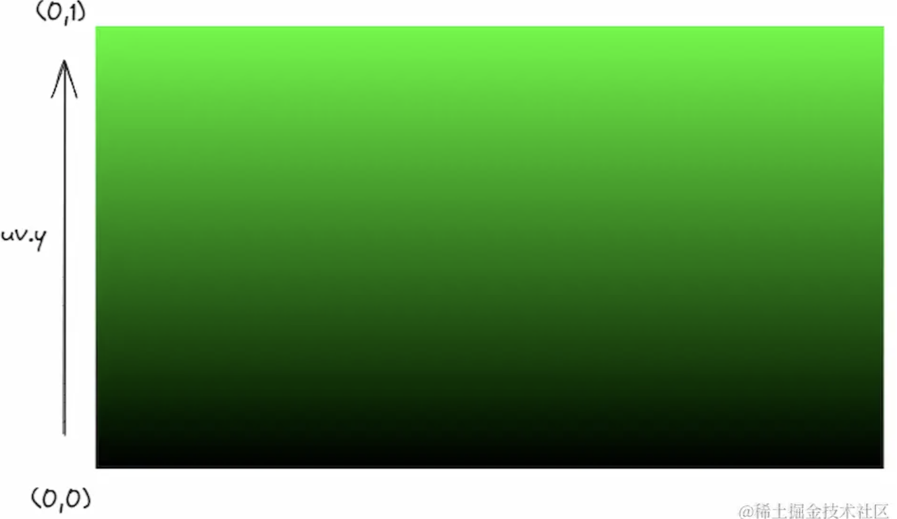
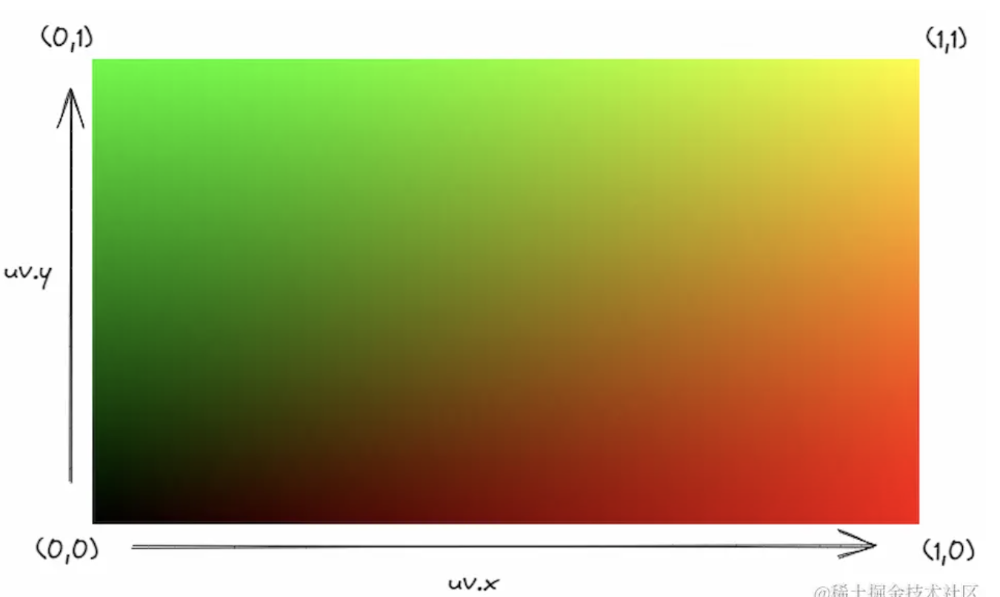

## Spader 基础概念

### 什么是 Spader

Shader（着色器）是一种用于在计算机图形学中进行图形渲染的程序。它们是在图形处理单元（GPU）上执行的小型程序，用于控制图形的各个方面，如颜色、光照、纹理映射、投影等。

在图形渲染过程中，着色器被用于对场景中的几何形状进行处理，并为每个像素或顶点计算出最终的颜色或属性。着色器通常由两种类型组成：顶点着色器和片元着色器。

- 顶点着色器（Vertex Shader）：顶点着色器对输入的顶点进行处理，计算出每个顶点的最终位置、颜色、法线等属性。它可以进行坐标变换、光照计算、顶点动画等操作。
- 片元着色器（Fragment Shader）：片元着色器对每个像素进行处理，计算出像素的最终颜色。它可以进行纹理采样、光照计算、阴影计算等操作。片元着色器通常用于生成最终的图像。

着色器使用一种特定的编程语言来描述图形处理的逻辑和计算过程。在现代图形编程中，常用的着色器语言是 OpenGL Shading Language（GLSL）和 DirectX High-Level Shading Language（HLSL）。这些着色器语言提供了丰富的函数和语法，使开发者能够实现各种复杂的图形效果。

### WebGL 渲染管线流程



流程：在 JS 中提供顶点的数据（通常是 Float32Array 类型的数组，包含了顶点的位置等信息），将这些数据传递给顶点着色器，让它计算每个顶点的位置，然后 WebGL 将顶点装配成图元（如三角形），图元再被转换成屏幕上的空像素（光栅化），让片元着色器来计算每个像素的颜色并填充上去，最终将物体渲染到屏幕上。

## Shader 开发准备

- Shader 语言选择：常用的着色器语言是 GLSL 和 HLSL，这里我们选择 `GLSL`
- Shader 的开发环境选择：
  - 网站：可以直接在www.shadertoy.com 网站上创建并编辑 Shader
  - 编辑器：这里选择 VSCode，安装 Shader 插件
- 相关 VSCode 插件
  - Shader languages support for VS Code：shader 语言支持
  - Shader Toy：用于预览
  - Live Server：HTML 实时预览
  - glsl-canvas：Shader 格式化，并提供了取色器

## Shader 内置

### SLSL 内置变量

- iResolution：代表了画面整体的大小，使用它时一般会取它的 xy 维度，比如`iResolution.x`、`iResolution.y`
- iTime：表示 Shader 从开始到现在执行所经过的时间。
- iMouse：变量表示用户鼠标当前所在的位置。

### SLSL 内置函数

- step 函数（阶梯函数）：取代 if，GPU 是并行处理结果的，而 if 语句会让处理器进行分支切换这一操作，处理多个分支会降低并行处理的性能。
  - `step(edge,x)`，目标值 x 大于边界值 edge，则返回 1，反之返回 0。
- smoothstep 函数（平滑阶梯函数）：平滑过的阶梯的形状，而不是像 step 函数一样突变
  - `smoothstep(edge1,edge2,x)`：它的边界值比 step 函数要多一个，我们可以将它的边界值定为 edge1 和 edge2：如果目标值 x 小于边界值 edge1，则返回 0；如果目标值 x 大于边界值 edge2，则返回 1；如果目标值 x 在 2 个边界值之间，则返回从 0 到 1 平滑过渡的值。
- pow 函数：计算数字的指数幂，比如 pow(4.,3.)，返回的值就是 4 的 3 次方——64

## SLSL 语言基础

- 强类型语言, 变量的使用和赋值必须是相同类型，需要时刻注意变量的类型。
- 强制分号
- 大小写敏感

### 1.一维变量

#### 初始化变量

格式：`变量类型 变量名=值;`

```
float foo=1.;
```

:::warning{title=注意}
浮点型变量必须要有小数点，不能省略！而且语句结尾一定要加一个分号;
:::

#### 一维变量

```
float foo=1.;
int foo=1;
bool foo=true;
```

### 2.矢量和矩阵（多维变量）

声明更高维度的变量的话，就要用到 vec 类型（也就是向量类型）。
vec 类型支持 3 种维度：二维 vec2、三维 vec3 和四维 vec4，四个维度分别为 x、y、z、w（也可以写为 r、g、b、a）。

除了 vec 类型有更高的维度支持外，mat 类型（也就是矩阵类型）亦是如此。mat2 类型代表了一个大小是 2x2 的矩阵，mat3 类型则代表了一个 3x3 的矩阵、mat4 类型是 4x4 的矩阵。

#### 矢量

- 矢量类型
  - (1)vec2、vec3、vec4 具有 2、3、4 个浮点数元素的矢量
  - (2)ivec2、ivec3、ivec4 具有 2、3、4 个整型元素的矢量
  - (3)bvec2、bvec3、bvec4 具有 2、3、4 个布尔值元素的矢量
- 赋值
  - 需要通过构造函数来进行赋值
    ```
      vec4 position = vec4(0.0, 0.0, 0.0, 1.0);    // vec4 就是矢量的构造函数
    ```
- 访问矢量里的分量
  - 获取单个分量
    ```
      vec4 position = vec4(0.1, 0.2, 0.3, 1.0);
      position.x  // 0.1
      position.y  // 0.2
      position.z  // 0.3
    ```
  - 获取多个分量
    ```
      vec4 position = vec4(0.1, 0.2, 0.3, 1.0);
      position.xy   // vec2(0.1, 0.2)
      position.yx   // vec2(0.2, 0.1)
      position.zyx  // vec3(0.3, 0.2, 0.1)
    ```

#### 矩阵

- 矩阵类型：mat2、mat3、mat4 对应 22、33、4\*4 的浮点数元素矩阵
  ```
    mat2 m1=mat2(1.,0.,0.,1.);
    mat3 m2=mat3(1.,2.,0.,0.,0.,1.,2.,1.,0.);
    mat4 m3=mat4(1.,2.,1.,0.,1.,1.,1.,0.,0.,0.,0.,1.,0.,1.,0.,1.);
  ```
- 赋值： 矩阵入参（注意：矩阵参数是列主序的）
  ```
    mat4 m = mat4(
    1.0, 5.0, 9.0,  13.0,
    2.0, 6.0, 10.0, 14.0,
    3.0, 7.0, 11.0, 15.0,
    4.0, 8.0, 12.0, 16.0
  )
  ```

### 3.函数

当你想复用一个代码片段时，定义一个函数就行，格式如下：

```glsl
float add(float a,float b){
    return a+b;
}
float c=add(1.,2.);// c的值为3.
```

如果是无返回：

```glsl
void main() {}
```

一个函数包括返回类型（无返回类型为 void）、函数名、带类型的参数和返回值（可选）。调用函数时也要严格遵循定义好的类型。

### 4.运算符

<table>
	<tr><th>大图</th><th>分类</th><th>说明</th></tr >
	<tr >
	    <td rowspan="5"><image src="./img/yunsuanfu.png"></image></td>
	    <td style="text-wrap: nowrap;">算数运算符</td>
	    <td>用于执行基本的四则运算，比如float a=3.; </td>
	</tr>
	<tr>
	    <td>赋值运算符</td>
	    <td style="text-wrap: nowrap;">用于将值赋给变量，赋值时也可同时进行算数运算。</td>
	</tr>
	<tr>
	    <td>比较运算符</td>
	    <td>>、<、=等</td>
	</tr>
	<tr>
	    <td>逻辑运算符</td>
	    <td>&&、||、!等</td>
	</tr>
	<tr><td>三元操作符</td>
	    <td>？ ： </td>
	</tr>
</table>

### 5.存储限定词

<table>
	<tr><th>限定词</th><th>说明</th></tr >
	<tr >
	    <td style="text-wrap: nowrap;">const</td>
	    <td>声明一个常量，定义之后不能被改变。</td>
	</tr>
	<tr>
	    <td>attribute</td>
	    <td style="text-wrap: nowrap;">只能出现在顶点着色器中，只能声明为全局变量，表示顶点信息。</td>
	</tr>
	<tr>
	    <td>uniform</td>
	    <td> 1、可同时出现在顶点着色器和片元着色器中<br/> 2、只读类型，强调一致性<br/> 3、用来存储的是影响所有顶点的数据，如变换矩阵</td>
	</tr>
	<tr>
	    <td>varying</td>
	    <td>从顶点着色器向片元着色器传递数据，需要同时在顶点着色器和片元着色器声明相同的类型和变量名。</td>
	</tr>
	<tr><td style="text-wrap: nowrap;">精度限定</td>
	    <td>1.提升运行效率，削减内存开支<br/>2.可以单独针对某个变量声明精度:<b style="color:green">mediump float f;</b> <br/> 3.劣势：会出现精度歧义，也不利于后期维护。  例如在使用f的时候，需要将f的精度转为高精度，这样就会出现精度的歧义，也有可能忘记转换精度，出现一些意想不到的效果，而且也不利于维护。<br/>4.通过precision关键字来修改着色器的默认精度。<b style="color:green">precision mediump float;</b><br/>5.精度枚举值：highp、mediump、lowp</td>
	</tr>
</table>

#### uniform

uniform 变量是一种全局的变量，一旦定义后会同时存在于顶点着色器与片元着色器中，并且它在每一个顶点和片元上的值都是相同的，是一个“统一”的值。在我们目前的 Shader 创作环境中，有一些内置的 uniform 变量可供我们直接使用，无需显式地去声明它们。

要注意的一点是：以后在 three.js 环境下，这些变量就不是内置的了，需要手动地去注入和声明。

- iTime：表示 Shader 从开始到现在执行所经过的时间。
- iResolution： 表示 Shader 所在画布的大小，默认是占满整个屏幕。
- iMouse：变量表示用户鼠标当前所在的位置。

#### const

const 定义的量是一种常量，它是无法被改变的一个值。

```
const float PI=3.14159265359;
```

### 6.类型和类型转换

- int()：转为整型
- float()：转为浮点型
- bool()：转为布尔型

### 7.宏

宏（macros）是一种预处理指令，用于在编译时进行文本的替换，常用于定义常量、函数、条件编译等。

:::warning{title=注意}
宏定义是一种文本替换机制，并没有类型检查和作用域限制，因此要根据实际的情况来使用它。
:::

宏定义的格式是#define 宏的名称 宏的值，语句结尾没有分号。

```
#define PI 3.14159265359
```

以上代码定义了一个名为 PI 的宏，Shader 编译时会将所有的 PI 替换为 3.14159265359 这个值，可以类比为 JS 的 String.replace 这个函数。

宏也可以带有参数，如下所示：

```
#define add(a,b) a+b
```

以上代码定义了一个名为 add 的宏，接受 2 个参数 a 和 b，对它们应用相加的运算，并且无需指定明确的类型，调用这个宏时只要参数的类型相匹配，就能正确执行宏定义的运算。

宏也可以条件编译，例如：

```
#define IS_IN_SHADERTOY 1

#if IS_IN_SHADERTOY==1
#define iChannel0Cube iChannel0
#endif
```

这个宏的#if 部分会判断 IS_IN_SHADERTOY 这个宏的值是否为 1，是的话就会将下面的一行宏代码#define iChannel0Cube iChannel0 包含到 Shader 代码中去，不是的话就忽略掉这行宏代码。

## UV 坐标

UV 坐标，它代表了图像（这里指画布）上所有像素的归一化后的坐标位置，其中 U 代表水平方向，V 代表垂直方向。

用输入坐标 fragCoord 除以画布大小 iResolution.xy，我们就能得到一个归一化的坐标：

```
void mainImage(out vec4 fragColor,in vec2 fragCoord){
    vec2 uv=fragCoord/iResolution.xy;
}
```

| x 坐标的分布情况               | y 坐标的分布情况               | 同时输入 x 和 y 坐标的分布情况 |
| ------------------------------ | ------------------------------ | ------------------------------ |
| fragColor=vec4(uv.x,0.,0.,1.); | fragColor=vec4(0.,uv.y,0.,1.); | fragColor=vec4(uv,0.,1.);      |
|             |             |            |

### UV 居中处理

目前图形的位置在左下角，把它挪到中间：将 UV 的坐标减去 0.5，再整体乘上 2。

```
uv=(uv-.5)*2.;
```

<table>
	<tr><th>未做居中处理</th><th>居中处理</th></tr >
  <tr >
	    <td style="text-wrap: nowrap;">void mainImage(out vec4 fragColor,in vec2 fragCoord){<br/>&nbsp;&nbsp;vec2 uv=fragCoord/iResolution.xy;<br/> &nbsp;&nbsp;fragColor=vec4(uv.xy,0.,1.);<br/>}</td>
	    <td style="text-wrap: nowrap;">void mainImage(out vec4 fragColor,in vec2 fragCoord){<br/>&nbsp;&nbsp;vec2 uv=fragCoord/iResolution.xy;<br/> &nbsp;&nbsp;uv=(uv-.5)*2.;<br/>&nbsp;&nbsp;fragColor=vec4(uv.xy,0.,1.);<br/>}</td>
	</tr>
	<tr >
	    <td colspan=2><image src="./img/uv-center.png" /></td>
	</tr>
  <tr>
	    <td colspan=2>之前的坐标系原点是第一幅图左下角的(0,0)，我们通过整体减去 0.5，将原点变成了(-0.5,-0.5)，也就是第二幅图左下角的那个点的位置，第一幅图的中点(0.5,0.5)就变成了第二幅图的中点(0,0)，然后，我们将坐标整体乘上 2，将 0.5 变成了 1，这样归一化后能方便后续的计算。</td>
	</tr>
</table>

### 画布正方形化

思路：计算画布的比例，将画布长除以画布宽就能算出，再将 UV 的 x 坐标与比例相乘即可。

```
uv.x*=iResolution.x/iResolution.y;
```

如何理解：uv.x 范围是 0-1，比例假设是 1.7 的话，那么与比例相乘之后范围就是 0-1.7。此时就正方形化了。
