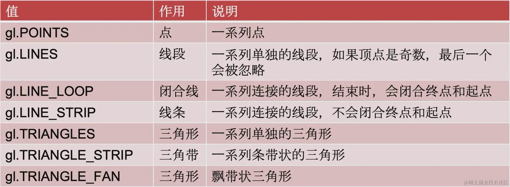

## 1.缓冲区对象

缓冲区对象是 WebGL 系统中的一块`内存区域`，可以一次性地向缓冲区对象中填充大量的顶点数据，然后将这些数据保存在其中，供顶点着色器使用。
缓冲区对象解决的实际上就是多个顶点绘制的问题。

### 1.1 创建一组顶点数据

建立三个顶点数据，两个浮点数构成一个顶点，分别代表 x、y 值。

```js
const points = new Float32Array([-0.5, -0.5, 0.5, -0.5, 0.0, 0.5]);
```

### 1.2 创建缓冲区对象

使用`gl.createBuffer`方法创建一个内存区域，用来存储顶点数据

```js
// 创建缓冲区对象
const buffer = gl.createBuffer();
```

### 1.3 关联缓冲区对象

```js
gl.bindBuffer(gl.ARRAY_BUFFER, buffer); // webgl关联缓冲区对象
```

- gl.ARRAY_BUFFER：表示缓冲区存储的是顶点的数据
- gl.ELEMENT_ARRAY_BUFFER：表示缓冲区存储的是顶点的索引值

### 1.4 顶点数据写入缓冲区对象

使用 gl 的`bufferData(target,data,type)`方法来写入顶点数据。
关于 type 表示向缓冲区写入数据的方式：

- gl.STATIC_DRAW：写入一次，多次绘制
- gl.STREAM_DRAW：写入一次，绘制若干次
- gl.DYNAMIC_DRAW：写入多次，多次绘制

```js
gl.bufferData(gl.ARRAY_BUFFER, points, gl.STATIC_DRAW); // 顶点数据写入缓冲区对象
```

### 1.5 给 attribute 变量赋值

之前使用的是 gl.vertexAttrib 系列的方法进行赋值，这次使用的是 gl 的 `vertexAttribPointer(location,size,type,normalized,stride,offset)`方法。

- location：attribute 变量的存储位置
- size：指定每个顶点所使用数据的个数(比如在上述的 points 中，两个数据表示一个顶点，size 就等于 2)
- type：指定数据格式，也就是数据类型
- normalized：表示是否将数据归一化到[0,1][-1,1]这个区间
- stride： 相邻两个顶点间的字节数，我的例子里写的是 0，那就是顶点之间是紧挨着的
- offset 从缓冲区的什么位置开始存储变量，我的例子里写的是 0，那就是从头开始存储变量

```js
const a_Position = gl.getAttribLocation(gl.program, 'a_Position');
gl.vertexAttribPointer(a_Position, 2, gl.FLOAT, false, 0, 0);
```

### 1.6 激活/禁用 attribute 变量状态

attribute 变量目前属于未激活的状态，需要通过 gl.enableVertexAttribArray(location)激活才能使用。禁用的方法是 gl.disableVertexAttribArray(location)

```js
gl.enableVertexAttribArray(a_Position);
```

### 1.7 绘图

gl.drawArrays 的 3 个参数分别是绘制的图形、开始绘制的顶点下标、绘制多少个顶点，现在要绘制 3 个顶点，因此要把第三个参数设置为 3。

```js
gl.drawArrays(gl.POINTS, 0, 3);
```

## 2. 多图形绘制



## 3.图形动画
