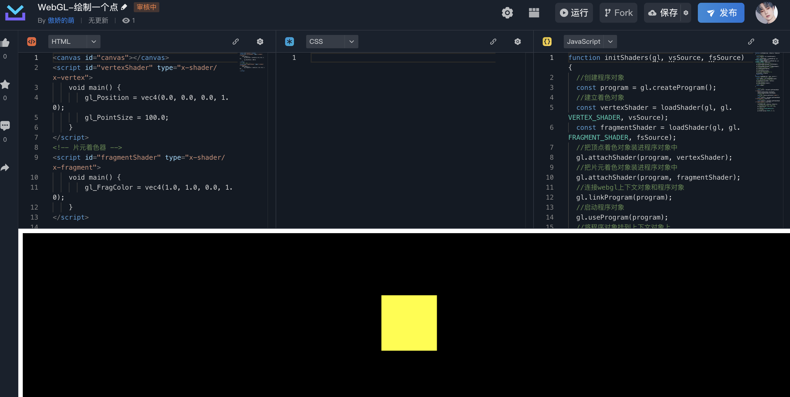
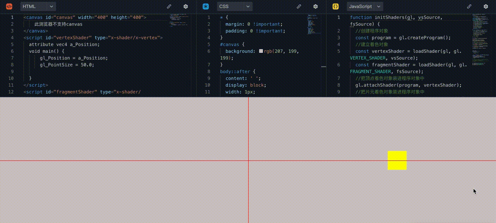
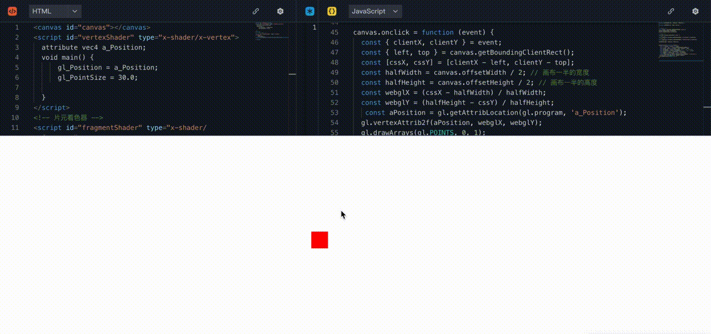
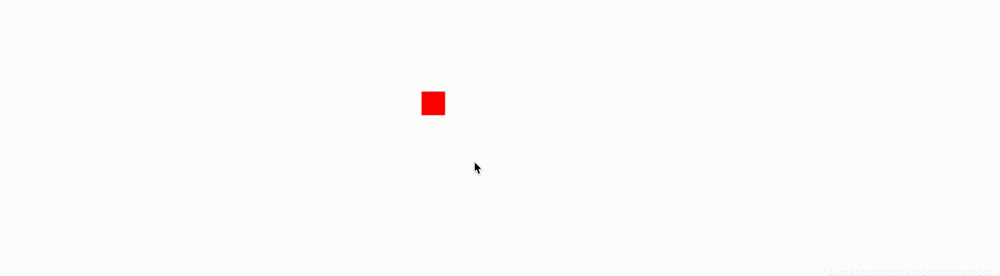
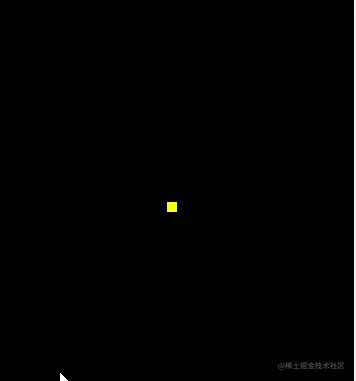
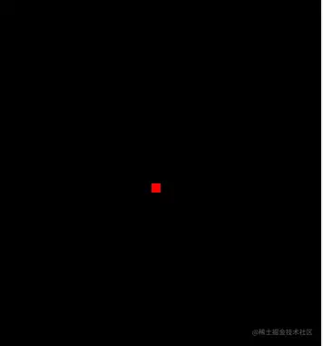

## 1.绘制一个点

[](https://code.juejin.cn/pen/7406018497852997642)



```js
<canvas id="canvas"></canvas>
<!-- 顶点着色器 -->
<script id="vertexShader" type="x-shader/x-vertex">
    void main() {
        gl_Position = vec4(0.0, 0.0, 0.0, 1.0);
        gl_PointSize = 100.0;
    }
</script>
<!-- 片元着色器 -->
<script id="fragmentShader" type="x-shader/x-fragment">
    void main() {
        gl_FragColor = vec4(1.0, 1.0, 0.0, 1.0);
    }
</script>
<script>
    // canvas 画布
    const canvas = document.getElementById('canvas');
    canvas.width=window.innerWidth;
    canvas.height=window.innerHeight;
    // webgl画笔
    const gl = canvas.getContext('webgl');
    // 顶点着色器
    const vsSource = document.getElementById('vertexShader').innerText;
    // 片元着色器
    const fsSource = document.getElementById('fragmentShader').innerText;
    // 初始化着色器
    initShaders(gl, vsSource, fsSource);
    // 指定将要用来清理绘图区的颜色
    gl.clearColor(0., 0.0, 0.0, 1.0);
    // 清理绘图区
    gl.clear(gl.COLOR_BUFFER_BIT);
    // 绘制顶点
    gl.drawArrays(gl.POINTS, 0, 1);

    function initShaders(gl,vsSource,fsSource){
        //创建程序对象
        const program = gl.createProgram();
        //建立着色对象
        const vertexShader = loadShader(gl, gl.VERTEX_SHADER, vsSource);
        const fragmentShader = loadShader(gl, gl.FRAGMENT_SHADER, fsSource);
        //把顶点着色对象装进程序对象中
        gl.attachShader(program, vertexShader);
        //把片元着色对象装进程序对象中
        gl.attachShader(program, fragmentShader);
        //连接webgl上下文对象和程序对象
        gl.linkProgram(program);
        //启动程序对象
        gl.useProgram(program);
        //将程序对象挂到上下文对象上
        gl.program = program;
        return true;
    }

    function loadShader(gl, type, source) {
        //根据着色类型，建立着色器对象
        const shader = gl.createShader(type);
        //将着色器源文件传入着色器对象中
        gl.shaderSource(shader, source);
        //编译着色器对象
        gl.compileShader(shader);
        //返回着色器对象
        return shader;
    }
</script>

```

## 2.Attribute 变量

### 2.1 每隔 200ms 移动一次点的位置

[](https://code.juejin.cn/pen/7406355663493791780)

```js
let x = 0;
setInterval(() => {
  x += 0.1;
  if (x > 1.0) {
    x = 0;
  }
  const aPosition = gl.getAttribLocation(gl.program, 'a_Position');
  gl.vertexAttrib1f(aPosition, x);
  gl.drawArrays(gl.POINTS, 0, 1);
}, 200);
```



## 3.用鼠标控制绘制

### 3.1 点击绘制

[](https://code.juejin.cn/pen/7406376042497048639)

```js
const canvas = document.getElementById('canvas');
canvas.onclick = function (event) {
  const { clientX, clientY } = event;
  const { left, top } = canvas.getBoundingClientRect();
  const [cssX, cssY] = [clientX - left, clientY - top];
  const halfWidth = canvas.offsetWidth / 2; // 画布一半的宽度
  const halfHeight = canvas.offsetHeight / 2; // 画布一半的高度
  const webglX = (cssX - halfWidth) / halfWidth;
  const webglY = (halfHeight - cssY) / halfHeight;
  const aPosition = gl.getAttribLocation(gl.program, 'a_Position');
  gl.vertexAttrib2f(aPosition, webglX, webglY);
  gl.drawArrays(gl.POINTS, 0, 1);
};
```



### 3.2 移动跟随绘制

在上述“点击绘制”的例子基础上，将 onClick 事件改成 onmousemove 即可

```js
canvas.onmousemove = function (event) {
  ... // 其他同上
};
```



### 3.3 画笔效果绘制

[](https://code.juejin.cn/pen/7406380925765812235)

```js
const canvas = document.getElementById('canvas');
const points = [];
canvas.onmousemove = function (event) {
  const { clientX, clientY } = event;
  const { left, top } = canvas.getBoundingClientRect();
  const [cssX, cssY] = [clientX - left, clientY - top];
  const halfWidth = canvas.offsetWidth / 2; // 画布一半的宽度
  const halfHeight = canvas.offsetHeight / 2; // 画布一半的高度
  const webglX = (cssX - halfWidth) / halfWidth;
  const webglY = (halfHeight - cssY) / halfHeight;
  const aPosition = gl.getAttribLocation(gl.program, 'a_Position');

  points.push({ webglX, webglY });

  for (let i = 0; i < points.length; i++) {
    gl.vertexAttrib2f(aPosition, points[i].webglX, points[i].webglY);
    gl.drawArrays(gl.POINTS, 0, 1);
  }
};
```

### 3.4 用 js 控制顶点尺寸

[](https://code.juejin.cn/pen/7406579060500856871)

用 js 控制顶点尺寸的方法和控制顶点位置的方法是一样的。


:::error{title=注意}

- gl_Position：vec4 是 4 维的变量类型
- gl_PointSize：float 浮点型
  :::

## 4.用 js 控制顶点颜色



[](https://code.juejin.cn/pen/7406588501820948543)

核心代码：

```js
<script id="fragmentShader" type="x-shader/x-fragment">
    precision mediump float;
    uniform vec4 u_FragColor;
    void main() {
        gl_FragColor = u_FragColor;
    }
</script>

const uFragColor=gl.getUniformLocation(gl.program,'u_FragColor');
const color=new Float32Array([
    Math.random(),
    Math.random(),
    Math.random(),
    1.0
])
gl.uniform4fv(uFragColor,color);
```
