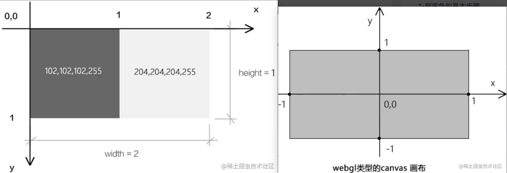
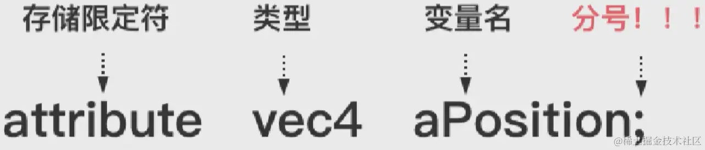
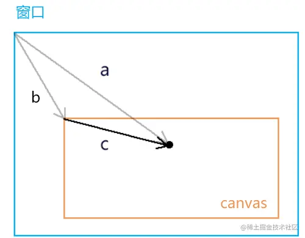

## 参考链接

- [WebGL - MDN](https://developer.mozilla.org/zh-CN/docs/Web/API/WebGL_API/Tutorial)
- [WebGL+Three.js— WebGL 简单应用](https://juejin.cn/post/7245682364932554808)
- [webgl-lesson](https://github.com/buglas/webgl-lesson?tab=readme-ov-file)

## 1.Canvas 与 WebGL 画布创建

**Canvas：**

```js
// step1. 创建<canvas>标签
<canvas id="canvas" width="400" height="400">
  此浏览器不支持canvas
</canvas>

// step2. 获取canvas上下文
// step3. 绘制图形
<script>
  const ctx = document.getElementById('canvas');
  const c = ctx.getContext('2d');
  c.fillStyle = 'red'
  c.fillRect(10, 10, 100, 100);
</script>
```

**WebGL：**

```js
// step1. 创建<canvas>标签
<canvas id="webgl" width="400" height="400">
  此浏览器不支持canvas
</canvas>

// step2. 获取webgl上下文
// step3. 设置画布颜色
<script>
  const ctx = document.getElementById('canvas');
  const gl = ctx.getContext('webgl');
  gl.clearColor(1.0, 0.0, 0.0, 1.0);  // 使用完全不透明的黑色清除所有图像
  gl.clear(gl.COLOR_BUFFER_BIT);  // 用上面指定的颜色清除缓冲区
</script>
```

### 1.1 gl.clearColor(red,green,blue,alpha)

[WebGLRenderingContext.clearColor()](https://developer.mozilla.org/zh-CN/docs/Web/API/WebGLRenderingContext/clearColor) 方法用于设置清空颜色缓冲时的颜色值。

```js
gl.clearColor(1.0, 0.0, 0.0, 1.0); // 背景色就被指定为了红色
gl.getParameter(gl.COLOR_CLEAR_VALUE); // 获取当前的清除颜色，传入 COLOR_CLEAR_VALUE 常量
```

> 注意：CSS 颜色中“rgba(255,255,255,1)”,其中 r、g、b 的定义域是[0,1]，但是 webgl 这里的 r、g、b 的定义域是[0,255]

#### css 转为 webgl 颜色

前面提到过，css 颜色跟 webgl 的 r、g、b 的定义域不一样，那么两者如何进行转换呢？

```js
const rgbaCSS = 'rgba(255,100,0,1)';
const reg = RegExp(/\((.*)\)/);
const rgbaStr = reg.exec(rgbaCSS)[1];
const rgb = rgbaStr.split(',').map((ele) => parseInt(ele));
const r = rgb[0] / 255;
const g = rgb[1] / 255;
const b = rgb[2] / 255;
const a = rgb[3];

gl.clearColor(r, g, b, a);
gl.clear(gl.COLOR_BUFFER_BIT);
```

### 1.2 gl.clear(buffer)

[WebGLRenderingContext.clear()](https://developer.mozilla.org/zh-CN/docs/Web/API/WebGLRenderingContext/clear) 方法使用预设值来清空缓冲。

```js
gl.clear(gl.COLOR_BUFFER_BIT);
```

参数值可以为：

- gl.COLOR_BUFFER_BIT //颜色缓冲区， 对应的设置方法为 gl.clearColor(0.0, 0.0, 0.0, 1.0)
- gl.DEPTH_BUFFER_BIT //深度缓冲区， 对应的设置方法为 gl.clearDepth(1.0)
- gl.STENCIL_BUFFER_BIT //模板缓冲区， 对应的设置方法为 gl.clearStencil(0)

## 2.坐标系

下图先后给出了 canvas 2d 坐标系和 webgl 坐标系：


- canvas 2d 坐标系：原点在左上角，y 轴方向朝下，1 个单位是一个像素
- webgl 坐标系：原点在画布中心，y 轴方向朝上，1 个单位的宽便是半个个 canvas 的宽，1 个单位的高便是半个 canvas 的高

## 3.着色器

webgl 绘图需要两种着色器：

- `顶点着色器（Vertex shader）`：描述顶点的特征，如位置、颜色等。
- `片元着色器（Fragment shader）`：进行逐片元处理，如光照。

举个例子：两点决定一条直线大家知道不？顶点着色器里的顶点就是决定这一条直线的两个点，片元着色器里的片元就是把直线画到画布上后，这两个点之间构成直线的每个像素。

### 3.1 创建着色器源码

- `顶点着色器（Vertex shader）`：顶点着色程序，要写在 type=“x-shader/x-vertex” 的 script 中

  ```js
  <script id="vertexShader" type="x-shader/x-vertex">
    void main() {
        gl_Position = vec4(0.0, 0.0, 0.0, 1.0);  // gl_Position 是顶点的位置(名称不能改)
        gl_PointSize = 100.0; // gl_PointSize 是顶点的尺寸(名称不能改)
    }
  </script>
  // vec4() 是一个4维矢量对象
  // 将vec4() 赋值给顶点点位gl_Position 的时候，其中的前三个参数是x、y、z，第4个参数默认1.0
  ```

- `片元着色器（Fragment shader）`：片元着色程序，要写在 type=“x-shader/x-fragment” 的 script 中。

  ```js
  <script id="fragmentShader" type="x-shader/x-fragment">
    void main() {
        gl_FragColor = vec4(1.0, 1.0, 0.0, 1.0);  // gl_FragColor 是片元的颜色(名称不能改)
    }
  </script>
  // 将vec4() 赋值给片元颜色gl_FragColor 的时候，其中的参数是r,g,b,a
  ```

### 3.2 创建并编译着色器

- 通过 gl.createShader 方法创建顶点和片元着色器
- 通过 gl.shaderSource 方法将着色器与源码关联起来
- 通过 gl.compileShader 方法进行编译着色器

```js
// 创建顶点和片元着色器
const vertexShader = gl.createShader(gl.VERTEX_SHADER);
const fragmentShader = gl.createShader(gl.FRAGMENT_SHADER);
// 将着色器与源码关联起来
gl.shaderSource(vertexShader, VERTEX_SHADER_SOURCE); // 指定顶点着色器的源码
gl.shaderSource(fragmentShader, FRAGMENT_SHADER_SOURCE); // 指定片元着色器的源码
// 编译着色器
gl.compileShader(vertexShader);
gl.compileShader(fragmentShader);
```

### 3.3 程序对象的创建与使用

- gl.createProgram：创建程序对象
- gl.attachShader：程序对象指定着色器
- gl.linkProgram：关联程序对象
- gl.useProgram： 使用程序对象

```js
const program = gl.createProgram();

gl.attachShader(program, vertexShader);
gl.attachShader(program, fragmentShader);
gl.linkProgram(program);
gl.useProgram(program);
```

### 3.4 绘制

通过 gl.drawArrays 方法进行绘制，该方法接收 3 个参数：绘制的图形，开始位置，顶点个数

```js
gl.drawArrays(gl.POINTS, 0, 1); //绘制顶点
```

### 3.5 着色器初始化的封装

```js
function initShaders(gl, vsSource, fsSource) {
  //创建程序对象
  const program = gl.createProgram();
  //建立着色对象
  const vertexShader = loadShader(gl, gl.VERTEX_SHADER, vsSource);
  const fragmentShader = loadShader(gl, gl.FRAGMENT_SHADER, fsSource);
  //把顶点着色对象装进程序对象中
  gl.attachShader(program, vertexShader);
  //把片元着色对象装进程序对象中
  gl.attachShader(program, fragmentShader);
  //连接webgl上下文对象和程序对象
  gl.linkProgram(program);
  //启动程序对象
  gl.useProgram(program);
  //将程序对象挂到上下文对象上
  gl.program = program;
  return true;
}
function loadShader(gl, type, source) {
  //根据着色类型，建立着色器对象
  const shader = gl.createShader(type);
  //将着色器源文件传入着色器对象中
  gl.shaderSource(shader, source);
  //编译着色器对象
  gl.compileShader(shader);
  //返回着色器对象
  return shader;
}
export { initShaders };
```

## 4.Attribute 变量

回顾之前的顶点着色器源码创建：

```js
<script id="vertexShader" type="x-shader/x-vertex">
  void main() {
      gl_Position = vec4(0.0, 0.0, 0.0, 1.0);  // gl_Position 是顶点的位置(名称不能改)
      gl_PointSize = 100.0; // gl_PointSize 是顶点的尺寸(名称不能改)
  }
</script>
```

目前的点信息是直接写在了源程序里面的，如果想动态去改变点信息，除非去改源程序，这样的做法显然不合理。 webgl 提供了 attribute 变量，解决了这个动态改变源程序信息的问题。(我们要让这个点位可以动态改变，那就得把它变成 attribute 变量)。js 可以通过 attribute 变量向顶点着色器传递与顶点相关的数据。

> 注意：attribute 变量是只有`顶点着色器`才能使用它的。

### 4.1 声明 Attribute 变量

在顶点着色器中声明 attribute 变量：

```js
<script id="vertexShader" type="x-shader/x-vertex">
  attribute vec4 a_Position; // 自动赋值 vec4(0.0,0.0,0.0,1.0)
  void main() {
      gl_Position = a_Position;
      gl_PointSize = 50.0;

  }
</script>
```



### 4.2 JS 中获取 Attribute 变量

通过 `gl.getAttribLocation(program, name)`方法获取 attribute 的变量。

```js
const a_Position = gl.getAttribLocation(gl.program, 'a_Position');
```

- program 是程序对象
- name 是 attribute 的变量名
- 方法返回变量的存储地址

### 4.3 JS 中修改 Attribute 变量

不能用 js 的语法来赋值或修改 attribute 变量的值：

```js
a_Position.a = 1.0;
```

而是用 WebGL 提供的方法改变 a_Position 的值：

```js
gl.vertexAttrib4f(aPosition, 0.5, 0.5, 0.0, 1.0);
```

修改之后就可以使用上下文对象绘制最新的点位了：

```js
gl.vertexAttrib4f(aPosition, 0.5, 0.5, 0.0, 1.0);
gl.clearColor(0.0, 0.0, 0.0, 1.0);
gl.clear(gl.COLOR_BUFFER_BIT);
gl.drawArrays(gl.POINTS, 0, 1);
```

### 4.4 vertexAttrib4f 的同族函数

gl.vertexAttrib3f(location,v0,v1,v2) 方法是一系列修改着色器中的 attribute 变量的方法之一，它还有许多同族方法：

- gl.vertexAttrib1f(location,v0)
- gl.vertexAttrib2f(location,v0,v1)
- gl.vertexAttrib3f(location,v0,v1,v2)
- gl.vertexAttrib4f(location,v0,v1,v2,v3)

注意：3f、2f、1f 这些方法，可以理解为 4f 方法的简略版，它会在省略的参数补上一个默认值，例如 gl.vertexAttrib3f(aPosition, 0.5, 0.5, 0.0)，它就相当于 gl.vertexAttrib4f(aPosition, 0.5, 0.5, 0.0, 1.0)，3f 它会帮我们补上第 4 个参数的默认值 1.0，其余的 2f 和 1f 方法也以此类推。

## 5.用鼠标控制绘制

要用鼠标控制一个点的位置，首先要知道鼠标点在 webgl 坐标系中的位置，这样才能让一个点出现在我们鼠标点击的位置。所以这部分的重点就是如何获取鼠标点在 webgl 坐标系中的位置。

### 思路

对于鼠标点在 webgl 坐标系中的位置，我们是无法直接获取的。所以我们得先获取鼠标在 canvas 这个 DOM 元素中的位置。

流程：监听点击事件 -> 获取点击位置 -> 转换为 canvas 坐标 -> 转换为 webgl 坐标 -> 绘图

### 5.1 监听点击事件

webgl 没有办法监听点击事件，因此点击事件还是要添加到画布上。

```js
const canvas = document.getElementById('canvas');
canvas.onclick = function (e) {};
// 或者
canvas.addEventListener('click', function (event) {});
```

### 5.2 获取点击位置以及 canvas 坐标


用向量减法来求解，已知：向量 a(clientX,clientY)，向量 b(left,top)，求：向量 c。向量 c=a-b=(clientX-left,clientY-top)。

求出来的 c 就是鼠标在 canvas 画布中的 css 位。

```js
const canvas = document.getElementById('canvas');
canvas.addEventListener('click', function (event) {
  // 获取点击位置
  const { clientX, clientY } = event;
  // 获取到鼠标在 canvas 画布中的 css 位，且是canvas 坐标
  const { left, top } = canvas.getBoundingClientRect();
  const [cssX, cssY] = [clientX - left, clientY - top];
});
```

说明： 因为 html 坐标系中的坐标原点和轴向与 canvas 2d 是一致的，所以在我们没有用 css 改变画布大小，也没有对其坐标系做变换的情况下，鼠标点在 canvas 画布中的 css 位就是鼠标点在 canvas 2d 坐标系中的位置。

### 5.3 转换为 webgl 坐标

canvas 坐标系如何转 webgl 坐标系？—— webgl 从左到右的取值范围是-1 到 1，webgl 从上往下的取值范围是 1 到-1。而目前我们得到的是一个真实的相对位置，因此需要将这个位置的横向和纵向的位置转换成对应的区间。

#### 横向转换

目前画布的 width 为 400，那么最左侧为 0，中心点为 200，最右侧为 400，区间是 0-400。想转换成-1 到 1 的区间，只需要把 canvas 往左移动 canvas 一半的宽度即可。移动之后，最左侧为-200，中心点为 0，最右侧为 200。最后统一除以 canvas 一半的宽度，那就转换成-1 到 1 的区间了。

:::success{title=公式}
webgl 的 x 位置 = (相对 x 位置 - 200) / 200
:::

#### 纵向转换

目前画布的 height 为 400，那么最上侧为 0，中心点为 200，最下侧为 400，区间是 0-400。想转换成 1 到-1 的区间，由于方向刚好相反，相对位置往下是正方向，而 webgl 往上才是正方向，因此需要使用 canvas 一半的高度减去相对位置，再除以 canvas 一半的高度，那就转换成 1 到-1 的区间了。

:::success{title=公式}
webgl 的 y 位置 = (200 - 相对 y 位置) / 200
:::

## 6.Uniform 变量

### 6.1 声明 Uniform 变量

uniform 变量与 attribute 变量类似，它也是声明在 main 函数的外面。
在片元着色器中声明 Uniform 变量：

```js
<script id="fragmentShader" type="x-shader/x-fragment">
    uniform vec4 uColor;
    void main() {
        gl_FragColor = uColor;  // vec4(0.0, 0.0, 0.0, 1.0);
    }
</script>
```

### 6.2 JS 中获取 Uniform 变量

uniform 变量和 attribute 变量不同，它既可以用在片元着色器，也可以用在顶点着色器里。

通过 `gl.getUniformLocation(program, name)`方法获取 Uniform 的变量。

```js
const uColor = gl.getUniformLocation(gl.program, 'uColor');
```

- program 是程序对象
- name 是 uniform 的变量名
- 方法返回变量的存储地址

### 6.3 JS 中修改 Uniform 变量

用 WebGL 提供的方法改变 uniform 变量 的值：

```js
gl.uniform4f(uColor, 1.0, 0.0, 0.0, 1.0);
```

### 6.4 uniform4f 的同族函数

gl.uniform4f(location,v0,v1,v2) 方法是一系列修改着色器中的 uniform 变量的方法之一，它还有许多同族方法：

- gl.uniform1f(location,v0)
- gl.uniform2f(location,v0,v1)
- gl.uniform3f(location,v0,v1,v2)
- gl.uniform4f(location,v0,v1,v2,v3)

注意：3f、2f、1f 这些方法，跟 vertexAttrib 系列有点区别。uniform 的方法使用，需要匹配类型，例如 vec4 类型就需要使用 uniform4f，vec3 就使用 uniform3f。

由于 gl_FragColor 需要接收的是 vec4 的类型，如果定义用的是 vec2 或者 vec3 等，可以使用 vec4()函数进行转换，函数里把对应的参数根据 rgba 的顺序读取即可。

```js
const FRAGMENT_SHADER_SOURCE = `
  precision mediump float;
  uniform vec3 uColor;
  void main() {
    gl_FragColor = vec4(uColor.r, uColor.g, uColor.b, 1.0);    // vec4(0.0, 0.0, 0.0, 1.0);
  }
`;
gl.uniform3f(uColor, 1.0, 0.0, 0.0);
```

注意：2f 的方法匹配 vec2 类型，跟 vec3 一样，但是 1f 的方法是例外，它对应的类型不是 vec1，而是 float，而且使用 vec4()函数转的时候，直接使用 uColor 变量，后面补上 gba3 个参数。

```js
// 片元着色器
const FRAGMENT_SHADER_SOURCE = `
  precision mediump float;
  uniform float uColor;
  void main() {
    gl_FragColor = vec4(uColor, 0.0, 0.0, 1.0);
  }
`;
gl.uniform1f(uColor, 1.0);
```

### 6.5 设置精度

在片元着色器中如果想使用矢量或者浮点数的时候，需要先设置它的精度。在顶点着色器使用矢量的时候，它会指定默认的精度为高精度，但是在片元着色器并没有指定它的默认精度，需要自己手动设置。

可以通过 `precision mediump float;`进行设置，它的意思是指定精度为中精度。它们的精度值分别为：

- (1)高精度：highp
- (2)中精度：mediump
- (3)低精度：lowp

```js
const FRAGMENT_SHADER_SOURCE = `
  precision mediump float;
  uniform vec4 uColor;
  void main() {
    gl_FragColor = uColor;    // vec4(0.0, 0.0, 0.0, 1.0);
  }
`;
```

## 7.Attribute 和 Uniform 变量区别

- attribute 变量只能用在顶点着色器里，但 uniform 变量既可以用在片元着色器，也可以用在顶点着色器里。
- gl.vertexAttrib 系列方法基本可以通用，但是 uniform 系列方法的使用需要匹配类型。
